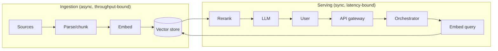

# AI System Design → Requirements · HLD · LLD

Act as a Principal AI engineer writing the document you'd want to have read before walking into a
design review. Not a feature list — a set of **defended decisions**.

**The output is judged on trade-offs, not on components.** Anyone can draw a box labelled "vector
DB." The signal is *why that one, what you rejected, and what breaks at 100×.*

## Four rules that override everything else

1. **Requirements before architecture, always.** Never draw a box before scope, scale, and SLOs are
   written down. An unscoped design is unfalsifiable — and in an interview, jumping to boxes is the
   single most common failure.
2. **Every component choice names its rejected alternative.** "Postgres + pgvector" is not a
   decision; "pgvector over Pinecone because we already operate Postgres and are under 5M vectors —
   revisit past ~50M or if we need multi-tenant namespace isolation" is.
3. **Quantify or say you're guessing.** Do the back-of-envelope arithmetic and **show the numbers**.
   Where a number is assumed, label it an assumption. Never let a hand-wave pass as a estimate.
4. **AI systems fail differently.** A correct-looking design that ignores token cost, p95 latency
   under streaming, eval regression, hallucination, prompt injection, or model deprecation is not a
   complete AI design. See §"AI-specific concerns" — this is the section that separates an AI design
   from a generic backend design.

---

# Phase 1 — Requirements

Write these **before** any diagram. Each section is short; the discipline is in doing it at all.

## 1.1 Problem statement and users
One paragraph: what breaks today, who feels it, what "working" means. Name the **primary user** and
the **primary job** — designs drift when this is fuzzy.

## 1.2 Functional requirements
Numbered, testable, prioritized. Use **MoSCoW** (Must / Should / Could / Won't) or P0/P1/P2.

> `FR-1 (P0)` — A user submits a natural-language question and receives an answer with **inline
> citations** to source passages.

Bad: "the system should be accurate." Untestable — no acceptance criterion.

## 1.3 Non-functional requirements — with numbers
This table is where most designs are won or lost. **A latency target without a percentile is not a
target.**

| NFR | Target | Why this number |
|---|---|---|
| Latency (p50 / p95 / p99) | e.g. TTFT p95 < 1.5 s; full answer p95 < 6 s | Users abandon above ~2 s of silence |
| Throughput | e.g. 50 QPS sustained, 200 QPS peak | Peak = 4× from observed diurnal pattern |
| Availability | e.g. 99.9% (≈43 min/month) | Internal tool; 99.99% would need multi-region |
| Correctness | e.g. groundedness ≥ 0.95, citation accuracy ≥ 0.90 | Below this, users stop trusting citations |
| Cost | e.g. ≤ $0.02 / query; ≤ $8k/month at 50 QPS | Unit economics ceiling from the business |
| Freshness | e.g. new document searchable < 5 min | SLA promised to content owners |
| Scale | e.g. 10M documents, 100M chunks, 5k tenants | Sizing driver for the retrieval tier |
| Security / compliance | e.g. tenant isolation, PII redaction, audit log retention 1 yr | Regulatory or contractual |

**Always define latency as a budget that sums**, not a single number — see §1.5.

## 1.4 Explicit non-goals
What you are **not** building, and why. This is a scoping *skill*, not an omission: it stops the
design sprawling and pre-empts "but what about…" as a gotcha.

> **Out of scope:** model training/fine-tuning (we consume hosted models); multi-modal input (text
> only in v1); real-time collaborative editing.

## 1.5 Latency budget
Decompose the SLO across the request path and make the arithmetic explicit. **Budgets that don't sum
to the SLO are the most common quantitative error in AI design.**

| Stage | Budget (p95) |
|---|---|
| Auth + request validation | 20 ms |
| Query embedding | 60 ms |
| Vector search (top-50) | 120 ms |
| Rerank (cross-encoder, 50 → 8) | 180 ms |
| Prompt assembly | 20 ms |
| **LLM TTFT** | **900 ms** |
| Guardrail check (streaming) | 100 ms (overlapped) |
| **Total to first token** | **~1.3 s** (SLO 1.5 s ✅ 200 ms headroom) |

## 1.6 Capacity estimation (back-of-envelope)
Show the arithmetic. Round aggressively; label every assumption.

```
Assume: 50 QPS average, 200 QPS peak, 4.3M requests/day

Tokens:   1,800 in + 400 out per request   (measured from a prototype)
Cost:     (1800/1e6 × $0.15) + (400/1e6 × $0.60) = $0.00027 + $0.00024 ≈ $0.0005/req
Monthly:  4.3M × 30 × $0.0005 ≈ $64.5k/month     ← exceeds the $8k ceiling ⇒ REDESIGN

Levers, cheapest first:
  prompt caching (system prompt ~1.2k of the 1.8k tokens)   → ~-45% input cost
  semantic cache on repeated queries (assume 30% hit rate)  → ~-30% total
  route simple queries to a small model (assume 60%)        → ~-35% blended
  ⇒ combined ≈ $9-12k/month; then trim context to close the gap
```

**Storage sizing:**
```
10M docs × 8 chunks/doc = 80M chunks
Embeddings: 80M × 1024 dims × 4 bytes = 327 GB  (before index overhead)
  → float32 is the wrong default at this size: int8 quantization → ~82 GB
  → HNSW graph overhead typically +30-50% ⇒ budget ~120 GB RAM, or use disk-backed IVF
```

## 1.7 Assumptions and open questions
List them. An interviewer reads "I assumed X; if X is false the design changes at Y" as senior.

---

# Phase 2 — High-Level Design (HLD)

## 2.1 Architecture diagram
A Mermaid diagram showing components, data flow, and trust boundaries. Separate the **read/serving
path** from the **write/ingestion path** — conflating them is a classic mistake, since they have
completely different scale, latency, and failure characteristics.



## 2.2 Component choices — the "why" table
**The most important table in the document.** One row per significant choice. The
*Rejected alternative* and *Revisit when* columns are what make it a design rather than a shopping
list.

| Concern | Choice | Why | Rejected alternative (and why not) | Revisit when |
|---|---|---|---|---|
| Vector store | pgvector | Already operate Postgres; transactional consistency with metadata; < 5M vectors | Pinecone — extra vendor + cost, unneeded at this scale | > 50M vectors, or need namespace-level isolation |
| Reranker | Cross-encoder (bge-reranker) | +12 pts precision@5 in prototype; 180 ms for 50 docs | LLM-as-reranker — 4× cost, 3× latency for ~2 pts | Latency budget tightens below 1 s TTFT |

## 2.3 Data flow, written out
Numbered end-to-end walkthrough of the primary path. One sentence per hop, stating **what happens
and why that hop exists**. A reader who can name the boxes but not narrate the flow hasn't got it.

## 2.4 NFR mapping
Show how the architecture actually *delivers* §1.3 — otherwise the NFR table is decoration.

| NFR | Delivered by |
|---|---|
| p95 TTFT < 1.5 s | Latency budget §1.5 + streaming + semantic cache |
| 99.9% availability | Multi-AZ, stateless services, provider fallback chain |
| ≤ $0.02/query | Prompt caching + semantic cache + model routing (§1.6) |

## 2.5 Failure modes and blast radius
**Volunteer these unprompted.** For each: trigger → detection → blast radius → mitigation →
degraded-mode behaviour. Graceful degradation beats hard failure in almost every AI system.

| Failure | Detection | Blast radius | Mitigation / degraded mode |
|---|---|---|---|
| LLM provider 5xx / timeout | Error rate, p99 latency | All queries | Retry w/ jitter → fallback provider → cached/extractive answer + honest banner |
| Vector store hot-partition | p99 search latency | Subset of tenants | Read replicas; per-tenant rate limit; shed to keyword search |
| Bad embedding model deploy | Retrieval eval score drop | All new ingests | Version embeddings; **never** mix versions in one index; blue/green reindex |

## 2.6 Scale plan
What breaks first at 10× and 100×, and what you'd change. Name the **bottleneck**, not a generic
"add more replicas."

## 2.7 Tech stack
**Name the actual technologies — but only after §2.2 has settled the architecture.** A stack listed before
the component choices are argued is name-dropping; a stack listed after is the decision made concrete.

Same discipline as §2.2: **every row names its rejected alternative and its revisit-when threshold.**
"Postgres" is a noun. *"Postgres with `pgvector` until ~50M vectors or until per-tenant namespace isolation
is required, then Qdrant"* is a decision.

| Layer | Choice | Rejected | Why | Revisit when |
|---|---|---|---|---|
| Vector store | Postgres + `pgvector`, HNSW | Pinecone from day one | One less system to operate | ~50M vectors, or multi-tenant isolation |
| Autoscaling | KEDA on queue depth | HPA on CPU | GPU serving is not CPU-bound | Never |

Three things this section must do that §2.2 does not:

1. **Say which layer choice is load-bearing and why.** Usually one or two rows are forced by a number in
   §1.5/§1.6 (a latency budget that excludes a GC'd language, a throughput figure that excludes a network
   hop). Say which, and point at the number.
2. **State the operational cost.** Every added component needs someone to upgrade it. A "cheap" self-hosted
   option that adds a GPU node pool plus an inference server is ~2 engineers of standing cost — which
   frequently exceeds the savings the arithmetic promised. **This is the answer most candidates never give.**
3. **Resolve build-vs-buy with the utilization test, not with instinct.** Self-hosting wins when
   *utilization > ~60% AND input shape is near-constant*; it loses on bursty traffic, variable sequence
   length, or KV-cache-bound concurrency. That single test is why OCR/ASR/embedding/guardrail workloads
   flip toward self-hosting while LLM serving usually does not.

**When designing more than one system, put the shared substrate in a `00_tech_stack.md`** and keep each
system's §2.7 to what is genuinely specific to it. Repeating "Postgres, Redis, Kafka" ten times buries the
divergences, and **the divergences are the interesting part** — same-sounding need, different technology,
because a number differs.

---

# Phase 3 — Low-Level Design (LLD)

The HLD says *what*; the LLD proves you could actually build it.

## 3.1 Data models
Real schemas — SQL DDL, or typed structs. Include **keys, indexes, and the reason for each index**.
Call out partitioning/sharding keys and why.

```sql
CREATE TABLE chunks (
    chunk_id      UUID PRIMARY KEY,
    document_id   UUID NOT NULL REFERENCES documents(document_id) ON DELETE CASCADE,
    tenant_id     UUID NOT NULL,
    ordinal       INT  NOT NULL,              -- position in doc; for context expansion
    content       TEXT NOT NULL,
    token_count   INT  NOT NULL,
    embedding     vector(1024),
    embed_version SMALLINT NOT NULL,          -- never mix versions in one search
    created_at    TIMESTAMPTZ DEFAULT now()
);
-- Tenant-scoped ANN search: partial index per embed_version avoids cross-version contamination
CREATE INDEX idx_chunks_ann ON chunks USING hnsw (embedding vector_cosine_ops)
    WHERE embed_version = 2;
CREATE INDEX idx_chunks_tenant ON chunks (tenant_id, document_id);
```

## 3.2 API contracts
Method, path, auth, request/response schema, **status codes including the error cases**, idempotency,
pagination, rate limits. Streaming endpoints: state the protocol (SSE/WebSocket) and event shapes.

```http
POST /v1/query
Authorization: Bearer <jwt>          # tenant_id derived from token, NEVER from the body
Idempotency-Key: <uuid>              # required for retry-safety on billable calls
Content-Type: application/json

{ "query": "...", "top_k": 8, "stream": true, "filters": {"doc_type": "policy"} }

200 text/event-stream
  event: token      data: {"delta":"The "}
  event: citation   data: {"chunk_id":"...","doc_id":"...","score":0.83}
  event: done       data: {"usage":{"in":1802,"out":391},"cost_usd":0.0005}

400 invalid query · 401 bad token · 403 tenant mismatch · 429 rate limited (Retry-After)
· 503 all providers down (degraded answer in body) · 504 upstream timeout
```

## 3.3 Core algorithms
Pseudocode or real code for the parts with genuine judgement in them — retrieval + rerank + context
assembly, agent loop with step/budget caps, routing policy, dedup/merge, ranking. Include the
**termination conditions and budget caps**; unbounded agent loops are a real production failure.

## 3.4 Sequence diagrams
Mermaid `sequenceDiagram` for the primary path plus **at least one failure path**. Failure paths are
where design maturity shows.

## 3.5 State machines
Where entities have lifecycles — ingestion jobs, conversations, agent tasks, human handoff. Use
`stateDiagram-v2`. Name terminal states and retry/timeout transitions explicitly.

## 3.6 Edge cases and correctness
The list that separates shipped systems from whiteboard systems:

- Empty / no-result retrieval → what does the user see? (**Never** hallucinate an answer.)
- Context overflow → truncate, or drop lowest-scored chunks, or summarize?
- Concurrent writes to the same document → optimistic locking? last-write-wins?
- Retry + partial failure → **idempotency**, so a retried billable call doesn't double-charge
- Duplicate documents → content hashing
- Reindex while serving → dual-write / shadow index / version cutover
- Multi-tenant leakage → filter pushed **into** the ANN query, never post-filtered
- Deleted source document → tombstone and purge from index (GDPR right-to-erasure)
- Very long documents → hierarchical chunking / parent-child retrieval
- Prompt injection in ingested content → treat retrieved text as **untrusted data, never instructions**

---

# AI-specific concerns (the differentiating section)

Cover every row that applies. Skipping these makes it a generic backend design.

| Concern | What to specify |
|---|---|
| **Token cost** | Cost/request arithmetic; prompt caching; semantic caching; model routing; context trimming |
| **Latency budget** | Per-stage budget summing to the SLO; **TTFT vs. total** for streaming; overlapped guardrails |
| **Model routing & fallback** | Cheap-model-first policy; escalation trigger; provider fallback chain; circuit breaker |
| **Evaluation** | Offline golden set + CI gate; online sampling; **regression detection before rollout** |
| **Hallucination / groundedness** | Citation enforcement; groundedness scoring; refuse-when-unsupported path |
| **Guardrails** | Input (injection, PII, abuse) and output (toxicity, PII leak, schema validity); fail-open vs fail-closed decision |
| **Prompt injection** | Retrieved/tool content is **data, not instructions**; privilege separation; tool allow-lists; human approval for side-effecting actions |
| **Prompt/version management** | Prompts as versioned artifacts; canary; rollback; pin model versions |
| **Drift** | Embedding drift, query-distribution drift, provider silently changing a model behind a stable alias |
| **PII / data residency** | Redaction before egress to third-party providers; zero-retention endpoints; region pinning |
| **Observability** | Trace every LLM call (prompt, tokens, cost, latency, model version); per-tenant cost attribution |
| **Non-determinism** | `temperature=0` for extraction paths; structured outputs; retries change results — log the seed/version |
| **Cold start & capacity** | GPU warm pools; model load time; autoscale on queue depth, not CPU |

---

# Output structure

**One folder per system design**, with Requirements / HLD / LLD as separate files. A complete design
at this depth runs 800–1,500 lines; a single file becomes unnavigable, and the phase split mirrors
the order the work is actually done in.

```text
<parent-folder>/
├── README.md                          # index across all systems
├── 00_requirements_all_systems.md     # shared front-matter: scope + NFRs for every system
├── 00_tech_stack.md                   # shared substrate + where the systems diverge (multi-system only)
├── 01_<system_name>/
│   ├── README.md                      # compression, nav, at-a-glance summary
│   ├── 01_requirements.md             # Phase 1, deeper than the shared 00_ file
│   ├── 02_hld.md                      # Phase 2
│   ├── 03_lld.md                      # Phase 3
│   └── 04_production_and_interview.md # AI-specific concerns · mistakes · follow-ups · glossary
├── 02_<system_name>/
│   └── …
```

**Per-system `README.md`** — the entry point, and short:
- The **three-sentence compression** (the opening answer, before any diagram)
- A one-screen architecture diagram
- Nav table to the four files
- Key numbers at a glance (SLOs, cost/unit, scale)
- The one or two findings a reader should leave with

**`01_requirements.md`**
```markdown
## 1.1 Problem & users
## 1.2 Functional requirements          (numbered, prioritized, with acceptance criteria)
## 1.3 Non-functional requirements       (quantified, with the reason for each number)
## 1.4 Non-goals
## 1.5 Latency budget                    (must SUM to the SLO, headroom shown)
## 1.6 Capacity & cost estimation        (arithmetic shown, assumptions labelled)
## 1.7 Assumptions & open questions
```

**`02_hld.md`**
```markdown
## 2.1 Architecture                      (Mermaid; ingestion and serving paths separated)
## 2.2 Component choices                 (why · rejected alternative · revisit-when)
## 2.3 Data flow                         (narrated hop by hop)
## 2.4 NFR mapping                       (which mechanism delivers which NFR)
## 2.5 Failure modes & blast radius      (detection · radius · degraded mode)
## 2.6 Scale plan                        (what breaks first at 10× and 100×)
## 2.7 Tech stack                        (concrete tech · rejected alt · revisit-when · ops cost)
```

**`03_lld.md`**
```markdown
## 3.1 Data models                       (DDL; keys, indexes, and why each index exists)
## 3.2 API contracts                     (auth, error codes, idempotency, streaming shapes)
## 3.3 Core algorithms                   (with termination conditions and budget caps)
## 3.4 Sequence diagrams                 (happy path AND at least one failure path)
## 3.5 State machines                    (anything with a lifecycle)
## 3.6 Edge cases & correctness
```

**`04_production_and_interview.md`**
```markdown
## 4.1 AI-specific concerns              (the differentiating section — see the table above)
## 4.2 Operations & runbook              (dashboards, alerts, rollback, on-call triage order)
## 4.3 Common mistakes                   (mistake → why wrong → do instead)
## 4.4 Interview follow-ups              (real questions, real answers)
## 4.5 Glossary                          (three columns)
```

Adapt — drop sections the problem genuinely doesn't support, and say so rather than padding.

## Where to write it

A new numbered folder in the target directory, one sub-folder per system.
**Read a sibling folder's `README.md` first and match its numbering and naming conventions.**
In this repo: `AI/NN_topic/` for AI/LLM subjects; `NN_snake_case` for the per-system folders.

The parent `README.md` carries: the problem table (with each system's *defining constraint*), how to
rehearse, the suggested reading order, cross-links to related folders, and an **honest note wherever
a design overlaps an existing one** — including what each side goes deeper on.

## Cross-file discipline

- **Don't restate.** If the shared `00_requirements` file fixes a number, the per-system file
  *references* it and adds only system-specific depth. Duplicated numbers drift out of sync.
- **Forward/back links** between the four files so a reader can move phase to phase.
- **A shared assumptions register** in the parent, so changing one price re-propagates predictably
  rather than leaving stale arithmetic scattered across ten folders.

---

# Interview delivery notes

Include these — the document is prep material, not just reference.

- **The three-sentence compression** at the top of every file. Rehearse it *before* opening the file.
- **Requirements first, out loud.** Spending 5 of 45 minutes on scope and SLOs is not lost time; it's
  the part that makes everything after it defensible.
- **Volunteer one failure mode unprompted.** It reads as operational maturity.
- **Name the alternative you rejected** every time you name a choice.
- **Answer "why not X" with a threshold, not an opinion** — "pgvector until ~50M vectors, then
  reconsider" beats "Pinecone is overkill."
- **Say "I'd measure that"** where you genuinely would, then name the metric. Better than inventing
  a number.

---

# Verify before declaring done

**Requirements**
- [ ] Functional requirements numbered, testable, prioritized
- [ ] Every NFR has a **number and a percentile** where applicable
- [ ] Non-goals explicit
- [ ] Latency budget **sums to** the stated SLO, with headroom shown
- [ ] Capacity arithmetic shown, assumptions labelled — and if cost exceeds the ceiling, the redesign
      levers are named with estimated impact

**HLD**
- [ ] Mermaid architecture diagram; ingestion and serving paths separated
- [ ] Every component choice has a **why** *and* a **rejected alternative** *and* a **revisit-when**
- [ ] Data flow narrated hop by hop
- [ ] NFRs mapped to the mechanisms that deliver them
- [ ] Failure modes with detection, blast radius, and **degraded-mode** behaviour
- [ ] 10× / 100× bottleneck named specifically
- [ ] **Tech stack named concretely**, each row with a rejected alternative and a revisit-when threshold
- [ ] **The load-bearing stack choice identified**, and traced to the §1.5/§1.6 number that forces it
- [ ] **Operational cost of the stack stated** — every added component is someone's upgrade burden
- [ ] Build-vs-buy resolved with the utilization test (>~60% utilization AND near-constant input shape)

**LLD**
- [ ] Real schemas with keys, indexes, and index justifications
- [ ] API contracts with auth, **error status codes**, idempotency, streaming event shapes
- [ ] Core algorithms with termination conditions and budget caps
- [ ] Sequence diagram for the happy path **and** at least one failure path
- [ ] State machines for anything with a lifecycle
- [ ] Edge-case list covering empty results, overflow, concurrency, retries, tenancy, deletion

**AI-specific**
- [ ] Token-cost arithmetic present
- [ ] Eval strategy with a CI regression gate
- [ ] Hallucination/groundedness handling, including the refuse path
- [ ] Prompt injection addressed as **untrusted data**, with privilege separation
- [ ] Observability includes per-call token/cost/model-version tracing

**Craft**
- [ ] Three-sentence compression at the top
- [ ] Interview follow-ups with real answers
- [ ] Glossary; every acronym expanded on first use
- [ ] README index updated, conventions matched, overlaps with existing folders noted

**Structure**
- [ ] One folder per system; Requirements / HLD / LLD / production+interview as separate files
- [ ] Per-system `README.md` with the three-sentence compression and nav table
- [ ] Forward/back links between the four phase files
- [ ] No number duplicated between the shared `00_requirements` file and a per-system file
- [ ] Parent README status table updated as each system lands

# Quality bar

**Must be:** quantified · defended · production-oriented · honest about assumptions · navigable.

**Must avoid:** unjustified component lists · latency targets without percentiles · "we'll use
Kubernetes" as a design · ignoring cost · ignoring evals · ignoring prompt injection · inventing
precise-sounding numbers without labelling them assumptions · a happy path with no failure path.
