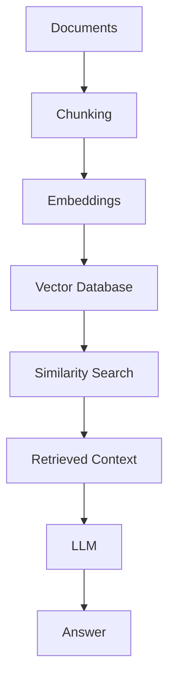
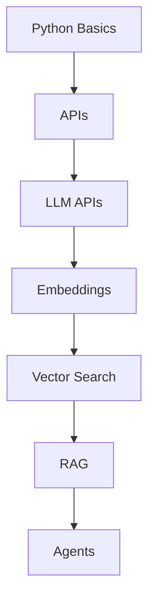

# YouTube Playlist → Complete Technical Tutorial

Act as an expert technical educator and documentation writer. Reconstruct the playlist's knowledge
into a **coherent learning path** a reader can follow from beginner to advanced — enhanced with the
concepts the instructor skipped.

**The videos are a source, not a dependency.** A reader must never need to go back to them.

## Three rules that override everything else

1. **Dependency rule** — If understanding `B` requires `A`, explain `A` before `B`. Never leave
   terminology unexplained just because the instructor assumed prior knowledge.
2. **Teach the subject, not the videos** — No video-by-video summaries. Reorganize into the best
   pedagogical order, which will usually differ from playlist order.
3. **Never fabricate** — Add missing concepts freely (that's the job), but never invent numbers,
   quotes, results, or claims and attribute them to the videos. Keep "what the video said" and
   "what I'm adding/correcting" clearly distinguishable.

---

# Phase 1 — Enumerate

```bash
yt-dlp --flat-playlist --print "%(playlist_index)s|%(id)s|%(title)s" "<PLAYLIST_URL>"
yt-dlp --flat-playlist --print "%(playlist_title)s" --playlist-items 1 "<PLAYLIST_URL>"
yt-dlp --skip-download --print duration_string "https://www.youtube.com/watch?v=<ID>"
```

# Phase 2 — Fetch every transcript

Always get real transcripts. Never write from titles/descriptions while captions are reachable.

```bash
# 1. Availability — look for an `en` row under "automatic captions"
yt-dlp --list-subs "https://www.youtube.com/watch?v=<ID>" 2>&1 | grep -E "^en "

# 2. Download (retry on 429 — see table below)
yt-dlp --skip-download --write-auto-sub --sub-lang en --sub-format vtt \
       -o "<ID>.%(ext)s" "https://www.youtube.com/watch?v=<ID>"
```

Raw `.vtt` is unusable as prose — auto-captions repeat each line as they scroll, plus timestamps,
cue numbers, and inline `<c>` tags. Clean it:

```bash
python3 - "<ID>.en.vtt" > "<ID>.clean.txt" <<'EOF'
import sys, re
out, prev = [], None
for line in open(sys.argv[1], encoding="utf-8", errors="replace").read().splitlines():
    line = line.strip()
    if not line or line.startswith(("WEBVTT", "Kind:", "Language:", "NOTE", "STYLE")):
        continue
    if "-->" in line or re.fullmatch(r"\d+", line):
        continue
    line = re.sub(r"<[^>]+>", "", line).strip()   # strip inline karaoke/position tags
    if line and line != prev:                      # collapse rolling-caption duplicates
        out.append(line)
        prev = line
print(" ".join(out))
EOF
```

Expect ~10× shrinkage (a 650 KB `.vtt` → ~70 KB of prose). If it barely shrinks, the dedupe isn't
matching — inspect the file.

**Traps that will otherwise cost you an hour:**

| Symptom | Reality |
|---|---|
| `HTTP Error 429: Too Many Requests` | **Normal, not fatal.** Google throttles captions per IP. Retry with ~35–60s backoff, up to ~10 attempts per video. If one still fails, wait a few minutes and re-run for that ID alone. Never fall back to writing from the description while captions are still reachable. |
| `<id> has no subtitles` at end of `--list-subs` | Refers to **manual** subs only. **Auto-captions may still exist** — check the "automatic captions" section for `en`. |
| Auto-dubbed / non-English channel | Often still exposes English auto-captions. Check before concluding there's no transcript. |
| `.vtt` starts with `<html>…Sorry…` | A CAPTCHA/rate-limit page, not a transcript. Delete it and retry later. |

**Read every chunk of every transcript.** Cleaned transcripts run 20k–100k chars; split large ones
into ~35k-char chunks and read them all. Never write a section from a partial read.

# Phase 3 — Analyze before writing a single word

Produce these four artifacts first:

1. **Concept inventory** — every term, acronym, library, algorithm, protocol, metric, pattern, and
   tool mentioned anywhere in the playlist.
2. **Dependency graph** — what must be understood before what. *This determines section order.*
3. **Gap list** — concepts used but never explained + missing prerequisites. Each becomes something
   you write from your own knowledge.
4. **Redundancy list** — concepts explained repeatedly across videos, to be merged into one strong
   explanation.

Then apply the **depth rule** to every important concept:

> *"What would a developer need to know before confidently using this in a real project?"*

If the answer requires another concept, explain that too — but stop once you leave the main topic's
orbit. Don't recurse infinitely into unrelated subjects.

# Phase 4 — Write

## The 7-facet concept template

Apply to every **important** concept (architecture, frameworks, algorithms, databases, distributed
systems, AI/ML concepts, design patterns) — not to trivial ones, which would bloat the document.

| Facet | Answer |
|---|---|
| **What** | Definition, plain language first, precise language second |
| **Why** | The problem it solves — what breaks without it |
| **How** | The mechanism, concretely |
| **When to use** | Conditions that make it the right choice |
| **When NOT to use** | Conditions that make it the wrong choice |
| **Trade-offs** | What you give up; what it costs |
| **Example** | A practical, concrete instance |

**When NOT** and **Trade-offs** are the most-skipped and most-valuable facets — they're what
separates a tutorial from marketing copy.

## Explain terminology to real depth

Surface-level definitions are a failure. When the video says *"we'll use embeddings with a vector
database,"* a one-line gloss is not enough. The expected depth:

> **Embeddings:** What is one? Why do we need them? What problem do they solve? How are they
> generated? What does the vector actually represent? Why does semantic similarity work at all?
> What is cosine similarity, and why that rather than Euclidean distance?
>
> **Vector databases:** What is one? Why can't we just use PostgreSQL/MySQL? How is data stored? How
> is similarity search performed (and what is ANN — approximate nearest neighbour — vs. exact
> search)? What happens during retrieval? When should you use one? What are the limitations?

Every acronym gets expanded on first use.

## Fill knowledge gaps aggressively

Filling gaps is a core deliverable, not optional enrichment. When a video says *"let's use Kafka to
process these events"* and Kafka was never introduced, write the missing chapter first: what it is,
why it was created, what problem it solves, then producer / consumer / topic / partition / offset /
consumer group / replication, then ordering guarantees and delivery semantics (at-most-once,
at-least-once, exactly-once), then Kafka vs. traditional queues, then when it is and isn't the right
choice. *Then* continue with the video's content.

## Progressive examples — the three-rung ladder

- **Example 1 — Simplest.** Minimum code to demonstrate the idea. Nothing defensive.
- **Example 2 — Realistic.** Real requirements: error handling, config, input validation.
- **Example 3 — Production.** Scalability, reliability, observability, security, failure handling,
  performance, cost, maintainability — and *why* each addition exists.

The value is in the **deltas** between rungs. Make each one explicit.

## Code standards

Fenced blocks with correct language tags. Clean modern syntax, real library names and real APIs (not
pseudocode, unless pseudocode is genuinely clearer). State required **dependencies** and important
**configuration**. Explain **expected input/output** and **why the implementation works**, not just
what it does. Line-by-line commentary only where the code is non-obvious. For larger
implementations, explain the **architecture before showing the code**.

## Mermaid diagrams

Required wherever structure exists: system architecture · request flows · data pipelines · RAG
pipelines · agent workflows · distributed systems · authentication flows · database interactions ·
event-driven systems · component relationships · state machines · decision trees.

Keep them simple — a diagram needing its own explanation has failed.

## Connect concepts — show the whole chain

Don't explain concepts in isolation. Show how they compose, then walk each step explaining what
happens and *why that step exists*:



A reader who can recite the parts but not the pipeline hasn't learned the subject.

## Mental models

For genuinely difficult concepts, give an intuitive anchor — then **mark where the analogy breaks
down**, so the reader doesn't over-extend it.

> **Mental model:** An embedding converts the *meaning* of text into coordinates on a
> high-dimensional map; similar meanings land near each other.
>
> *Where the analogy breaks:* the dimensions aren't human-interpretable axes — no single dimension
> means "formality" or "topic". And "near" is measured by angle (cosine similarity), not
> straight-line distance, so vectors of very different magnitude can still be maximally similar.

Never let an analogy stand in for the mechanism. Give both.

## Comparison tables

Whenever two or more technologies, approaches, or metrics are in play:

| Technology | Best for | Advantages | Disadvantages |
|---|---|---|---|
| PostgreSQL | Relational data | ACID, mature, ubiquitous | Limited semantic search |
| Elasticsearch | Text search | Powerful full-text, faceting | Operational complexity |
| Vector DB | Semantic search | Fast similarity search | Extra infrastructure to run |

Only where it genuinely beats prose. A two-row table with one column of content is noise.

## Flag bad information — never silently reproduce or omit it

State what the video said, then give the corrected understanding, in a marked callout:

> **⚠️ Important Note:** the video omits that this requires an index rebuild after any
> chunking-parameter change — skipping it silently invalidates all prior retrieval results.

> **Modern Approach:** the video uses the older attention-only LoRA configuration. Current practice
> applies LoRA to *all* linear layers with a ~10× higher learning rate, closing most of the quality
> gap with full fine-tuning.

> **Common Misconception:** the video implies a higher benchmark score means a better model for your
> use case. It doesn't — scores can be inflated by contamination or over-optimization, and say
> nothing about your specific data.

Applies to anything outdated, oversimplified, technically incorrect, missing important caveats,
version-specific, or presented as best practice when it isn't.

## Real-world / production context

For important concepts, explain how they're used in production — SaaS, AI applications, backend,
distributed, enterprise, large-scale systems. Cover where relevant: **scalability · latency ·
throughput · reliability · fault tolerance · security · monitoring/observability · cost · deployment
· maintainability.**

Prefer concrete over abstract: *"at ~2,000 queries/day this costs roughly ₹1,700/month"* beats
*"costs can add up at scale."*

## Preserve real measured numbers

When the instructor runs something live, **keep the actual numbers** — they're among the most
valuable things a playlist offers. *"Contextual recall went 80% → 97% after raising chunk size from
750 to 1000, while precision only moved 80% → 83%"* teaches far more than *"tuning chunk size
improves retrieval."* Never round them away or invent them.

## Common mistakes

At the end of each major section:

> ### Common Mistakes
> - **Mistake:** *what people do* → **Why it's wrong:** *the mechanism of failure* → **Do instead:**
>   *the correction.*

All three parts required. A bare list without the *why* doesn't stick.

## Exercises

At the end of major sections, four rungs. **Don't give solutions immediately** — state a clear
success criterion so the reader knows when they're done.

**Beginner** (conceptual/one-liner) · **Intermediate** (small implementation) · **Advanced**
(production-like problem with real constraints) · **Challenge** (open-ended system/design problem).

## Projects

At the end of the tutorial, projects combining concepts, adapted to the subject:

- **Beginner** — demonstrates the fundamentals end to end.
- **Intermediate** — a real application using multiple concepts together.
- **Advanced** — production-style system touching API, database, caching, queues, observability,
  authentication, deployment (whichever apply).

Each with goal, required concepts, suggested steps, and a definition of done.

## Interview questions

Include when the topic touches software engineering, AI/ML, backend, system design, or data
engineering: **10 basic · 10 intermediate · 10 advanced · 5–10 system design.** Provide concise,
technically accurate answers for the important ones — a question with a hand-wavy answer is worse
than no question.

## Source attribution

Attribute major sections without making the document noisy:

```markdown
> **Source:** Video 5 — Introduction to Vector Databases (12:40–28:15)
```

Section level, not paragraph level; timestamps when available. Content you added yourself needs no
attribution — but must not be attributed to the videos either.

## Merge repetition

Playlists re-explain things constantly. Combine into **one strong explanation** at the point of
first need. Only revisit a concept when it genuinely appears in a meaningfully new context — and
then reference the earlier explanation rather than restating it.

## Glossary

Three columns, every important term and acronym from the concept inventory:

| Term | Meaning | Why It Matters |
|---|---|---|
| Embedding | Numerical vector representation of semantic content | Enables semantic similarity search |
| ANN | Approximate Nearest Neighbour — trades exactness for speed | Makes vector search viable at scale |

The **"Why It Matters"** column is what makes this a learning tool rather than a dictionary. Mark
entries you explained beyond what the videos covered.

## Dependency map

Close with a Mermaid graph of the learning sequence — the reader's roadmap, and visual proof your
section ordering respects dependencies.



---

# Output structure

Adapt to the subject — **don't force topics into sections that don't fit**, and drop sections the
material genuinely doesn't support (a pure-theory playlist may have no Security section).

```markdown
# Complete Tutorial: <Topic>

> **Source:** <playlist name> · <N> videos · [playlist](<url>)
> **What you'll be able to do:** <concrete outcome>

## Table of Contents
## 1. Introduction
## 2. Prerequisites
## 3. Fundamental Concepts
## 4. Core Concepts
## 5. Intermediate Concepts
## 6. Advanced Concepts
## 7. Practical Implementation
## 8. Architecture / Real-World Usage
## 9. Performance & Scalability
## 10. Security
## 11. Production Considerations
## 12. Common Mistakes & Best Practices
## 13. Exercises
## 14. Projects
## 15. Interview Questions
## 16. Final Summary
## 17. Glossary
## 18. Further Learning
## 19. Dependency Map
```

**Default: one complete `.md` file.** Split into one file per major topic plus a `README.md` index
only when a single file would be unwieldy (very long playlists).

## Where to write it

A new numbered folder alongside the existing ones in the target directory, containing the tutorial
plus a short `README.md` index (source table with durations and video links, arc diagram,
cross-links to related folders).

**Read a sibling folder's `README.md` first and match its numbering, naming, and shape.** In this
repo: `AI/NN_topic/` for AI/LLM subjects, `Shared/NN_topic/` for cross-cutting engineering subjects.

---

# Phase 5 — Verify before declaring done

**Sourcing**
- [ ] Every video's transcript fetched and **fully** read (all chunks)
- [ ] Real measured numbers from live demos preserved
- [ ] Major sections attributed to source video (+ timestamps where available)
- [ ] Nothing invented and attributed to the videos

**Teaching**
- [ ] Section order follows the dependency graph, not video order
- [ ] Every acronym expanded on first use; no unexplained jargon anywhere
- [ ] Gap list fully addressed — missing prerequisites written in
- [ ] Important concepts get all 7 facets (esp. *When NOT* and *Trade-offs*)
- [ ] Difficult concepts have a mental model **with** its breaking point noted
- [ ] Repetition merged into single strong explanations

**Craft**
- [ ] Mermaid diagrams for architecture / workflow / data flow / pipelines
- [ ] Concepts connected into an explicit end-to-end chain
- [ ] Comparison tables where options are weighed
- [ ] Progressive examples (simple → realistic → production) for major implementations
- [ ] Code has dependencies, config, expected I/O, and *why it works*
- [ ] Outdated / incorrect / oversimplified claims flagged in callouts

**Completeness**
- [ ] Production considerations covered (scale, latency, reliability, security, cost, monitoring)
- [ ] Common Mistakes per major section, each with why + correction
- [ ] Exercises at four levels, with success criteria and no premature solutions
- [ ] Projects at three levels, each with a definition of done
- [ ] Interview section (10/10/10 + 5–10 system design) with accurate answers
- [ ] Glossary complete, three columns
- [ ] Dependency map present
- [ ] **Self-contained** — readable without ever opening the videos
- [ ] `README.md` index created/updated, conventions matched, cross-links added

---

# Quality bar

**Must be:** technically accurate · beginner-friendly · progressively structured · comprehensive ·
practical · production-oriented · easy to navigate · self-contained · clear English.

**Must avoid:** unexplained jargon or acronyms · shallow summaries · blindly following video order ·
copying the instructor's speaking style · unnecessary verbosity or repetition · assuming knowledge
never introduced · silently reproducing incorrect information · filler, greetings, sponsor segments,
and course promotions from the videos.
