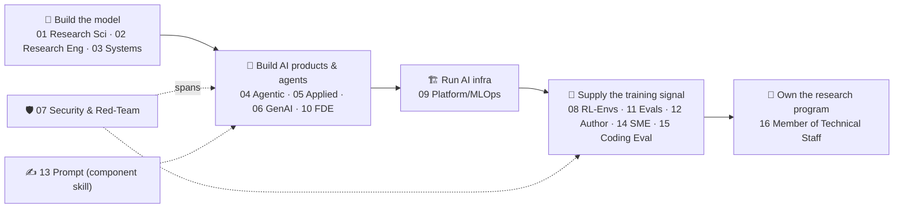

# 💼 AI Jobs → Learning Paths

> The **job-level front door** to this repo. Pick a role, and this folder tells you what the work is, **example companies that hire for it**, and exactly which lessons/modules to study.
>
> The modules teach topics; **this folder maps topics to the careers that use them**, and gives you a hands-on project for each.

> ⚠️ Company names are **illustrative examples, not endorsements or a complete list.**

---

## 📊 The roles

| # | Role | Type | Example employers | Project |
|---|------|------|--------------------|---------|
| [01](01_ai-research-scientist/README.md) | AI / ML Research Scientist | FT | OpenAI, Anthropic, DeepMind, Meta, xAI | [🧪 try it](01_ai-research-scientist/project.md) |
| [02](02_research-engineer-model-training/README.md) | Research Engineer — Model Training | FT | OpenAI, Anthropic, DeepMind, Mistral, Together AI | [🧪 try it](02_research-engineer-model-training/project.md) |
| [03](03_ml-systems-and-training-infra/README.md) | ML Systems & Training-Infra Engineer | FT | NVIDIA, OpenAI, Meta (PyTorch), CoreWeave, Databricks | [🧪 try it](03_ml-systems-and-training-infra/project.md) |
| [04](04_agentic-ai-engineer/README.md) 🔥 | Agentic AI Engineer | FT | Sierra, Cognition, Cursor, LangChain, consultancies | [🧪 try it](04_agentic-ai-engineer/project.md) |
| [05](05_applied-ai-llm-product-engineer/README.md) | Applied AI / LLM Product Engineer | FT | Perplexity, Cursor, Harvey, Glean, + most enterprises | [🧪 try it](05_applied-ai-llm-product-engineer/project.md) |
| [06](06_genai-engineer/README.md) | GenAI Engineer | FT | Enterprises, TCS/Infosys/Accenture, AI startups | [🧪 try it](06_genai-engineer/project.md) |
| [07](07_ai-security-and-red-team-engineer/README.md) | AI Security & Red-Team Engineer | FT | Anthropic, DeepMind, Lakera, Protect AI, Trail of Bits | [🧪 try it](07_ai-security-and-red-team-engineer/project.md) |
| [08](08_rl-environments-and-infra-engineer/README.md) ⭐ | RL Environments & Infrastructure Engineer | FT/contract | Scale, Surge, Mercor, Turing, Prime Intellect | [🧪 try it](08_rl-environments-and-infra-engineer/project.md) |
| [09](09_ai-platform-mlops-inference-engineer/README.md) | AI Platform / MLOps & Inference Engineer | FT | Databricks, Together AI, Fireworks, Baseten, cloud MLs | [🧪 try it](09_ai-platform-mlops-inference-engineer/project.md) |
| [10](10_forward-deployed-ai-solutions-engineer/README.md) | Forward-Deployed / AI Solutions Engineer | FT | Palantir, OpenAI, Anthropic, Sierra, Glean | [🧪 try it](10_forward-deployed-ai-solutions-engineer/project.md) |
| [11](11_agent-evaluation-and-data-pipeline-engineer/README.md) | Agent Evaluation & Data-Pipeline Engineer | FT | Scale, Surge, Braintrust, Arize, W&B, lab eval teams | [🧪 try it](11_agent-evaluation-and-data-pipeline-engineer/project.md) |
| [12](12_rl-environment-task-author-contract/README.md) | RL Environment / Task Author (contract) | Contract | Mercor, Micro1, Turing, Handshake, Outlier | [🧪 try it](12_rl-environment-task-author-contract/project.md) |
| [13](13_prompt-engineer/README.md) | Prompt Engineer / AI Interaction | FT (fewer) | Anthropic, OpenAI, AI startups (often merged into #05) | [🧪 try it](13_prompt-engineer/project.md) |
| [14](14_domain-sme-ai-data-contributor-contract/README.md) | Domain SME / AI Data Contributor (contract) | Contract | Outlier, Mercor, Micro1, DataAnnotation, Prolific | [🧪 try it](14_domain-sme-ai-data-contributor-contract/project.md) |
| [15](15_agentic-coding-evaluator-contract/README.md) 🆕 | Agentic Coding Evaluator (contract, hourly) | Contract | Mercor, Turing, Outlier, Handshake AI, Surge AI | [🧪 try it](15_agentic-coding-evaluator-contract/project.md) |
| [16](16_member-of-technical-staff-frontier-ai/README.md) 🆕 | Member of Technical Staff, Frontier AI (Research/Data Quality Lead) | FT, core team | AI-data-lab core/research teams; frontier labs' internal research-ops | [🧪 try it](16_member-of-technical-staff-frontier-ai/project.md) |

> 🏗️ **Roles 01–03 now have platform-level system designs.** [`AI/29_model-training-system-design`](../29_model-training-system-design/README.md) carries a full Requirements → HLD → LLD for each: a [research experiment platform](../29_model-training-system-design/01_research_experiment_platform/README.md) (01), a [post-training pipeline](../29_model-training-system-design/02_post_training_pipeline/README.md) (02), and a [distributed training platform](../29_model-training-system-design/03_distributed_training_platform/README.md) (03) — each with a concepts primer, an interview drill, and runnable code. The three `project.md` files above link into them.

> **#04 / #05 / #06 overlap heavily** — "Agentic AI Engineer," "Applied AI / LLM Engineer," and "GenAI Engineer" are often the *same job* under different titles. Rough distinction: **GenAI** = build generative features (RAG/chat/gen), **Applied AI** = the umbrella product-engineering role, **Agentic AI** = the autonomous-agent specialization. Search all three when job-hunting.

---

## 🧭 The role spectrum

The top cluster (01–03) *is* the frontier lab. The product/agent cluster (04–06, 10) builds on models. The supply cluster (08, 11, 12, 14, 15) feeds labs the training/eval signal — a category created by the 2024→ shift to RL-with-verifiable-rewards. Role 16 sits **above** the supply cluster: it doesn't build one environment/pipeline, it owns whether the signal from all of them is trustworthy enough to act on.

---

## 🎯 Quick chooser

- **"Start fast, remote, low barrier"** → [14 SME](14_domain-sme-ai-data-contributor-contract/README.md) → [15 Agentic Coding Evaluator](15_agentic-coding-evaluator-contract/README.md) (if you code) → [12 Env/Task Author](12_rl-environment-task-author-contract/README.md).
- **"Experienced backend/full-stack SWE"** → [04 Agentic AI](04_agentic-ai-engineer/README.md) 🔥 / [05 Applied AI](05_applied-ai-llm-product-engineer/README.md) / [06 GenAI](06_genai-engineer/README.md), or [08 RL Environments](08_rl-environments-and-infra-engineer/README.md) ⭐ (this repo's anchor).
- **"Infra/DevOps background"** → [09 Platform/MLOps](09_ai-platform-mlops-inference-engineer/README.md) or [03 Systems](03_ml-systems-and-training-infra/README.md).
- **"Security/SecOps background"** → [07 AI Security](07_ai-security-and-red-team-engineer/README.md) → security env authoring ([Lesson 9](../10_rl-environments-and-infra/09-security-cve-patching-environments.md)).
- **"Aim for a lab / training research"** → [02 Research Engineer](02_research-engineer-model-training/README.md) → [01 Research Scientist](01_ai-research-scientist/README.md).
- **"Already do eval/data-pipeline work, want to own the program"** → [16 Member of Technical Staff, Frontier AI](16_member-of-technical-staff-frontier-ai/README.md) — the full-time destination above [08](08_rl-environments-and-infra-engineer/README.md)/[11](11_agent-evaluation-and-data-pipeline-engineer/README.md).

---

## 🗺️ How the repo maps to these jobs

| If you're targeting… | Study first |
|---|---|
| Agentic AI (04) | [`05_multi-agent-frameworks`](../05_multi-agent-frameworks/README.md), [`13_langgraph`](../13_langgraph/README.md), [`15_mcp`](../15_mcp/README.md), [`09_a2a-protocol`](../09_a2a-protocol/README.md), [`14_memory`](../14_memory/README.md), [`16_evals`](../16_evals/README.md) |
| Applied AI / GenAI (05, 06, 13) | [`01_prompt-engineering`](../01_prompt-engineering/README.md), [`12_rag`](../12_rag/README.md), [`06_vector-databases`](../06_vector-databases/README.md), [`08_multimodal-ai`](../08_multimodal-ai/README.md), [`11_langchain`](../11_langchain/README.md), [`16_evals`](../16_evals/README.md) |
| RL environments / evals / data (08, 11, 12) | [`10_rl-environments-and-infra`](../10_rl-environments-and-infra/README.md) ⭐, [`16_evals`](../16_evals/README.md), [`DL/04_reinforcement-learning`](../../DL/04_reinforcement-learning/README.md) |
| Agentic coding evaluation (15) | [`23_ai-coding-agents-and-code-eval`](../23_ai-coding-agents-and-code-eval/README.md) 🆕, [`01_prompt-engineering`](../01_prompt-engineering/README.md), [`17_claude-code`](../17_claude-code/README.md), [`16_evals`](../16_evals/README.md) |
| Research/data-quality ownership (16) | [`10_rl-environments-and-infra` Lesson 10](../10_rl-environments-and-infra/10-ops-to-research-translation-and-signal-judgment.md) 🆕, [Lesson 6](../10_rl-environments-and-infra/06-running-frontier-models-and-failure-analysis.md), [Lesson 4](../10_rl-environments-and-infra/04-task-generation-and-data-pipelines.md), [`16_evals`](../16_evals/README.md) |
| Infra / systems / serving (03, 09) | [`04_llm-serving-and-inference-optimization`](../04_llm-serving-and-inference-optimization/README.md), [`Shared/02_mlops`](../../Shared/02_mlops/README.md), [`10_rl-environments-and-infra` L7](../10_rl-environments-and-infra/07-the-environment-platform-and-infra.md) |
| Training / research (01, 02) | [`02_fine-tuning-and-alignment`](../02_fine-tuning-and-alignment/README.md), [`DL/04_reinforcement-learning`](../../DL/04_reinforcement-learning/README.md), [`Shared/01_lora-qlora`](../../Shared/01_lora-qlora/README.md) |
| Security (07) | [`03_llm-security-and-guardrails`](../03_llm-security-and-guardrails/README.md), [`10_rl-environments-and-infra` L9](../10_rl-environments-and-infra/09-security-cve-patching-environments.md) |
| Interview prep (any senior role) | [`19_agentic-ai-interview`](../19_agentic-ai-interview/README.md) |

---

## 🔎 Notes on sourcing
Titles reflect current market knowledge + a July 2026 web search across job boards and 2026 career guides. LinkedIn itself is login-walled and can't be scraped directly — for *live* openings, search job boards by these exact titles.

## ➕ Adding a new job
Each job is a folder: `NN_slug/README.md` (the role writeup) + `NN_slug/project.md` (a hands-on sample project). Copy the closest role folder as a template, fill in what the work is + example employers, write a matching project, place it on the [spectrum](#-the-role-spectrum), insert it into the table in the right spot, and give it a lesson path.
