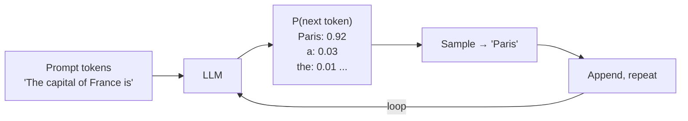
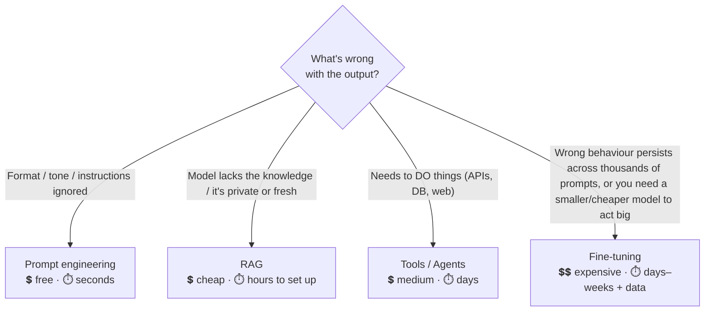

# 1 · What is Prompt Engineering?

*Prompt engineering module · Lesson 1 of 8 · [← index](README.md) · [next → Anatomy of a Prompt](02-anatomy-of-a-prompt.md)*

Prompt engineering is the practice of **crafting the text you send to an LLM** so it reliably returns the output you want — without touching the model's weights. It's part instruction-writing, part experiment design, part understanding how the model "thinks."

---

## 1.1 Why it matters: the same model, two prompts

The model is fixed. The only thing you control at inference time is the prompt. That control is enormous:

```python
# ❌ Vague prompt → vague, unusable answer
llm("Tell me about the sales data.")
# → "The sales data shows various trends across different periods..."

# ✅ Specific prompt → precise, actionable answer
llm("""You are a data analyst. Given this monthly revenue (₹ lakh):
Jan 22, Feb 28, Mar 35, Apr 47.
1. State the overall trend in one sentence.
2. Compute the % growth from Jan to Apr.
3. Flag the single biggest month-over-month jump.
Answer as three numbered bullets.""")
# → "1. Revenue grew steadily every month.
#    2. Growth Jan→Apr = (47-22)/22 = 113.6%.
#    3. Biggest jump: Mar→Apr (+₹12 lakh)."
```

Same model, same cost. The second prompt encodes a **role**, **data**, **explicit tasks**, and a **format** — and gets a dramatically better result.

---

## 1.2 The mental model: an LLM is a next-token predictor

Under the hood, an LLM does exactly one thing: given a sequence of tokens, predict the probability distribution over the next token, sample one, append it, and repeat.



**Why this matters for prompting:**

- The prompt is the *conditioning context* that shapes that probability distribution. A good prompt shifts probability mass toward the tokens you want.
- The model has **no memory** between calls — every request is stateless. "Context" is only what's in the prompt right now (this is why chat apps resend the whole history).
- The model is **pattern-completing**, not reasoning from first principles. If your prompt looks like the start of a well-structured answer, the completion tends to be well-structured too. This is the deep reason few-shot examples and "think step by step" work.

---

## 1.3 Key inference knobs (not the prompt, but they shape output)

Prompting works alongside a few sampling parameters. You'll tune these constantly:

| Parameter | What it does | Use low when… | Use high when… |
|-----------|--------------|----------------|----------------|
| `temperature` (0–2) | Randomness of sampling | You want deterministic, factual output (0–0.3) | You want creative variety (0.8–1.2) |
| `top_p` (0–1) | Nucleus sampling: only sample from the top tokens whose cumulative prob ≥ p | Precision tasks | Creative tasks |
| `max_tokens` | Hard cap on output length | Short answers | Long generation |
| `stop` | Sequences that end generation | Structured output boundaries | — |
| `seed` | Fixes randomness for reproducibility | Testing / evals | — |

```python
from openai import OpenAI
client = OpenAI()

resp = client.chat.completions.create(
    model="gpt-4o-mini",
    messages=[{"role": "user", "content": "Extract the invoice total."}],
    temperature=0,        # deterministic — we want THE number, not a creative one
    max_tokens=50,
    seed=42,              # reproducible for tests
)
```

> **Rule of thumb:** extraction/classification/code → `temperature=0`. Brainstorming/writing → `0.7–1.0`.

---

## 1.4 Prompt engineering vs. the alternatives



They **compose** — a production system usually does all four. But you always start at the top, because prompt fixes are instant and free.

---

## 1.5 Takeaways

- Prompt engineering shapes the model's next-token distribution — it's the one lever you fully control at inference time.
- LLMs are **stateless pattern-completers**: everything they "know" for this call is in the prompt.
- Pair prompts with the right **sampling settings** (temperature 0 for precision, higher for creativity).
- It's the **first and cheapest** thing to try; RAG, tools, and fine-tuning come after, and layer on top.

➡️ Next: [Anatomy of a Prompt](02-anatomy-of-a-prompt.md) — the reusable building blocks every strong prompt is made of.
