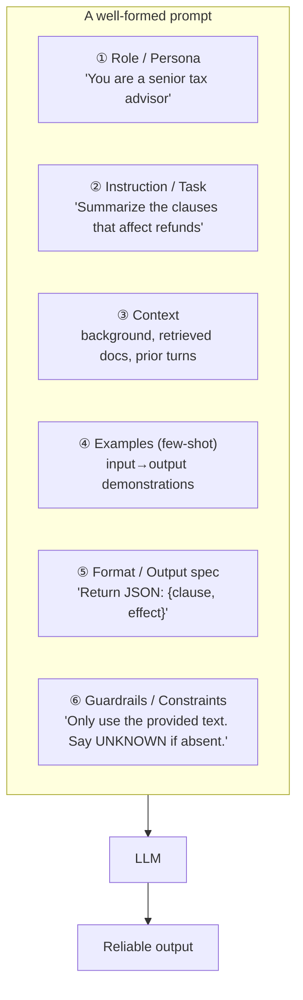

# 2 · Anatomy of a Prompt

*Prompt engineering module · Lesson 2 of 8 · [← What is Prompt Engineering](01-what-is-prompt-engineering.md) · [next → Core Techniques](03-core-techniques.md)*

A strong prompt is not a blob of text — it's a **structure**. Once you see the building blocks, you can assemble them like Lego for any task.

---

## 2.1 The six building blocks



Not every prompt needs all six — but the more ambiguous or high-stakes the task, the more of them you should make explicit.

| # | Block | Answers the question | Example |
|---|-------|----------------------|---------|
| ① | **Role** | *Who* is answering? | "You are a Kubernetes SRE." |
| ② | **Instruction** | *What* to do? | "Diagnose why the pod is CrashLooping." |
| ③ | **Context** | *What info* to use? | logs, docs, the user's data |
| ④ | **Examples** | *What does good look like?* | 2–3 solved cases |
| ⑤ | **Format** | *How* to shape the answer? | "3 bullets, ≤20 words each" |
| ⑥ | **Guardrails** | *What not* to do? | "Don't guess; cite line numbers." |

---

## 2.2 A fully-assembled template

```text
# ① ROLE
You are an expert clinical-documentation assistant.

# ② INSTRUCTION
Extract every medication mentioned in the note below, with its dosage.

# ③ CONTEXT
Clinical note:
"""
Patient started on Metformin 500mg twice daily. Continue Lisinopril 10mg
once daily. Discontinued Aspirin.
"""

# ⑤ FORMAT
Return a JSON array of objects: {"drug": str, "dose": str, "status": "active"|"discontinued"}

# ⑥ GUARDRAILS
- Only include drugs explicitly named in the note.
- If a dose is not stated, use null.
- Do not add any drug not present in the text.
```

Expected output:

```json
[
  {"drug": "Metformin", "dose": "500mg twice daily", "status": "active"},
  {"drug": "Lisinopril", "dose": "10mg once daily", "status": "active"},
  {"drug": "Aspirin", "dose": null, "status": "discontinued"}
]
```

---

## 2.3 The three chat roles (system / user / assistant)

Modern chat models take a **list of messages**, each tagged with a role. This is the real API surface — the "prompt" is the whole array.

```mermaid
sequenceDiagram
    participant App
    participant LLM
    App->>LLM: system: "You are a terse SQL tutor. Never write prose."
    App->>LLM: user: "How do I join two tables?"
    LLM-->>App: assistant: "SELECT * FROM a JOIN b ON a.id = b.a_id;"
    App->>LLM: user: "add a WHERE"
    Note over App,LLM: full history resent every turn (stateless)
    LLM-->>App: assistant: "... WHERE b.active = true;"
```

| Role | Purpose | Who controls it |
|------|---------|-----------------|
| `system` | Sets persistent behaviour, persona, rules for the whole conversation | **You** (the app developer) — the user usually can't see or edit it |
| `user` | The end-user's turn / request | The end user |
| `assistant` | The model's previous replies (part of history) | The model |

```python
messages = [
    {"role": "system", "content": "You are a helpful assistant that always replies in French."},
    {"role": "user", "content": "What is the weather like?"},
    {"role": "assistant", "content": "Je ne peux pas vérifier la météo en direct."},  # prior turn
    {"role": "user", "content": "Ok, tell me a joke instead."},
]
```

> **Key insight:** put your *rules and persona* in `system`, and the *task/data* in `user`. System messages are weighted more heavily as standing instructions and are the right place for guardrails you don't want the user to override.

---

## 2.4 Ordering & delimiters matter

Two structural habits that measurably improve reliability:

**1. Put instructions first, long context last** — but keep the *question* near the end too. Models pay most attention to the start and end of the prompt (the "lost in the middle" effect — see [Lesson 6](06-context-engineering.md)).

**2. Delimit distinct sections** so the model never confuses *instructions* with *data* (this is also a security defense — see [Lesson 8](08-pitfalls-and-anti-patterns.md)):

```text
Summarize the text between the triple quotes in one sentence.

"""
{{ untrusted user or retrieved text goes here }}
"""
```

Common delimiters: triple quotes `"""`, XML-ish tags `<document>...</document>`, or Markdown headers. XML tags are especially robust for nested structure:

```xml
<instructions>Answer only from the context.</instructions>
<context>{{retrieved_chunks}}</context>
<question>{{user_question}}</question>
```

---

## 2.5 Takeaways

- Think in **six blocks**: role, instruction, context, examples, format, guardrails — make the ambiguous ones explicit.
- The real prompt is a **message array**; put persona + rules in `system`, task + data in `user`.
- **Order** (instructions first, question last) and **delimiters** (quotes/XML tags) separate instructions from data and boost reliability.
- Templates make prompts reusable, testable, and diff-able — treat them like code.

➡️ Next: [Core Techniques](03-core-techniques.md) — zero-shot, few-shot, and the everyday moves.
