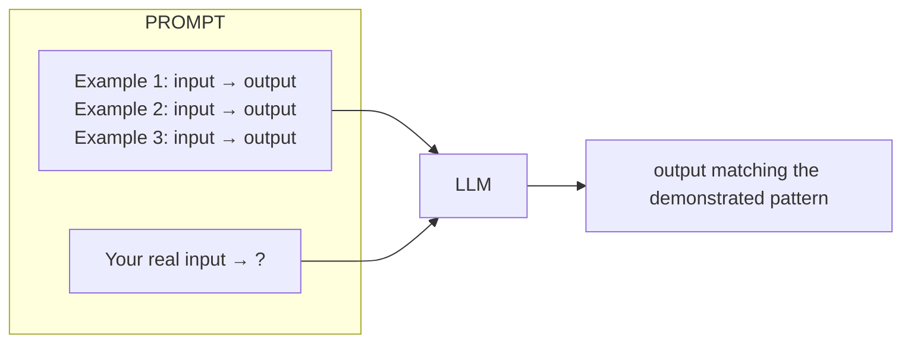
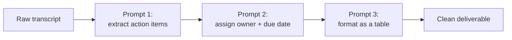
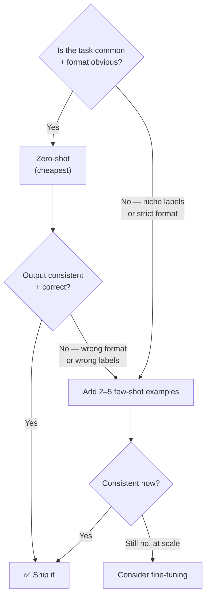

# 3 · Core Techniques

*Prompt engineering module · Lesson 3 of 8 · [← Anatomy of a Prompt](02-anatomy-of-a-prompt.md) · [next → Reasoning Techniques](04-reasoning-techniques.md)*

The everyday moves. Master these four and you cover the majority of real prompting work; the fancier reasoning methods in [Lesson 4](04-reasoning-techniques.md) build on top.

---

## 3.1 Zero-shot prompting

Just ask, no examples. Works well for tasks the model has clearly seen a lot of in training (summarize, translate, classify obvious cases).

```python
prompt = "Classify the sentiment as positive, negative, or neutral:\n'The delivery was late but the product is great.'"
# → "neutral" (mixed) or "positive" depending on model — note the ambiguity
```

**When it fails:** ambiguous label definitions, niche formats, or when "positive/negative/neutral" don't mean to the model what they mean to *you*. That's your cue for few-shot.

---

## 3.2 Few-shot prompting

Show 2–5 input→output examples so the model infers the exact pattern, label set, and format you want. This is the single highest-leverage technique for consistency.



```text
Classify support tickets. Use EXACTLY these labels: BILLING, BUG, FEATURE_REQUEST.

Ticket: "I was charged twice this month."         → BILLING
Ticket: "The export button does nothing on click." → BUG
Ticket: "Please add dark mode."                    → FEATURE_REQUEST
Ticket: "My invoice PDF won't download."           →
```

Output: `BILLING` (the model now knows "invoice" maps to BILLING, not BUG, from the pattern).

**Few-shot best practices:**

| Do | Why |
|----|-----|
| Cover the **label space** (one example per class) | Model learns the full taxonomy |
| Include a **hard / edge case** | Teaches the boundary, not just the easy middle |
| Keep example **format identical** to what you want back | Model copies format exactly |
| **Balance** classes | Avoid biasing toward an over-represented label |
| Order can matter — put the trickiest example **last** | Recency effect |

> ⚖️ **Cost tradeoff:** every example is tokens you pay for on *every* call. Few-shot is prompt-time "training" — if you need dozens of examples, that's a signal to consider fine-tuning ([`../02_fine-tuning-and-alignment/`](../02_fine-tuning-and-alignment/README.md)) instead.

---

## 3.3 Role / persona prompting

Assign the model an expert identity. This conditions vocabulary, depth, and assumptions.

```text
You are a senior security engineer doing a code review.
Point out only genuine vulnerabilities, ranked by severity, with the CWE id.
```

Personas are a **compression trick**: "act as a tax advisor" pulls in a whole cluster of behaviours (formal tone, cites rules, hedges appropriately) in four words. Put the persona in the `system` message so it persists.

---

## 3.4 Task decomposition

Break one hard instruction into an ordered list of smaller steps. LLMs follow an explicit checklist far more reliably than a dense paragraph.

```text
Rewrite the email below to be more professional. Do it in these steps:
1. Fix all grammar and spelling.
2. Change the tone from casual to formal.
3. Keep it under 120 words.
4. End with a clear call to action.

Output only the final rewritten email.
```

For genuinely multi-stage work, decompose across **multiple prompts** (prompt chaining) so each step is simple and independently checkable:



```python
# Prompt chaining in code
items   = llm(f"List the action items in this transcript:\n{transcript}")
owned   = llm(f"For each action item, guess the owner from context:\n{items}")
table   = llm(f"Format as a Markdown table with columns Task | Owner:\n{owned}")
```

Each hop is a simple, testable transformation — far more robust than one mega-prompt.

---

## 3.5 A few reliable "control" phrases

Small phrases with outsized effect (use judiciously — test, don't cargo-cult):

| Phrase | Effect |
|--------|--------|
| "Let's think step by step." | Triggers reasoning (see [Lesson 4](04-reasoning-techniques.md)) |
| "If you are unsure, say 'I don't know'." | Reduces confident hallucination |
| "Only use the information in the context above." | Grounds to provided docs |
| "Answer with ONLY the label, no explanation." | Suppresses chatty preamble |
| "Take a deep breath and work through this carefully." | Empirically nudges harder reasoning on some models |

---

## 3.6 Zero-shot vs few-shot: how to choose



---

## 3.7 Takeaways

- **Zero-shot** for common tasks; **few-shot** the moment format/label consistency matters.
- Good few-shot = covers the label space, includes an edge case, matches output format exactly.
- **Role prompting** compresses a whole behaviour cluster into a persona — put it in `system`.
- **Decompose** hard tasks into a numbered checklist, or across chained prompts, so each step is simple and verifiable.

➡️ Next: [Reasoning Techniques](04-reasoning-techniques.md) — CoT, Self-Consistency, ReAct, and Tree-of-Thoughts.
