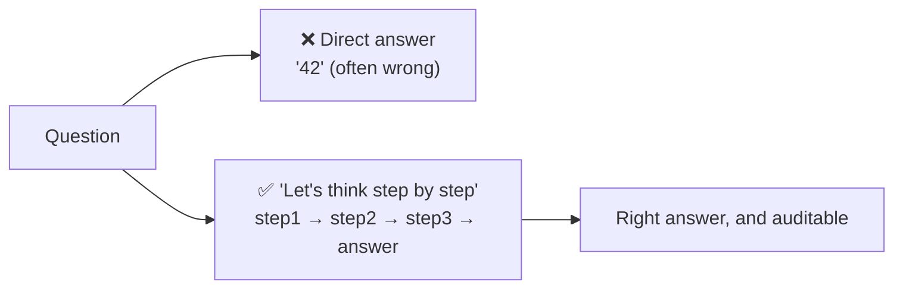
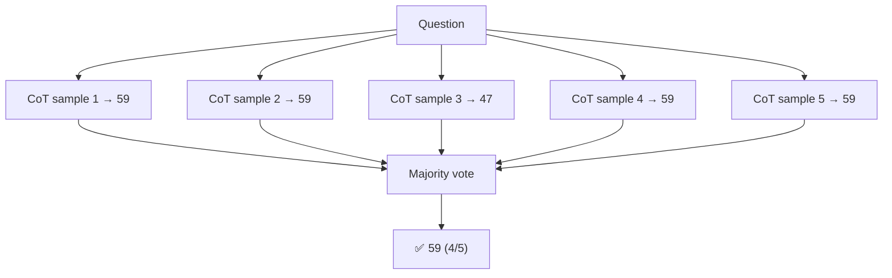
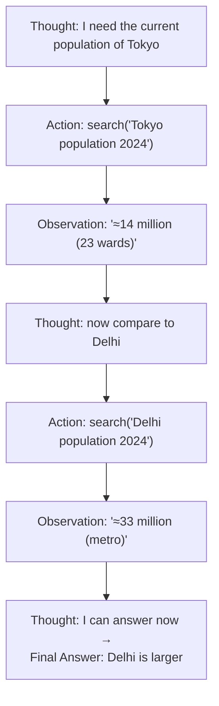
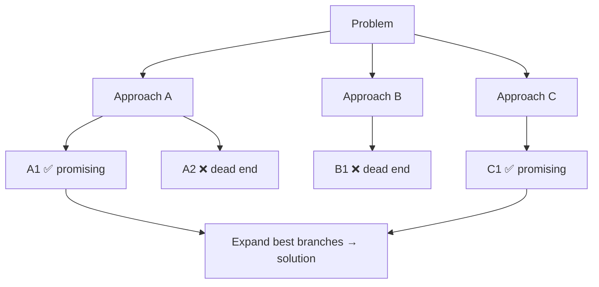
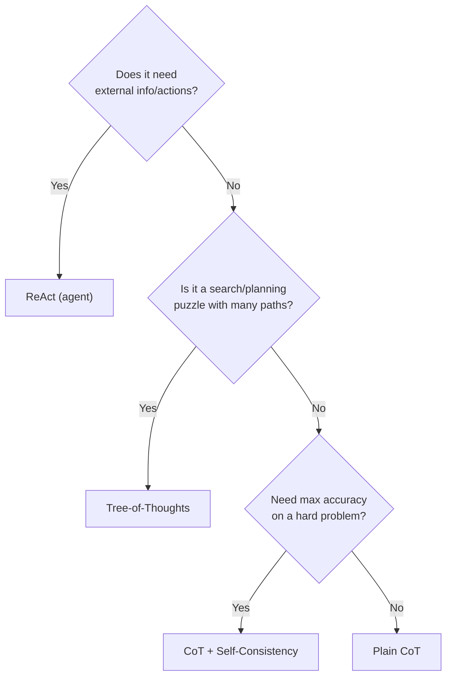

# 4 · Reasoning Techniques

*Prompt engineering module · Lesson 4 of 8 · [← Core Techniques](03-core-techniques.md) · [next → Structured Output](05-structured-output.md)*

For problems that need **multi-step thinking** — math, logic, planning, tool use — plain zero/few-shot often fails because the model commits to an answer token before it has "worked it out." These techniques force the reasoning to happen *in the output*, where it can actually help.

---

## 4.1 Chain-of-Thought (CoT)

**Idea:** make the model generate intermediate reasoning steps before the final answer. Because it's an autoregressive predictor, those steps become part of the context that conditions the answer — literally giving it "scratch space to think."

*(Wei et al., 2022 — "Chain-of-Thought Prompting Elicits Reasoning in LLMs")*



**Zero-shot CoT** — just append the magic phrase:

```text
Q: A shop has 23 apples. It sells 12, then a delivery brings 8 crates of 6 apples each.
How many apples now?
A: Let's think step by step.
```
```
Start: 23. Sold 12 → 23 - 12 = 11.
Delivery: 8 × 6 = 48. Total: 11 + 48 = 59.
Answer: 59.
```

**Few-shot CoT** — show worked examples *with* reasoning, and the model imitates the reasoning style (stronger, but more tokens).

| Pros | Cons |
|------|------|
| Big accuracy gains on math/logic/multi-hop | More tokens = slower + costlier |
| Reasoning is **auditable** (you can see where it went wrong) | Reasoning can be plausible but wrong ("hallucinated logic") |
| Trivial to apply | Not needed for simple lookups |

> 💡 If you don't want the reasoning shown to the end user, generate it, then add a final line like `Final answer:` and parse only that — or use a model with a hidden "thinking" mode.

---

## 4.2 Self-Consistency

**Idea:** CoT reasoning is a *sample* — run it several times at `temperature > 0`, get several independent reasoning chains, then **take the majority-vote answer**. Errors are random and scatter; the correct answer tends to be the mode.

*(Wang et al., 2022)*



```python
from collections import Counter

def self_consistent_answer(question, n=5):
    answers = []
    for _ in range(n):
        chain = llm(f"{question}\nLet's think step by step.", temperature=0.8)
        answers.append(extract_final_answer(chain))   # parse the last number/label
    return Counter(answers).most_common(1)[0][0]        # majority vote
```

**Tradeoff:** N× the cost. Reserve it for high-value, hard problems where accuracy justifies the spend.

---

## 4.3 ReAct (Reason + Act)

**Idea:** interleave **reasoning** with **actions** (tool/API/search calls) and **observations** of the results. This is the foundation of most modern *agents* — it lets the model gather information it doesn't have instead of hallucinating.

*(Yao et al., 2022 — "ReAct: Synergizing Reasoning and Acting")*



The prompt scaffolds this loop:

```text
Answer the question using this format, repeating Thought/Action/Observation as needed:

Thought: <your reasoning about what to do next>
Action: <tool>[<input>]
Observation: <result gets inserted here by the system>
... (repeat) ...
Thought: I now know the final answer.
Final Answer: <answer>

Available tools: search[query], calculator[expression]

Question: {{user_question}}
```

Your runtime **stops generation** at `Observation:`, actually runs the tool, injects the real result, and resumes. This is exactly what LangGraph's agent and the ReAct agent implement — see [`../13_langgraph/`](../13_langgraph/README.md) and the LangChain end-to-end agent notes in [`../11_langchain/`](../11_langchain/README.md).

---

## 4.4 Tree-of-Thoughts (ToT)

**Idea:** instead of one linear chain, explore a **tree** of reasoning branches, evaluate partial solutions, and backtrack from dead ends — like search over thoughts. Best for puzzles/planning with many paths (Game of 24, crosswords).

*(Yao et al., 2023)*



Powerful but heavy (many model calls + an evaluator step). In practice, CoT + Self-Consistency covers most needs; reach for ToT only on genuine search problems.

---

## 4.5 Choosing a reasoning technique

| Technique | Extra cost | Use it for |
|-----------|:----------:|------------|
| **CoT** | ~1× (longer output) | Any multi-step reasoning — the default upgrade |
| **Self-Consistency** | N× | Hard problems where accuracy > cost |
| **ReAct** | Variable (tool calls) | The model needs *external info or actions* |
| **Tree-of-Thoughts** | Many× | Search/planning puzzles with branching paths |



---

## 4.6 Takeaways

- **CoT** = "think step by step" — the default upgrade for any reasoning task; gives the model scratch space and makes errors auditable.
- **Self-Consistency** = sample N CoT chains, majority-vote — trades cost for accuracy.
- **ReAct** = Thought → Action → Observation loop — the backbone of tool-using agents; cures hallucination by fetching real info.
- **Tree-of-Thoughts** = branch, evaluate, backtrack — reserve for genuine search/planning problems.

➡️ Next: [Structured Output](05-structured-output.md) — getting machine-parseable JSON out reliably.
