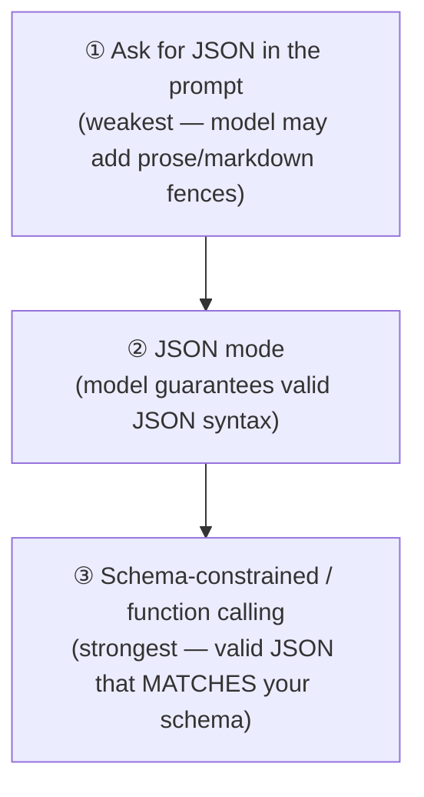
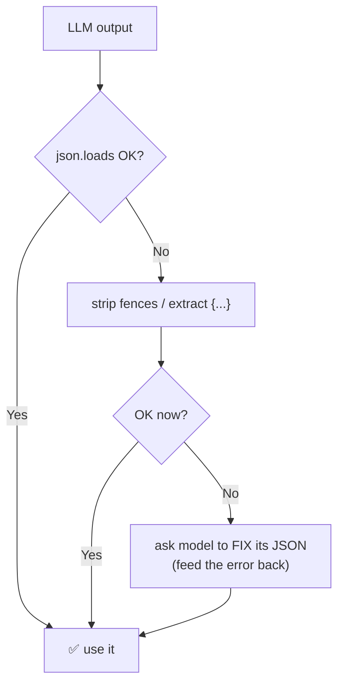

# 5 · Structured Output

*Prompt engineering module · Lesson 5 of 8 · [← Reasoning Techniques](04-reasoning-techniques.md) · [next → Context Engineering](06-context-engineering.md)*

The moment an LLM feeds a downstream program (a database write, an API call, a UI), you need output your code can **parse deterministically** — not prose. This lesson covers getting reliable JSON (and other schemas) out.

---

## 5.1 The problem: prose is not an API

```mermaid
flowchart LR
    LLM["LLM"] -->|"'Sure! The total is ₹5,600 😊'"| P["parser"] -->|"💥 can't extract"| APP["your app"]
    LLM2["LLM"] -->|'{"total": 5600}'| P2["json.loads()"] -->|"✅ 5600"| APP2["your app"]
```

Three escalating ways to force structure, weakest → strongest:



---

## 5.2 Level 1 — just ask (and constrain hard)

```text
Extract the fields. Respond with ONLY a JSON object, no markdown, no commentary:
{"name": string, "age": number, "email": string|null}

Text: "Hi, I'm Priya, 29, reach me at priya@example.com"
```

Works often, fails sometimes (` ```json ` fences, trailing "Here you go!", a stray comment). Always pair with defensive parsing (§5.5). Good enough for quick scripts; not for production.

---

## 5.3 Level 2 — JSON mode

Most providers offer a flag that *guarantees syntactically valid JSON*. It does **not** guarantee your schema — just that `json.loads()` won't throw.

```python
resp = client.chat.completions.create(
    model="gpt-4o-mini",
    messages=[
        {"role": "system", "content": "Output a JSON object with keys: name, age, email."},
        {"role": "user", "content": "Hi, I'm Priya, 29, priya@example.com"},
    ],
    response_format={"type": "json_object"},   # ← JSON mode
)
import json
data = json.loads(resp.choices[0].message.content)   # safe: guaranteed valid JSON
```

> ⚠️ When using JSON mode, you **must** also mention "JSON" in the prompt and describe the keys — the flag enforces syntax, your prompt still defines the shape.

---

## 5.4 Level 3 — schema-constrained / function calling (best)

Give the model a **schema** (JSON Schema or a Pydantic model). The model returns JSON guaranteed to match it — right keys, right types, enums respected. This is the production default.

### Function / tool calling

```python
tools = [{
    "type": "function",
    "function": {
        "name": "save_contact",
        "description": "Save an extracted contact",
        "parameters": {
            "type": "object",
            "properties": {
                "name":  {"type": "string"},
                "age":   {"type": "integer"},
                "email": {"type": ["string", "null"], "format": "email"},
            },
            "required": ["name", "age"],
        },
    },
}]

resp = client.chat.completions.create(
    model="gpt-4o-mini",
    messages=[{"role": "user", "content": "I'm Priya, 29, priya@example.com"}],
    tools=tools,
    tool_choice={"type": "function", "function": {"name": "save_contact"}},  # force it
)
args = json.loads(resp.choices[0].message.tool_calls[0].function.arguments)
# → {"name": "Priya", "age": 29, "email": "priya@example.com"}
```

### Pydantic (the ergonomic way — LangChain / instructor / OpenAI SDK)

```python
from pydantic import BaseModel, Field
from typing import Optional

class Contact(BaseModel):
    name: str
    age: int = Field(ge=0, le=130)
    email: Optional[str] = None

# LangChain
structured_llm = llm.with_structured_output(Contact)
contact = structured_llm.invoke("I'm Priya, 29, priya@example.com")
# → Contact(name='Priya', age=29, email='priya@example.com')  ← already a typed object
```

The schema doubles as **documentation, validation, and the prompt** — one source of truth. This is the same `with_structured_output` pattern covered in [`../11_langchain/`](../11_langchain/README.md).

---

## 5.5 Defensive parsing & repair

Even with the strongest method, build a safety net for the long tail:

```python
import json, re

def robust_json_parse(text: str):
    # 1. strip common markdown fences
    text = re.sub(r"^```(?:json)?|```$", "", text.strip(), flags=re.MULTILINE).strip()
    try:
        return json.loads(text)
    except json.JSONDecodeError:
        # 2. grab the outermost {...} or [...] block
        m = re.search(r"(\{.*\}|\[.*\])", text, re.DOTALL)
        if m:
            return json.loads(m.group(1))
        raise
```



**Self-repair prompt** (last resort): feed the invalid output and the parser error back, asking for corrected JSON only.

---

## 5.6 Beyond JSON

Same principles apply to other structured targets — always give a strict template + delimiters:

| Target | How to constrain |
|--------|------------------|
| CSV / TSV | "Output only rows, no header, comma-separated, in this column order: …" |
| Markdown table | Show the exact header row in the prompt |
| SQL | "Output a single valid PostgreSQL query, nothing else." + validate by `EXPLAIN` |
| Enum / label | "Respond with exactly one of: A, B, C." + `logit_bias` or schema `enum` |
| XML | Provide the tag structure; parse with a lenient parser |

---

## 5.7 Takeaways

- Prose isn't an API — force structure whenever an LLM feeds code.
- Escalate: **ask → JSON mode → schema/function calling**; use schema-constrained output in production.
- **Pydantic + `with_structured_output`** gives you a typed object *and* validation from one schema.
- Always keep a **defensive parser + self-repair** fallback for the long tail.

➡️ Next: [Context Engineering](06-context-engineering.md) — managing the context window and grounding prompts.
