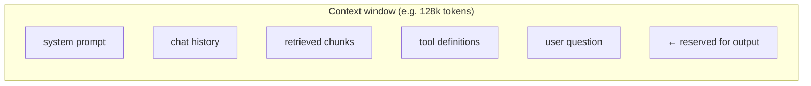
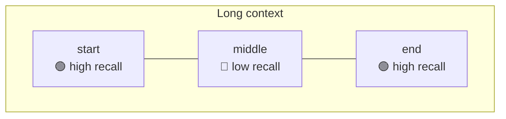
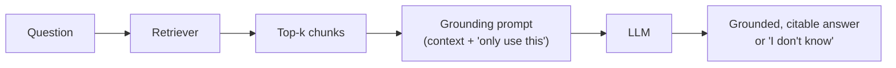
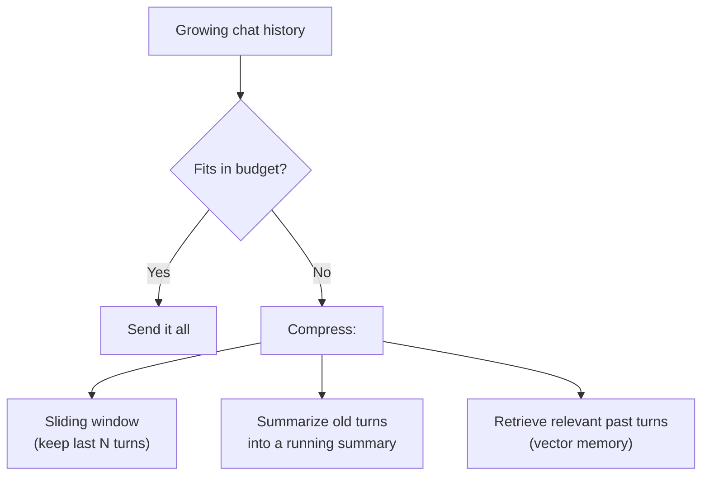
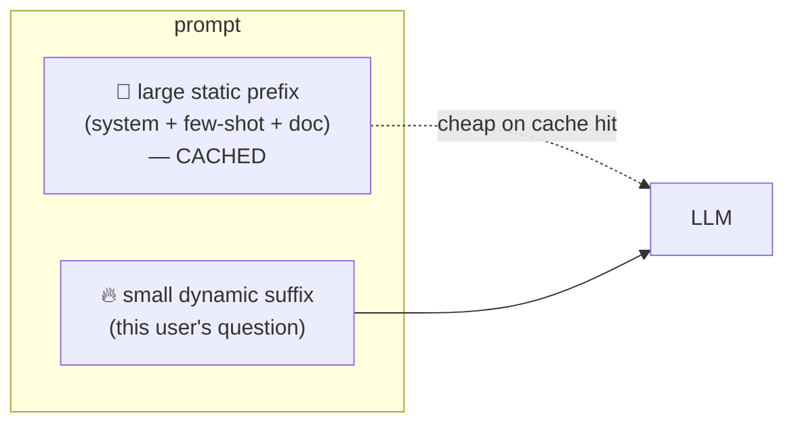

# 6 · Context Engineering

*Prompt engineering module · Lesson 6 of 8 · [← Structured Output](05-structured-output.md) · [next → Optimization & Evaluation](07-optimization-and-evaluation.md)*

Prompt engineering scales up into **context engineering**: deciding *what information* to put in the finite context window, *in what order*, and *how much*. This is where prompting meets RAG, memory, and agents.

---

## 6.1 The context window is a budget

Everything the model sees for one call — system prompt, history, retrieved docs, tools, the user question, and the space reserved for the answer — shares **one token budget**.



More context ≠ better. Three real costs of stuffing the window:

| Cost | Why it bites |
|------|--------------|
| 💲 **Money** | You pay per input token, every call |
| ⏱️ **Latency** | Bigger prompts = slower time-to-first-token |
| 🎯 **Accuracy** | Irrelevant context *distracts* the model and buries the signal |

---

## 6.2 "Lost in the middle"

Models attend most strongly to the **beginning** and **end** of the context, and can miss facts buried in the **middle** — even when the window technically fits everything. *(Liu et al., 2023)*



**Practical consequences:**

- Put the **most important instructions and the question at the start and/or end**, not buried mid-prompt.
- In RAG, **rank the best chunk first (or last)**, not in the middle of 20 mediocre ones.
- Fewer, higher-relevance chunks beat many marginal ones — retrieval *precision* matters more than recall past a point.

---

## 6.3 Grounding: the anti-hallucination prompt pattern

The single most important context-engineering pattern for factual apps: **give the model the source text and forbid it from going beyond it.**

```text
Answer the QUESTION using ONLY the CONTEXT below.
If the answer is not in the context, reply exactly: "I don't know."
Cite the source line/section for each claim.

<context>
{{retrieved_chunks}}
</context>

<question>{{user_question}}</question>
```



This is the read-side prompt at the heart of every RAG system — the full retrieval pipeline that produces `{{retrieved_chunks}}` is covered in [`../12_rag/`](../12_rag/README.md) and applied in [`../18_ragapp/`](../18_ragapp/README.md).

---

## 6.4 Managing long conversations

Chat history grows unbounded but the window doesn't. Strategies:



| Strategy | Keeps | Loses | Good for |
|----------|-------|-------|----------|
| **Sliding window** | Recent N turns verbatim | Old details entirely | Short task chats |
| **Summarization** | A running summary + recent turns | Fine detail of old turns | Long assistants |
| **Vector memory** | Semantically relevant past turns on demand | Strict chronology | Long-term/personal memory |

These map directly to the agent-memory patterns in [`../14_memory/`](../14_memory/README.md) and LangGraph's short-/long-term memory.

---

## 6.5 Prompt (context) caching

If a large chunk of your prompt is **identical across calls** (a big system prompt, a fixed few-shot block, a static document), providers can **cache** it so you don't re-pay full price or latency for those tokens each time.



**Design implication:** put the **stable content first** (system prompt, examples, fixed docs) and the **variable content last** (the user's actual query). That ordering maximizes cache hits and cuts cost/latency — a concrete reason the block order from [Lesson 2](02-anatomy-of-a-prompt.md) matters.

---

## 6.6 Takeaways

- The context window is a shared **token budget** (money + latency + accuracy) — more is not better.
- Beat **"lost in the middle"** by placing key instructions and the question at the **start/end**, and ranking the best retrieved chunk first.
- **Grounding** ("use only this context; else say 'I don't know'") is the core anti-hallucination pattern and the heart of RAG.
- Manage long chats with **windowing / summarization / vector memory**; put **static content first** to exploit prompt caching.

➡️ Next: [Optimization & Evaluation](07-optimization-and-evaluation.md) — how to iterate on prompts systematically.
