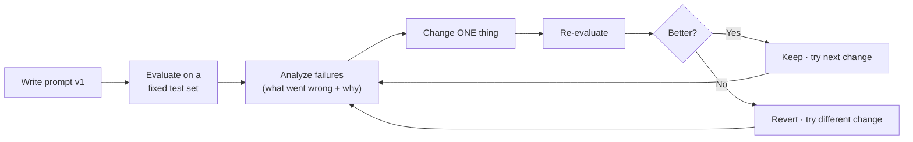
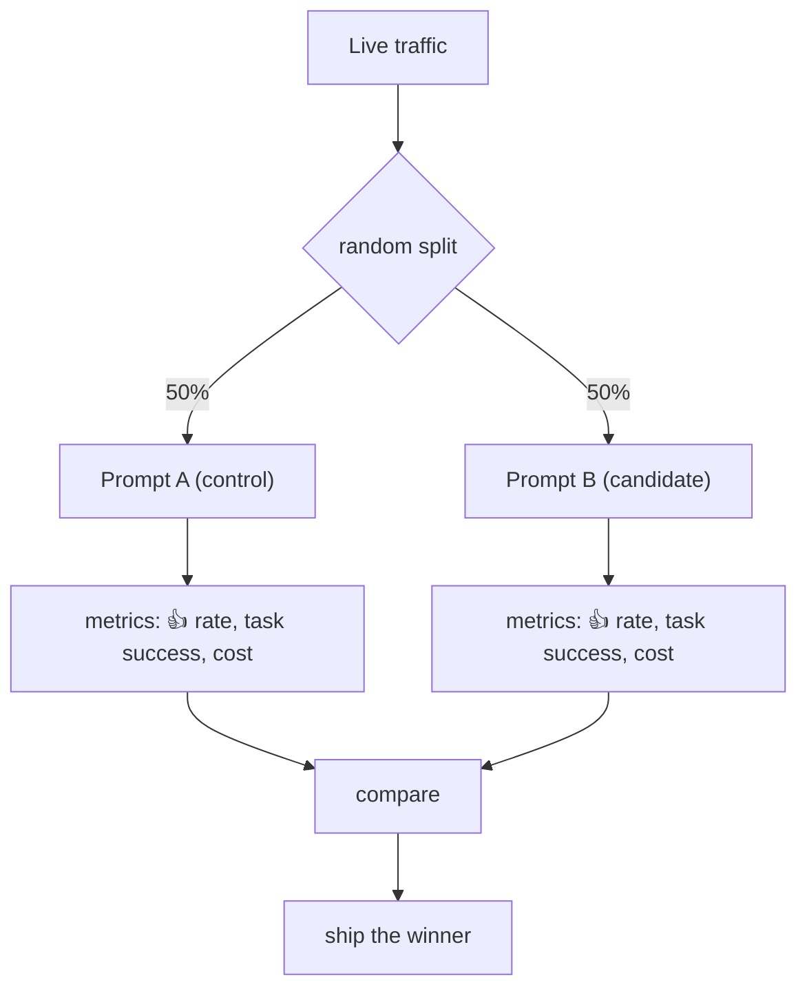
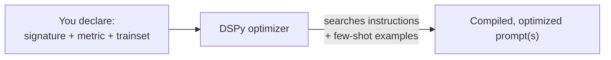

# 7 · Optimization & Evaluation

*Prompt engineering module · Lesson 7 of 8 · [← Context Engineering](06-context-engineering.md) · [next → Pitfalls & Anti-Patterns](08-pitfalls-and-anti-patterns.md)*

Prompting by "eyeballing it" doesn't survive contact with production. This lesson is about turning prompt work into an **engineering loop**: measure, change one thing, re-measure.

---

## 7.1 The optimization loop



**Two rules that separate engineering from vibes:**
1. **Fixed test set.** You can't tell if a change helped without a stable set of inputs (with known-good outputs where possible). ~20–50 cases covering easy, hard, and edge inputs is enough to start.
2. **Change one variable at a time.** Change the persona *and* add examples *and* reword the instruction at once, and you'll never know which helped.

---

## 7.2 Building a tiny eval harness

You don't need a framework to start — a list of cases and an assertion:

```python
test_cases = [
    {"input": "I was charged twice",          "expected": "BILLING"},
    {"input": "export button does nothing",   "expected": "BUG"},
    {"input": "please add dark mode",          "expected": "FEATURE_REQUEST"},
    {"input": "my invoice pdf won't download", "expected": "BILLING"},   # edge: 'invoice' not 'billing'
]

def evaluate(prompt_template):
    correct = 0
    for case in test_cases:
        out = llm(prompt_template.format(ticket=case["input"]), temperature=0).strip()
        ok = out == case["expected"]
        correct += ok
        if not ok:
            print(f"❌ {case['input']!r} → got {out!r}, expected {case['expected']!r}")
    print(f"Score: {correct}/{len(test_cases)}")
    return correct / len(test_cases)

evaluate(prompt_v1)   # 3/4
evaluate(prompt_v2)   # 4/4  ← the change helped
```

Pin `temperature=0` and a `seed` during evals so score changes reflect *the prompt*, not sampling noise.

---

## 7.3 What to measure

Not everything is exact-match. Pick the scoring method that fits the task:

| Task type | Scoring method |
|-----------|----------------|
| Classification / extraction | **Exact match / F1** vs. gold labels |
| Structured output | **Schema-valid?** + field-level accuracy |
| Summaries / open Q&A | **LLM-as-judge** (a second model grades faithfulness, relevance) |
| Factual (RAG) | **Groundedness / citation-support** — is every claim in the context? |
| Safety | Toxicity / PII / injection-resistance checks |
| Cost/latency | Tokens in-out, p95 latency |

This is exactly the eval taxonomy developed in depth in [`../16_evals/`](../16_evals/README.md) and the RagApp eval proposal — prompt eval is just eval applied to one prompt variable.

> **LLM-as-a-judge** in one line: for open-ended output, prompt a strong model with the input, the answer, and a rubric, and have it return a score + reason. Cheap, scalable, and correlates well with humans if the rubric is good — but calibrate it against a few human labels first.

---

## 7.4 A/B testing prompts in production

Offline evals prove a change is *probably* better; online A/B proves it on real traffic.



Version your prompts like code (they *are* code) — the config-version + activate pattern in [`../18_ragapp/`](../18_ragapp/README.md) is a ready-made way to A/B and roll back prompts without a deploy.

---

## 7.5 Automatic prompt optimization (DSPy & friends)

Hand-tuning is fine for a few prompts. When you have a **pipeline** of prompts (RAG + reranker + answerer), tuning them jointly by hand is hopeless. Frameworks like **DSPy** treat prompts as *learnable parameters*: you define the task signature + a metric, and the optimizer searches instructions/examples for you.

```python
# DSPy sketch — you declare the task, it compiles the prompt
import dspy

class Classify(dspy.Signature):
    """Classify a support ticket."""
    ticket: str = dspy.InputField()
    label: str = dspy.OutputField(desc="one of BILLING, BUG, FEATURE_REQUEST")

program = dspy.Predict(Classify)
optimized = dspy.BootstrapFewShot(metric=exact_match).compile(program, trainset=train)
# DSPy auto-selects the best few-shot examples + instruction wording from your data
```



Related ideas: **APE** (Automatic Prompt Engineer — LLM proposes candidate prompts, you score them), and OPRO (optimization by prompting). The theme: **let a metric + search do the tuning you'd otherwise do by hand.**

---

## 7.6 Takeaways

- Turn prompting into a loop: **fixed test set → change one thing → re-measure**.
- A 20-line eval harness (cases + assertions, `temperature=0`) beats eyeballing immediately.
- Match the **scorer** to the task (exact-match, schema-valid, LLM-as-judge, groundedness); this is [`../16_evals/`](../16_evals/README.md) applied to prompts.
- **Version prompts like code** and A/B them in production; for multi-prompt pipelines, reach for automatic optimizers like **DSPy**.

➡️ Next: [Pitfalls & Anti-Patterns](08-pitfalls-and-anti-patterns.md) — injection, hallucination triggers, and mistakes to avoid.
