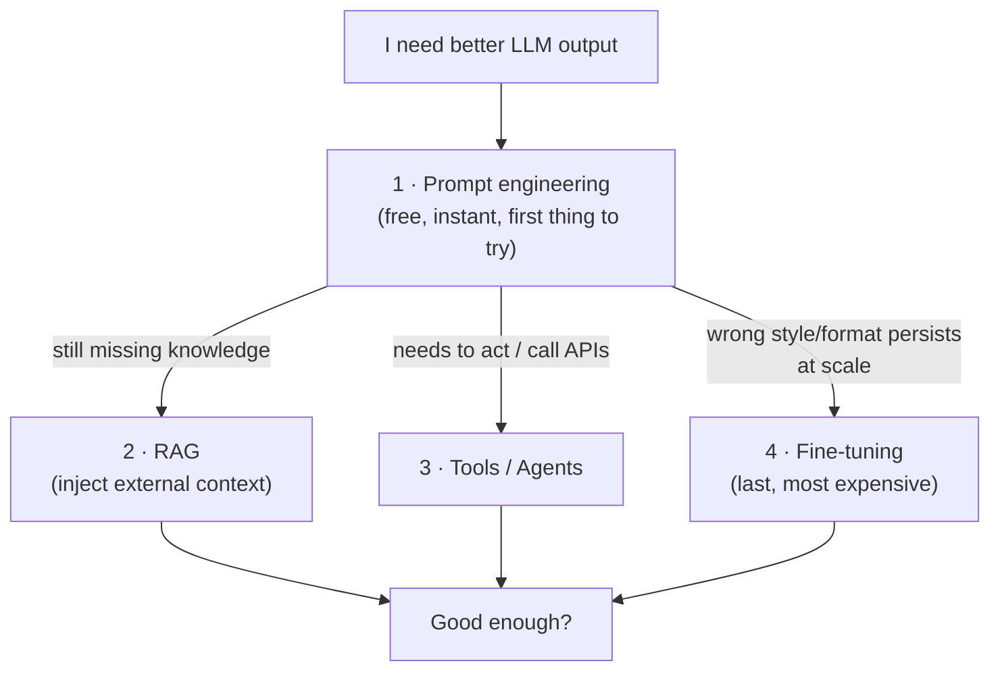

# 🧭 Prompt Engineering

> The discipline of designing the **text input** to an LLM so it reliably produces the output you want — the cheapest, fastest lever you have before reaching for RAG, tools, or fine-tuning.

These notes are a **reference module** (concept + code + diagrams), not a transcript of one playlist. They assume you've seen the basics of calling an LLM (see [`../11_langchain/`](../11_langchain/README.md)) and slot in *before* retrieval ([`../12_rag/`](../12_rag/README.md)), agents ([`../13_langgraph/`](../13_langgraph/README.md)), and fine-tuning ([`../02_fine-tuning-and-alignment/`](../02_fine-tuning-and-alignment/README.md)).

---

## 🗺️ Where prompting sits in the stack

**Golden rule:** exhaust prompt engineering first. ~80% of "the model is dumb" problems are actually "the prompt is underspecified."

---

## 📓 Lessons

| # | Lesson | What you'll learn |
|---|--------|-------------------|
| 1 | [What is Prompt Engineering?](01-what-is-prompt-engineering.md) | Why prompts matter, how LLMs read them, the mental model |
| 2 | [Anatomy of a Prompt](02-anatomy-of-a-prompt.md) | The 6 building blocks; system vs user vs assistant roles |
| 3 | [Core Techniques](03-core-techniques.md) | Zero-shot, few-shot, role prompting, delimiters, decomposition |
| 4 | [Reasoning Techniques](04-reasoning-techniques.md) | Chain-of-Thought, Self-Consistency, ReAct, Tree-of-Thoughts |
| 5 | [Structured Output](05-structured-output.md) | JSON mode, schemas, function calling, parsing & repair |
| 6 | [Context Engineering](06-context-engineering.md) | Context windows, the "lost in the middle" problem, RAG prompts |
| 7 | [Optimization & Evaluation](07-optimization-and-evaluation.md) | Iterating, A/B testing, DSPy, automatic prompt optimization |
| 8 | [Pitfalls & Anti-Patterns](08-pitfalls-and-anti-patterns.md) | Injection, hallucination triggers, common mistakes |

---

## ⚡ The whole module in one cheat sheet

| Want… | Reach for… |
|-------|-----------|
| A quick answer | **Zero-shot** + a clear instruction |
| Consistent format/style | **Few-shot** (2–5 examples) |
| Correct multi-step reasoning | **Chain-of-Thought** ("think step by step") |
| Higher accuracy on hard problems | **Self-Consistency** (sample N, majority vote) |
| The model to use tools/search | **ReAct** (Reason → Act → Observe loop) |
| Machine-parseable output | **Function calling / JSON schema** |
| Less hallucination | **Ground it** (RAG) + "say 'I don't know' if unsure" |
| To stop leaking your system prompt | See [Pitfalls](08-pitfalls-and-anti-patterns.md) → injection defenses |

---

*Reference notes for personal study. Techniques cite their origin papers where relevant (CoT — Wei et al. 2022; ReAct — Yao et al. 2022; Self-Consistency — Wang et al. 2022; ToT — Yao et al. 2023).*
