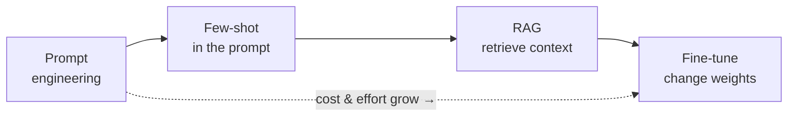
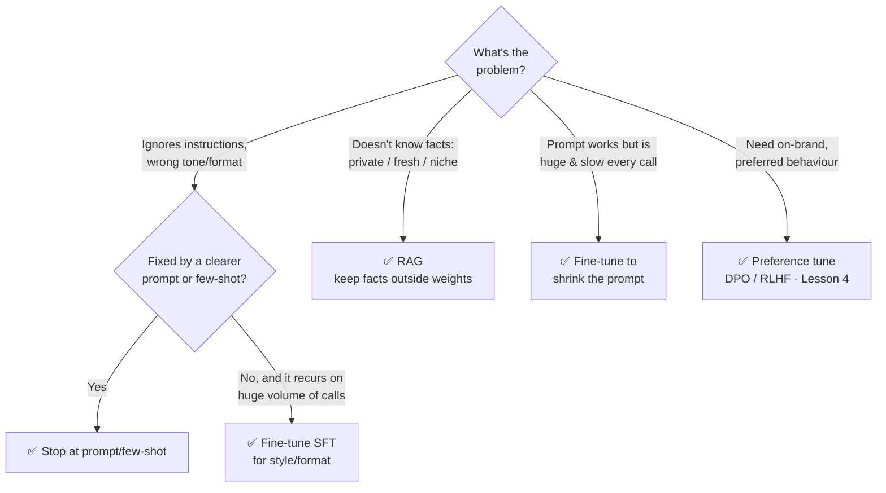
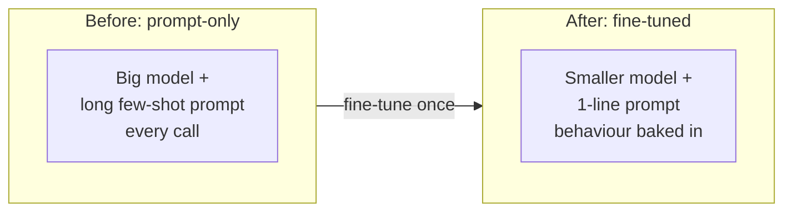
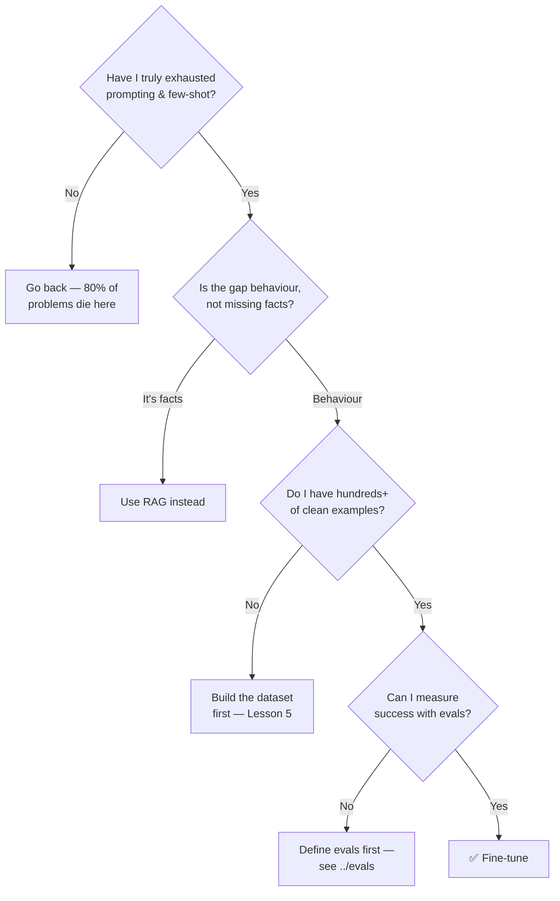

# 1 · When to Fine-tune

*Fine-tuning & Alignment module · Lesson 1 of 6 · [← index](README.md) · [next → Full vs Parameter-Efficient](02-full-vs-parameter-efficient.md)*

Fine-tuning changes the model's **weights** so a behaviour becomes the default — no longer something you have to coax out with a long prompt every call. It's powerful, but it's also the slowest and most expensive lever, and it's the one people reach for too early. This lesson is about **not reaching for it too early**, and knowing exactly what it can and can't do.

---

## 1.1 The four levers, cheapest first

Every "the model isn't doing what I want" problem gets solved by one (or a mix) of these. You always start at the top.

| Lever | Cost | Setup time | Changes… | Best at |
|-------|------|-----------|----------|---------|
| **Prompt** | ~free | seconds | nothing (inference only) | Instructions, tone, one-off format fixes |
| **Few-shot** | prompt tokens | minutes | nothing | Locking a format/style with 2–5 examples |
| **RAG** | infra + tokens | hours–days | nothing (adds context) | **Knowledge** the model lacks: private, fresh, niche |
| **Fine-tune** | GPU + data + time | days–weeks | the weights | **Behaviour** at scale: style, format, domain tone, latent skill |

The trap: teams see the model give a wrong *fact* and decide to "just fine-tune it on our docs." That almost never works — see §1.4.

---

## 1.2 The decision, as a flowchart

---

## 1.3 The tradeoffs you're actually trading

**Data.** Prompting needs zero labelled data. A useful SFT run needs, at minimum, hundreds to a few thousand *high-quality* examples in your target format (Lesson 5). Bad or thin data makes the model worse, not better.

**Cost & time.** A prompt change ships in the time it takes to edit a string. A fine-tune is a data pipeline + a training run + an eval loop + a serving change — days to weeks, and it repeats every time your data or base model changes.

**Latency & unit economics.** This is the *underrated* reason to fine-tune. A 30-line few-shot prompt on a big model costs input tokens on **every** call. Bake that behaviour into a smaller model and the prompt shrinks to one line — often a real cost and latency win at scale.

**Maintenance.** A fine-tune freezes a snapshot of your data and your base model. New base model next quarter? You re-tune. RAG and prompts, by contrast, update instantly.

---

## 1.4 What fine-tuning can and cannot fix

This is the single most important table in the module.

| Goal | Fine-tune? | Why |
|------|:---------:|-----|
| Consistent **output format** (always this JSON, always this template) | ✅ Yes | Pure behaviour — imitation learning nails it |
| A specific **tone / voice / persona** (your brand, a support style) | ✅ Yes | Style is a distribution over phrasing, exactly what SFT shifts |
| **Domain phrasing & conventions** (legal, medical, radiology shorthand) | ✅ Yes | Teaches *how* the domain talks, not new facts |
| Latent **skill / task** the base model is bad at (a niche classification) | ✅ Yes | You're sharpening an ability it already has some of |
| Shrinking a huge prompt / using a **smaller cheaper model** | ✅ Yes | Distills prompt behaviour into weights |
| **New facts** (today's prices, your internal wiki, this customer's data) | ❌ No | Facts baked into weights go stale and *hallucinate*; use RAG |
| **Frequently-changing knowledge** | ❌ No | Re-training per change is absurd; RAG updates instantly |
| Making the model **stop hallucinating** in general | ❌ No | Tuning on Q→A pairs teaches it to answer *confidently*, often making it worse |

> ⚠️ **The classic mistake:** fine-tuning on your knowledge-base documents to "teach it your product." The model learns the *style* of your docs and becomes *more* confident — while still not reliably recalling the facts. You wanted RAG. See [`../12_rag/README.md`](../12_rag/README.md).

**Mental model:** fine-tuning shifts the *behaviour distribution*; RAG changes the *facts available at query time*. Different problems, different tools — and real systems use both (Lesson 6).

---

## 1.5 A quick gut-check before you tune

You'll notice fine-tuning is gated behind *four* "yes" answers. That's deliberate.

---

## 1.6 Takeaways

- Four levers, cheapest first: **prompt → few-shot → RAG → fine-tune**. Exhaust the top before spending on the bottom.
- Fine-tuning changes **behaviour** (style, format, tone, latent skill), never reliable **knowledge** — that's RAG's job.
- The strongest *pro-tuning* argument is often **latency/cost**: bake a long prompt into a smaller model.
- Don't fine-tune on your docs to "teach facts" — you'll get a more confident hallucinator.
- Gate any tune behind four checks: prompting exhausted, gap is behavioural, clean data exists, and you can measure success.

➡️ Next: [Full vs Parameter-Efficient](02-full-vs-parameter-efficient.md) — once you've decided to tune, how much of the model do you actually touch?
