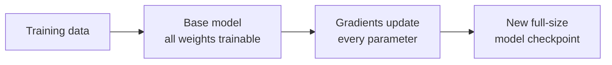
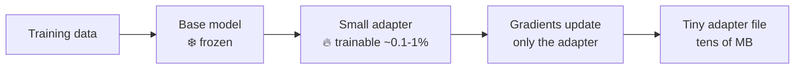
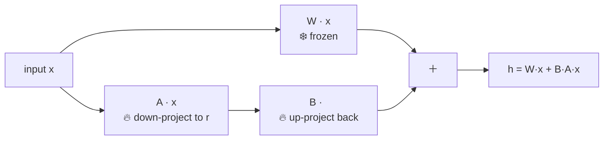
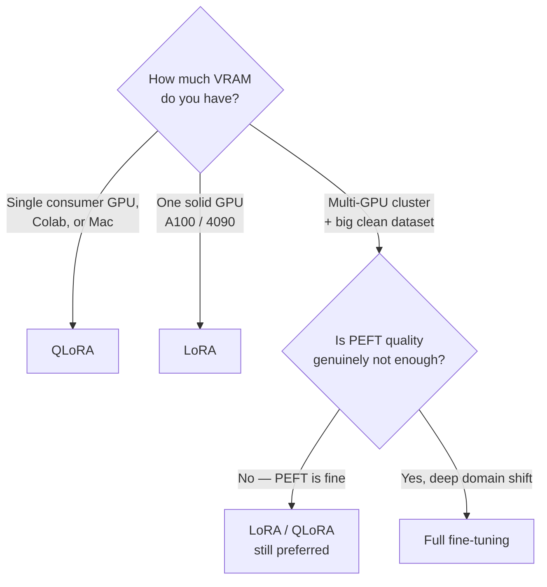

# 2 · Full vs Parameter-Efficient Fine-tuning

*Fine-tuning & Alignment module · Lesson 2 of 6 · [← When to Fine-tune](01-when-to-fine-tune.md) · [next → Instruction Tuning & SFT](03-instruction-tuning-and-sft.md)*

You've decided to tune. The next fork is **how much of the model you touch**. Do you update all the weights (full fine-tuning), or freeze the base and train a tiny set of new parameters (PEFT)? For LLMs in 2023+, PEFT — specifically LoRA and QLoRA — is the default, and this lesson explains why. The heavy math lives in [`../../Shared/01_lora-qlora/README.md`](../../Shared/01_lora-qlora/README.md); here we cover the decision and the intuition.

---

## 2.1 Full fine-tuning: update everything

Classic transfer learning: unfreeze the whole network and backprop into every weight.



The problem is memory. For a 7B model in mixed precision you're roughly holding, in VRAM:

| What | Rough size (7B) |
|------|-----------------|
| Model weights | ~14 GB (bf16) |
| Gradients | ~14 GB |
| Optimizer states (Adam: 2 moments) | ~28 GB+ |
| Activations | variable |

That's **4–8× the model size** — easily 60–80 GB, i.e. multiple high-end GPUs, just for a 7B. And you produce a *full copy* of the model per run, so ten fine-tunes = ten 14 GB checkpoints to store and serve.

---

## 2.2 PEFT: freeze the base, train a little

**Parameter-Efficient Fine-Tuning** keeps the pretrained weights frozen and introduces a small number of *new* trainable parameters. You get ~99% of the quality while training <1% of the parameters.



Because only the adapter has gradients and optimizer states, memory collapses — and the artifact you save is a handful of MB, not GB. Swap different adapters onto the *same* frozen base to serve many tasks from one set of weights.

### The main PEFT families

| Method | Idea | Notes |
|--------|------|-------|
| **LoRA** | Learn a low-rank update `ΔW = B·A` alongside frozen `W` | The dominant approach; strong quality, mergeable |
| **QLoRA** | LoRA on top of a **4-bit quantized** frozen base | Fits big models on one consumer GPU / Mac |
| **Prefix / P-tuning** | Prepend trainable "virtual tokens" to the input | Lighter still, usually weaker than LoRA |
| **Adapters (Houlsby)** | Insert small bottleneck layers between blocks | The original PEFT idea; adds inference layers |
| **(IA)³** | Learn per-feature rescaling vectors | Very few params; niche |

---

## 2.3 LoRA in one diagram

LoRA (Hu et al. 2021) freezes the big weight matrix `W` and learns a **low-rank** update. Rank `r` (typically 8–64) is the whole knob: bigger `r` = more capacity + more params.



For `d = k = 4096`, `r = 16`: you train `2 × 4096 × 16 ≈ 131K` params instead of `16.7M` per layer — roughly a **99% cut**. `W` never moves, so adapters are swappable and, at deploy time, *mergeable* back into `W` for zero added latency.

**QLoRA** (Dettmers et al. 2023) stacks four tricks so even the *frozen* base shrinks: 4-bit NormalFloat (NF4), double quantization, paged optimizers, and LoRA adapters trained in bf16 on top. Net effect: a 7B that needs ~28 GB in FP32 trains on **~6–10 GB VRAM**.

> 📎 The full derivation, the four QLoRA ingredients in detail, VRAM math, and a runnable notebook are in [`../../Shared/01_lora-qlora/README.md`](../../Shared/01_lora-qlora/README.md). This module doesn't duplicate it — go there for the deep dive.

---

## 2.4 A minimal LoRA config with `peft`

Idiomatic HuggingFace: wrap a loaded base model with a `LoraConfig`. (QLoRA = the same, plus a `BitsAndBytesConfig` 4-bit load — shown in Lesson 6.)

```python
from peft import LoraConfig, get_peft_model
from transformers import AutoModelForCausalLM

model = AutoModelForCausalLM.from_pretrained("meta-llama/Llama-3.1-8B")

lora_config = LoraConfig(
    r=16,                    # rank — capacity knob
    lora_alpha=32,           # scaling; common heuristic alpha = 2*r
    target_modules=["q_proj", "k_proj", "v_proj", "o_proj"],  # attn projections
    lora_dropout=0.05,
    bias="none",
    task_type="CAUSAL_LM",
)

model = get_peft_model(model, lora_config)
model.print_trainable_parameters()
# trainable params: 6,815,744 || all params: 8,037,076,992 || trainable%: 0.0848
```

Note the last line: **<0.1% trainable**. That number is the whole point of PEFT.

---

## 2.5 Choosing: full vs LoRA vs QLoRA

| | Full fine-tuning | LoRA | QLoRA |
|---|---|---|---|
| Trainable params | 100% | <1% | <1% |
| Base precision | bf16/fp16 | bf16/fp16 | 4-bit (NF4) |
| VRAM (7B, rough) | 60–80 GB | 14–16 GB | 5–10 GB |
| Speed | baseline | fast | ~20–30% slower (dequant) |
| Artifact size | full model (GB) | adapter (MB) | adapter (MB) |
| Quality ceiling | highest | ~matches full | ~matches full |
| **When to use** | Deep domain shift, big data, you own the GPUs, quality is everything | You have a decent GPU (A100/4090) and want speed | One consumer GPU, free Colab T4, or a Mac — the pragmatic default |



The honest default for almost everyone doing this outside a frontier lab: **start with QLoRA**, only escalate if evals say PEFT quality is the bottleneck.

---

## 2.6 Takeaways

- **Full fine-tuning** updates every weight — highest ceiling, but 4–8× model size in VRAM and a full checkpoint per run.
- **PEFT** freezes the base and trains <1% new params, collapsing memory and shrinking the artifact to MB.
- **LoRA** = low-rank update `ΔW = B·A` beside a frozen `W`; rank `r` is the capacity knob; adapters are swappable and mergeable.
- **QLoRA** = LoRA over a 4-bit base — fits big models on one consumer GPU at ~negligible quality cost.
- Default to **QLoRA**; escalate only when evals prove PEFT is the limit. Deep math → [`../../Shared/01_lora-qlora/README.md`](../../Shared/01_lora-qlora/README.md).

➡️ Next: [Instruction Tuning & SFT](03-instruction-tuning-and-sft.md) — the actual training objective and dataset format behind most fine-tunes.
