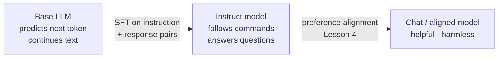
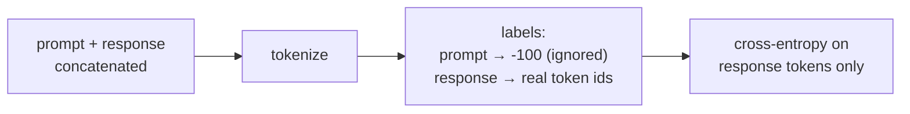
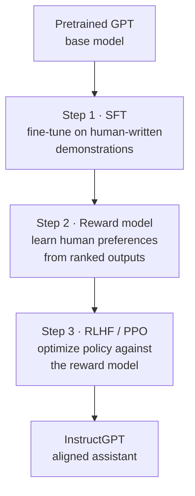

# 3 · Instruction Tuning & SFT

*Fine-tuning & Alignment module · Lesson 3 of 6 · [← Full vs Parameter-Efficient](02-full-vs-parameter-efficient.md) · [next → Preference Alignment: RLHF & DPO](04-preference-alignment-rlhf-dpo.md)*

**Supervised Fine-Tuning (SFT)** is the workhorse. You show the model example `(prompt → ideal response)` pairs and train it to imitate the responses. **Instruction tuning** is SFT on a *broad mix* of instruction-style tasks — the step that turns a raw next-token predictor into something that follows commands. This lesson covers the objective, the dataset format (chat templates matter more than people expect), the InstructGPT lineage, and a real TRL `SFTTrainer` run.

---

## 3.1 From base model to instruction-follower

A **base (pretrained) model** only continues text. Ask it a question and it might continue with *more questions*, because that's what its web-scraped training data looked like. Instruction tuning fixes this.



This is the first of the two big post-training stages. SFT teaches the *format of being helpful*; preference alignment (Lesson 4) then sharpens *which* helpful answer humans prefer.

---

## 3.2 The objective: imitate the response, mask the prompt

SFT is just language modeling — next-token cross-entropy — but computed **only on the response tokens**. The prompt tokens are masked out of the loss (label `-100`), so the model isn't rewarded for predicting the user's question, only for producing the answer.



> 💡 Modern TRL handles this masking for you (`DataCollatorForCompletionOnlyLM`, or `assistant_only_loss` in newer configs). Getting it wrong — training on the prompt too — quietly hurts quality.

---

## 3.3 Dataset format: prompt/response and chat templates

There are two shapes you'll meet.

**1. Instruction (single-turn) format** — the Alpaca-style trio:

```json
{
  "instruction": "Summarize the paragraph in one sentence.",
  "input": "Large language models are trained on ...",
  "response": "LLMs learn language patterns from massive text corpora."
}
```

**2. Chat (multi-turn) format** — a list of role-tagged messages, now the standard:

```json
{
  "messages": [
    {"role": "system", "content": "You are a concise assistant."},
    {"role": "user", "content": "What is fine-tuning?"},
    {"role": "assistant", "content": "Updating a model's weights on task data."}
  ]
}
```

**The chat template is not cosmetic.** Each instruct model was trained with *specific* control tokens marking who's speaking. If you train (or later prompt) with the wrong delimiters, quality craters. You must apply the **same template the base model expects**:

```python
from transformers import AutoTokenizer

tok = AutoTokenizer.from_pretrained("meta-llama/Llama-3.1-8B-Instruct")

messages = [
    {"role": "system", "content": "You are a concise assistant."},
    {"role": "user", "content": "What is fine-tuning?"},
]
text = tok.apply_chat_template(messages, tokenize=False, add_generation_prompt=True)
print(text)
# <|begin_of_text|><|start_header_id|>system<|end_header_id|> ...
# <|start_header_id|>assistant<|end_header_id|>   ← model continues from here
```

`apply_chat_template` reads the template baked into the tokenizer, so you get the right special tokens automatically. **Rule: never hand-format role delimiters — always go through the tokenizer's chat template.**

---

## 3.4 The InstructGPT lineage (why any of this exists)

Instruction tuning as we know it traces to **InstructGPT** (Ouyang et al. 2022), the paper behind ChatGPT's recipe. Its three-stage pipeline is the template the whole field copied:



The headline result: a **1.3B** InstructGPT was preferred by humans over the **175B** base GPT-3 — alignment beat raw scale by 100×. This lesson is **Step 1**. Lesson 4 is Steps 2–3 (and the DPO shortcut that collapses them). Earlier roots: RLHF-for-summarization (Stiennon et al. 2020) and the FLAN line (Wei et al. 2021) that showed instruction tuning generalizes to unseen tasks.

---

## 3.5 A real SFT run with TRL `SFTTrainer`

[TRL](https://github.com/huggingface/trl) (Transformer Reinforcement Learning) is HuggingFace's post-training library. `SFTTrainer` wraps the whole SFT loop — tokenization, chat-template application, loss masking, PEFT — into a few lines.

```python
from datasets import load_dataset
from peft import LoraConfig
from trl import SFTConfig, SFTTrainer

# 1. A chat-format dataset ({"messages": [...]} per row)
dataset = load_dataset("HuggingFaceH4/ultrachat_200k", split="train_sft")

# 2. LoRA so we train <1% of params (Lesson 2)
peft_config = LoraConfig(
    r=16,
    lora_alpha=32,
    lora_dropout=0.05,
    target_modules="all-linear",
    task_type="CAUSAL_LM",
)

# 3. Training config — SFTConfig subclasses TrainingArguments
sft_config = SFTConfig(
    output_dir="./llama-sft-lora",
    num_train_epochs=1,
    per_device_train_batch_size=4,
    gradient_accumulation_steps=4,     # effective batch = 16
    learning_rate=2e-4,                # LoRA likes higher LR than full FT
    bf16=True,
    max_length=2048,
    logging_steps=25,
    packing=True,                      # pack short samples to fill the seq
)

# 4. Trainer — pass the model *id*; TRL loads it and applies the chat template
trainer = SFTTrainer(
    model="meta-llama/Llama-3.1-8B-Instruct",
    train_dataset=dataset,
    args=sft_config,
    peft_config=peft_config,
)

trainer.train()
trainer.save_model()                   # saves the LoRA adapter (tens of MB)
```

What TRL is doing for you: applying the tokenizer's chat template to each `messages` row, masking prompt tokens from the loss, wrapping the model in the LoRA adapter, and (with `packing=True`) concatenating short examples so you're not wasting compute on padding.

> ⚠️ **Hyperparameter sanity:** LoRA tolerates a higher learning rate (1e-4–3e-4) than full fine-tuning (1e-5–5e-5). Start with **1 epoch** — instruction data overfits fast (Lesson 5). More epochs is the most common way people ruin a tune.

---

## 3.6 SFT vs instruction tuning vs continued pretraining

| Technique | Data | Teaches | When to use |
|-----------|------|---------|-------------|
| **Continued pretraining** | Raw domain text (no labels) | Domain vocabulary & style | Big unlabelled corpus, deep jargon (law, medicine, code) |
| **Instruction tuning** | *Broad* instruction→response mix | General "follow commands" ability | Turning a base model into an assistant |
| **Task SFT** | *Narrow* task pairs in your format | One specific behaviour/format | You have a defined task and clean labels — the common case |
| **Preference alignment** | Chosen vs rejected pairs | *Which* good answer humans prefer | After SFT, to polish helpfulness/tone — Lesson 4 |

They stack in that order: (optional continued pretraining) → SFT → preference alignment.

---

## 3.7 Takeaways

- **SFT** = imitate `(prompt → response)` pairs with next-token loss, computed **only on response tokens** (prompt masked).
- **Instruction tuning** is SFT on a broad task mix — the step that makes a base model *follow instructions*.
- **Chat templates are load-bearing**: always format via `tokenizer.apply_chat_template`, never by hand.
- The **InstructGPT** (2022) three-stage recipe — SFT → reward model → RLHF — is the template the field copied; this lesson is Step 1.
- Use TRL's **`SFTTrainer`** with a `LoraConfig`; start at **1 epoch** and a higher LR (~2e-4) for LoRA to avoid overfitting.

➡️ Next: [Preference Alignment: RLHF & DPO](04-preference-alignment-rlhf-dpo.md) — going beyond imitation to optimise on what humans actually prefer.
