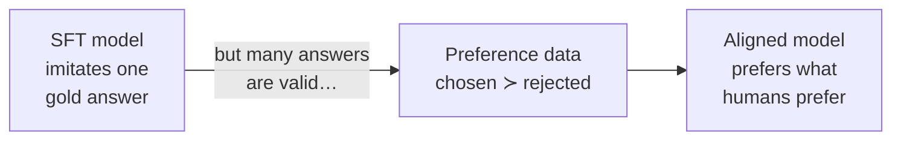
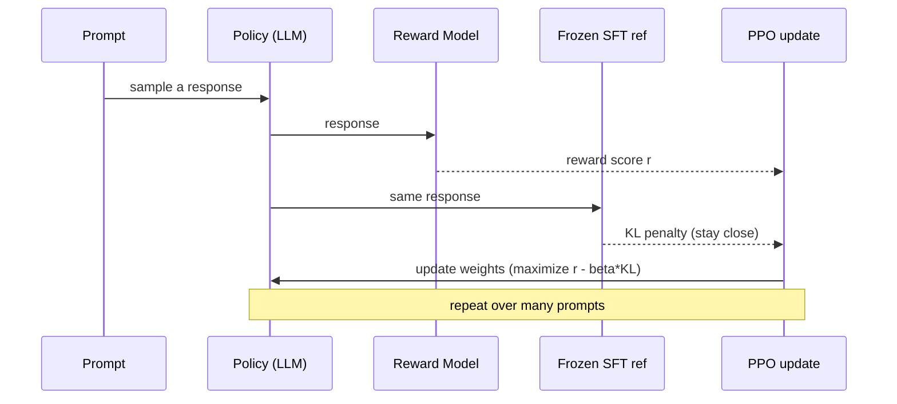
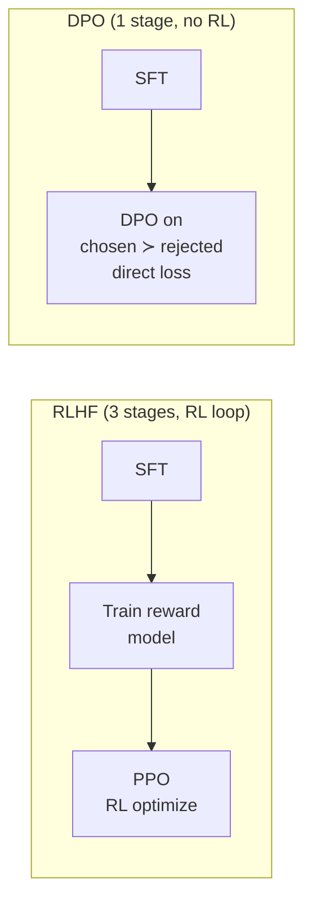
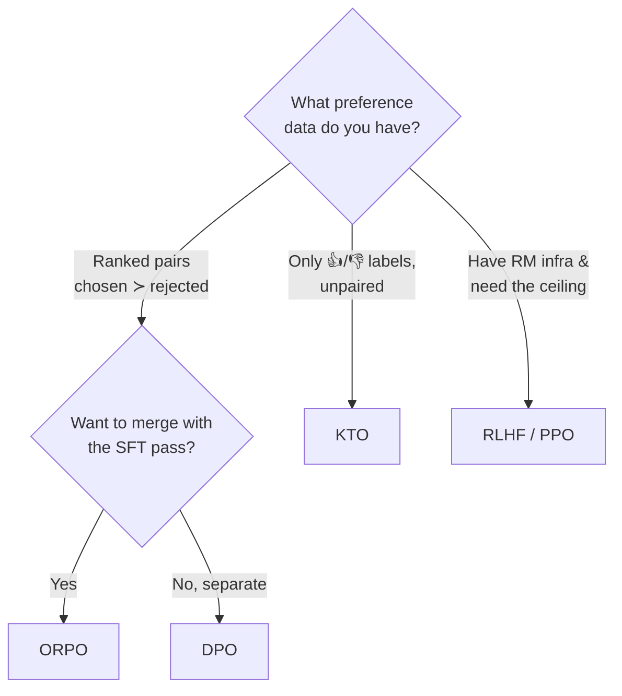

# 4 · Preference Alignment: RLHF & DPO

*Fine-tuning & Alignment module · Lesson 4 of 6 · [← Instruction Tuning & SFT](03-instruction-tuning-and-sft.md) · [next → Data & Evaluation](05-data-and-evaluation.md)*

SFT teaches the model to *imitate* good answers. But "good" is fuzzy — for one prompt there are many valid responses, and humans have *preferences* among them (more helpful, safer, better formatted, less waffly). **Preference alignment** optimises directly on those preferences, using data shaped as *"for this prompt, response A was preferred over response B."* This is the second big post-training stage, and it's where **RLHF** and its simpler successor **DPO** live.

---

## 4.1 Why imitation isn't enough



SFT can only push toward the *single* demonstration it was shown. Preference methods use **relative** judgments (A over B), which are far cheaper and more reliable for humans to give than writing a perfect answer — and they let the model learn what to *avoid*, not just what to copy.

---

## 4.2 RLHF: reward model + PPO

**RLHF** (Reinforcement Learning from Human Feedback — Stiennon et al. 2020; scaled in InstructGPT, Ouyang et al. 2022) is the original recipe. Two moving parts after SFT:

1. **Reward model (RM):** collect prompts with several sampled responses, have humans *rank* them, and train a model to output a scalar "how much a human would like this" score.
2. **PPO:** treat the LLM as a *policy*, generate responses, score them with the RM, and use **Proximal Policy Optimization** to nudge the policy toward higher reward — with a **KL penalty** to the frozen SFT model so it doesn't drift into gibberish that games the RM.



It works — this is what aligned frontier chat models. But it's **painful**: you train and host a *second* model (the RM), the RL loop is unstable and hyperparameter-sensitive, and you juggle up to four models in memory (policy, reference, reward, and often a value/critic head).

---

## 4.3 DPO: skip the reward model

**Direct Preference Optimization** (Rafailov et al. 2023) is the key simplification. Its insight: the RLHF objective has a *closed-form* optimum, so you can express the reward implicitly through the policy itself — and optimise the policy **directly on the preference pairs with a simple classification-style loss**. No separate reward model. No RL loop. No sampling during training.



DPO needs only:
- the **SFT model** (as both the policy being trained and the frozen reference), and
- a dataset of `(prompt, chosen, rejected)` triples.

It pushes up the log-prob of `chosen` and down the log-prob of `rejected`, *relative to the frozen reference*, with a temperature `beta` controlling how far it may stray. Same goal as RLHF, dramatically less machinery — which is why it became the default for open-model alignment.

---

## 4.4 The ORPO / KTO family (going even simpler)

Two more recent variants worth knowing:

| Method | Data it needs | Idea | When to use |
|--------|---------------|------|-------------|
| **ORPO** (Hong et al. 2024) | `(prompt, chosen, rejected)` | Folds preference *into SFT itself* via an odds-ratio penalty — **one stage, no separate SFT, no reference model** | You want a single-pass SFT+alignment run |
| **KTO** (Ethayarajh et al. 2024) | `(prompt, response, 👍/👎)` | Learns from **unpaired** binary thumbs signals (prospect-theory loss) | You only have thumbs-up/down logs, not ranked pairs |



Practical guidance: **start with DPO** — it's the sweet spot of simplicity and quality. Use ORPO to save a stage, KTO when your data is only thumbs, and full RLHF/PPO only if you have the infrastructure and evals show DPO is the ceiling.

---

## 4.5 A DPO run with TRL `DPOTrainer`

Same library as Lesson 3. The dataset must have `prompt`, `chosen`, and `rejected` columns.

```python
from datasets import load_dataset
from peft import LoraConfig
from trl import DPOConfig, DPOTrainer

# Preference dataset: columns prompt / chosen / rejected
dataset = load_dataset("trl-lib/ultrafeedback_binarized", split="train")

peft_config = LoraConfig(
    r=16, lora_alpha=32, lora_dropout=0.05,
    target_modules="all-linear", task_type="CAUSAL_LM",
)

dpo_config = DPOConfig(
    output_dir="./llama-dpo-lora",
    num_train_epochs=1,
    per_device_train_batch_size=2,
    gradient_accumulation_steps=8,
    learning_rate=5e-6,     # DPO wants a *low* LR
    beta=0.1,               # KL strength: lower = stray further from ref
    bf16=True,
    logging_steps=25,
)

trainer = DPOTrainer(
    model="./llama-sft-lora",   # start from your SFT checkpoint
    args=dpo_config,
    train_dataset=dataset,
    peft_config=peft_config,
)

trainer.train()
trainer.save_model()
```

Notes that matter:
- **Start from the SFT model**, never a raw base — DPO refines an already-instruction-tuned policy.
- With PEFT, TRL uses the base weights (adapters disabled) as the frozen reference, so you don't hold a second full model.
- **`beta`** is the key knob: too low and the model drifts and degrades; too high and it barely moves. `0.1` is a common start.
- DPO's LR is ~10–40× **lower** than SFT's — it's a gentle nudge, not a rewrite.

---

## 4.6 RLHF vs DPO

| | RLHF (PPO) | DPO |
|---|---|---|
| Stages after SFT | 2 (reward model + RL) | 1 |
| Separate reward model? | ✅ yes | ❌ no (implicit) |
| RL loop / online sampling? | ✅ yes (unstable) | ❌ no — offline, supervised-style |
| Models in memory | up to 4 | 2 (policy + frozen ref; 1 with PEFT) |
| Compute & complexity | high | low–moderate |
| Stability / ease | finicky | robust, easy to reproduce |
| Quality ceiling | slightly higher; online can keep improving | very strong; the open-model default |
| **When to use** | You have RM infra and need the absolute top end | Almost everyone else — start here |

---

## 4.7 Takeaways

- **Preference alignment** optimises on *chosen ≻ rejected* judgments — relative feedback humans give more reliably than perfect answers.
- **RLHF** = train a reward model, then PPO the policy against it with a KL leash — powerful but multi-model, unstable, expensive.
- **DPO** collapses that to a single direct loss on preference pairs — no reward model, no RL loop; the open-model default.
- **ORPO** merges preference into the SFT pass (no reference model); **KTO** learns from unpaired 👍/👎 signals.
- Always align **on top of an SFT checkpoint**, use a **low LR**, and tune **`beta`** as the main DPO knob.

➡️ Next: [Data & Evaluation](05-data-and-evaluation.md) — the part that actually decides whether any of this helped.
