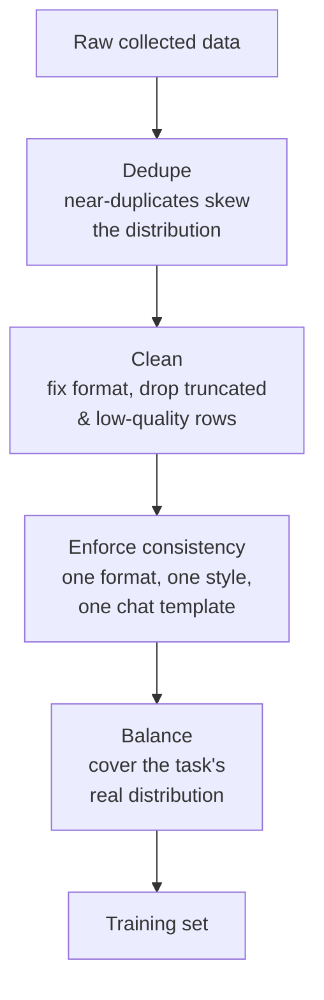
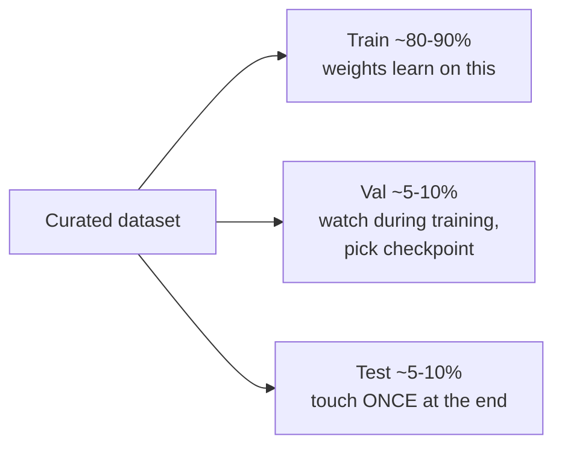
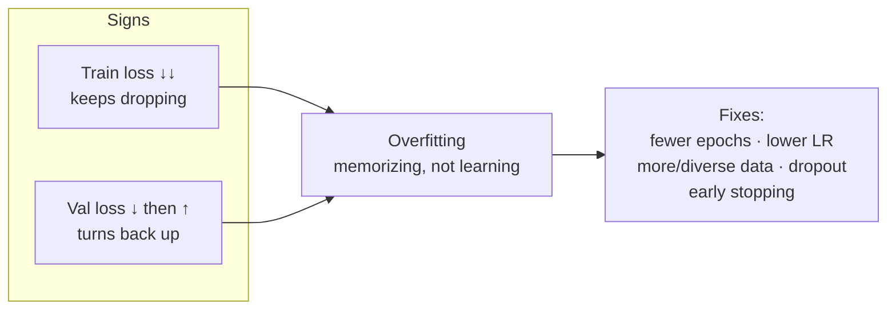
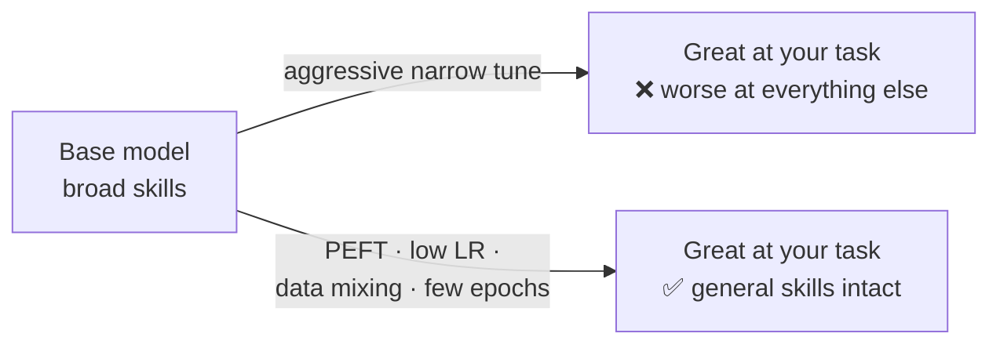
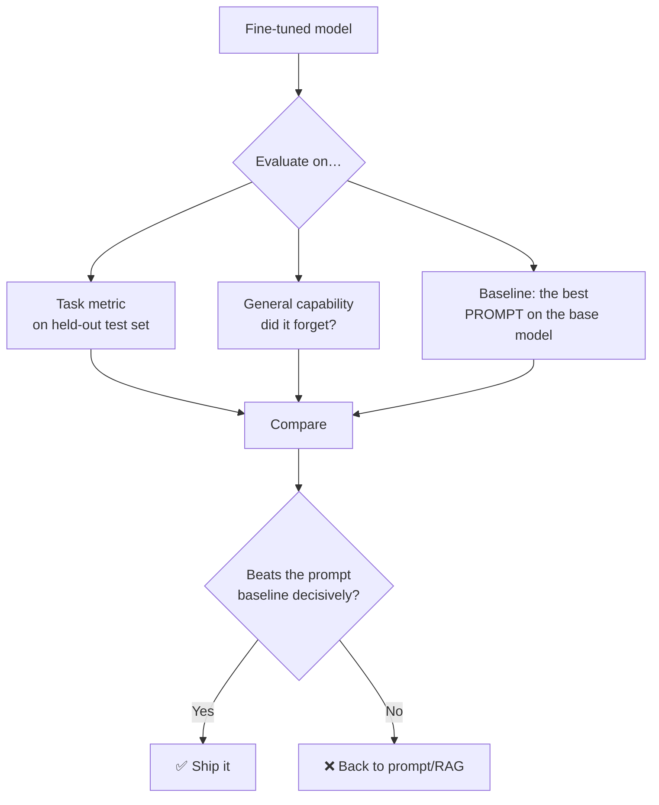

# 5 · Data & Evaluation

*Fine-tuning & Alignment module · Lesson 5 of 6 · [← Preference Alignment: RLHF & DPO](04-preference-alignment-rlhf-dpo.md) · [next → Practical Workflow](06-practical-workflow.md)*

The training recipe is the easy part. The two things that actually decide whether a fine-tune succeeds are the **data** you feed it and the **evaluation** that tells you if it worked. Get these wrong and a flawless training run produces a confidently worse model. This lesson covers curation, how much data you need, splits, the two big failure modes (catastrophic forgetting and overfitting), and — most importantly — how to tell if the tune beat a good prompt.

---

## 5.1 Data quality beats data quantity

The most reproduced lesson in fine-tuning: a **small, clean, consistent** dataset beats a large noisy one. The LIMA result (Zhou et al. 2023) — a strong assistant from just **1,000** carefully curated examples — made the point loudly.

What "quality" concretely means here:
- **Consistency** — every example in the *exact* output format/tone you want. The model imitates whatever variance you show it, so mixed formats teach mixed behaviour.
- **Correctness** — a wrong example is a directly-taught mistake.
- **Diversity within the task** — cover the real spread of inputs, including edge cases, not 500 near-copies of one easy case.
- **No leakage** — examples that overlap your eval set inflate scores and lie to you.

---

## 5.2 How much data do you actually need?

Rough, task-dependent guidance (PEFT/SFT):

| Goal | Ballpark examples | Notes |
|------|------------------|-------|
| Lock a **format / JSON shape** | 50–200 | Narrow behaviour; small clean set is plenty |
| A **tone / persona / style** | 100–1,000 | Consistency matters more than count |
| A **specific task/skill** | 1,000–10,000 | Diversity of inputs drives generalization |
| **Broad instruction tuning** | 10,000+ | You're covering many task types |
| **Preference (DPO) tuning** | 1,000–10,000 pairs | Quality of the *contrast* matters most |

> 💡 Start at the **low** end. Fine-tuning has fast diminishing returns, and more mediocre data usually hurts. Add data only when evals say you're data-limited, not from a hunch.

---

## 5.3 Always hold out a validation (and test) set

Split **before** you touch the data, and split so no near-duplicate crosses the boundary.

- **Train** — the model learns on it.
- **Validation** — watch loss during training to catch overfitting and choose the best checkpoint. You look at it repeatedly, so it can't be your final judge.
- **Test** — held out, touched exactly once, for the honest final number.

---

## 5.4 Failure mode 1 — overfitting

With small data and PEFT, overfitting is the *default* outcome if you're not careful. The tell is the classic loss-curve divergence.

Symptoms in behaviour: it parrots training phrasings verbatim, is brittle on slightly-different inputs, and — the giveaway — you ran **too many epochs**. For instruction SFT, **1–3 epochs** is usually the whole budget. Watch val loss and stop when it turns up.

---

## 5.5 Failure mode 2 — catastrophic forgetting

Fine-tuning hard on a narrow task can degrade the *general* abilities the base model had. Teach it your JSON format too aggressively and it may forget how to reason, code, or chat.

Mitigations:
- **PEFT (LoRA)** inherently forgets less than full fine-tuning — the base weights are frozen.
- **Mix in** some general instruction data alongside your task data (a "replay" buffer).
- **Lower LR, fewer epochs** — a gentle nudge preserves more.
- **Evaluate general capability**, not just your task — see §5.6.

---

## 5.6 Evaluating a fine-tune

Training loss is **not** the metric you care about. You care whether the deployed behaviour improved. Build the eval **before** you train (you defined it as a gate in Lesson 1).

Methods (this module doesn't re-teach eval theory — see [`../16_evals/README.md`](../16_evals/README.md)):
- **Held-out task metrics** — exact match / F1 / format-valid rate for structured tasks.
- **LLM-as-judge** — a strong model scores outputs against a rubric; great for open-ended quality. See [`../16_evals/05-eval-methods-llm-as-judge.md`](../16_evals/05-eval-methods-llm-as-judge.md).
- **Pairwise A/B** — show judges (or users) fine-tune vs baseline blind; report win-rate.
- **Capability regression suite** — a small general-skills battery to catch forgetting.
- **Online/production** — once shipped, watch real metrics. See [`../16_evals/06-offline-vs-online-evals.md`](../16_evals/06-offline-vs-online-evals.md).

**The one comparison that matters:** fine-tuned model vs *your best prompt on the base model*. If you don't beat a good prompt, you spent days to ship a regression.

---

## 5.7 When a fine-tune is actually worse than a good prompt

Fine-tuning has a real failure surface. Reach back for prompting/RAG when:

| Situation | Why the prompt wins |
|-----------|---------------------|
| The gap was **knowledge**, not behaviour | The tune learned the *style* of the answers, not the facts — now it hallucinates confidently. Use RAG. |
| Data was **thin or noisy** | The tune imitated the noise; a clean prompt is more reliable |
| The task **changes often** | Every change = a re-tune; a prompt edits in seconds |
| You **over-trained** | Catastrophic forgetting / overfitting made it worse overall |
| Base model **improved** since | A newer base + a good prompt often beats last quarter's tune |

> ⚠️ "We fine-tuned and it got worse" is almost always one of: knowledge-not-behaviour (§1.4), dirty data, or too many epochs. Diagnose before you re-run.

---

## 5.8 Takeaways

- **Quality ≫ quantity**: a small, clean, *consistent* dataset beats a big noisy one (LIMA, 2023). Start small.
- Always split **train / val / test** up front; watch **val loss** to pick the checkpoint, touch **test** once.
- **Overfitting** (val loss turns up, verbatim parroting) → fewer epochs, lower LR, more/diverse data. SFT usually needs **1–3 epochs**.
- **Catastrophic forgetting** → prefer PEFT, mix in general data, keep LR/epochs modest, and test general skills.
- Evaluate against the **best prompt on the base model** — if you don't beat it decisively, don't ship. Eval depth → [`../16_evals/README.md`](../16_evals/README.md).

➡️ Next: [Practical Workflow](06-practical-workflow.md) — putting data, PEFT, alignment, and evals into one end-to-end pipeline.
