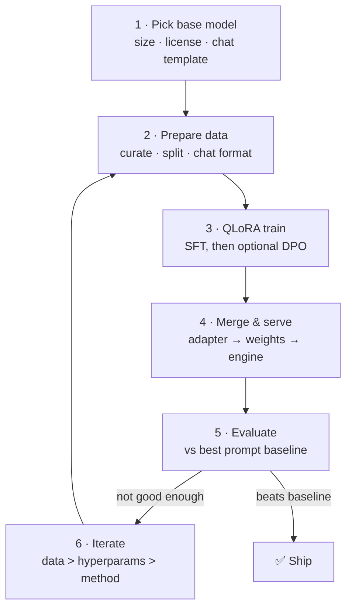
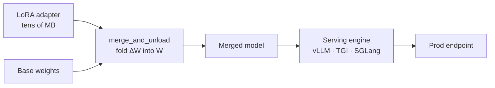
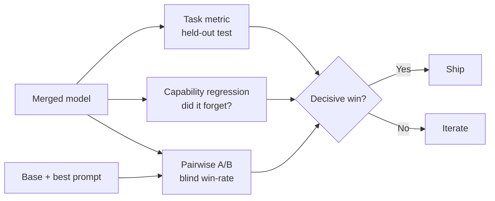
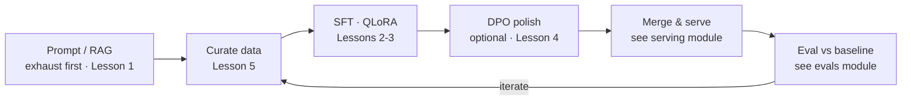

# 6 · Practical Workflow

*Fine-tuning & Alignment module · Lesson 6 of 6 · [← Data & Evaluation](05-data-and-evaluation.md) · [next → module index](README.md)*

This lesson wires the whole module together into one end-to-end pipeline: **pick a base model → prepare data → QLoRA train → merge/serve → eval → iterate.** It's the checklist you actually run, with the code seams that connect each stage and pointers back to the lesson that covers each step in depth.

---

## 6.1 The pipeline at a glance



The loop matters more than any single box: **most gains come from iterating on data**, not from clever hyperparameters.

---

## 6.2 Step 1 — Pick the base model

| Decision | What to weigh |
|----------|---------------|
| **Size** | Smallest that clears your evals. 1–3B for narrow tasks, 7–8B is the pragmatic default, larger only if evals demand it |
| **Base vs Instruct** | Start from an **Instruct** checkpoint if you want chat behaviour — it already did Lesson 3's instruction tuning |
| **License** | Check commercial-use terms (Llama, Qwen, Mistral, Gemma all differ) |
| **Chat template** | You'll inherit its template — use the *matching* tokenizer everywhere (Lesson 3) |
| **Ecosystem** | Quantization, serving, and community adapters that already support it |

> 💡 Bigger base + QLoRA often beats a smaller base + full fine-tune at the same VRAM budget — the frozen 4-bit base buys you capacity cheaply.

---

## 6.3 Step 2 — Prepare data

Curate, split, and get everything into the chat format the base expects (Lesson 5 + Lesson 3).

```python
from datasets import load_dataset

ds = load_dataset("json", data_files="my_task.jsonl", split="train")
ds = ds.shuffle(seed=42)

# hold out val + test BEFORE training (Lesson 5)
split = ds.train_test_split(test_size=0.1, seed=42)
train_ds, eval_ds = split["train"], split["test"]

# each row is chat format: {"messages": [{"role": ..., "content": ...}, ...]}
```

Checklist: deduped, consistent format/tone, correct, covers the real input spread, no eval leakage.

---

## 6.4 Step 3 — QLoRA train

Load the base in **4-bit** (`BitsAndBytesConfig`), attach LoRA, and run `SFTTrainer`. This is the concrete QLoRA setup the earlier lessons pointed at.

```python
import torch
from transformers import AutoModelForCausalLM, BitsAndBytesConfig
from peft import LoraConfig, prepare_model_for_kbit_training
from trl import SFTConfig, SFTTrainer

# 4-bit NF4 quantization = the "Q" in QLoRA (Lesson 2)
bnb_config = BitsAndBytesConfig(
    load_in_4bit=True,
    bnb_4bit_quant_type="nf4",
    bnb_4bit_compute_dtype=torch.bfloat16,
    bnb_4bit_use_double_quant=True,
)

model = AutoModelForCausalLM.from_pretrained(
    "meta-llama/Llama-3.1-8B-Instruct",
    quantization_config=bnb_config,
    device_map="auto",
)
model = prepare_model_for_kbit_training(model)   # enable grad checkpointing etc.

peft_config = LoraConfig(
    r=16, lora_alpha=32, lora_dropout=0.05,
    target_modules="all-linear", task_type="CAUSAL_LM",
)

sft_config = SFTConfig(
    output_dir="./task-qlora",
    num_train_epochs=1,               # start at 1 (Lesson 5)
    per_device_train_batch_size=4,
    gradient_accumulation_steps=4,
    learning_rate=2e-4,
    bf16=True,
    max_length=2048,
    packing=True,
    eval_strategy="steps",
    eval_steps=50,                    # watch val loss to catch overfitting
    logging_steps=25,
)

trainer = SFTTrainer(
    model=model,
    args=sft_config,
    train_dataset=train_ds,
    eval_dataset=eval_ds,
    peft_config=peft_config,
)
trainer.train()
trainer.save_model("./task-qlora/adapter")   # small adapter, tens of MB
```

**Optional preference pass:** if behaviour needs polishing beyond imitation, follow with a `DPOTrainer` run on `(prompt, chosen, rejected)` data, starting from this SFT checkpoint (Lesson 4).

---

## 6.5 Step 4 — Merge & serve

For deployment you usually **merge** the adapter back into the base so there's no runtime adapter overhead, then hand the merged weights to an inference engine.



```python
from peft import PeftModel
from transformers import AutoModelForCausalLM

base = AutoModelForCausalLM.from_pretrained(
    "meta-llama/Llama-3.1-8B-Instruct", torch_dtype="bfloat16",
)
merged = PeftModel.from_pretrained(base, "./task-qlora/adapter").merge_and_unload()
merged.save_pretrained("./task-merged")
# tokenizer.save_pretrained("./task-merged")  # keep them together
```

> 📎 Merge in the **same precision** you'll serve in; merging a LoRA trained over a 4-bit base into full bf16 can shift quality slightly, so **re-run evals after merging**. Alternatively, keep the adapter separate and serve it live — vLLM and TGI can hot-swap multiple LoRA adapters over one base, which is ideal when you have many task-specific tunes.

The whole serving side — quantization for inference, batching, KV-cache, throughput vs latency — is its own topic: see [`../04_llm-serving-and-inference-optimization/README.md`](../04_llm-serving-and-inference-optimization/README.md).

---

## 6.6 Step 5 — Evaluate

Same gate as Lesson 5: the merged model must beat **your best prompt on the base model** on a held-out test set, and must not have regressed on general capability. Use task metrics + LLM-as-judge + a pairwise win-rate. Depth in [`../16_evals/README.md`](../16_evals/README.md).



---

## 6.7 Step 6 — Iterate (in priority order)

When results disappoint, change things in this order — it's roughly the order of impact:

| Priority | Lever | Typical fix |
|:--------:|-------|-------------|
| 1 | **Data** | More/cleaner/more-diverse examples; fix inconsistent formatting (biggest wins live here) |
| 2 | **Epochs / LR** | Overfitting → fewer epochs, lower LR; underfitting → a touch more |
| 3 | **LoRA rank `r`** | Underfitting a complex task → raise `r` (and `lora_alpha`) |
| 4 | **Method** | Add a **DPO** pass if behaviour needs preference polish (Lesson 4) |
| 5 | **Base model** | Only after the above — try a bigger/newer base |

> ⚠️ The rookie move is to reach straight for step 4 or 5. Nine times out of ten the answer is step 1: **better data**.

---

## 6.8 The end-to-end mental model



Fine-tuning isn't a one-shot; it's this loop, gated by evals, most often improved by data.

---

## 6.9 Takeaways

- The pipeline: **base model → data → QLoRA (SFT, then optional DPO) → merge/serve → eval → iterate.**
- Pick the **smallest base that passes evals**, start from an **Instruct** checkpoint, mind the license and chat template.
- Train with **4-bit NF4 + LoRA** via `SFTTrainer`; **merge** the adapter for deployment and **re-run evals after merging**.
- Serving is its own discipline — hand off to [`../04_llm-serving-and-inference-optimization/README.md`](../04_llm-serving-and-inference-optimization/README.md); adapters can also be hot-swapped live.
- When iterating, fix **data first** — it beats hyperparameters, method changes, and a bigger base almost every time.

➡️ Back to the [module index](README.md). Related: [prompt engineering](../01_prompt-engineering/README.md) · [RAG](../12_rag/README.md) · [LoRA/QLoRA deep dive](../../Shared/01_lora-qlora/README.md) · [evals](../16_evals/README.md).
