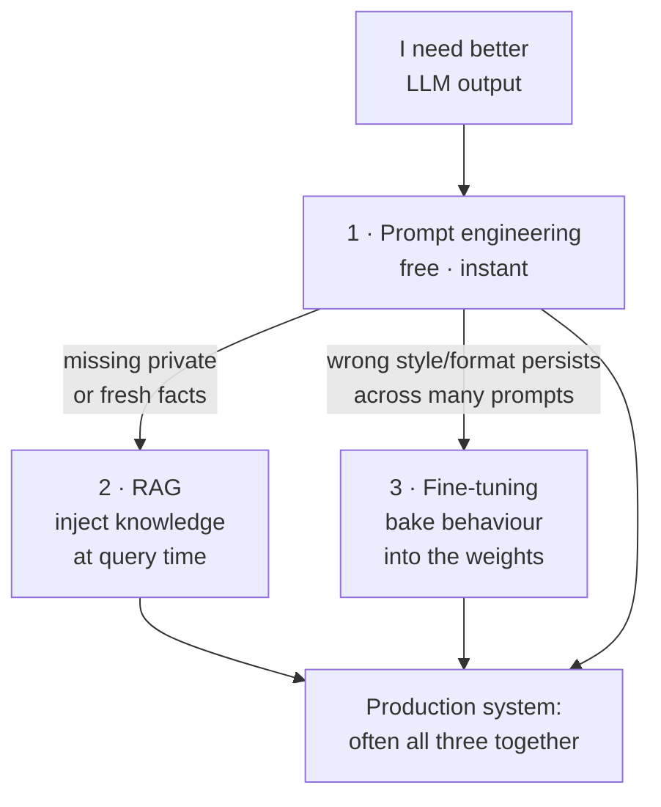
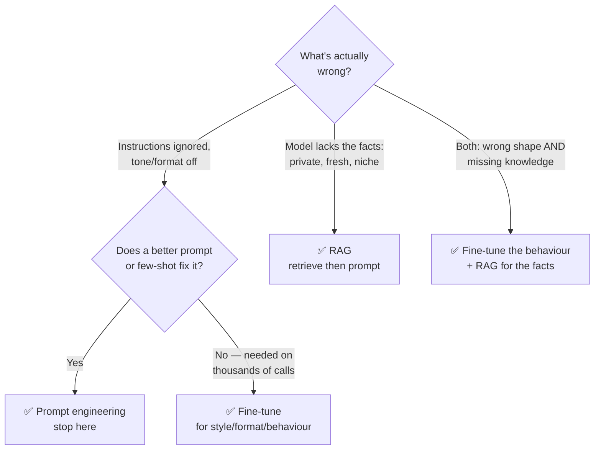

# 🎯 Fine-tuning & Alignment

> The discipline of **changing the model's weights** so it behaves the way you want by default — the last and most expensive lever, reached only after prompt engineering and RAG stop paying off.

These notes are a **reference module** (concept + code + diagrams), not a transcript of one course. They assume you're comfortable with [prompting](../01_prompt-engineering/README.md) and [retrieval](../12_rag/README.md), and they sit *after* both in the stack. The deep dive on the LoRA/QLoRA math and a runnable notebook live in [`../../Shared/01_lora-qlora/`](../../Shared/01_lora-qlora/README.md) — this module is about the **decisions and the pipeline** around it.

---

## 🗺️ Where fine-tuning sits vs prompt & RAG

**Golden rule:** fine-tuning changes *how* the model responds, not *what facts* it knows. If the problem is "it doesn't know X," that's RAG. If the problem is "it knows plenty but keeps answering in the wrong shape/tone," that's fine-tuning.

---

## 📓 Lessons

| # | Lesson | What you'll learn |
|---|--------|-------------------|
| 1 | [When to Fine-tune](01-when-to-fine-tune.md) | Prompt vs few-shot vs RAG vs fine-tune; cost/data/latency tradeoffs; what tuning can and can't fix |
| 2 | [Full vs Parameter-Efficient](02-full-vs-parameter-efficient.md) | Full fine-tuning vs PEFT; why LoRA/QLoRA won; where to go for the deep dive |
| 3 | [Instruction Tuning & SFT](03-instruction-tuning-and-sft.md) | Supervised fine-tuning, chat templates, dataset format, the InstructGPT lineage; TRL `SFTTrainer` |
| 4 | [Preference Alignment: RLHF & DPO](04-preference-alignment-rlhf-dpo.md) | Reward model + PPO, then DPO as the simpler direct alternative; ORPO/KTO; TRL `DPOTrainer` |
| 5 | [Data & Evaluation](05-data-and-evaluation.md) | Curation, size guidance, splits, catastrophic forgetting, overfitting signs, evaluating a tune |
| 6 | [Practical Workflow](06-practical-workflow.md) | End-to-end: base model → data → QLoRA → merge/serve → eval → iterate |

---

## 🧭 When to fine-tune vs RAG vs prompt

---

## ⚡ The whole module in one cheat sheet

| Want… | Reach for… | Why |
|-------|-----------|-----|
| A quick behaviour change | **Prompt / few-shot** | Free, instant, no data pipeline |
| The model to know private/fresh facts | **RAG** | Facts live outside the weights, updatable anytime |
| A consistent tone, format, or domain voice at scale | **Fine-tune (SFT)** | Bakes the behaviour in; shrinks the prompt |
| A small cheap model to punch above its weight on one task | **Fine-tune (PEFT)** | Distills your task into adapters |
| Human-preference behaviour (helpful, safe, on-brand) | **Preference alignment (DPO/RLHF)** | Optimises on *chosen vs rejected*, not just imitation |
| To fit training on one GPU / a Mac | **QLoRA** | 4-bit base + small adapters — see [`../../Shared/01_lora-qlora/`](../../Shared/01_lora-qlora/README.md) |
| To know if the tune actually helped | **Evals** | Compare against the best prompt — see [`../16_evals/`](../16_evals/README.md) |

---

*Reference notes for personal study. Methods cite their origin work where relevant (InstructGPT — Ouyang et al. 2022; RLHF for summarization — Stiennon et al. 2020; LoRA — Hu et al. 2021; QLoRA — Dettmers et al. 2023; DPO — Rafailov et al. 2023; ORPO — Hong et al. 2024; KTO — Ethayarajh et al. 2024).*
