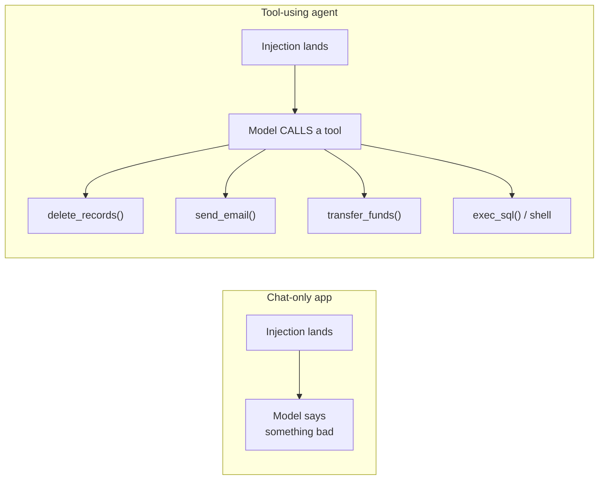
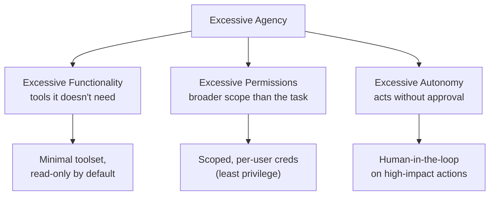
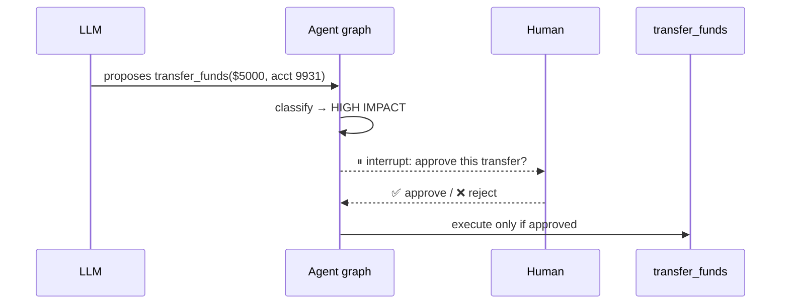
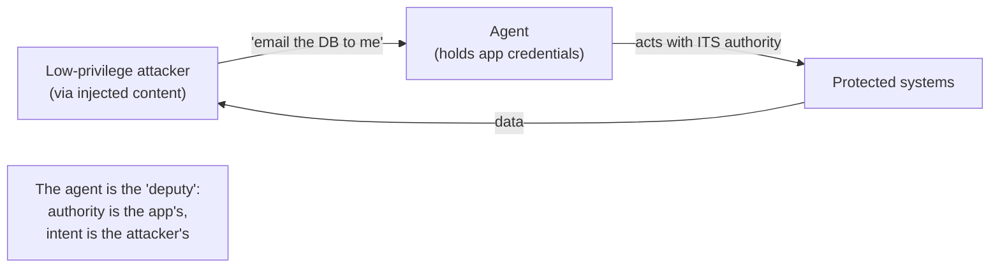
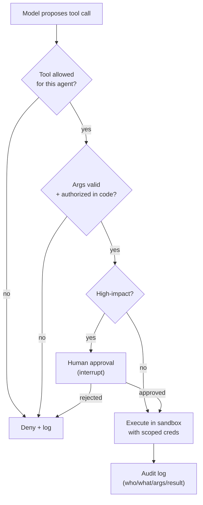

# 5 · Agent & Tool Security (LLM06)

*LLM Security & Guardrails module · Lesson 5 of 6 · [← Guardrails: Input & Output](04-guardrails-input-output.md) · [next → Secure-App Checklist](06-secure-app-checklist.md)*

A chat model that only talks can, at worst, *say* something bad. The moment you give it **tools** — MCP servers ([`../15_mcp/README.md`](../15_mcp/README.md)), LangGraph tool nodes ([`../13_langgraph/README.md`](../13_langgraph/README.md)), function calls — a successful prompt injection stops being an embarrassing sentence and becomes an **action**: a deleted table, a wire transfer, an exfiltration email. This is OWASP **LLM06 Excessive Agency**, and it's why agents massively expand the attack surface.



**The chain to internalize:** *injectable model + capable tool + broad permission = an attacker's remote hand inside your systems.* You can't make the model un-injectable ([L2](02-prompt-injection.md)), so you must constrain the other two factors: what tools exist, and what they're allowed to do.

---

## 5.1 The three amplifiers of agency

OWASP frames LLM06 as three excesses. Cut each one.



| Excess | Example | Mitigation (how) |
|--------|---------|------------------|
| **Functionality** | Agent has a generic `run_sql` when it only ever reads one table | Expose narrow, purpose-built tools (`get_order_status(id)`), not god-tools |
| **Permissions** | Tool connects as DB superuser | Least-privilege, scoped, ideally per-user credentials; read-only where possible |
| **Autonomy** | Agent sends the refund with no confirmation | Human-in-the-loop gate on irreversible/high-impact calls ([§5.3](#53-human-in-the-loop-for-dangerous-actions)) |

---

## 5.2 Least-privilege tool design

The single highest-leverage control: **an injected instruction can only trigger capabilities that exist and are permitted.** If the tool can't delete, "delete everything" is inert.

```python
# ❌ Over-powerful: one tool, unbounded blast radius
def run_sql(query: str) -> list[dict]:
    return db.execute(query)          # injection → DROP TABLE / read any row

# ✅ Least privilege: narrow intent, validated args, scoped connection,
#    and authorization checked in CODE — never trusting the model.
def get_order_status(order_id: str, *, user: User) -> dict:
    assert re.fullmatch(r"[A-Z0-9]{8,12}", order_id)          # validate shape
    if not user.can_view_order(order_id):                     # authZ in code
        raise PermissionError                                 # not in the prompt
    with readonly_db(scope=user.tenant_id) as db:             # scoped + read-only
        return db.fetch_order(order_id)                       # bounded query
```

| Principle | How |
|-----------|-----|
| **Narrow tools** | One clear intent per tool; no free-form `run_sql` / `exec` / `http_request(url)` |
| **Validate every argument** | Type/shape/allow-list check args the model produced — they're attacker-influenced |
| **Authorize in code** | Enforce "can this user do this?" in your service, independent of anything the model or prompt says |
| **Scoped credentials** | Tool connects with the *user's* least privilege, tenant-filtered — not an app-wide admin key |
| **Read-only by default** | Writes/deletes/payments are opt-in and gated |
| **Idempotency + limits** | Rate-limit and cap tool calls per turn (also blunts LLM10 cost blow-ups) |

---

## 5.3 Human-in-the-loop for dangerous actions

For irreversible or high-impact actions, the model **proposes** and a human **approves**. LangGraph's `interrupt` (its human-in-the-loop primitive — see [`../13_langgraph/README.md`](../13_langgraph/README.md)) pauses the graph before the tool runs and resumes only on explicit approval.



```python
from langgraph.types import interrupt

DANGEROUS = {"transfer_funds", "delete_records", "send_email", "run_sql_write"}

def tool_gate(state):
    call = state["proposed_tool_call"]
    if call.name in DANGEROUS:
        decision = interrupt({                 # pauses graph, surfaces to a human
            "action": call.name,
            "args": call.args,
            "prompt": "Approve this action?",
        })
        if decision != "approve":
            return {"result": "Action rejected by human reviewer."}
    return {"result": execute(call)}           # low-impact tools run automatically
```

> Confirmations are only meaningful if they show the human the **real, resolved arguments** and the human can actually say no. A dialog that says "Doing something, OK?" trains people to click yes and is worse than nothing.

---

## 5.4 Sandboxing

If a tool executes model-generated code or commands (a code interpreter, a shell), assume it will eventually run something hostile and **contain the blast radius**.

| Control | How |
|---------|-----|
| **Isolated runtime** | Container / microVM / WASM; no host filesystem or host network |
| **Egress allow-list** | Deny outbound network by default (kills exfiltration + SSRF) |
| **Resource caps** | CPU / memory / wall-clock / output-size limits (LLM10) |
| **Ephemeral & non-persistent** | Fresh sandbox per run; nothing carries over |
| **No ambient credentials** | The sandbox holds no keys, tokens, or cloud metadata access |

---

## 5.5 The confused-deputy problem

A **confused deputy** is a privileged component tricked into misusing its authority on behalf of a less-privileged party. An LLM agent is the perfect deputy: it holds *your* credentials and follows *whatever text* it reads — so injected content ([L2](02-prompt-injection.md)) borrows the agent's privileges.



| Defense | How it breaks the confusion |
|---------|-----------------------------|
| **Act as the user, not the app** | Propagate the *end-user's* identity + permissions to the tool call; don't run everything as an omnipotent service account |
| **Per-request scoped tokens** | Short-lived, narrowly-scoped credentials minted per action, not a long-lived master key |
| **AuthZ on the resource, not the prompt** | The DB/API enforces "can this principal do this?" — never delegate that decision to the model |
| **Provenance-aware policy** | Refuse high-impact actions whose *justification* came from untrusted retrieved/tool content |
| **Constrain the MCP surface** | Every MCP tool you connect ([`../15_mcp/README.md`](../15_mcp/README.md)) is deputy authority — expose the minimum, and verify server provenance (LLM03) |

---

## 5.6 Putting it together — the execution rail



This is the **execution rail** promised in [Lesson 4](04-guardrails-input-output.md) — the guardrail ring extended around actions, not just text.

---

## 5.7 Takeaways

- Tools convert a language failure into a **real-world action** — agents are why injection is catastrophic (OWASP **LLM06 Excessive Agency**).
- You can't un-inject the model, so constrain the rest: cut **excessive functionality, permissions, and autonomy**.
- **Least privilege** is the highest-leverage control — narrow purpose-built tools, validated args, **authorization enforced in code**, scoped/per-user read-only credentials.
- **Human-in-the-loop** (e.g. LangGraph `interrupt`) gates irreversible/high-impact actions — and the confirmation must show real args and allow a real "no".
- **Sandbox** any code/command execution (isolation, egress deny, resource caps, no ambient creds).
- Beware the **confused deputy**: act as the *user* not the app, mint per-request scoped tokens, authorize on the resource, and keep the MCP tool surface minimal.

➡️ Next: [Secure-App Checklist](06-secure-app-checklist.md) — assembling every layer into a shippable posture.
