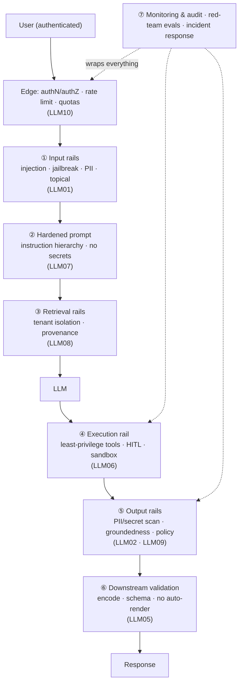
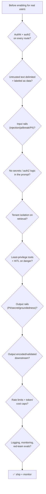
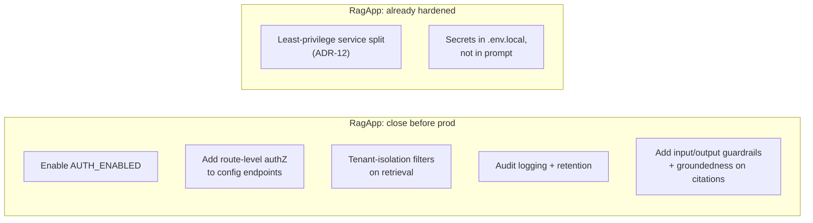

# 6 · Secure-App Checklist

*LLM Security & Guardrails module · Lesson 6 of 6 · [← Agent & Tool Security](05-agent-and-tool-security.md) · [back to index](README.md)*

The payoff lesson. Everything from Lessons 1–5 assembled into a **defense-in-depth architecture** and a **pre-production security checklist** — the security analogue of the prompt-author's [pre-flight checklist](../01_prompt-engineering/08-pitfalls-and-anti-patterns.md#84-the-prompt-authors-pre-flight-checklist). At the end we map it onto a real system: the [RagApp](../18_ragapp/README.md) production-hardening backlog.

---

## 6.1 Defense-in-depth architecture

No single control holds. A secure LLM app is **concentric rings**: every request passes through input rails, a hardened prompt, least-privilege tools, output rails, and downstream validation — with monitoring wrapped around all of it. Any one ring failing should degrade safety, not collapse it.

| Ring | Owns (OWASP) | Built in |
|------|--------------|----------|
| Edge — authN/Z, rate limit, quotas | LLM10 | [L1](01-threat-landscape-owasp.md) |
| ① Input rails | LLM01 | [L2](02-prompt-injection.md), [L4](04-guardrails-input-output.md) |
| ② Hardened prompt | LLM07 | [L2](02-prompt-injection.md), [L3](03-jailbreaks-and-data-leakage.md) |
| ③ Retrieval rails | LLM08 | [L2](02-prompt-injection.md) |
| ④ Execution rail | LLM06 | [L5](05-agent-and-tool-security.md) |
| ⑤ Output rails | LLM02, LLM09 | [L3](03-jailbreaks-and-data-leakage.md), [L4](04-guardrails-input-output.md) |
| ⑥ Downstream validation | LLM05 | [L1](01-threat-landscape-owasp.md) |
| ⑦ Monitoring / model & supply chain | LLM03, LLM04 | this lesson |

---

## 6.2 The pre-production security checklist

Run this before shipping — mirror it in a PR template so it's not optional.

**Identity & access**
- [ ] Every endpoint requires authentication; authorization is enforced **server-side** on every route (no route silently public).
- [ ] Retrieval and tool calls run with the **end-user's** scoped permissions, not an app-wide admin identity (confused-deputy, [L5](05-agent-and-tool-security.md)).
- [ ] Multi-tenant data is partitioned; retrieval is filtered by tenant/user at the store (LLM08).

**Input (LLM01)**
- [ ] All untrusted text (user, RAG, tool, file) is delimited and labeled as **data, not instructions**.
- [ ] Input rail runs injection/jailbreak detection + PII scan; encodings normalized first ([L2](02-prompt-injection.md), [L4](04-guardrails-input-output.md)).
- [ ] Ingested documents are sanitized (strip hidden/zero-width text, HTML comments) before entering the corpus.

**Prompt & model (LLM07 · LLM03 · LLM04)**
- [ ] System prompt contains **no secrets and no authorization logic** — assume it leaks.
- [ ] Model & third-party adapters/packages pinned and provenance-verified; SBOM maintained (LLM03).
- [ ] Training/fine-tune/RAG data sources vetted; untrusted corpora isolated (LLM04).

**Tools & actions (LLM06)**
- [ ] Tools are narrow and least-privilege; no free-form `run_sql` / `exec` / arbitrary `http_request`.
- [ ] Tool arguments are validated; authorization is checked in code, not trusted from the model.
- [ ] Irreversible/high-impact actions require human-in-the-loop approval showing real args.
- [ ] Code/command execution is sandboxed (isolation, egress deny, resource caps, no ambient creds).

**Output (LLM02 · LLM05 · LLM09)**
- [ ] Output rail scans for PII/secret leakage and policy violations before returning or logging.
- [ ] RAG answers pass a groundedness/citation check; uncertainty is surfaced (LLM09).
- [ ] Output is encoded/parameterized/schema-validated for its sink; model-supplied URLs/images are not auto-rendered (LLM05).

**Availability & cost (LLM10)**
- [ ] Per-user rate limits, quotas, token and output-length caps, and timeouts are enforced.
- [ ] Spend alerts and anomaly detection on request volume.

**Operate**
- [ ] Structured audit logging (who/what/args/result) with PII scrubbed from logs.
- [ ] Monitoring + alerting on guardrail hits, refusals, and tool denials.
- [ ] Red-team / safety evals in the [eval pipeline](../16_evals/README.md); a documented incident-response path (NIST AI RMF *Manage*).

---

## 6.3 Applied — the RagApp production-hardening backlog

The [RagApp](../18_ragapp/README.md) design set is a real enterprise-RAG stack (an `ingestion-service`, an `agent-service`, a browser UI). Its HLD already flags the exact items this module argues for. Mapping the checklist onto its documented gaps:

| RagApp item (from its HLD / decision log) | OWASP | Checklist ring | Status per the docs |
|-------------------------------------------|-------|----------------|---------------------|
| SSO/OIDC auth via `rag_common.auth`, gated by `AUTH_ENABLED` (defaults `false` locally) | — | Edge / identity | Present, but **off by default** — must be enabled in prod |
| Config endpoints "do not declare the route-level auth dependency" used by conversation routes | LLM06 / access | ① Edge | **Open gap** — every route must require authZ |
| Review service-to-service auth, CORS, audit logging, retention, tenant/data-isolation filters before sensitive workloads (HLD risk #5) | LLM02 / LLM08 | ③ retrieval + operate | **Backlog** — do before enabling sensitive data |
| Agent reads assets via the ingestion HTTP API, not S3; only ingestion holds storage/vector-write creds (ADR-12) | LLM06 | ④ execution (least privilege) | ✅ Good — least-privilege boundary already designed in |
| Secrets in gitignored `.env.local`, resolved from process env | LLM07 | ② prompt / secrets | ✅ Good — secrets out of code and out of the prompt |
| Vector schema drift between the two services | LLM08 | ③ retrieval | Guarded by the shared-vector-space invariant |

The lesson: a well-architected app still ships with a **hardening backlog**, and the OWASP-derived checklist is exactly how you turn "we should review that" into tracked, closable work items — several of RagApp's own risks (auth off by default, config routes lacking authZ, missing tenant filters and guardrails) are already on that list.

---

## 6.4 Takeaways

- Security is **defense-in-depth**: concentric rings — edge authN/Z + rate limits, input rails, hardened prompt, retrieval isolation, least-privilege execution, output rails, downstream validation, and monitoring around all of it.
- Ship against a **pre-production checklist** grouped by OWASP category, and bake it into your PR template so it can't be skipped.
- **Authorize server-side on every route**, run tools as the *user* not the app, and never let the system prompt hold secrets or access rules.
- Put **red-team and safety evals** in your [eval pipeline](../16_evals/README.md) and stand up monitoring + incident response — security is continuous, not a launch gate.
- Even a cleanly-designed stack like [RagApp](../18_ragapp/README.md) carries a **hardening backlog** (auth off by default, config routes lacking authZ, missing tenant filters and guardrails) — the checklist is how you make that backlog explicit and closable.

⬅️ Back to the [module index](README.md). You now have the full arc: [threat map](01-threat-landscape-owasp.md) → [injection](02-prompt-injection.md) → [jailbreaks/leakage](03-jailbreaks-and-data-leakage.md) → [guardrails](04-guardrails-input-output.md) → [agent security](05-agent-and-tool-security.md) → this checklist. Loop back to the prompt-author's view in [`../01_prompt-engineering/08-pitfalls-and-anti-patterns.md`](../01_prompt-engineering/08-pitfalls-and-anti-patterns.md).
