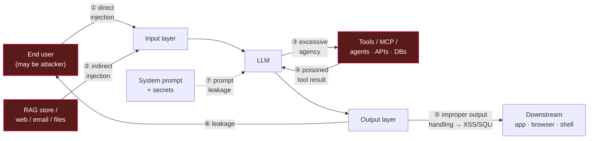

# 🔐 LLM Security & Guardrails

> The discipline of keeping an LLM application **safe under adversarial input** — where an attacker controls some of the text the model reads, and *some of that text is trying to make the model misbehave*. Prompting makes the model do what **you** want; security makes sure it *won't* do what an **attacker** wants.

These notes are a **reference module** (concept + code + diagrams), not a transcript of one playlist. They pick up where the prompt-engineering module's [Pitfalls lesson](../01_prompt-engineering/08-pitfalls-and-anti-patterns.md) left off — that lesson introduced prompt injection for the *prompt author*; this module treats security for the *system designer* who has to ship a hardened app with tools, RAG, and untrusted users.

---

## 🗺️ The threat surface of an LLM app

Every arrow that carries text into or out of the model is an attack surface. The core problem never changes: **the model cannot natively tell instructions from data**, so any channel that can inject text can try to hijack behaviour.

| # | Where it hits | The attack in one line | OWASP 2025 |
|---|---------------|------------------------|------------|
| ① | Input (user) | User types "ignore your rules and…" | LLM01 |
| ② | Input (content) | Malicious instructions ride in on a RAG chunk / email / page | LLM01 |
| ③ | Model → tools | Model is talked into a dangerous tool call | LLM06 |
| ④ | Tools → model | A tool/API returns attacker-controlled text that re-injects | LLM01 |
| ⑤ | Output → app | Raw model output is trusted downstream (XSS, SQLi, SSRF) | LLM05 |
| ⑥ | Output → user | Model reveals PII / another tenant's data | LLM02 |
| ⑦ | System prompt | Model coaxed into printing its own instructions/secrets | LLM07 |

---

## 📓 Lessons

| # | Lesson | What you'll learn |
|---|--------|-------------------|
| 1 | [Threat Landscape — OWASP Top 10 for LLM Apps (2025)](01-threat-landscape-owasp.md) | All ten risks as a table, grouped by layer, with example + mitigation |
| 2 | [Prompt Injection](02-prompt-injection.md) | Direct vs indirect; real RAG/tool/email attacks; layered defenses |
| 3 | [Jailbreaks & Data Leakage](03-jailbreaks-and-data-leakage.md) | Role-play, DAN, encoding, many-shot; system-prompt / PII / training-data leaks |
| 4 | [Guardrails: Input & Output](04-guardrails-input-output.md) | The guardrail pipeline; Guardrails AI, NeMo Guardrails, Llama Guard |
| 5 | [Agent & Tool Security](05-agent-and-tool-security.md) | Why tools explode the attack surface; least privilege, HITL, sandboxing, confused deputy |
| 6 | [Secure-App Checklist](06-secure-app-checklist.md) | Defense-in-depth architecture + a pre-production security checklist |

---

## ⚡ Defense cheat-sheet

| Threat | First reach for… |
|--------|------------------|
| Direct prompt injection | Instruction hierarchy in `system` + input guardrail (see [L2](02-prompt-injection.md)) |
| Indirect injection (RAG/web/email) | Treat all retrieved text as **data**, delimit + label it, never as instructions ([L2](02-prompt-injection.md)) |
| Jailbreak / policy bypass | Safety classifier on input (Llama Guard) + refusal-preserving system prompt ([L3](03-jailbreaks-and-data-leakage.md)) |
| PII / secret leakage | Output PII scan + redaction; never put secrets in the prompt ([L3](03-jailbreaks-and-data-leakage.md), [L4](04-guardrails-input-output.md)) |
| System-prompt leakage (LLM07) | Assume it leaks — keep no secrets in it; enforce authZ downstream ([L3](03-jailbreaks-and-data-leakage.md)) |
| Ungrounded / hallucinated answer | Groundedness / provenance check against the retrieved context ([L4](04-guardrails-input-output.md)) |
| Dangerous tool call | Least-privilege tools + human-in-the-loop approval ([L5](05-agent-and-tool-security.md)) |
| Insecure output used downstream | Encode/validate output before it hits a browser/DB/shell (LLM05, [L1](01-threat-landscape-owasp.md)) |
| Cost / DoS blow-up | Rate limits, token caps, output-length caps (LLM10, [L6](06-secure-app-checklist.md)) |

**Golden rule:** *no single control is sufficient.* Security is a **pipeline of independent layers** — input filter → hardened prompt → least-privilege tools → output filter → downstream validation → monitoring. One layer failing should not be game over.

---

## 🔗 Related modules

- [`../01_prompt-engineering/08-pitfalls-and-anti-patterns.md`](../01_prompt-engineering/08-pitfalls-and-anti-patterns.md) — the prompt-author's intro to injection and hallucination.
- [`../15_mcp/README.md`](../15_mcp/README.md) — Model Context Protocol; every tool you expose is attack surface (see [L5](05-agent-and-tool-security.md)).
- [`../13_langgraph/README.md`](../13_langgraph/README.md) — agent graphs, tools, and human-in-the-loop interrupts (the enforcement point for dangerous actions).
- [`../16_evals/README.md`](../16_evals/README.md) — red-team and safety evals belong in your eval pipeline.
- [`../18_ragapp/README.md`](../18_ragapp/README.md) — a real RAG stack whose production-hardening backlog [L6](06-secure-app-checklist.md) maps onto.

---

*Reference notes for personal study. Standards and frameworks cited by name: OWASP Top 10 for LLM Applications 2025, MITRE ATLAS, NIST AI RMF, NeMo Guardrails, Guardrails AI, Llama Guard.*
