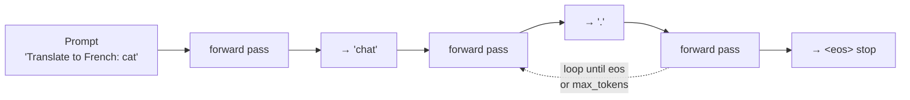
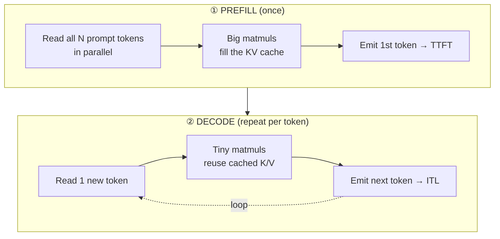
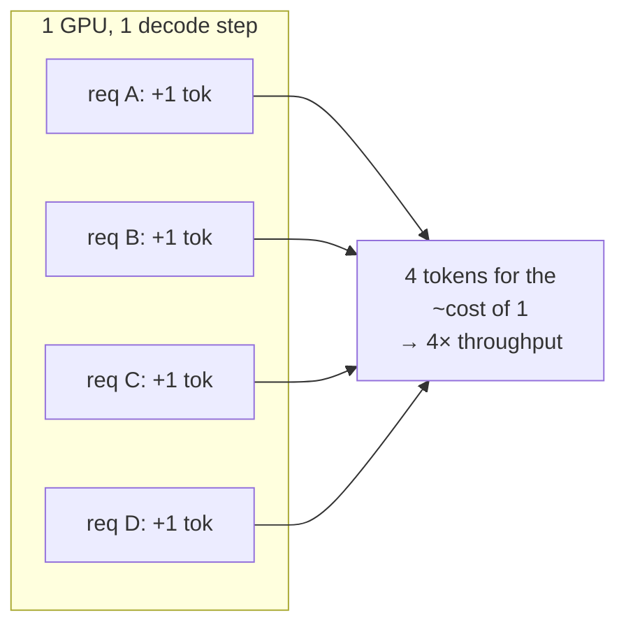

# 1 · Inference Basics

*LLM Serving & Inference Optimization module · Lesson 1 of 6 · [← index](README.md) · [next → KV Cache & Memory](02-kv-cache-and-memory.md)*

Before you can optimize inference, you have to see it as it really is: an autoregressive loop split into **two phases with completely different performance characteristics**. Almost every trick in this module exists because prefill and decode stress the GPU in opposite ways.

---

## 1.1 Autoregressive generation: one token at a time

An LLM generates by repeatedly predicting the *next* token, appending it, and feeding the whole sequence back in. There is no way to jump ahead — token N+1 depends on token N.



If you generate 200 output tokens, the model runs **200 sequential forward passes**. This inherent serialism is why decode is hard to speed up and why techniques like speculative decoding ([Lesson 6](06-advanced-and-cost.md)) try to *guess* several tokens ahead.

---

## 1.2 The two phases: prefill vs decode

The very first forward pass is special. It processes the *entire prompt at once*; every later pass processes *one new token*.



| Phase | Runs | Work per step | Bottleneck | Feels like |
|-------|------|---------------|------------|------------|
| **Prefill** | Once, on the whole prompt | N tokens × full network in parallel | **Compute-bound** (GPU FLOPs / tensor cores) | Filling the tank |
| **Decode** | Once per output token | 1 token × full network | **Memory-bandwidth-bound** (streaming weights + KV from HBM) | Sipping through a straw |

### Why the bottleneck flips

- **Prefill** does a lot of arithmetic per byte of weights it loads — big matrix-matrix multiplies keep the tensor cores busy. You are limited by raw FLOPs.
- **Decode** does almost no arithmetic per step (one token = a matrix-*vector* multiply) but still has to **stream every weight and the whole KV cache out of HBM** each step. The GPU's compute units sit mostly idle waiting on memory. You are limited by **memory bandwidth**, not FLOPs.

> **Rule of thumb:** prefill loves big prompts and big batches (more math to amortize). Decode is starved for memory bandwidth, which is exactly why quantization ([Lesson 4](04-quantization.md)) — fewer bytes to move — speeds up decode more than it speeds up prefill.

---

## 1.3 The three latency numbers that matter

```mermaid
gantt
    title One request, streamed
    dateFormat X
    axisFormat %s
    section Request
    Prefill (→ TTFT)      :done, p, 0, 3
    Decode token 2        :active, d1, 3, 4
    Decode token 3        :active, d2, 4, 5
    Decode token 4 ...    :active, d3, 5, 6
```



| Metric | Definition | Set by |
|--------|------------|--------|
| **TTFT** — time to first token | Prompt received → first token streamed | Prefill cost ≈ prompt length, queueing, prefix-cache hits |
| **ITL / TPOT** — inter-token latency / time-per-output-token | Average gap between two streamed tokens | Decode cost per step (memory bandwidth, batch size) |
| **Throughput** | Total output tokens/sec across *all* concurrent requests | Batching efficiency (see [Lesson 3](03-batching-and-throughput.md)) |

**End-to-end latency ≈ TTFT + (output_tokens − 1) × ITL.**

A chat that answers in 300 tokens with TTFT = 0.4 s and ITL = 20 ms finishes in ≈ 0.4 + 299 × 0.02 ≈ **6.4 s**, but *feels* fast because the first word appeared in 0.4 s and tokens stream faster than you read (~50 tok/s).

---

## 1.4 Latency is per-request; throughput is per-GPU

A single request cannot use a whole modern GPU during decode — one token is far too little work. So the engine runs **many requests together** to fill the hardware. This is the central lever of the whole module.



Because decode is memory-bandwidth-bound, adding more requests to a step is *nearly free* until you saturate bandwidth (or run out of KV-cache memory — [Lesson 2](02-kv-cache-and-memory.md)). That is why throughput and per-request latency trade off, and why the *scheduler* is the heart of a serving engine ([Lesson 3](03-batching-and-throughput.md)).

---

## 1.5 A first look at the knobs

Sampling parameters (from [prompt engineering](../01_prompt-engineering/01-what-is-prompt-engineering.md)) directly change inference cost — mostly by changing **how many decode steps** you run.

```python
from vllm import LLM, SamplingParams

llm = LLM(model="meta-llama/Meta-Llama-3-8B-Instruct", dtype="bfloat16")

# max_tokens is the biggest cost lever: it caps the number of decode steps.
params = SamplingParams(
    temperature=0.0,   # greedy — deterministic, no effect on speed
    max_tokens=256,    # ≤ 256 sequential decode passes for THIS request
    stop=["\n\n"],     # stop early → fewer decode steps → lower cost & latency
)

out = llm.generate(["Summarize: the KV cache stores attention K/V."], params)
print(out[0].outputs[0].text)
```

> **Cost intuition:** input tokens are paid *once* (parallel prefill); output tokens are paid *one sequential decode step each*. That's why output tokens are usually priced 3–5× higher than input tokens, and why `max_tokens` and good `stop` sequences are real money savers.

---

## 1.6 Takeaways

- LLM inference is an **autoregressive loop**: one sequential forward pass per output token.
- It splits into **prefill** (whole prompt at once, **compute-bound**, sets TTFT) and **decode** (one token at a time, **memory-bandwidth-bound**, sets ITL).
- Report three numbers: **TTFT**, **ITL/TPOT**, and **throughput**; end-to-end ≈ TTFT + (out−1)×ITL.
- A single request underutilizes the GPU during decode, so engines **batch many requests** — the root cause of the latency↔throughput tradeoff explored in the rest of this module.

➡️ Next: [KV Cache & Memory](02-kv-cache-and-memory.md) — the cache that makes decode fast and then eats all your GPU memory.
