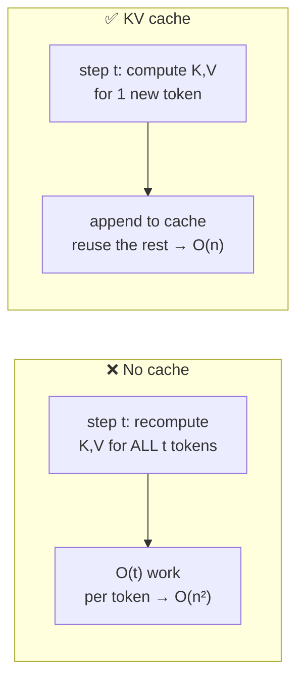
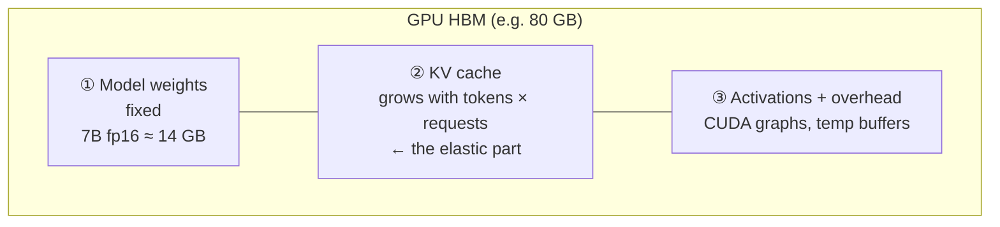
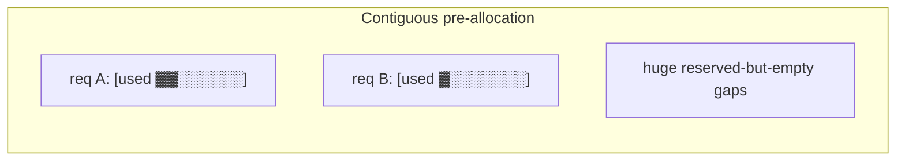
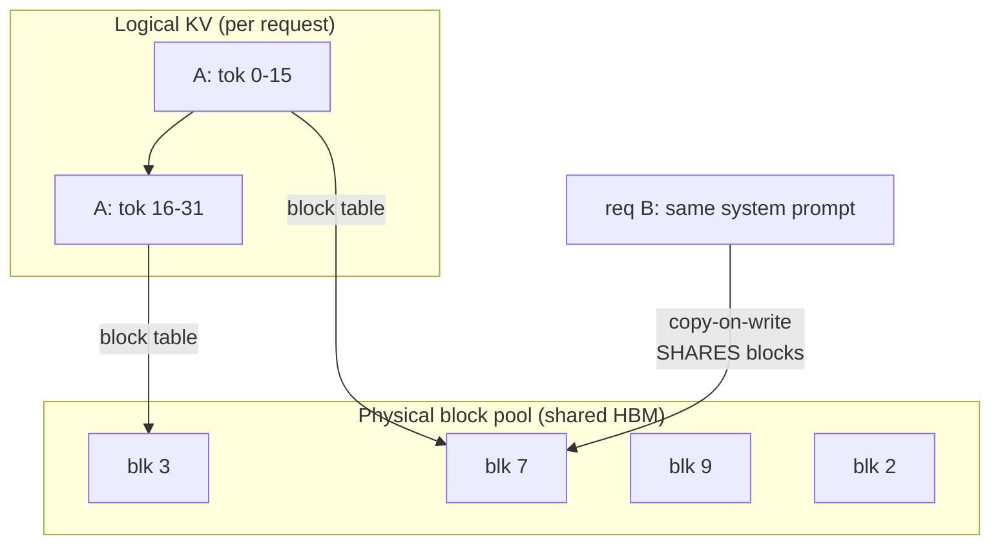

# 2 · KV Cache & Memory

*LLM Serving & Inference Optimization module · Lesson 2 of 6 · [← Inference Basics](01-inference-basics.md) · [next → Batching & Throughput](03-batching-and-throughput.md)*

The KV cache is the reason decode is fast — and the reason you run out of GPU memory long before you run out of compute. Understanding it is the single highest-leverage thing in LLM serving.

---

## 2.1 What the KV cache actually is

Attention lets every new token look back at **all previous tokens**. For each token, each layer computes a **Key (K)** and **Value (V)** vector. Those K/V vectors don't change once computed — so instead of recomputing them for the whole sequence at every decode step, the engine **caches** them and only computes K/V for the *one new* token.



Without the cache, generating N tokens is O(N²) work; with it, decode is O(N). The price you pay for that speedup is **memory** — you must keep every token's K and V, for every layer, for every sequence in flight.

---

## 2.2 The KV cache size formula

```text
kv_bytes = 2 × n_layers × n_kv_heads × head_dim × dtype_bytes × seq_len × batch
           ↑
           K and V
```

The `2 × n_layers × n_kv_heads × head_dim` part is **per token, per sequence** — a fixed property of the model. Worked examples in fp16 (`dtype_bytes = 2`):

| Model | Layers | KV heads × head_dim | Attention | **KV per token** | 4k-token sequence |
|-------|--------|--------------------|-----------|------------------|-------------------|
| Llama-2-7B | 32 | 32 × 128 (MHA) | full | **512 KiB** | ~2 GB |
| Llama-3-8B | 32 | 8 × 128 (GQA) | grouped | **128 KiB** | ~0.5 GB |
| Llama-3-70B | 80 | 8 × 128 (GQA) | grouped | **320 KiB** | ~1.25 GB |

> **This is why GQA exists.** Grouped-Query Attention shares K/V across query heads (8 KV heads instead of 32), cutting KV cache 4× with almost no quality loss. It is a *serving* optimization baked into the model — the whole point is fitting more concurrent tokens in memory.

The killer property: KV cache scales with **sequence length × concurrent requests**. 100 users each holding an 8k-token chat on Llama-3-8B ≈ 100 × 1 GB = **100 GB of KV cache** — far more than the 16 GB of weights.

---

## 2.3 The GPU memory budget

Everything below must fit in one GPU's HBM (e.g. 80 GB on an A100/H100):



| Component | Size | Behavior |
|-----------|------|----------|
| **Weights** | `params × dtype_bytes` (7B fp16 ≈ 14 GB; int4 ≈ 3.5 GB) | Fixed once loaded |
| **KV cache** | formula above | **Elastic** — this is your concurrency budget |
| **Activations / overhead** | ~1–3 GB | Roughly fixed per engine |

**Weights are a sunk cost; KV cache is the free memory that decides how many requests you can serve at once.** Quantizing weights ([Lesson 4](04-quantization.md)) is attractive largely because it frees HBM *for more KV cache*.

```python
# vLLM: reserve 90% of HBM for weights + KV cache (leave headroom for activations).
# max_model_len caps per-request sequence length → caps worst-case KV per request.
from vllm import LLM
llm = LLM(
    model="meta-llama/Meta-Llama-3-8B-Instruct",
    dtype="bfloat16",
    gpu_memory_utilization=0.90,   # too high → OOM under load; too low → wasted concurrency
    max_model_len=8192,
)
```

---

## 2.4 The old way wasted most of the cache

Classic engines pre-allocated one **contiguous** KV buffer per request, sized to `max_model_len`, up front. Two big problems:

- **Internal fragmentation:** a request that only uses 200 of 8192 reserved tokens wastes the other ~97%.
- **External fragmentation + no sharing:** two requests with the *same* prompt prefix each keep their own copy.



Reported KV-cache utilization in these systems was often **20–40%** — you were paying for GPU memory you never used.

---

## 2.5 PagedAttention (vLLM, 2023)

vLLM's PagedAttention borrows **virtual memory / paging** from operating systems. The KV cache is split into fixed-size **blocks** (e.g. 16 tokens each). A sequence gets a **block table** mapping logical positions → physical blocks, allocated **on demand**. Blocks need not be contiguous.



What this buys you:

- **Near-zero waste:** allocate a block only when a sequence actually needs it → utilization ~90%+.
- **Prefix sharing:** requests with a common prefix (shared system prompt, few-shot block) **share physical blocks** copy-on-write — the basis of *prefix caching* ([Lesson 6](06-advanced-and-cost.md)).
- **More concurrent requests** in the same HBM → higher throughput, and the enabler of continuous batching ([Lesson 3](03-batching-and-throughput.md)).

> **One-line mental model:** PagedAttention is `malloc`/virtual memory for the KV cache. It doesn't make a single token faster — it lets you pack far more tokens into the same GPU, which is what raises throughput.

---

## 2.6 Takeaways

- The **KV cache** stores per-token K/V so decode is O(N) not O(N²) — it's what makes generation fast.
- Its size = `2 × n_layers × n_kv_heads × head_dim × dtype × seq_len × batch`; it scales with **context length × concurrency** and quickly dwarfs the weights.
- GPU HBM = **weights (fixed) + KV cache (elastic) + activations**; KV cache is your real concurrency budget, which is why weight quantization matters.
- **PagedAttention** (vLLM) pages the KV cache like OS virtual memory — killing fragmentation, enabling prefix sharing, and packing more requests per GPU.

➡️ Next: [Batching & Throughput](03-batching-and-throughput.md) — how the scheduler fills all that KV-cache space with concurrent work.
