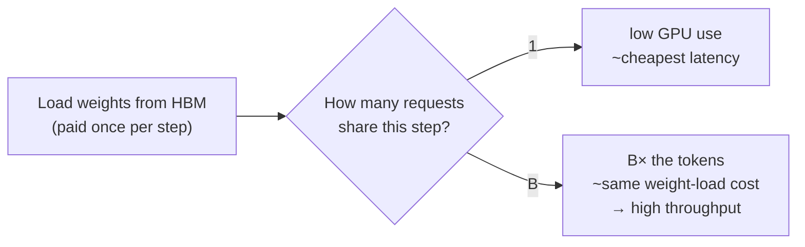
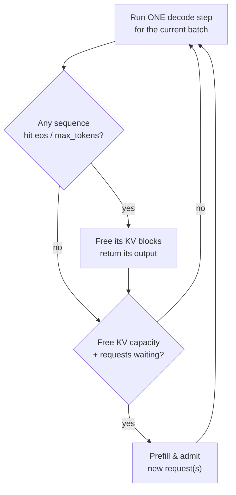
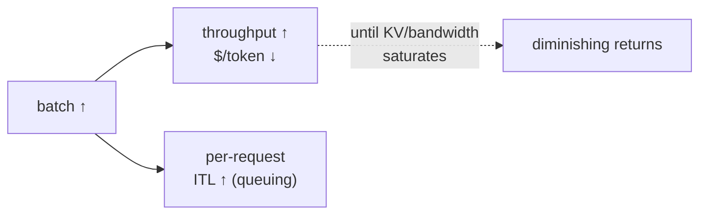

# 3 · Batching & Throughput

*LLM Serving & Inference Optimization module · Lesson 3 of 6 · [← KV Cache & Memory](02-kv-cache-and-memory.md) · [next → Quantization](04-quantization.md)*

Decode underutilizes the GPU ([Lesson 1](01-inference-basics.md)), so serving is really a **scheduling** problem: which requests share each forward pass? The evolution from static → dynamic → continuous batching is the biggest throughput jump in modern LLM serving.

---

## 3.1 Why batch at all

One decode step for one request is a matrix-*vector* multiply — it barely touches the tensor cores while still streaming every weight from HBM. Stack B requests into a matrix-*matrix* multiply and you reuse those same loaded weights across all B, so throughput rises almost linearly until you hit a bottleneck.



The batch can't grow forever. Two ceilings: **KV-cache memory** ([Lesson 2](02-kv-cache-and-memory.md)) and eventually **memory bandwidth / compute** saturation. The scheduler's job is to stay just under those ceilings.

---

## 3.2 Static batching

Collect N requests, run them together to completion, return all N, then take the next batch. Simple — and the default in naïve `model.generate()` loops.

```mermaid
gantt
    title Static batch of 4 (finish together, then next batch)
    dateFormat X
    axisFormat %s
    section Batch 1
    req A (short) done, waits idle :crit, a, 0, 2
    req A idle padding             :done,  ap, 2, 8
    req B (short)                  :crit, b, 0, 3
    req B idle padding             :done,  bp, 3, 8
    req C (long)                   :active, c, 0, 8
    req D (long)                   :active, d, 0, 8
```



**The fatal flaw — head-of-line blocking:** the batch runs until the *slowest* request finishes. Short requests (A, B) finish early but their GPU slots sit **idle** until the long ones (C, D) are done, and no new request can join. Real chat traffic has wildly different output lengths, so utilization craters.

---

## 3.3 Dynamic batching

Borrowed from classic model servers (e.g. Triton). Wait a short window (say 5–20 ms) to *gather* whatever requests arrive, then run that batch. It improves how batches are *formed* under bursty traffic, but each batch is still run to completion — so it **inherits head-of-line blocking** for generative decode. It shines for fixed-length models (embeddings, classifiers), not for variable-length text generation.

| | Batch formed by | Handles variable output length? |
|---|---|---|
| Static | Fixed count / offline list | ❌ pad + wait for slowest |
| Dynamic | Time window on arrivals | ❌ still runs batch to completion |

---

## 3.4 Continuous (in-flight) batching

The key idea (Orca, Yu et al. 2022; the default in vLLM/TGI): **schedule at the granularity of a single decode step, not a whole request.** After every step the scheduler can **evict finished sequences and admit new ones**, so the batch is refilled continuously — no waiting for the slowest request.



Now the timeline looks like this — the moment A and B finish, C and D slot straight in:

```mermaid
gantt
    title Continuous batching (slots refill immediately)
    dateFormat X
    axisFormat %s
    section GPU slot 1
    req A (finishes) :crit, a, 0, 2
    req C (admitted) :active, c, 2, 8
    section GPU slot 2
    req B (finishes) :crit, b, 0, 3
    req D (admitted) :active, d, 3, 8
```



- No idle padding: freed slots are reused the *same* or *next* step.
- Works hand-in-glove with **PagedAttention** — evicting a finished sequence returns its KV blocks to the pool for the newcomer.
- Typically **2–4× (sometimes >10× on skewed length distributions)** higher throughput than static batching at similar latency.

> **Prefill vs decode scheduling:** admitting a new request means running its (compute-heavy) prefill, which can stall ongoing decodes and spike their ITL. Modern engines use **chunked prefill** — slice a long prefill into pieces and interleave them with decode steps — to keep TTFT and ITL both smooth.

---

## 3.5 The throughput ↔ latency tradeoff

More concurrency = more throughput = worse per-request latency. You are choosing a point on a curve, and the right point depends on the workload.



| Workload | Optimize for | Batching stance | Typical settings |
|----------|-------------|-----------------|------------------|
| Interactive chat / agents | **Low TTFT + ITL** | Small effective batch, cap concurrency, chunked prefill | modest `max_num_seqs`, streaming on |
| RAG serving | Balanced | Continuous batching, prefix caching for shared system prompt | prefix caching on |
| Bulk / offline (evals, data gen, [../16_evals/](../16_evals/README.md)) | **Max throughput** | Batch as large as KV allows | high `max_num_seqs`, offline `LLM.generate` |

```python
# vLLM exposes the concurrency ceilings directly.
from vllm import LLM
llm = LLM(
    model="meta-llama/Meta-Llama-3-8B-Instruct",
    max_num_seqs=256,        # max sequences batched per step → throughput ceiling
    max_num_batched_tokens=8192,  # token budget per step (prefill + decode)
    enable_chunked_prefill=True,  # interleave long prefills with decode → smoother ITL
    gpu_memory_utilization=0.90,
)
# Offline bulk: pass ALL prompts at once and let continuous batching pack the GPU.
outs = llm.generate(list_of_10000_prompts)  # far faster than a Python for-loop
```

> **Anti-pattern:** calling the engine in a Python `for` loop, one prompt at a time. That serializes everything and throws away continuous batching. Hand the engine *all* the work and let its scheduler batch it.

---

## 3.6 Takeaways

- Batching turns wasteful matrix-*vector* decode steps into efficient matrix-*matrix* ones, reusing loaded weights → throughput scales with batch size until KV/bandwidth saturates.
- **Static batching** runs a batch to completion → **head-of-line blocking** and idle GPU on variable-length text; **dynamic batching** only fixes batch *formation*.
- **Continuous (in-flight) batching** schedules per decode step, evicting finished and admitting new sequences every step — the default in vLLM/TGI and the big modern throughput win.
- Throughput and per-request latency **trade off**; pick the point per workload, and always feed the engine work in bulk rather than a serial loop.

➡️ Next: [Quantization](04-quantization.md) — shrink the weights (and KV) so more fits in HBM and decode moves fewer bytes.
