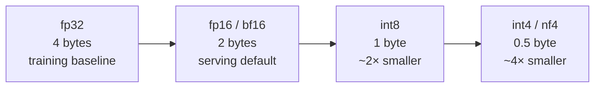
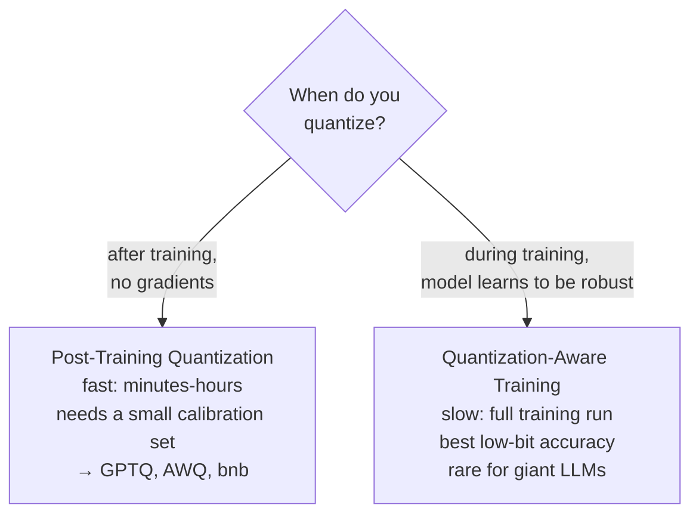
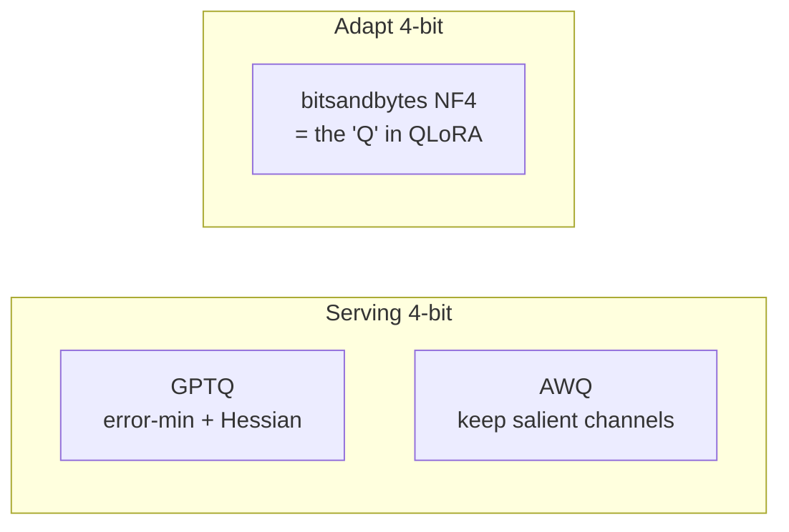
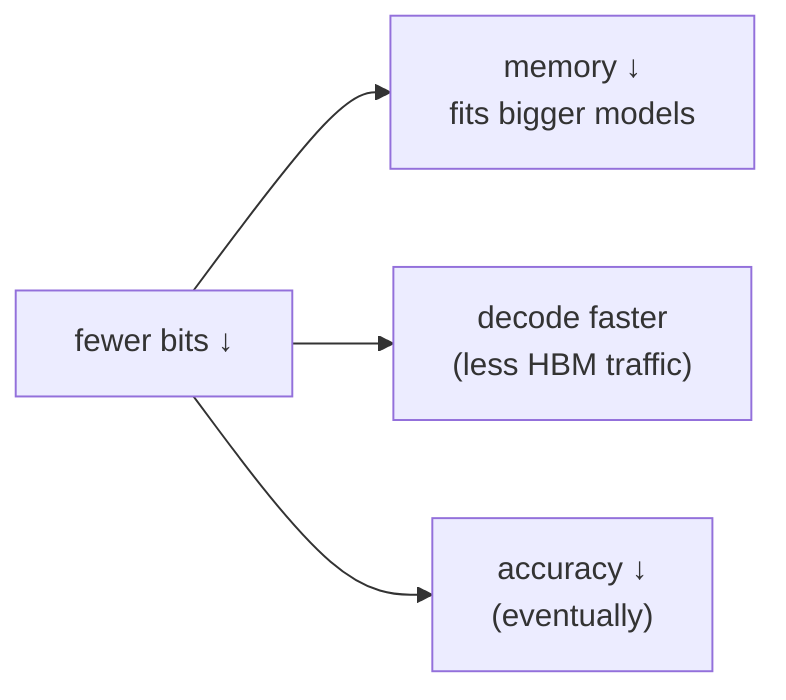

# 4 · Quantization

*LLM Serving & Inference Optimization module · Lesson 4 of 6 · [← Batching & Throughput](03-batching-and-throughput.md) · [next → Serving Frameworks](05-serving-frameworks.md)*

Quantization stores weights (and sometimes activations/KV) in **fewer bits**. Since decode is memory-bandwidth-bound ([Lesson 1](01-inference-basics.md)) and KV cache is your concurrency budget ([Lesson 2](02-kv-cache-and-memory.md)), moving fewer bytes is a direct win on **memory, cost, and decode speed** — if you can hold accuracy.

---

## 4.1 The number formats



| Format | Bytes/param | 7B weights | Notes |
|--------|-------------|-----------|-------|
| fp32 | 4 | ~28 GB | Training precision; almost never used to serve |
| **fp16 / bf16** | 2 | ~14 GB | The serving baseline. **bf16** has fp32's exponent range → more stable, preferred on A100/H100 |
| **int8** | 1 | ~7 GB | ~2× smaller/faster, tiny quality loss with good schemes |
| **int4 / NF4** | 0.5 | ~3.5 GB | ~4× smaller; fits big models on small GPUs; watch accuracy |

> **fp16 vs bf16:** same 2 bytes, different split of exponent/mantissa. bf16 trades precision for range and rarely overflows, so it's the default `dtype` on modern data-center GPUs. fp16 keeps more mantissa bits but can overflow; fine on hardware without bf16.

---

## 4.2 PTQ vs QAT



| | Cost | Accuracy at 4-bit | Use when |
|---|------|-------------------|----------|
| **PTQ** | Cheap (one pass over calibration data) | Good with modern methods | Serving an existing checkpoint — the default for LLMs |
| **QAT** | Expensive (retrain) | Best | You control training and need aggressive low-bit accuracy |

Because retraining a 70B model is impractical, **PTQ dominates LLM serving.** The interesting engineering is in *how* PTQ picks scales so 4-bit doesn't wreck quality.

---

## 4.3 The PTQ methods you'll actually pick between

| Method | Bits | How it decides scales | Quantizes | Best for |
|--------|------|----------------------|-----------|----------|
| **bitsandbytes NF4** | 4 | NormalFloat4 datatype tuned for normally-distributed weights; done **on load**, no calibration | Weights (activations stay bf16) | Fast setup, QLoRA fine-tuning, dev/experiments |
| **GPTQ** | 3/4/8 | Layer-wise error minimization using approximate second-order (Hessian) info + calibration set | Weights | Max compression, throughput serving |
| **AWQ** | 4 | *Activation-aware* — protects the ~1% of "salient" weight channels that matter most for activations | Weights | Best 4-bit accuracy/latency balance for serving |
| int8 (LLM.int8() / SmoothQuant) | 8 | Outlier-aware int8; SmoothQuant shifts activation outliers into weights | Weights (+activations) | Conservative 2× with minimal risk |



### The QLoRA tie-in

**bitsandbytes NF4 is exactly the quantization behind QLoRA.** QLoRA freezes the base model in 4-bit NF4 (with *double quantization* — quantizing the quantization constants too) and trains small LoRA adapters in bf16 on top. That's how a 65B model fine-tunes on a single 48 GB GPU. Full treatment in [`../../Shared/01_lora-qlora/`](../../Shared/01_lora-qlora/README.md); the point here: the *same* 4-bit trick serves double duty for **training-memory** (QLoRA) and **serving-memory** (this lesson).

```python
# bitsandbytes NF4 load — the QLoRA base-model config, also usable to just serve smaller.
import torch
from transformers import AutoModelForCausalLM, BitsAndBytesConfig

bnb = BitsAndBytesConfig(
    load_in_4bit=True,
    bnb_4bit_quant_type="nf4",              # NormalFloat4
    bnb_4bit_compute_dtype=torch.bfloat16,  # matmuls run in bf16
    bnb_4bit_use_double_quant=True,         # quantize the quant constants too
)
model = AutoModelForCausalLM.from_pretrained(
    "meta-llama/Meta-Llama-3-8B", quantization_config=bnb, device_map="auto",
)
```

```bash
# Serving a pre-quantized checkpoint in vLLM: just point at an AWQ/GPTQ repo.
vllm serve TheBloke/Llama-2-7B-Chat-AWQ  --quantization awq
vllm serve TheBloke/Llama-2-7B-Chat-GPTQ --quantization gptq
```

> **Rule of thumb for serving throughput:** reach for **AWQ or GPTQ** (compiled, fast kernels). **bitsandbytes** is the easiest to *apply* and the right choice for QLoRA and quick experiments, but its runtime is generally slower than AWQ/GPTQ for high-throughput serving.

---

## 4.4 The tradeoff table



| Precision | Memory vs fp16 | Speed (decode) | Accuracy | When to use |
|-----------|----------------|----------------|----------|-------------|
| **bf16/fp16** | 1× | baseline | reference | Default; you have the VRAM and want zero quality risk |
| **int8** | ~0.5× | ~1.2–1.5× | ~lossless with good schemes | Safe 2× memory cut; conservative production |
| **int4 (AWQ/GPTQ)** | ~0.25× | ~1.5–2×+ | small drop (task-dependent) | Fit large models on fewer/smaller GPUs; cost-sensitive serving |
| **int4 (NF4, bnb)** | ~0.25× | modest | small drop | QLoRA base; quick local/dev serving |

> **Always measure, don't assume.** Quantization damage is *task-dependent* — a model can hold trivia benchmarks but degrade on multi-step reasoning, code, or long context. Gate every quantized deploy behind your [eval suite](../16_evals/README.md); the memory/cost win is only real if quality survives.

**KV-cache quantization** is a related lever: store the KV cache in fp8/int8 (vLLM `--kv-cache-dtype fp8`) to roughly double concurrency. Since KV is the concurrency budget ([Lesson 2](02-kv-cache-and-memory.md)), this can matter as much as weight quantization for long-context, high-concurrency serving.

---

## 4.5 Takeaways

- Quantization stores params in **fewer bits** (fp16 → int8 → int4), cutting **memory + HBM traffic** → smaller footprint, more KV room, faster decode.
- **PTQ** (post-training, cheap, calibration-based) dominates LLM serving; **QAT** (retrain) gives the best low-bit accuracy but is rarely worth it for giant models.
- Pick by goal: **AWQ/GPTQ** for fast 4-bit *serving*, **bitsandbytes NF4** for *QLoRA* and quick setup, **int8** for a safe 2× cut.
- NF4 is literally the "Q" in **QLoRA** ([`../../Shared/01_lora-qlora/`](../../Shared/01_lora-qlora/README.md)); quantize the KV cache too for long-context concurrency — and **always re-run [evals](../16_evals/README.md)**, since damage is task-dependent.

➡️ Next: [Serving Frameworks](05-serving-frameworks.md) — the engines that bundle PagedAttention, continuous batching, and quantization behind an API.
