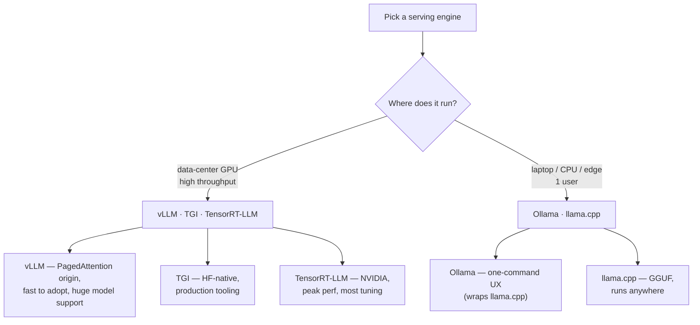
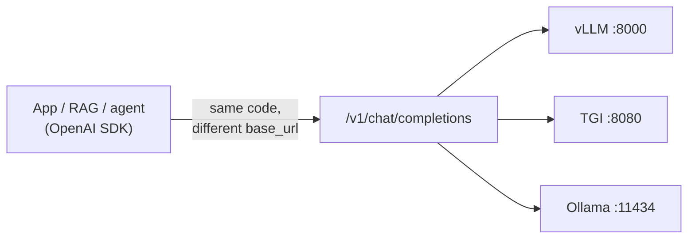
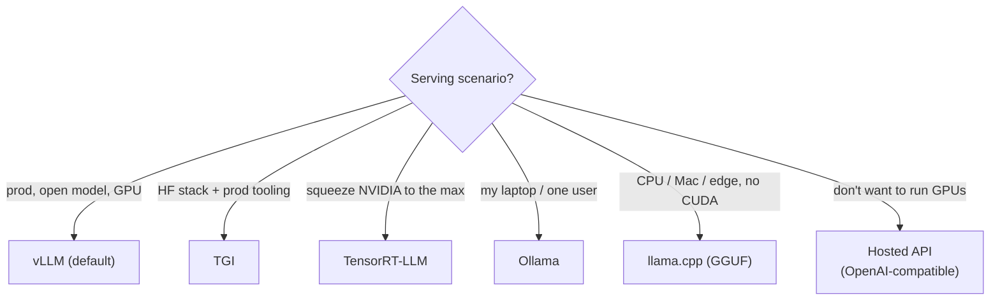

# 5 · Serving Frameworks

*LLM Serving & Inference Optimization module · Lesson 5 of 6 · [← Quantization](04-quantization.md) · [next → Advanced & Cost](06-advanced-and-cost.md)*

Everything in Lessons 1–4 — PagedAttention, continuous batching, quantization, FlashAttention kernels — is bundled by an **inference engine** so you don't build it yourself. This lesson maps the landscape and shows the one interface they all converge on: the **OpenAI-compatible API**.

---

## 5.1 The landscape



| Framework | Backer | Sweet spot | Quantization | Superpower | Watch-out |
|-----------|--------|-----------|--------------|-----------|-----------|
| **vLLM** | UC Berkeley / community | High-throughput GPU serving | AWQ, GPTQ, fp8, bnb | PagedAttention + continuous batching; broad model + LoRA support | Needs a GPU; config surface is large |
| **TGI** (Text Generation Inference) | Hugging Face | Production GPU serving in HF ecosystem | AWQ, GPTQ, EETQ, bnb | Batteries-included: metrics, tracing, guided decoding, easy Docker | Slightly less bleeding-edge than vLLM |
| **TensorRT-LLM** | NVIDIA | Absolute peak latency/throughput on NVIDIA | INT8/INT4/FP8 (engine-baked) | Compiled, hardware-tuned kernels | Per-model/GPU **engine build** step; least flexible, most effort |
| **Ollama** | Ollama | Local dev, single user, quick demos | GGUF (llama.cpp) | `ollama run llama3` — trivial UX, model registry | Not for high concurrency |
| **llama.cpp** | ggml / community | CPU, Apple Silicon, edge, embedded | GGUF (2–8 bit) | Runs almost anywhere, no CUDA needed | Lower throughput than GPU engines |

> **Rule of thumb:** **vLLM** is the sane default for serving open models on GPUs. Use **TGI** if you're deep in the HF stack and want production tooling out of the box, **TensorRT-LLM** when you must wring the last 20–30% out of NVIDIA hardware and can afford the build step, and **Ollama/llama.cpp** for local, single-user, or edge.

---

## 5.2 The OpenAI-compatible API is the universal contract

The industry standardized on OpenAI's `/v1/chat/completions` schema. vLLM, TGI, TensorRT-LLM (via Triton), Ollama, and llama.cpp's server **all expose it**. That means you swap engines or providers by changing a `base_url` — your application code, RAG pipeline, and agents don't change.



> **Why this matters for the rest of the repo:** your [RAG app](../18_ragapp/README.md) and agents just point their OpenAI client at whichever engine you deploy. Self-hosting vs a hosted API becomes a one-line config choice, not a rewrite.

---

## 5.3 vLLM in practice

### Offline / batch (fastest way to run 10k prompts)

```python
from vllm import LLM, SamplingParams

llm = LLM(
    model="meta-llama/Meta-Llama-3-8B-Instruct",
    dtype="bfloat16",
    gpu_memory_utilization=0.90,
    max_model_len=8192,
)
params = SamplingParams(temperature=0.7, top_p=0.9, max_tokens=256)

prompts = ["Explain PagedAttention in one line.",
           "Why is decode memory-bandwidth-bound?"]
outputs = llm.generate(prompts, params)   # continuous batching packs the GPU
for o in outputs:
    print(o.prompt, "→", o.outputs[0].text)
```

### Online server (OpenAI-compatible)

```bash
# Start the server. `vllm serve` == python -m vllm.entrypoints.openai.api_server
vllm serve meta-llama/Meta-Llama-3-8B-Instruct \
    --dtype bfloat16 \
    --gpu-memory-utilization 0.90 \
    --max-model-len 8192 \
    --enable-prefix-caching \
    --port 8000
```

```python
# Any OpenAI client talks to it — note base_url + a dummy api_key.
from openai import OpenAI

client = OpenAI(base_url="http://localhost:8000/v1", api_key="EMPTY")
resp = client.chat.completions.create(
    model="meta-llama/Meta-Llama-3-8B-Instruct",   # must match the served model id
    messages=[{"role": "user", "content": "Give me one KV-cache fact."}],
    temperature=0.7,
    max_tokens=200,
    stream=True,          # SSE streaming → low perceived latency (first token ASAP)
)
for chunk in resp:
    delta = chunk.choices[0].delta.content
    if delta:
        print(delta, end="", flush=True)
```

---

## 5.4 TGI in practice

TGI ships as a Docker image; you pass model + optimization flags and get the same OpenAI-style endpoint plus Prometheus metrics.

```bash
docker run --gpus all --shm-size 1g -p 8080:80 \
  -v "$PWD/data:/data" \
  ghcr.io/huggingface/text-generation-inference:latest \
  --model-id meta-llama/Meta-Llama-3-8B-Instruct \
  --quantize awq \
  --max-batch-prefill-tokens 8192
# → OpenAI-compatible endpoint at http://localhost:8080/v1
```

---

## 5.5 Choosing, quickly



| If you… | Use | Because |
|---------|-----|---------|
| Serve an open model to real traffic on GPUs | **vLLM** | Best throughput-per-effort; PagedAttention + continuous batching built in |
| Live in the HF ecosystem and want metrics/tracing now | **TGI** | Production-grade Docker with tooling included |
| Must hit the lowest possible latency on NVIDIA | **TensorRT-LLM** | Compiled kernels; accept the per-model engine build |
| Prototype locally or ship a desktop app | **Ollama** | One command, no infra |
| Run on CPU/Apple Silicon/edge | **llama.cpp** | GGUF runs anywhere, no CUDA |
| Not run GPUs at all | Hosted OpenAI-compatible API | Same client code; trade $/token for zero ops (see [Lesson 6](06-advanced-and-cost.md)) |

---

## 5.6 Takeaways

- Serving **engines package** PagedAttention, continuous batching, quantized kernels, and FlashAttention behind an API — you rarely build these yourself.
- **vLLM** = strong default for GPU serving; **TGI** = HF-native production tooling; **TensorRT-LLM** = peak NVIDIA performance with a build step; **Ollama/llama.cpp** = local/edge/single-user.
- They all speak the **OpenAI-compatible** `/v1` API, so swapping engines (or self-hosted ↔ hosted) is a `base_url` change, not a rewrite — which is why your [RAG app](../18_ragapp/README.md) doesn't care what's behind it.
- Use `vllm serve` (or TGI's Docker) for an online endpoint; use `LLM.generate` with all prompts at once for the fastest offline/batch runs.

➡️ Next: [Advanced & Cost](06-advanced-and-cost.md) — speculative decoding, prefix caching, multi-GPU parallelism, and the $/1M-token model.
