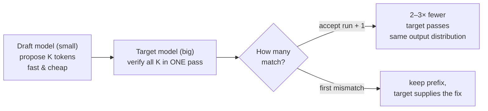
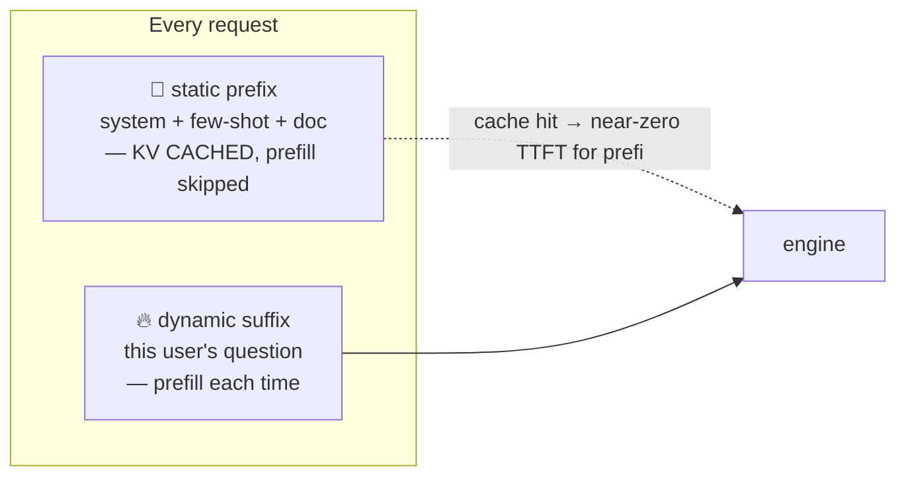
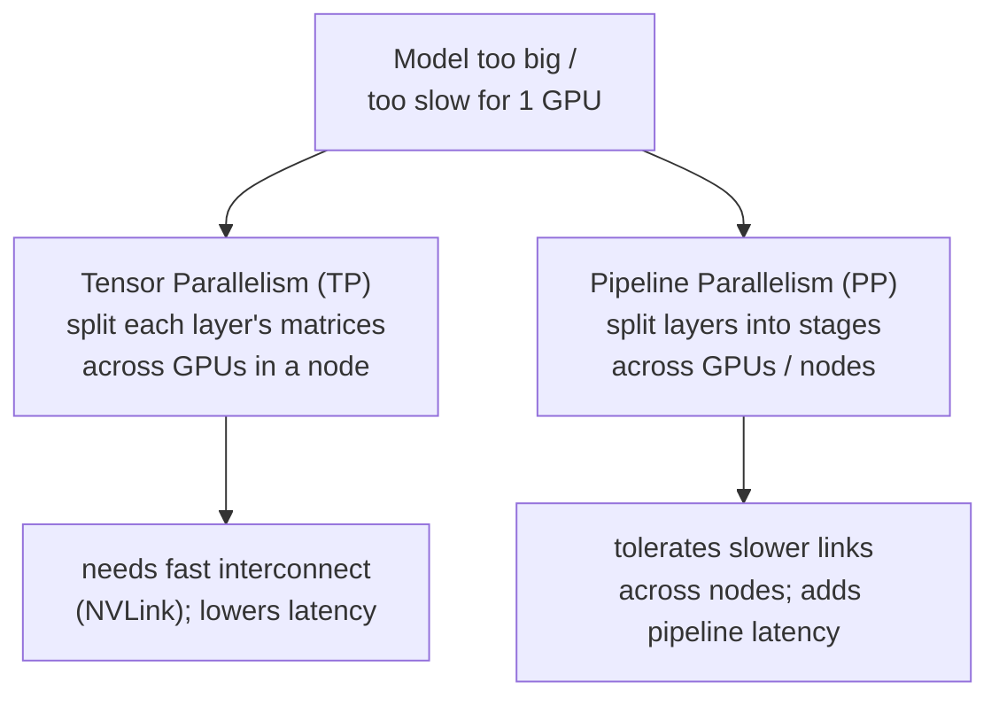
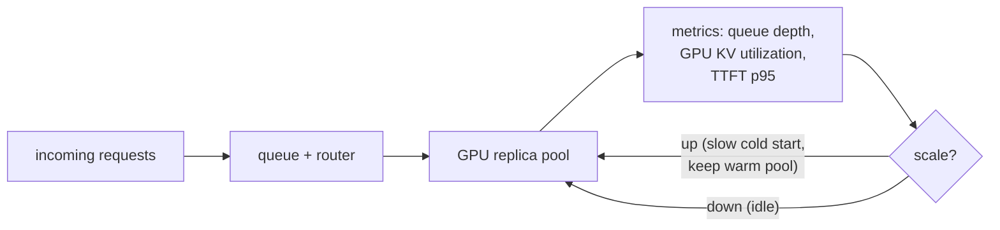
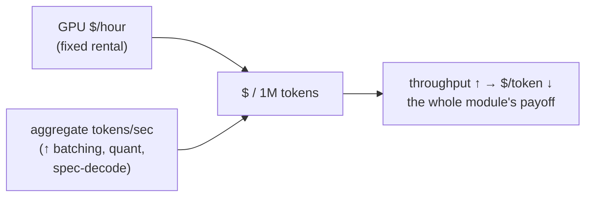

# 6 · Advanced & Cost

*LLM Serving & Inference Optimization module · Lesson 6 of 6 · [← Serving Frameworks](05-serving-frameworks.md) · [next → index](README.md)*

The last mile: techniques that break the "one sequential token per step" limit, reuse work across requests, spread giant models across GPUs, and — finally — turn all of it into a defensible **cost per million tokens**. This is where serving meets [MLOps](../../Shared/02_mlops/README.md).

---

## 6.1 Speculative decoding

Decode is memory-bandwidth-bound and sequential ([Lesson 1](01-inference-basics.md)) — the GPU is *idle enough* to verify several tokens for the cost of one. Speculative decoding (Leviathan et al., 2023) exploits this: a small, cheap **draft** model proposes K tokens, and the big **target** model verifies them **in a single parallel forward pass**, keeping the longest correct prefix.



- **Output is identical in distribution** to the target alone — this is a *speedup*, not an approximation. Rejected guesses are simply discarded.
- Wins most when the draft is accurate on "easy" tokens (boilerplate, code, formatting) — typical **1.5–3× lower ITL**.
- Variants: a separate small draft model, **n-gram / prompt lookup** (draft from the prompt itself), and self-speculation like **Medusa/EAGLE** (extra heads predict ahead — no separate model).

```bash
# vLLM: pair a 70B target with an 8B draft (newer vLLM uses --speculative-config JSON).
vllm serve meta-llama/Meta-Llama-3-70B-Instruct \
  --tensor-parallel-size 4 \
  --speculative-config '{"model": "meta-llama/Meta-Llama-3-8B-Instruct", "num_speculative_tokens": 5}'
```

---

## 6.2 Prefix / prompt caching

If many requests share a **prefix** — a big system prompt, a few-shot block, a fixed document — you can compute its KV cache **once** and reuse it, skipping that prefill entirely on later requests. PagedAttention makes this cheap: shared prefix tokens map to **shared physical blocks** ([Lesson 2](02-kv-cache-and-memory.md)).



- Directly slashes **TTFT** for long shared prompts and cuts input-token compute.
- **Design implication:** put stable content **first**, variable content **last** — the exact ordering rule from context engineering ([`../01_prompt-engineering/06-context-engineering.md`](../01_prompt-engineering/06-context-engineering.md)). Serving-side prefix caching is that same principle enforced by the engine.
- Enable in vLLM with `--enable-prefix-caching`; hosted APIs expose it as automatic/opt-in "prompt caching" with discounted cached-input tokens.

> This is the serving-layer payoff of good prompt structure: a well-ordered prompt isn't just cleaner, it's **cheaper and lower-latency** because the engine can cache its stable head.

---

## 6.3 Multi-GPU: when the model doesn't fit

A 70B model in bf16 is ~140 GB of weights — more than one 80 GB GPU. Split it.



| Strategy | Splits | Communication | Latency effect | Use when |
|----------|--------|---------------|----------------|----------|
| **Tensor parallel (TP)** | Each layer's weight matrices across GPUs | Heavy per layer (all-reduce) → wants **NVLink** | Lowers latency (more compute per token) | Model too big for one GPU, GPUs in one node |
| **Pipeline parallel (PP)** | Contiguous blocks of layers into stages | Light (activations between stages) | Adds pipeline latency; great throughput with micro-batching | Scaling across **nodes** / slower interconnect |

```bash
# 70B across 4 GPUs on one node via tensor parallelism.
vllm serve meta-llama/Meta-Llama-3-70B-Instruct --tensor-parallel-size 4
# Combine TP within a node and PP across nodes for the very largest models:
vllm serve <huge-model> --tensor-parallel-size 8 --pipeline-parallel-size 2
```

> **Order of preference:** first try to **fit on one GPU** (quantize — [Lesson 4](04-quantization.md)). If it still won't fit or is too slow, add **TP within a node** (needs NVLink). Reach for **PP across nodes** only for the largest models — cross-node communication is the expensive part.

---

## 6.4 Autoscaling and the serving loop

LLM traffic is bursty, GPUs are expensive, and cold starts are slow (loading tens of GB of weights takes tens of seconds). So autoscaling for LLMs looks different from stateless web services.



- **Scale on LLM-native signals** — queue depth, KV-cache utilization, TTFT p95 — not raw CPU. GPU util can read "busy" while requests still queue.
- **Cold starts are slow** → keep a warm minimum replica count; scale to zero only for dev/spiky-but-tolerant workloads.
- Everything here — deploy, roll out a new quantized checkpoint, monitor, roll back — is the [MLOps](../../Shared/02_mlops/README.md) loop applied to a serving engine. Wire in [evals](../16_evals/README.md) as the quality gate so an "optimization" that quietly hurts accuracy never ships.

---

## 6.5 The cost-per-1M-tokens mental model

All the optimization in this module reduces to one number leadership cares about: **$ per 1M tokens.** The formula:

```text
cost_per_1M_tokens = (GPU $/hour) / (throughput_tokens_per_hour / 1_000_000)

throughput_tokens_per_hour = aggregate_tokens_per_sec × 3600
```



**Worked example.** One H100 at ~$4/hour serving Llama-3-8B at an aggregate **3,000 tok/s**:

- tokens/hour = 3,000 × 3,600 = **10.8M**
- cost per 1M = $4 / 10.8 = **≈ $0.37 per 1M tokens**

Now apply the module: continuous batching lifts aggregate throughput to 6,000 tok/s → **≈ $0.185 / 1M** (2× cheaper, same GPU). Quantize to int4 and free HBM for more concurrency → cheaper still. **The lever is always the denominator: raise throughput per GPU-hour.**

| Lever | Moves | Net effect on $/token |
|-------|-------|-----------------------|
| Continuous batching ([L3](03-batching-and-throughput.md)) | Aggregate tok/s ↑↑ | ↓↓ (biggest single win) |
| Quantization ([L4](04-quantization.md)) | More KV room + faster decode | ↓ |
| Prefix caching (6.2) | Skip repeated prefill | ↓ (esp. long shared prompts) |
| Speculative decoding (6.1) | Fewer target passes | ↓ latency; ↓ cost if GPU was under-fed |
| Bigger/newer GPU | $/hour ↑ but tok/s ↑ more | usually ↓ |

> **Build vs buy:** compute your self-hosted $/1M with this formula (including idle time and ops) and compare to a hosted API's per-token price. Self-hosting wins at **high, steady utilization**; hosted APIs win for **spiky or low volume** — you're renting someone else's continuous batching across many tenants.

---

## 6.6 Takeaways

- **Speculative decoding** uses a small draft model to propose tokens the big model verifies in parallel — same output distribution, ~1.5–3× lower ITL.
- **Prefix caching** reuses the KV of shared prompt prefixes to cut TTFT and input cost — the serving-side reward for putting **static content first** ([context engineering](../01_prompt-engineering/06-context-engineering.md)).
- **Tensor parallelism** (within a node, needs NVLink) and **pipeline parallelism** (across nodes) run models too big for one GPU; try quantization to fit on one GPU first.
- **Autoscale on LLM-native signals** (queue depth, KV util, TTFT p95) with warm replicas; it's the [MLOps](../../Shared/02_mlops/README.md) loop, gated by [evals](../16_evals/README.md).
- It all rolls up to **$/1M tokens = GPU $/hr ÷ (tokens/hr ÷ 1M)** — every optimization is a fight to raise throughput per GPU-hour and shrink that number.

➡️ Back to the [module index](README.md) — or jump to related tracks: [fine-tuning & alignment](../02_fine-tuning-and-alignment/README.md), [LoRA/QLoRA](../../Shared/01_lora-qlora/README.md), [MLOps](../../Shared/02_mlops/README.md), [evals](../16_evals/README.md).
