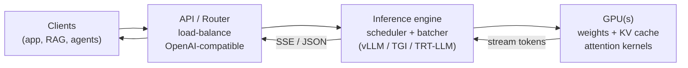
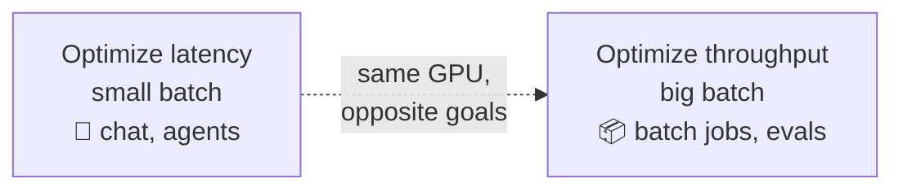

# 🚀 LLM Serving & Inference Optimization

> The discipline of turning a trained model's **weights** into a fast, cheap, high-throughput **API** — squeezing the most tokens per second per GPU dollar without wrecking latency or quality.

These notes are a **reference module** (concept + code + diagrams), not a transcript of one talk. They assume you can already prompt a model ([`../01_prompt-engineering/`](../01_prompt-engineering/README.md)) and know roughly how one is trained/adapted ([`../02_fine-tuning-and-alignment/`](../02_fine-tuning-and-alignment/README.md)). This module is the layer *underneath* every LLM app: the thing that actually runs the model in production and shows up as your cloud bill.

---

## 🗺️ The serving stack

The **engine** is where all the interesting optimization lives — it decides *which requests run together this step*, *where the KV cache goes*, and *how many tokens each request gets to generate*. Everything in this module is about making that box faster and cheaper.

---

## 📓 Lessons

| # | Lesson | What you'll learn |
|---|--------|-------------------|
| 1 | [Inference Basics](01-inference-basics.md) | Prefill vs decode, autoregressive generation, TTFT vs inter-token latency vs throughput |
| 2 | [KV Cache & Memory](02-kv-cache-and-memory.md) | Why the KV cache dominates GPU memory; PagedAttention/vLLM; the memory budget |
| 3 | [Batching & Throughput](03-batching-and-throughput.md) | Static vs dynamic vs continuous (in-flight) batching; the throughput/latency curve |
| 4 | [Quantization](04-quantization.md) | fp16/bf16/int8/int4, PTQ vs QAT, GPTQ vs AWQ vs bitsandbytes NF4 |
| 5 | [Serving Frameworks](05-serving-frameworks.md) | vLLM vs TGI vs TensorRT-LLM vs Ollama vs llama.cpp; OpenAI-compatible serving |
| 6 | [Advanced & Cost](06-advanced-and-cost.md) | Speculative decoding, prefix caching, tensor/pipeline parallelism, autoscaling, $/1M tokens |

---

## ⚡ Latency vs throughput cheat-sheet

The three numbers you will report about any deployment — and they trade off against each other:

| Metric | What it measures | Dominated by | Lower it with |
|--------|------------------|--------------|---------------|
| **TTFT** (time to first token) | Responsiveness — how long until output starts | **Prefill** (compute-bound) | Prefix/prompt caching, chunked prefill, shorter prompts |
| **ITL / TPOT** (inter-token latency) | Smoothness — gap between streamed tokens | **Decode** (memory-bandwidth-bound) | Quantization, speculative decoding, faster GPU memory |
| **Throughput** (tokens/s, req/s) | Efficiency — total work per GPU | **Batch size** | Continuous batching, PagedAttention, tensor parallelism |

> **The core tension:** bigger batches → higher **throughput** (cheaper per token) but higher **per-request latency**. Interactive chat optimizes latency; bulk/offline jobs optimize throughput. You cannot maximize both at once — you pick a point on the curve.

---

## 🔗 Where this connects

- **Before serving:** you [fine-tune / align](../02_fine-tuning-and-alignment/README.md) the model, often with [LoRA / QLoRA](../../Shared/01_lora-qlora/README.md) — QLoRA's NF4 quantization is the same idea as [Lesson 4](04-quantization.md).
- **Around serving:** [MLOps](../../Shared/02_mlops/README.md) owns the deploy/scale/monitor loop; [evals](../16_evals/README.md) tell you if optimization broke quality.
- **On top of serving:** every [RAG app](../18_ragapp/README.md) and agent is a client of this stack — its latency *is* your engine's latency.

---

*Reference notes for personal study. Systems named where relevant (vLLM + PagedAttention — Kwon et al., 2023; FlashAttention — Dao et al., 2022; continuous batching / Orca — Yu et al., 2022; speculative decoding — Leviathan et al., 2023).*
