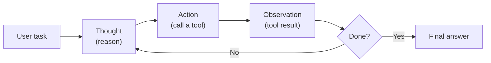
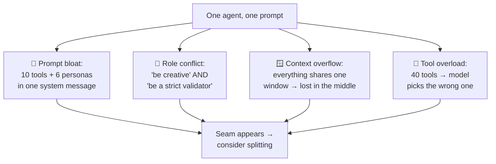
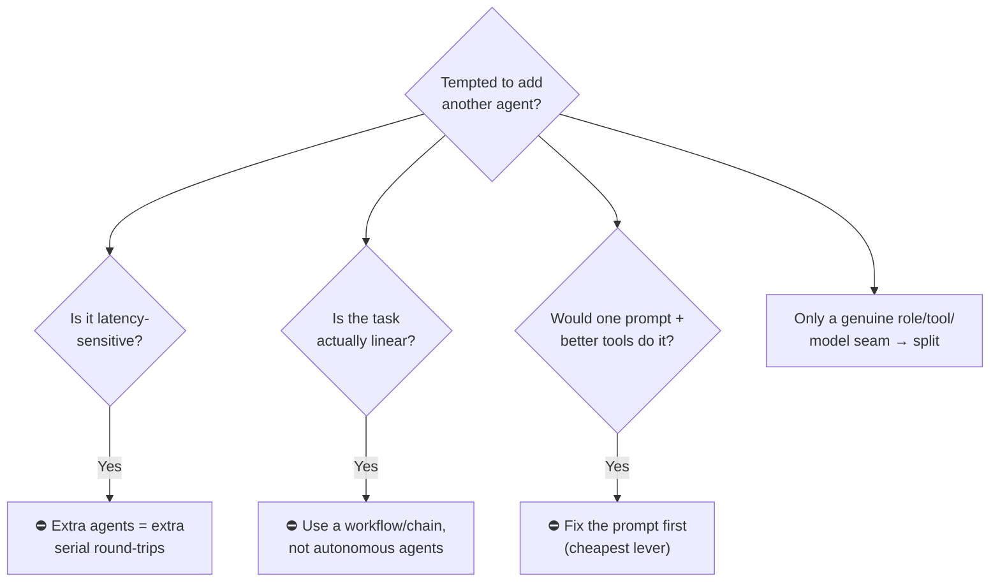
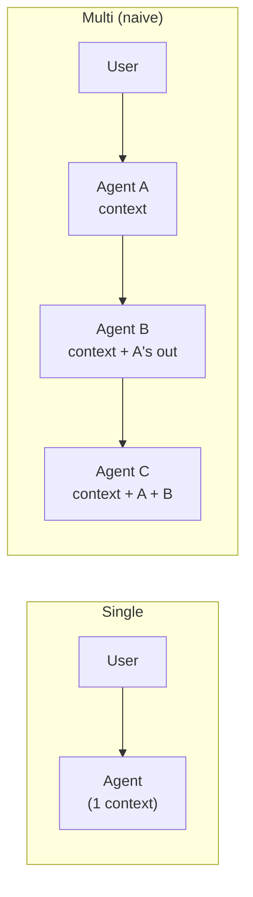

# 1 · Why Multi-Agent?

*Multi-Agent Frameworks module · Lesson 1 of 6 · [← Overview](README.md) · [next → Agent Topologies](02-agent-topologies.md)*

Before you wire up three agents, be honest about the baseline: a **single agent** — one model, one prompt, a loop of tool calls — is astonishingly capable. Multi-agent is not a maturity level you graduate to; it's a **tradeoff** you take on when a task develops real seams. This lesson is the "should I even?" gate for the rest of the module.

---

## 1.1 The single-agent baseline: ReAct

Almost every "agent" is, at heart, a **ReAct** loop — *Reason → Act → Observe*, repeated until done. (Full treatment in [Reasoning Techniques → ReAct](../01_prompt-engineering/04-reasoning-techniques.md#43-react-reason--act).)



One model. One system prompt. A bag of tools. It plans, calls tools, reads results, and keeps going. If this handles your task at acceptable accuracy, **you are finished** — everything below is optional complexity.

```python
# The whole "agent" — one model in a loop (pseudo-idiomatic)
agent = create_react_agent(model, tools=[search, calculator, sql])
result = agent.invoke({"messages": [("user", "Q3 revenue vs Q2, and why?")]})
```

---

## 1.2 Where the single agent breaks down

Multi-agent earns its keep when a *single* prompt/loop starts fighting itself:



Each of these is a **separation-of-concerns** signal. A researcher agent with search tools + a writer agent with a style prompt each have a *smaller, cleaner* job than one agent asked to do both.

---

## 1.3 Single vs multi-agent — the tradeoff

| Dimension | Single agent | Multi-agent |
|-----------|--------------|-------------|
| **Setup complexity** | Low — one prompt, one loop | High — roles, routing, message plumbing |
| **Latency** | 1 chain of turns | N agents × turns each (often serial) |
| **Token cost** | Baseline | 2–10×+ (handoffs re-share context) |
| **Focus per unit** | One prompt juggles everything | Each agent has a tight remit |
| **Failure modes** | Model gets confused | Model confusion **+** routing bugs, loops, dropped state |
| **Debuggability** | One trace | Many traces to stitch together |
| **Specialisation** | Hard (one persona/model) | Easy (per-agent prompt, tools, *and model*) |

The killer feature of multi-agent is that last row: **different models per role** (a cheap model to triage, an expensive one to reason) and **isolated context** per agent, so no single window has to hold the whole world.

---

## 1.4 When NOT to go multi-agent



Concrete anti-patterns:

- **Over-orchestration.** A "supervisor" that just forwards the message to one worker is a middleman tax — collapse it.
- **Chatty debate for simple tasks.** Two agents arguing over "what's 2+2 in context" burns tokens for no accuracy gain (see debate/reflection, [Lesson 2](02-agent-topologies.md)).
- **Autonomy where you want determinism.** If the steps are fixed (fetch → transform → email), that's a **pipeline/workflow**, not a swarm of decision-makers. A LangGraph graph with static edges is safer than agents choosing what to do.
- **Splitting to dodge a prompt problem.** If one agent picks the wrong tool, giving it a friend rarely helps — trim the toolset or sharpen the prompt.

> 💡 A useful heuristic: multi-agent should *remove* net complexity — clearer prompts, smaller contexts, isolated failure — not just relocate it into routing logic. If it doesn't, you've over-engineered.

---

## 1.5 The cost you're signing up for

Every handoff typically **re-serialises context** into the next agent's window. Three agents that each read a growing transcript can quintuple your token bill versus one agent — and that's *before* retries and loops.



We treat the cost-blowup problem head-on in **[Lesson 6 · Patterns & Pitfalls](06-patterns-and-pitfalls.md)** (shared memory vs message passing is the main lever), and how to *measure* whether the extra agents actually paid off in [`../16_evals/`](../16_evals/README.md).

---

## Takeaways

- **Start single.** A ReAct agent (one model + tools in a loop) is the baseline; multi-agent is an optimisation, not a rite of passage.
- **Split on real seams** — distinct roles, tool sets, context needs, or *models* per agent. That separation of concerns is the actual payoff.
- **Multi-agent adds failure modes, latency, and 2–10× tokens.** It must remove more complexity than it introduces, or you've over-engineered.
- **Don't split for linear work** (use a workflow/chain) or to paper over a fixable prompt/tool problem.
- The rest of this module assumes you've passed *this* gate.

➡️ Next: [Agent Topologies](02-agent-topologies.md) — the handful of shapes every framework re-implements.
