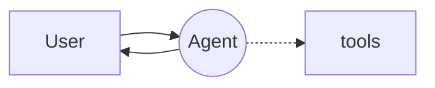
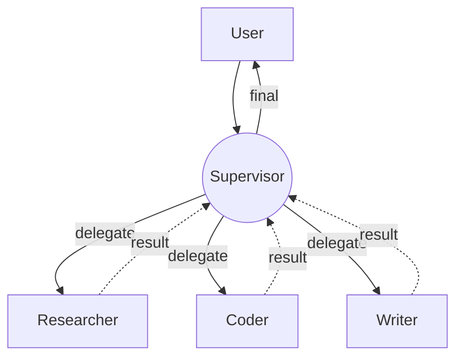
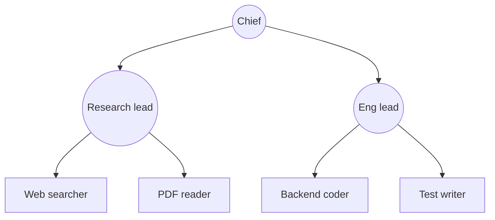
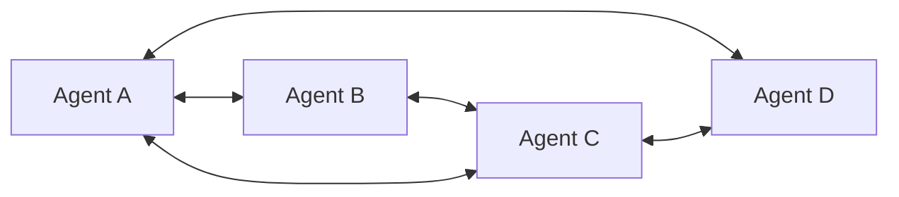
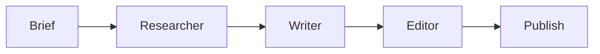
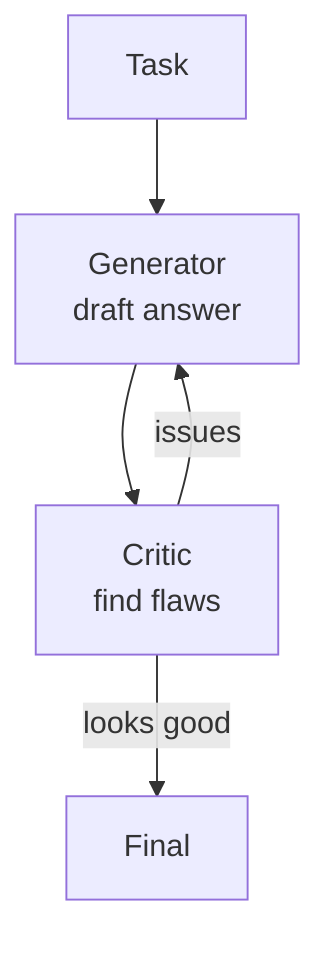
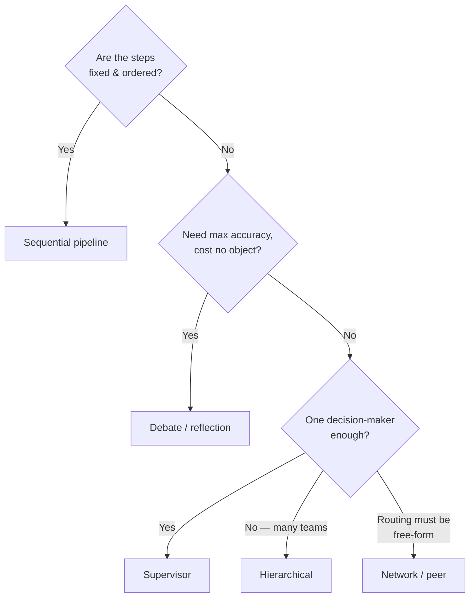

# 2 · Agent Topologies

*Multi-Agent Frameworks module · Lesson 2 of 6 · [← Why Multi-Agent?](01-why-multi-agent.md) · [next → Microsoft AutoGen](03-autogen.md)*

Every framework in this module is really just a way to arrange the same handful of **communication shapes**. Learn the shapes once and AutoGen/CrewAI/Agents SDK/LangGraph become "which shapes does this one make easy?" This lesson gives you a diagram per pattern and a when-to-use table.

---

## 2.1 Single agent (the control)

One agent, one loop ([Lesson 1](01-why-multi-agent.md)). Included so the tables below have a baseline. If this works, don't read further.

---

## 2.2 Supervisor / orchestrator

A central agent owns the plan. It **routes** each step to a worker, collects the result, and decides what's next. Workers don't talk to each other — all coordination flows through the hub.

- **Pros:** clear control flow, one place to log/guard, easy to reason about.
- **Cons:** supervisor is a bottleneck and a single point of failure; risk of the "useless middleman" if it only forwards.
- **Maps to:** LangGraph `create_supervisor`, CrewAI `Process.hierarchical` (manager agent), Agents SDK triage-agent-with-handoffs, AutoGen `GroupChatManager`.

---

## 2.3 Hierarchical (supervisors of supervisors)

Scale the supervisor idea into a **tree**: a top orchestrator delegates to *team leads*, each of whom runs their own sub-crew. Good when the problem itself is hierarchical (a "company" of agents).

- **Pros:** context stays local to each subtree; scales to many workers without one giant prompt.
- **Cons:** deep trees = deep latency and compounding error; hard to debug end-to-end.
- **Maps to:** LangGraph subgraphs-as-nodes, nested CrewAI crews, teams-within-teams in AutoGen 0.4.

---

## 2.4 Network / peer

No hub. Any agent can hand off to any other agent as it sees fit. Maximum flexibility, minimum predictability.

- **Pros:** flexible; emergent routing; no bottleneck node.
- **Cons:** can loop forever, hard to bound cost, hardest to test. Needs a hard turn-limit and good tracing.
- **Maps to:** LangGraph `Command(goto="any_node")`, Agents SDK handoffs where every agent lists every other.

---

## 2.5 Sequential pipeline

A fixed assembly line: output of one stage is the input of the next. Barely "multi-agent" — it's closer to a **workflow** — but it's the most reliable shape.

- **Pros:** deterministic, cheap to reason about, easy to eval stage-by-stage.
- **Cons:** no adaptivity — every input walks the same path; a bad early stage poisons the rest.
- **Maps to:** CrewAI `Process.sequential`, a LangGraph linear graph, AutoGen sequential chats.

> 💡 If your "multi-agent system" is *only* this shape, you probably want a plain workflow/chain, not autonomous agents. Reserve real agents for where a decision has to be made at runtime.

---

## 2.6 Debate / reflection

Multiple agents (or one agent + a critic) **argue or critique** across rounds to improve quality. Two flavours: *debate* (peers with different stances converge) and *reflection* (a generator + a reviewer loop).

- **Lineage:** multi-agent *debate* (Du et al. 2023) and *Reflexion* (Shinn et al. 2023); conceptually the multi-agent cousin of [Self-Consistency](../01_prompt-engineering/04-reasoning-techniques.md#42-self-consistency).
- **Pros:** measurable accuracy gains on reasoning, factuality, and code; catches self-satisfied errors.
- **Cons:** N× cost and latency per round; can converge on a *confidently wrong* consensus; needs a stop condition.
- **Maps to:** AutoGen two-agent chat (assistant ↔ critic), CrewAI reviewer task, LangGraph generator/critic loop with a max-round guard.

---

## 2.7 Choosing a topology

| Topology | Control flow | Cost | Predictability | Use it when… |
|----------|:------------:|:----:|:--------------:|--------------|
| **Single** | one loop | 💲 | ⭐⭐⭐⭐⭐ | one prompt + tools already works |
| **Sequential pipeline** | fixed | 💲💲 | ⭐⭐⭐⭐⭐ | steps are known & ordered (fetch→write→edit) |
| **Supervisor** | hub routes | 💲💲💲 | ⭐⭐⭐⭐ | distinct roles, one decision-maker, need logging |
| **Hierarchical** | tree | 💲💲💲💲 | ⭐⭐⭐ | many workers; problem is itself nested |
| **Network / peer** | any→any | 💲💲💲💲 | ⭐⭐ | routing must be emergent/flexible |
| **Debate / reflection** | loop | 💲💲💲💲💲 | ⭐⭐⭐ | quality/accuracy matters more than cost |

---

## Takeaways

- Frameworks differ mostly in **which topology they make easy** — the shapes themselves are universal.
- **Supervisor** is the pragmatic default for real multi-agent work: one router, clear logging, workers stay simple.
- **Sequential pipeline** is the safest and cheapest — but if that's all you have, question whether you need agents at all.
- **Hierarchical** scales the supervisor to nested teams; **network** trades predictability for flexibility (bound it with turn limits).
- **Debate/reflection** buys accuracy with N× cost — the multi-agent analogue of self-consistency; always give it a stop condition.

➡️ Next: [Microsoft AutoGen](03-autogen.md) — the conversation-first framework where topologies emerge from who-speaks-next.
