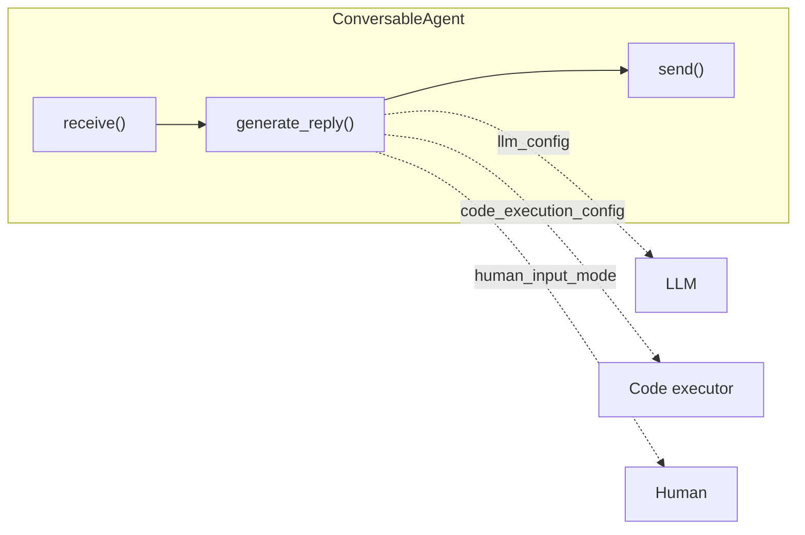
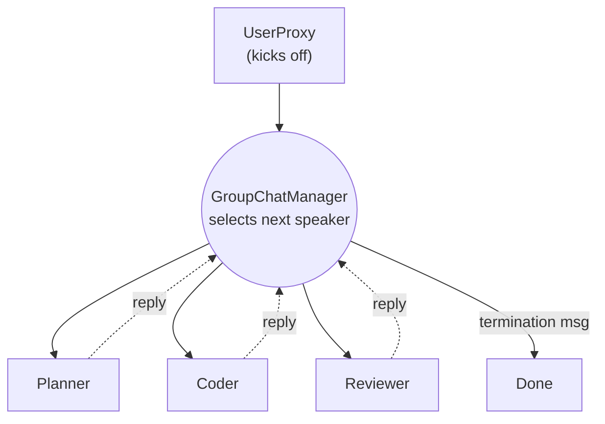

# 3 · Microsoft AutoGen

*Multi-Agent Frameworks module · Lesson 3 of 6 · [← Agent Topologies](02-agent-topologies.md) · [next → CrewAI](04-crewai.md)*

**Microsoft AutoGen** frames multi-agent as a **conversation**. You define agents that can send and receive messages, drop them into a chat, and let them talk until the task is done. Topology ([Lesson 2](02-agent-topologies.md)) is an *emergent* property of *who gets to speak next* — which makes AutoGen feel very natural for code-gen-with-review, brainstorming, and back-and-forth problem solving.

> ⚠️ **Two AutoGens.** The classic API (`autogen` / AutoGen 0.2, also continued as the community **AG2** fork) centres on `ConversableAgent` + `GroupChat`. AutoGen **0.4** is a ground-up async rewrite (`autogen-agentchat`) with `AssistantAgent` and *teams* like `RoundRobinGroupChat` / `SelectorGroupChat`. The mental model is the same; this lesson uses the widely-known classic API and notes the 0.4 equivalents.

---

## 3.1 The core object: `ConversableAgent`

Everything in classic AutoGen is a `ConversableAgent` — an entity that can **send**, **receive**, and **generate** a reply (via LLM, via code execution, or via a human).



Two thin specialisations ship out of the box:

- **`AssistantAgent`** — LLM-backed, no code execution by default; the "thinker."
- **`UserProxyAgent`** — represents the human; can auto-execute code the assistant writes and can pause for human input (`human_input_mode="ALWAYS" | "NEVER" | "TERMINATE"`).

```python
import os
from autogen import AssistantAgent, UserProxyAgent

llm_config = {
    "config_list": [{"model": "gpt-4o", "api_key": os.environ["OPENAI_API_KEY"]}],
    "temperature": 0,
}

assistant = AssistantAgent(
    name="assistant",
    llm_config=llm_config,
    system_message="You are a senior Python engineer. Write correct, minimal code.",
)

user_proxy = UserProxyAgent(
    name="user_proxy",
    human_input_mode="NEVER",                 # fully autonomous
    max_consecutive_auto_reply=5,
    code_execution_config={"work_dir": "coding", "use_docker": False},
    is_termination_msg=lambda m: "TERMINATE" in (m.get("content") or ""),
)

# A two-agent conversation: proxy asks, assistant writes code, proxy runs it, loop.
user_proxy.initiate_chat(
    assistant,
    message="Fetch BTC/USD daily closes for the last 30 days and plot a 7-day moving average.",
)
```

This two-agent loop is already the **reflection/execution** pattern: the assistant proposes code, the `UserProxyAgent` executes it and feeds back stdout/errors, and they iterate until termination.

---

## 3.2 `GroupChat` + `GroupChatManager` (3+ agents)

For more than two participants, you don't hardcode who talks to whom. You put the agents in a **`GroupChat`** and let a **`GroupChatManager`** choose the next speaker each turn.



```python
from autogen import AssistantAgent, UserProxyAgent, GroupChat, GroupChatManager

planner = AssistantAgent("planner", llm_config=llm_config,
    system_message="Break the task into steps. Do not write code.")
coder = AssistantAgent("coder", llm_config=llm_config,
    system_message="Implement the current step in Python. Keep it minimal.")
reviewer = AssistantAgent("reviewer", llm_config=llm_config,
    system_message="Critique the code for bugs/edge cases. Reply APPROVE when correct.")

user_proxy = UserProxyAgent("user_proxy", human_input_mode="NEVER",
    code_execution_config={"work_dir": "out", "use_docker": False})

groupchat = GroupChat(
    agents=[user_proxy, planner, coder, reviewer],
    messages=[],
    max_round=12,
    speaker_selection_method="auto",   # manager's LLM picks; or "round_robin"
)
manager = GroupChatManager(groupchat=groupchat, llm_config=llm_config)

user_proxy.initiate_chat(
    manager,
    message="Build and unit-test a function that parses ISO-8601 durations to seconds.",
)
```

**How the topology emerges:** `speaker_selection_method="auto"` makes the manager an LLM-driven **supervisor** — it reads the transcript and decides who's most relevant next. Switch to `"round_robin"` and you get a fixed rotation (closer to a pipeline). AutoGen 0.4 makes this explicit with `SelectorGroupChat` (LLM picks) vs `RoundRobinGroupChat` (rotate).

---

## 3.3 Tools / function calling

Agents call Python functions you register. In the classic API you register a function's **schema** on the calling (LLM) agent and its **implementation** on the executing agent:

```python
from autogen import register_function

def get_stock_price(ticker: str) -> float:
    """Return the latest close price for a ticker."""
    ...

register_function(
    get_stock_price,
    caller=assistant,        # advertises the tool to the LLM
    executor=user_proxy,     # actually runs it
    name="get_stock_price",
    description="Latest close price for a stock ticker",
)
```

AutoGen predates MCP but plays nicely with it — tools exposed over [MCP](../15_mcp/README.md) can be wrapped as AutoGen functions, so your servers are reusable across frameworks.

---

## 3.4 Strengths & weaknesses

| 👍 Strengths | 👎 Weaknesses |
|-------------|--------------|
| Conversation model is intuitive for iterative tasks (code ↔ review) | Emergent routing can wander, loop, or stall without tight `max_round` |
| First-class **code execution** loop (assistant writes, proxy runs) | Two API generations (0.2/AG2 vs 0.4) — docs and examples diverge |
| `human_input_mode` makes HITL trivial | Cost is hard to predict — LLM-selected speakers = variable turns |
| Research pedigree; strong for agentic experimentation | Less "draw the exact graph" control than [LangGraph](../13_langgraph/README.md) |
| `GroupChat` supports supervisor **and** round-robin out of the box | Termination logic (`is_termination_msg`) is easy to get subtly wrong |

**Reach for AutoGen when** the task is genuinely a *dialogue* — code generation with a reviewer, multi-persona brainstorming, or anything with a natural execute-and-critique rhythm. Reach elsewhere when you need deterministic control flow (LangGraph) or a simple role-and-task list (CrewAI, next).

> 💡 Always set `max_round` (GroupChat) and a real `is_termination_msg`. An AutoGen chat with no stop condition is the classic way to discover the network-topology cost blowup from [Lesson 6](06-patterns-and-pitfalls.md) — on your bill.

---

## Takeaways

- **AutoGen = conversation-first.** Agents are `ConversableAgent`s that send/receive messages; the *topology emerges from who speaks next*.
- **`AssistantAgent` + `UserProxyAgent`** give you the thinker + the executor/human — a two-agent chat is already a reflection loop.
- **`GroupChat` + `GroupChatManager`** scale to 3+ agents; `speaker_selection_method` toggles you between supervisor (`auto`) and pipeline (`round_robin`).
- Know the **0.2/AG2 vs 0.4** split; the concepts carry over (`SelectorGroupChat`/`RoundRobinGroupChat` are the 0.4 teams).
- Its power (emergent dialogue) is also its risk — **bound rounds and define termination** or costs run away.

➡️ Next: [CrewAI](04-crewai.md) — where you stop thinking about messages and start thinking about roles and a task list.
