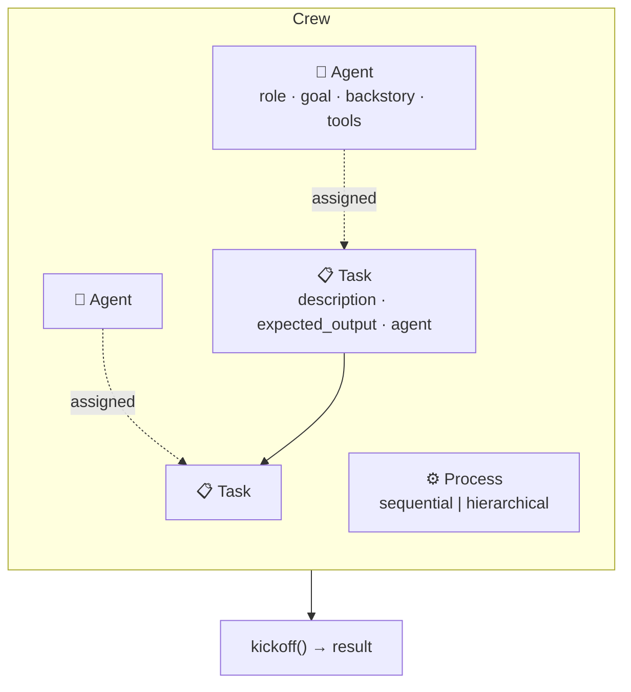
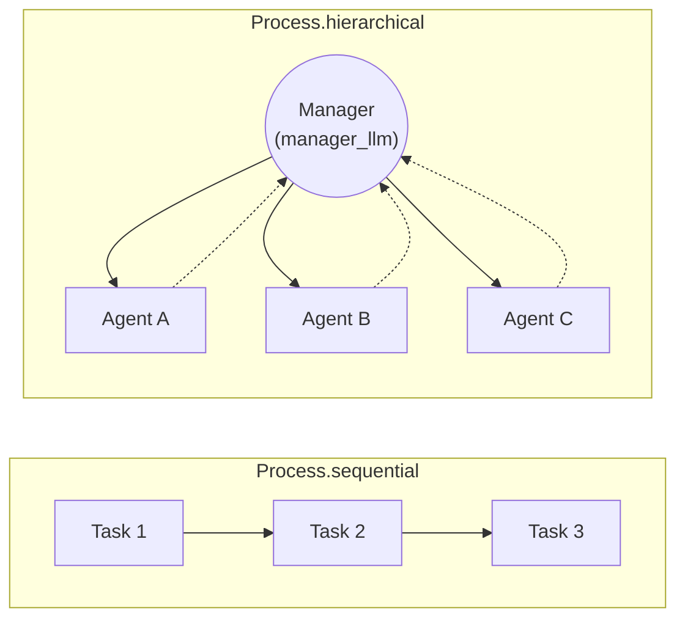
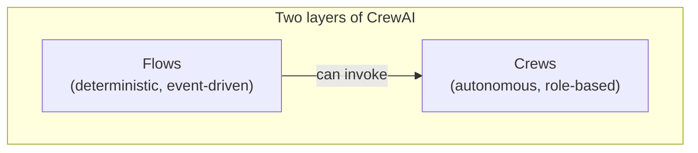

# 4 · CrewAI

*Multi-Agent Frameworks module · Lesson 4 of 6 · [← Microsoft AutoGen](03-autogen.md) · [next → OpenAI Agents SDK](05-openai-agents-sdk.md)*

**CrewAI** asks you to think like a manager staffing a team, not a programmer wiring a graph. You describe **who** (Agents, by role) and **what** (Tasks, with expected outputs), assemble them into a **Crew**, and pick a **Process** for how work flows. The role-based framing makes it the fastest of the four to get a plausible multi-agent system running.

---

## 4.1 The mental model: staff a crew



Four nouns, and that's basically the whole framework:

| Concept | What it is | Key fields |
|---------|-----------|-----------|
| **`Agent`** | A role-playing worker (its own persona + tools + optional LLM) | `role`, `goal`, `backstory`, `tools`, `llm`, `allow_delegation` |
| **`Task`** | A unit of work assigned to an agent | `description`, `expected_output`, `agent`, `context`, `output_pydantic` |
| **`Crew`** | The team + the task list + the process | `agents`, `tasks`, `process`, `manager_llm` |
| **`Process`** | How tasks are executed | `Process.sequential` \| `Process.hierarchical` |

---

## 4.2 A working example (sequential)

A classic research → write crew:

```python
from crewai import Agent, Task, Crew, Process
from crewai_tools import SerperDevTool

search = SerperDevTool()

researcher = Agent(
    role="Senior Research Analyst",
    goal="Find accurate, recent facts about {topic}",
    backstory="You are meticulous and never state a claim you can't source.",
    tools=[search],
    allow_delegation=False,
    verbose=True,
)

writer = Agent(
    role="Tech Content Writer",
    goal="Turn research into a crisp 300-word brief",
    backstory="You write for busy engineers — clear, no fluff.",
    allow_delegation=False,
    verbose=True,
)

research_task = Task(
    description="Research the current state of {topic}. Gather key facts and 3 sources.",
    expected_output="A bulleted fact sheet with sources.",
    agent=researcher,
)

write_task = Task(
    description="Using the research, write a 300-word brief on {topic}.",
    expected_output="A polished 300-word markdown brief.",
    agent=writer,
    context=[research_task],          # feeds research output into this task
)

crew = Crew(
    agents=[researcher, writer],
    tasks=[research_task, write_task],
    process=Process.sequential,
    verbose=True,
)

result = crew.kickoff(inputs={"topic": "small language models on-device"})
print(result.raw)
```

`Process.sequential` runs tasks in list order; `context=[research_task]` is how the writer *sees* the researcher's output. This is the [sequential-pipeline topology](02-agent-topologies.md#25-sequential-pipeline) with roles bolted on.

---

## 4.3 Sequential vs hierarchical process

The `Process` field is the one big lever that changes your topology.



```python
crew = Crew(
    agents=[researcher, writer, editor],
    tasks=[research_task, write_task, edit_task],
    process=Process.hierarchical,
    manager_llm="gpt-4o",          # REQUIRED: the auto-manager that delegates
    verbose=True,
)
```

- **`Process.sequential`** — tasks run top-to-bottom; deterministic; the safe default.
- **`Process.hierarchical`** — CrewAI spins up an automatic **manager agent** (you must supply `manager_llm`, or a custom `manager_agent`) that delegates tasks to workers and validates their output. This is the [supervisor topology](02-agent-topologies.md#22-supervisor--orchestrator).

Delegation between peers is also possible: set `allow_delegation=True` on an agent and it can ask a teammate for help mid-task.

---

## 4.4 Tools, structured output, and Flows

- **Tools** come from `crewai_tools` (search, scrape, file, RAG) or any custom callable; MCP servers ([`../15_mcp/`](../15_mcp/README.md)) can be adapted as CrewAI tools so the same server backs every framework.
- **Structured output:** `Task(output_pydantic=MyModel)` coerces the result into a Pydantic model — handy for feeding downstream code (compare [Structured Output](../01_prompt-engineering/05-structured-output.md) in the prompting module).
- **CrewAI Flows** are a newer, more *deterministic* layer (`@start`, `@listen`, event-driven `@router`) for when you want explicit control-flow around your crews — i.e. when "a crew" isn't structured enough and you're drifting toward what [LangGraph](../13_langgraph/README.md) gives you.



---

## 4.5 Strengths & weaknesses

| 👍 Strengths | 👎 Weaknesses |
|-------------|--------------|
| Fastest to a working prototype — role/goal/backstory is intuitive | Autonomy can mean less precise control than an explicit graph |
| Clean separation of **agents** (who) and **tasks** (what) | Hierarchical process adds an LLM manager = extra cost + a failure point |
| `Process` switch flips pipeline ↔ supervisor with one line | Verbose/"personality" prompts can bloat tokens if you over-write backstories |
| Structured output via Pydantic; growing tool ecosystem | Debugging emergent delegation is harder than a static pipeline |
| **Flows** add determinism when you outgrow pure crews | Younger ecosystem; APIs still moving |

**Reach for CrewAI when** you naturally describe the problem as "I need a team: a researcher, a writer, an editor, and here's their task list." It optimises for *authoring speed* and readability.

> 💡 Keep `backstory`/`goal` tight. They're system-prompt real estate — a paragraph of florid persona per agent multiplies across every turn and quietly inflates cost with no accuracy benefit.

---

## Takeaways

- **CrewAI = role-based staffing.** Define `Agent`s (role/goal/backstory/tools), `Task`s (description/expected_output/agent), assemble a `Crew`, run `kickoff()`.
- **`Process` is the topology switch:** `sequential` = pipeline, `hierarchical` = auto-manager supervisor (needs `manager_llm`).
- **`context=[...]`** is how one task's output flows into the next; `output_pydantic` gives you typed results.
- It trades some control for **authoring speed and readability** — great for prototypes and clearly-role-shaped problems.
- Outgrowing autonomous crews? **Flows** add deterministic, event-driven orchestration before you jump to LangGraph.

➡️ Next: [OpenAI Agents SDK](05-openai-agents-sdk.md) — delegation as an explicit *handoff*, plus built-in guardrails and tracing.
