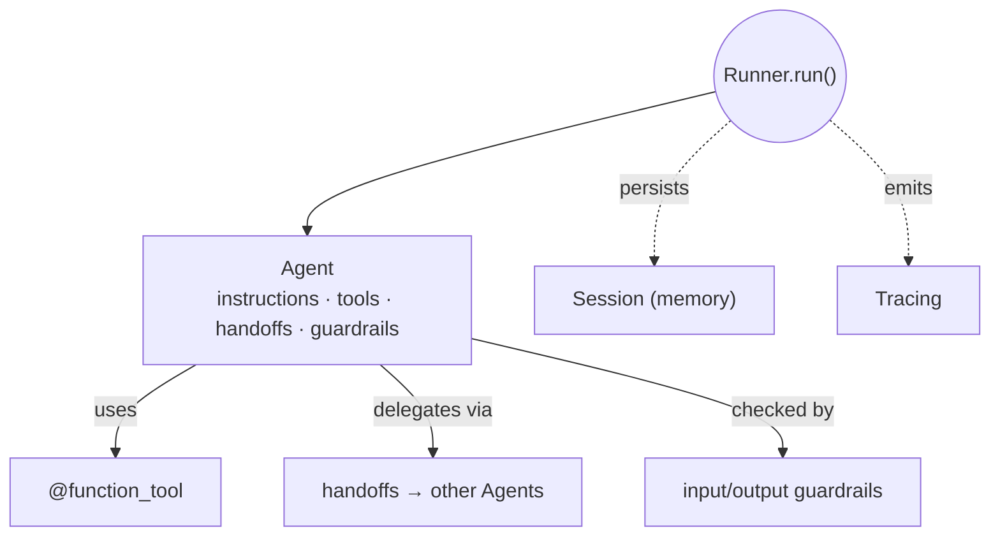
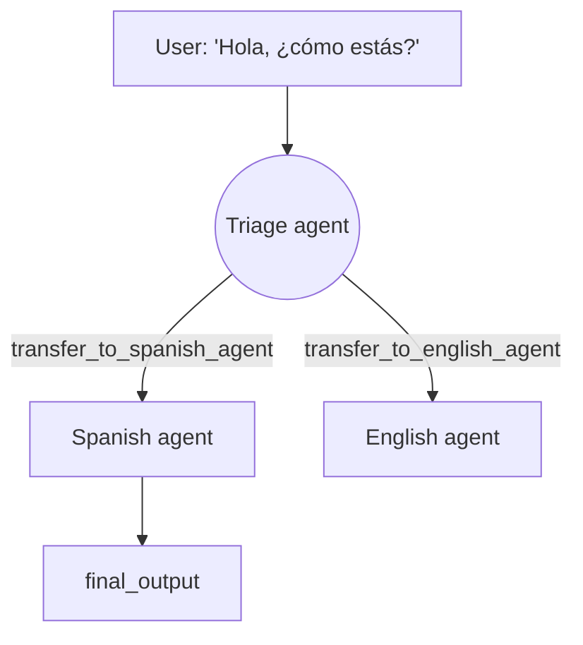
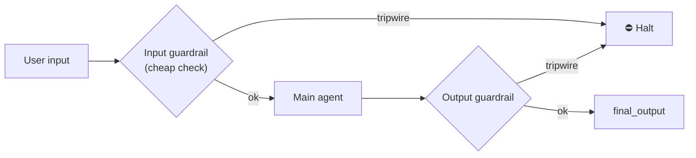

# 5 · OpenAI Agents SDK

*Multi-Agent Frameworks module · Lesson 5 of 6 · [← CrewAI](04-crewai.md) · [next → Patterns & Pitfalls](06-patterns-and-pitfalls.md)*

The **OpenAI Agents SDK** (the production-grade successor to the *Swarm* experiment) is the most minimal of the four. Its whole philosophy: keep primitives few and Python-native. There are really only a handful — **Agent**, **Runner**, **handoffs**, **guardrails**, **sessions**, and **tracing** — and multi-agent behaviour falls out of composing them.

---

## 5.1 The primitives



| Primitive | Role |
|-----------|------|
| **`Agent`** | An LLM + `instructions` + `tools` + `handoffs` + `guardrails` |
| **`Runner`** | The executor — runs the agent loop (`run`, `run_sync`, `run_streamed`) |
| **handoffs** | One agent transfers control to another (this *is* the multi-agent part) |
| **guardrails** | Validate input/output in parallel; trip a tripwire to halt |
| **Sessions** | Automatic conversation memory across runs (e.g. `SQLiteSession`) |
| **Tracing** | Built-in spans for every run/tool/handoff — visible in the OpenAI dashboard |

---

## 5.2 Handoffs = delegation

A **handoff** hands the conversation to another agent. Crucially, the SDK exposes each handoff to the model **as a tool** named `transfer_to_<agent_name>` — so "delegate to the Spanish agent" is just the LLM deciding to call that transfer tool. That's the whole trick: delegation is tool-calling in disguise.



```python
from agents import Agent, Runner

spanish_agent = Agent(
    name="Spanish agent",
    instructions="You only respond in Spanish.",
)
english_agent = Agent(
    name="English agent",
    instructions="You only respond in English.",
)

triage_agent = Agent(
    name="Triage agent",
    instructions="Hand off to the agent matching the language of the request.",
    handoffs=[spanish_agent, english_agent],
)

result = Runner.run_sync(triage_agent, "Hola, ¿cómo estás?")
print(result.final_output)     # -> Spanish reply from the Spanish agent
```

This triage-agent-with-handoffs is the [supervisor topology](02-agent-topologies.md#22-supervisor--orchestrator). Give *every* agent a handoff to every other and you get the [network topology](02-agent-topologies.md#24-network--peer). For a customised transfer (rename it, pass typed data, run an on-handoff callback) use the `handoff()` helper:

```python
from agents import handoff
from pydantic import BaseModel

class EscalationData(BaseModel):
    reason: str

def on_escalate(ctx, data: EscalationData):
    log.warning("Escalated: %s", data.reason)

triage = Agent(
    name="Triage",
    handoffs=[handoff(human_agent, on_handoff=on_escalate, input_type=EscalationData)],
)
```

---

## 5.3 Tools

Any Python function becomes a tool with `@function_tool` — the SDK derives the JSON schema from the signature and docstring:

```python
from agents import Agent, function_tool

@function_tool
def get_weather(city: str) -> str:
    """Return a short weather report for a city."""
    return f"{city}: 22°C, clear"

weather_agent = Agent(
    name="Weather agent",
    instructions="Answer weather questions using the tool.",
    tools=[get_weather],
)
```

Tools can also come from **MCP servers** ([`../15_mcp/`](../15_mcp/README.md)): the SDK can connect to an MCP server and surface its tools to the agent, so the same server backs every framework in this module.

---

## 5.4 Guardrails

Guardrails run **alongside** the agent to validate inputs (and outputs). A guardrail is itself often a small/cheap agent; if it trips a **tripwire**, execution halts before you spend on the expensive model.



```python
from agents import (
    Agent, Runner, GuardrailFunctionOutput, input_guardrail, RunContextWrapper,
)

@input_guardrail
async def no_homework_help(ctx: RunContextWrapper, agent: Agent, user_input: str):
    is_homework = "solve my homework" in user_input.lower()
    return GuardrailFunctionOutput(
        output_info={"is_homework": is_homework},
        tripwire_triggered=is_homework,   # True → run stops with an exception
    )

support = Agent(
    name="Support",
    instructions="Help with product questions only.",
    input_guardrails=[no_homework_help],
)
```

---

## 5.5 Sessions & tracing

- **Sessions** give an agent automatic memory across `Runner.run` calls — no manual transcript stitching:

  ```python
  from agents import SQLiteSession
  session = SQLiteSession("user-123")
  Runner.run_sync(agent, "My name is Nitish.", session=session)
  Runner.run_sync(agent, "What's my name?", session=session)   # remembers
  ```

- **Tracing** is on by default: every run, tool call, handoff, and guardrail becomes a span you can inspect in the OpenAI Traces dashboard (or export to third-party processors). This matters enormously for multi-agent, where the hardest problem is *"which agent did what, and why did it loop?"* — see [Lesson 6](06-patterns-and-pitfalls.md) and [`../16_evals/`](../16_evals/README.md).

---

## 5.6 Strengths & weaknesses

| 👍 Strengths | 👎 Weaknesses |
|-------------|--------------|
| Tiny, Python-native surface — very fast to learn | Fewer primitives = you build complex orchestration yourself |
| Handoffs are an elegant, LLM-legible delegation model | Best-in-class experience is **OpenAI-centric** (though model-agnostic-capable) |
| **Guardrails + tracing built in** — production concerns first-class | Less prescriptive than CrewAI's roles/tasks scaffolding |
| Sessions remove manual memory plumbing | Younger than the LangChain ecosystem around [LangGraph](../13_langgraph/README.md) |
| Provider-flexible via the Chat Completions / Responses interface | Graph-level control (branching, checkpointing) is not the focus |

**Reach for the Agents SDK when** you want a lightweight, OpenAI-first path with delegation, safety, and observability out of the box — and you don't need the explicit graph control that LangGraph provides.

> 💡 Handoffs vs sub-agents-as-tools: a **handoff** transfers the *whole* conversation (the new agent takes over), whereas wrapping an agent as a *tool* gets you a single answer back and control stays with the caller. Use handoffs for "you take it from here," tools for "go compute this and report back."

---

## Takeaways

- **Agents SDK = minimal primitives:** `Agent` + `Runner`, with `handoffs`, `guardrails`, `sessions`, and `tracing` layered on.
- **Handoffs implement delegation** and are shown to the model as `transfer_to_<agent>` tools — supervisor and network topologies both fall out of how you wire them.
- **`@function_tool`** turns any function into a tool; MCP servers plug in as tool sources.
- **Guardrails** run in parallel and trip a tripwire to halt early; **sessions** handle memory; **tracing** is on by default — the production trio.
- Choose it for a **lean, OpenAI-centric** stack; choose LangGraph when you need to *draw* the control flow.

➡️ Next: [Patterns & Pitfalls](06-patterns-and-pitfalls.md) — memory vs messaging, cost blowups, evaluating agents, and where MCP + A2A fit.
