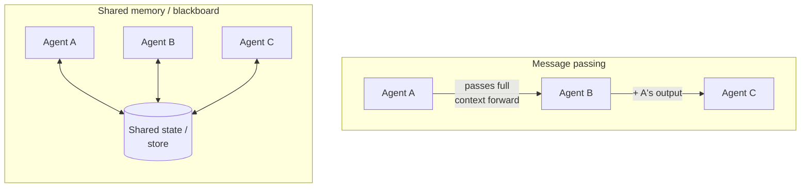
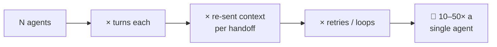
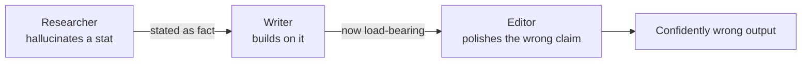
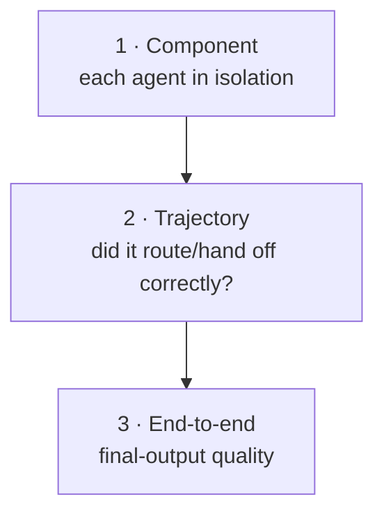
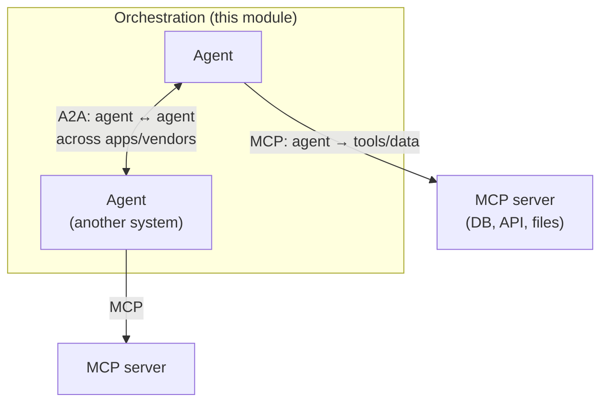
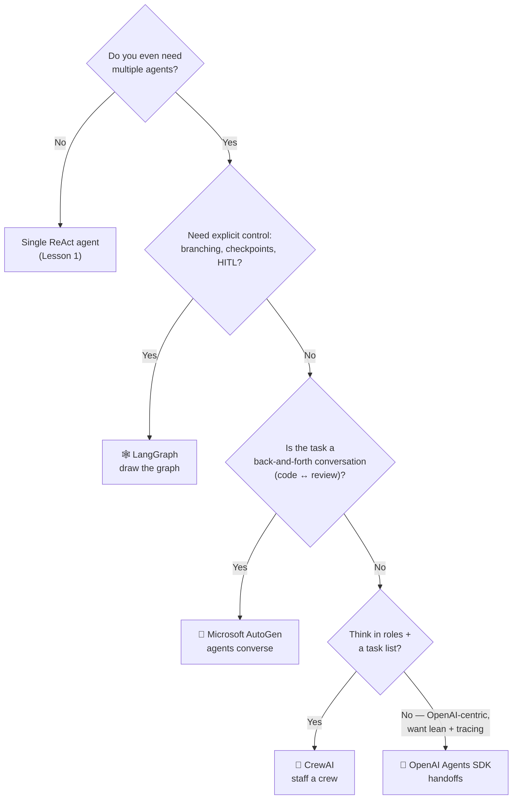

# 6 · Patterns & Pitfalls

*Multi-Agent Frameworks module · Lesson 6 of 6 · [← OpenAI Agents SDK](05-openai-agents-sdk.md) · [next → module complete](README.md)*

You know the topologies ([Lesson 2](02-agent-topologies.md)) and the four frameworks ([3](03-autogen.md)/[4](04-crewai.md)/[5](05-openai-agents-sdk.md)). This lesson is the hard-won middle: how agents *share information*, why costs explode, how errors propagate, how to actually **evaluate** a multi-agent system, and where [MCP](../15_mcp/README.md) and [A2A](../09_a2a-protocol/README.md) fit as the plumbing. It ends with a decision diagram for picking a framework.

---

## 6.1 Shared memory vs message passing

The single biggest architectural choice — and the biggest cost lever.

| | Message passing | Shared memory (blackboard) |
|---|-----------------|----------------------------|
| **How** | Each handoff forwards a transcript | Agents read/write a common store |
| **Token cost** | Grows every hop (context re-sent) | Agents fetch only what they need |
| **Coupling** | Loose — agents just need the message | Tighter — a shared schema/contract |
| **Debug** | Follow the message chain | Inspect store snapshots |
| **Framework fit** | AutoGen chats, Agents SDK handoffs | LangGraph `State`, CrewAI task `context`, external vector/KV store |

**Rule:** if agents keep re-sending the same growing history, switch to shared state and pass **references/summaries**, not the whole transcript. This is the #1 fix for the [cost blowup in Lesson 1](01-why-multi-agent.md#15-the-cost-youre-signing-up-for).

---

## 6.2 Orchestration cost blowup

Costs compound *multiplicatively*, and it sneaks up on you:

Mitigations, in order of impact:

- **Fewer agents.** Every agent removed is a guaranteed saving. Collapse pass-through supervisors.
- **Cheap models for cheap roles.** Triage/routing/guardrails on a small model; reserve the frontier model for the hard reasoning agent.
- **Summarise on handoff.** Pass a compacted state, not the raw transcript.
- **Hard turn/round limits.** `max_round` (AutoGen), recursion limits (LangGraph), `max_turns` (Agents SDK). No limit = no ceiling on your bill.
- **Cache** stable context (system prompts, shared docs) where the provider supports prompt caching.

---

## 6.3 Error propagation

In a chain of agents, an early mistake doesn't stay local — it becomes an authoritative-looking *input* for everyone downstream.

Defences:

- **Validation gates between stages** — a guardrail/critic agent ([reflection](02-agent-topologies.md#26-debate--reflection)) that can send work back.
- **Typed contracts** — Pydantic outputs (CrewAI `output_pydantic`, Agents SDK `output_type`) so a stage fails loudly on malformed input rather than passing garbage.
- **Provenance** — make agents cite sources; downstream agents (and evals) can check them.
- **Isolate blast radius** — subgraphs/sub-crews so a failure is contained and retryable, not fatal to the whole run.

> 💡 The debate/reflection topology is partly an error-propagation *defence*: a critic exists precisely to stop a bad intermediate result from becoming everyone's premise.

---

## 6.4 Evaluating multi-agent systems

You can't improve what you can't measure — and multi-agent has *more* to measure. Evaluate at **three levels** (full methodology in [`../16_evals/`](../16_evals/README.md)):

| Level | Question | How |
|-------|----------|-----|
| **Component** | Is each agent good at its one job? | Per-agent eval sets; [LLM-as-judge](../16_evals/05-eval-methods-llm-as-judge.md) on that agent's output |
| **Trajectory** | Did the *right* agents run in the *right* order? Any loops? | Assert on traces/handoff sequences; check turn counts |
| **End-to-end** | Is the final answer correct/useful/cheap enough? | Task-level judge + track **cost & latency** as first-class metrics |

Multi-agent-specific things to watch: **handoff accuracy** (did triage pick the right specialist?), **loop detection** (same two agents ping-ponging), and **cost per successful task** (not just per call). Tracing ([Agents SDK](05-openai-agents-sdk.md#55-sessions--tracing), LangSmith for [LangGraph](../13_langgraph/README.md)) is what makes trajectory eval possible at all.

---

## 6.5 Where MCP and A2A fit

Frameworks orchestrate agents; they don't define how agents reach **tools** or talk to **agents in other systems**. Two open protocols fill those gaps — think of them as different layers:

| Layer | Protocol | Answers | Notes link |
|-------|----------|---------|-----------|
| **Tool / data** | **MCP** (Model Context Protocol) | "How does an agent call a tool or read a resource?" | [`../15_mcp/`](../15_mcp/README.md) |
| **Agent interop** | **A2A** (Agent-to-Agent) | "How do two *independent* agents discover and delegate to each other?" | [`../09_a2a-protocol/`](../09_a2a-protocol/README.md) |

The clean mental model: **MCP is vertical** (agent reaches *down* to tools/data), **A2A is horizontal** (agent reaches *across* to peer agents). All four frameworks in this module can consume MCP tools today; A2A is the emerging standard so a CrewAI crew and an Agents-SDK agent from different vendors can collaborate without a bespoke integration.

---

## 6.6 Choosing a framework

| If you value… | Pick |
|---------------|------|
| Maximum control over control-flow, state, persistence, HITL | **[LangGraph](../13_langgraph/README.md)** |
| Natural dialogue / execute-and-critique loops | **[AutoGen](03-autogen.md)** |
| Fastest role-based authoring | **[CrewAI](04-crewai.md)** |
| Lean primitives + built-in guardrails & tracing (OpenAI-first) | **[OpenAI Agents SDK](05-openai-agents-sdk.md)** |

These aren't exclusive: it's common to run one framework for orchestration while every agent pulls tools over MCP, and increasingly to bridge across frameworks over A2A.

---

## Takeaways

- **Shared memory vs message passing** is the core design (and cost) decision — pass references/summaries via shared state, not ever-growing transcripts.
- **Costs compound multiplicatively** (agents × turns × context × retries); cut agents, use cheap models for cheap roles, summarise handoffs, and cap turns.
- **Errors propagate** downstream as load-bearing "facts" — defend with validation gates, typed contracts, provenance, and blast-radius isolation.
- **Evaluate at three levels** — component, trajectory, end-to-end — and treat cost & latency as first-class metrics ([`../16_evals/`](../16_evals/README.md)). Tracing makes trajectory eval possible.
- **MCP is vertical** (agent → tools/data), **A2A is horizontal** (agent ↔ agent). Frameworks orchestrate; protocols connect.
- **Framework choice:** LangGraph for control, AutoGen for conversation, CrewAI for roles, Agents SDK for lean OpenAI-first delegation — and only *after* you've confirmed one agent isn't enough.

⬅️ Back to the [module index](README.md).
