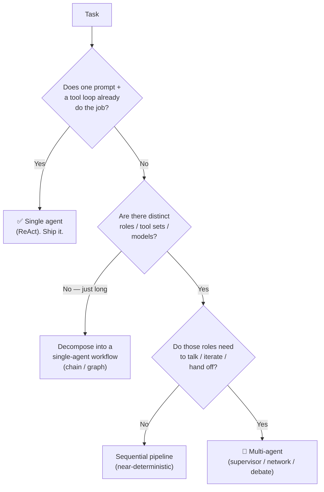
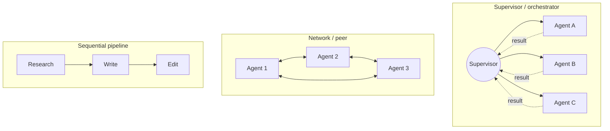

# 🤝 Multi-Agent Frameworks

> The discipline of splitting a hard task across **several specialised agents** that coordinate — instead of cramming everything into one prompt/loop. The upgrade you reach for *after* a single [ReAct](../01_prompt-engineering/04-reasoning-techniques.md) agent stops scaling, and often *before* you actually need it.

These notes are a **reference module** (concept + code + diagrams), not a transcript of one playlist. They assume you've built at least one single-graph agent — see [`../13_langgraph/`](../13_langgraph/README.md) — and know how tools reach an agent ([`../15_mcp/`](../15_mcp/README.md)) and how you'd measure whether any of this works ([`../16_evals/`](../16_evals/README.md)).

---

## 🗺️ Single agent vs multi-agent — is it even worth it?

One capable model in a tool loop solves a *surprising* amount. Multi-agent buys you **separation of concerns** (distinct roles, prompts, tools, and even models per agent) at the cost of **latency, tokens, and coordination bugs**. The honest default is: *start single, split only when a real seam appears.*

**Golden rule:** every extra agent is another failure mode and another LLM bill. Add one only when it removes more complexity than it adds.

---

## 🕸️ The common topologies at a glance

Full breakdown (hierarchical, debate/reflection, plus when-to-use) lives in **[Lesson 2 · Agent Topologies](02-agent-topologies.md)**.

---

## 📓 Lessons

| # | Lesson | What you'll learn |
|---|--------|-------------------|
| 1 | [Why Multi-Agent?](01-why-multi-agent.md) | Single vs multi tradeoffs; the ReAct baseline; when NOT to split |
| 2 | [Agent Topologies](02-agent-topologies.md) | Supervisor, hierarchical, network, pipeline, debate — a diagram each |
| 3 | [Microsoft AutoGen](03-autogen.md) | `ConversableAgent`, `GroupChat`, `GroupChatManager`; conversation-first |
| 4 | [CrewAI](04-crewai.md) | `Agent` / `Task` / `Crew` / `Process`; role-based mental model |
| 5 | [OpenAI Agents SDK](05-openai-agents-sdk.md) | `Agent` / `Runner` / handoffs / guardrails / sessions & tracing |
| 6 | [Patterns & Pitfalls](06-patterns-and-pitfalls.md) | Memory vs messaging, cost blowup, eval, MCP + A2A as the plumbing |

---

## ⚡ Framework cheat-sheet

| Framework | Core abstraction | Coordination model | Reach for it when… |
|-----------|------------------|--------------------|--------------------|
| **[LangGraph](../13_langgraph/README.md)** (multi-agent) | Graph of nodes + shared `State` | Explicit edges / `Command(goto=…)` / `create_supervisor` | You want **full control** of control-flow, state, checkpointing, HITL |
| **Microsoft AutoGen** | `ConversableAgent` in a `GroupChat` | Agents **converse**; a manager picks the next speaker | The task is naturally a **conversation** (code-gen ↔ review, brainstorming) |
| **CrewAI** | `Agent` + `Task` + `Crew` | `Process.sequential` / `hierarchical` over tasks | You think in **roles & a task list** ("a crew for X") and want fast setup |
| **OpenAI Agents SDK** | `Agent` + `Runner` + `handoffs` | **Handoff** = one agent transfers control to another | You're OpenAI-centric and want **lightweight** delegation + built-in tracing |

Rule of thumb: **LangGraph** = you draw the wiring; **AutoGen** = agents chat it out; **CrewAI** = you staff a team; **Agents SDK** = agents pass the baton. All four sit on top of the same tool layer ([MCP](../15_mcp/README.md)) and increasingly the same cross-app interop layer ([A2A](../09_a2a-protocol/README.md)).

---

*Reference notes for personal study. Frameworks named accurately: Microsoft AutoGen, CrewAI, OpenAI Agents SDK, LangGraph. Patterns cite their lineage where relevant (ReAct — Yao et al. 2022; multi-agent debate — Du et al. 2023; Reflexion — Shinn et al. 2023).*
