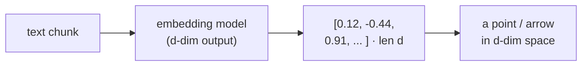
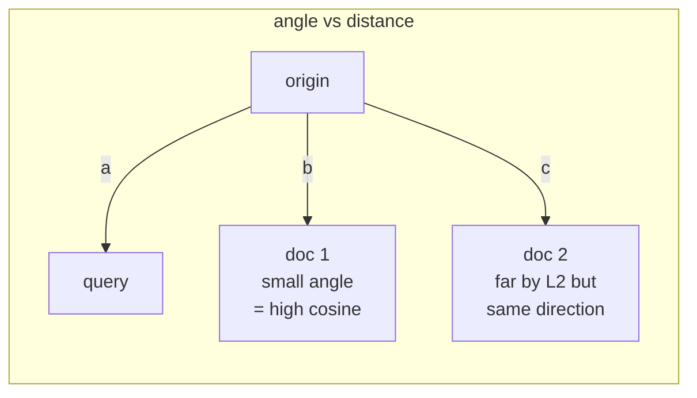

# 1 · Embeddings & Similarity

*Vector Databases module · Lesson 1 of 6 · [← Overview](README.md) · [next → ANN Algorithms](02-ann-algorithms.md)*

Everything a vector database does rests on one idea: **meaning becomes geometry**. An embedding model maps text (or images, audio, code) into a fixed-length vector so that *semantically similar things land close together* in that space. "Search" then reduces to "find the nearest points." This lesson nails down what "near" actually means — because the distance metric you pick silently determines your results.

> The *what-is-an-embedding* intuition (the movie-recommender story, false positives/negatives of keyword matching) is covered in [`../12_rag/04_vector-stores.md`](../12_rag/04_vector-stores.md). Here we go one level down into the **math of similarity**.

---

## 1.1 A vector is just a point in ℝⁿ

An embedding is an array of `d` floats — `d` is the **dimensionality** (384 for `all-MiniLM-L6-v2`, 768 for BERT-base, 1536 for OpenAI `text-embedding-3-small`, 3072 for `text-embedding-3-large`). Two things matter about that array:

- **Direction** — *where* it points. This encodes the semantic content ("is this about cricket or cooking?").
- **Magnitude** — *how long* it is. Often (not always) tied to token count / confidence, and usually the part you do **not** want to compare on.



Because we care about *meaning* (direction) more than *length* (magnitude), the most common similarity measure ignores magnitude entirely: **cosine**.

---

## 1.2 The three metrics you'll actually meet

| Metric | Formula | Range | Bigger = | Sensitive to length? |
|--------|---------|-------|----------|----------------------|
| **Cosine similarity** | `a·b / (‖a‖‖b‖)` | −1 … 1 | more similar | **No** (angle only) |
| **Dot product** (inner product) | `a·b` | −∞ … ∞ | more similar | **Yes** |
| **Euclidean (L2)** | `‖a − b‖` | 0 … ∞ | **less** similar | Yes |

They are not independent. The key identity every practitioner should know:

> **On normalized vectors (‖a‖ = ‖b‖ = 1), cosine, dot product, and (squared) Euclidean all rank neighbours identically.**

That's because `‖a − b‖² = ‖a‖² + ‖b‖² − 2(a·b) = 2 − 2·cos(a,b)` when both are unit length. So minimizing L2 = maximizing dot = maximizing cosine. This is *why* so many pipelines normalize once and then let the index use the cheapest metric (dot product / inner product) internally.



**Geometric intuition:** doc 2 above may be *far* from the query by straight-line (L2) distance simply because it's a longer vector, yet point in almost the same *direction*. Cosine calls it a great match; raw L2 penalizes it for its length. That single difference is why picking the wrong metric quietly wrecks recall.

---

## 1.3 When to use which

| Use… | When | Notes |
|------|------|-------|
| **Cosine** | Default for text/sentence embeddings | Length-invariant; matches how most encoders are trained |
| **Dot product** | Embeddings trained *for* inner product (e.g. many retrieval/DPR models); or after you've normalized | Fastest; but on **un-normalized** vectors it rewards long vectors — can bias toward verbose chunks |
| **Euclidean (L2)** | Image features, some clustering, when magnitude is meaningful | Rarely the right call for raw text embeddings |

Two hard rules:

1. **Use the metric the embedding model was trained with.** Model cards say this. OpenAI, Cohere, and most sentence-transformers → cosine (or dot on normalized vectors). Guessing here silently degrades quality.
2. **Query and index must use the same metric.** Mixing cosine-at-index with L2-at-query returns nonsense.

---

## 1.4 Normalization: the one preprocessing step

Normalizing means scaling every vector to unit length (`v / ‖v‖`). Do it and you get to use fast **inner-product** indexes while still getting **cosine** semantics — the best of both.

```python
import numpy as np

def normalize(v: np.ndarray) -> np.ndarray:
    """L2-normalize a single vector or a batch (rows)."""
    v = np.asarray(v, dtype=np.float32)
    norm = np.linalg.norm(v, axis=-1, keepdims=True)
    return v / np.clip(norm, 1e-12, None)   # avoid divide-by-zero
```

Most vector DBs will normalize for you if you declare the metric as `Cosine` (Qdrant), `cosine` (pgvector's `vector_cosine_ops`), or `IP` on pre-normalized data (FAISS). But if you build a raw FAISS `IndexFlatIP` yourself, **you** must normalize both sides.

---

## 1.5 Cosine similarity from scratch (numpy)

The whole game in ~10 lines — this is exactly what a brute-force ("flat") index does, before any ANN cleverness:

```python
import numpy as np

def cosine_sim(a: np.ndarray, b: np.ndarray) -> np.ndarray:
    a = a / np.linalg.norm(a, axis=-1, keepdims=True)
    b = b / np.linalg.norm(b, axis=-1, keepdims=True)
    return a @ b.T                       # dot of unit vectors == cosine

# a tiny corpus of 3-dim "embeddings"
docs = np.array([
    [0.90, 0.10, 0.00],   # 0: about cricket
    [0.85, 0.15, 0.05],   # 1: also cricket
    [0.05, 0.10, 0.95],   # 2: about cooking
], dtype=np.float32)
labels = ["cricket A", "cricket B", "cooking"]

query = np.array([0.88, 0.12, 0.02], dtype=np.float32)   # a cricket query

scores = cosine_sim(query[None, :], docs)[0]             # shape (3,)
order  = np.argsort(-scores)                             # descending
for i in order:
    print(f"{labels[i]:<10} cos={scores[i]:.3f}")
# cricket A  cos=1.000
# cricket B  cos=0.999
# cooking    cos=0.170
```

This is **O(N·d)** per query: every one of `N` documents is touched. Fine for 3 vectors, fine for ~10k–100k vectors, catastrophic at 10M+. Lesson 2 is entirely about escaping that linear scan.

---

## 1.6 Takeaways

- An embedding turns meaning into a point in `d`-dimensional space; **direction encodes meaning, magnitude usually doesn't** — which is why cosine is the text default.
- **On unit-length vectors, cosine ≈ dot ≈ L2 for ranking** — so normalize once and let the index use fast inner product.
- Pick the metric your **embedding model was trained on**, and use the **same metric at index and query time**; mismatches silently ruin recall.
- Brute-force cosine (`query @ docs.T`) is `O(N·d)` per query — correct but unscalable. That linear cost is the problem [ANN algorithms](02-ann-algorithms.md) exist to solve.

➡️ Next: [ANN Algorithms](02-ann-algorithms.md) — HNSW, IVF, and Product Quantization, and the recall/latency trade you make to beat `O(N)`.
