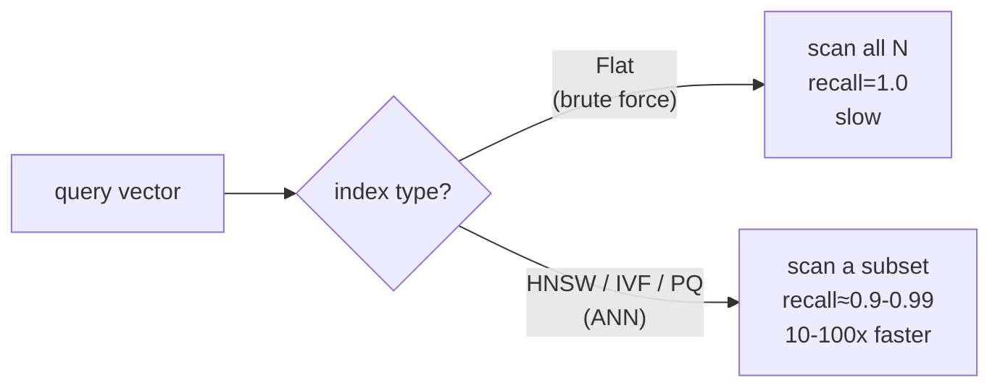
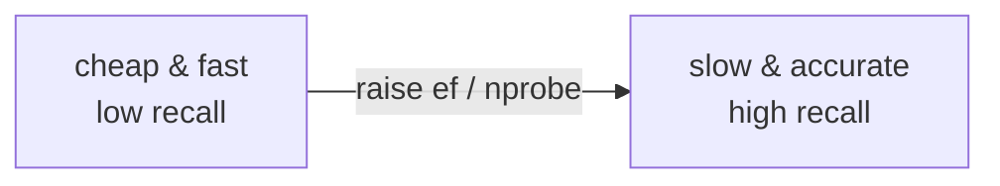
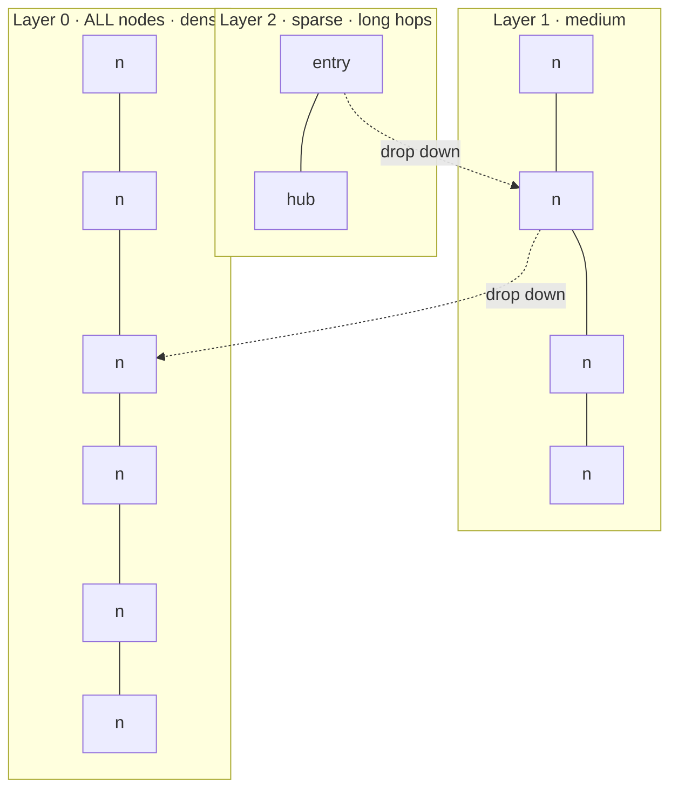
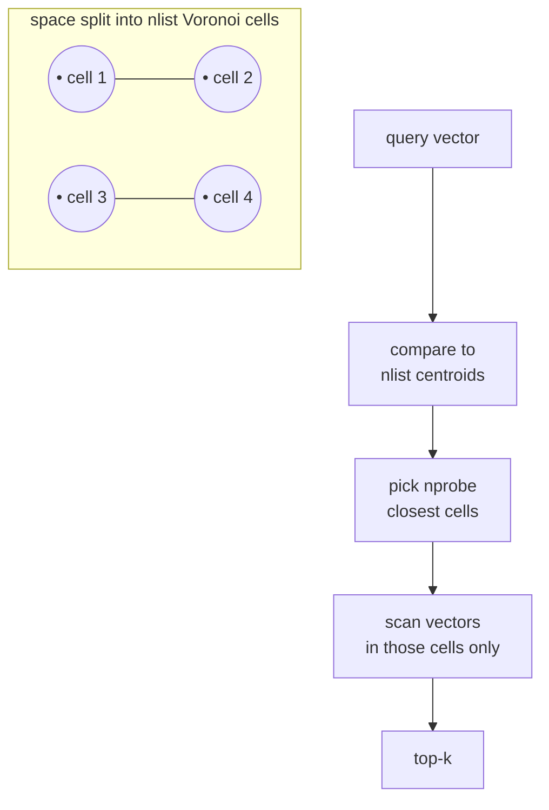
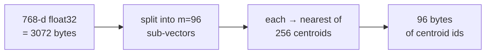

# 2 · ANN Algorithms

*Vector Databases module · Lesson 2 of 6 · [← Embeddings & Similarity](01-embeddings-and-similarity.md) · [next → Indexing & Tradeoffs](03-indexing-and-tradeoffs.md)*

Brute-force kNN (Lesson 1) is exact but `O(N·d)` per query — at 10M × 768-dim that's ~7.7B multiply-adds *per query*. **Approximate Nearest Neighbour (ANN)** search buys back the speed by agreeing to be *almost always right* instead of *always right*. This lesson covers the three algorithms that power essentially every production vector DB: **HNSW**, **IVF**, and **Product Quantization**.

---

## 2.1 Exact kNN vs ANN, and the metric that matters

**Exact kNN** guarantees the true `k` nearest neighbours. **ANN** returns `k` neighbours that are *probably* the true ones. The quality knob is **recall@k**:

```text
recall@k = |returned top-k ∩ true top-k| / k
```

recall@10 = 0.95 means: on average, 9.5 of the 10 results you got back were genuinely in the true top-10. For most retrieval/RAG use cases, **0.9–0.99 recall is indistinguishable from exact** to the end user — because the embedding model itself is fuzzy, and the LLM re-reads the chunks anyway.



### The recall / latency (/ memory) trade

Every ANN index exposes at least one knob that slides along this curve. Push it one way → higher recall, slower + more memory. Push the other → blazing fast, lower recall.



You never get "fast + accurate + tiny" all at once — that's the triangle we formalize in [Lesson 3](03-indexing-and-tradeoffs.md).

---

## 2.2 HNSW — Hierarchical Navigable Small World *(the graph)*

HNSW *(Malkov & Yashunin, 2016)* is the most popular ANN index — it's the default in Qdrant, Weaviate, Milvus, pgvector (`hnsw`), and Elastic. It's a **multi-layer proximity graph** you navigate greedily.

**The idea:** build a graph where each vector is a node connected to its near neighbours. Add *layers* like a skip-list: the top layer has very few nodes with long-range links (express highways), lower layers get denser (local streets), and the bottom layer holds every node. Search starts at the top, greedily hops toward the query, then drops a layer and refines.



**Search path:** enter at the top layer → greedily move to the neighbour closest to the query → when you can't get closer, descend one layer → repeat → at layer 0 do a wider best-first search keeping a candidate list of size `ef`.

### The two parameters that define an HNSW index

| Param | Set at | Controls | Higher = |
|-------|--------|----------|----------|
| **M** | build | max neighbours per node (graph degree) | denser graph → better recall, **more memory**, slower build |
| **ef_construction** | build | candidate list size *while building* | better-quality graph, slower build |
| **ef_search** (`ef`) | **query** | candidate list size *while searching* | higher recall, higher latency |

The magic of `ef_search`: it's a **query-time** knob. You build the graph once, then dial recall vs latency *per query* without rebuilding. Typical values: `M` = 16–64, `ef_construction` = 100–400, `ef_search` = 50–400.

- **Strengths:** excellent recall at low latency; graph is incrementally updatable (add nodes without full rebuild); query-time recall control.
- **Weaknesses:** **memory-hungry** — the full graph + full vectors sit in RAM (roughly `1.1 × N × (d×4 + M×8)` bytes); slow, non-trivial deletes (usually tombstoned then rebuilt).

---

## 2.3 IVF — Inverted File Index *(partitions)*

IVF is the "cluster first, search one cluster" idea from [`../12_rag/04_vector-stores.md`](../12_rag/04_vector-stores.md), made rigorous. It's a **coarse quantizer**: run k-means to split the space into `nlist` cells (Voronoi partitions), each with a centroid. At query time, find the closest few centroids and search **only those cells**.



### The two IVF parameters

| Param | Set at | Controls | Higher = |
|-------|--------|----------|----------|
| **nlist** | build | number of cells (centroids) | finer partitions; rule of thumb `nlist ≈ √N` to `4√N` |
| **nprobe** | **query** | how many cells to actually search | higher recall, higher latency |

`nprobe = 1` searches one cell (fast, can miss neighbours sitting just across a cell boundary — the classic IVF failure mode). `nprobe = nlist` degenerates to brute force. Like `ef_search`, `nprobe` is a query-time recall dial.

- **Strengths:** fast, memory-lighter than HNSW, great when combined with PQ (below); training is quick.
- **Weaknesses:** needs a **training step** (k-means over a sample) before you can add vectors; boundary effect hurts recall at low `nprobe`; recall plateaus below HNSW at the same speed on hard datasets.

---

## 2.4 Product Quantization (PQ) — *compression*

HNSW and IVF speed up *which* vectors you compare. **PQ** *(Jégou et al., 2011)* shrinks *how big each vector is*, so you can hold far more in RAM and compare them faster.

**The trick:** split each `d`-dim vector into `m` sub-vectors; run k-means (usually 256 centroids → 1 byte) on each sub-space; store each sub-vector as the **id of its nearest centroid**. A 768-dim float32 vector (3072 bytes) with `m=96, 8-bit` codes becomes **96 bytes** — a ~32× compression.



Distances are then computed **approximately** from precomputed centroid-distance tables (Asymmetric Distance Computation) — fast and cache-friendly. The cost is a further recall hit from lossy compression, usually clawed back with a **rerank** step: retrieve more candidates with PQ, then re-score the top few with full-precision vectors.

**IVF-PQ** = partition with IVF, compress residuals with PQ. This is the workhorse for **billion-scale** indexes where full vectors simply won't fit in memory. **ScaNN** *(Guo et al., 2020)* refines the same family with an anisotropic quantization loss and is Google's very fast variant.

---

## 2.5 Putting them side by side

| Index | Idea | Recall | Speed | Memory | Build | Best for |
|-------|------|--------|-------|--------|-------|----------|
| **Flat** | brute force | 1.00 | slow (O(N)) | full vectors | none | <~100k vectors, ground-truth |
| **HNSW** | proximity graph | ⭐ highest | ⭐ fast | ❌ high (RAM) | slow | ≤ tens of M, recall-critical, low latency |
| **IVF (Flat)** | cluster + probe | good | fast | medium | needs training | medium-large, RAM-constrained |
| **IVF-PQ** | cluster + compress | ok (rerank helps) | ⭐ fast | ⭐ tiny | needs training | ⭐ billion-scale, memory-bound |
| **ScaNN** | anisotropic PQ | high | ⭐ fastest | low | training | Google-scale, latency-critical |

**When to use what, in one breath:** small/exact → **Flat**; recall + latency and you have RAM → **HNSW**; huge and memory-bound → **IVF-PQ**; last-mile speed on massive data → **ScaNN**.

---

## 2.6 Takeaways

- ANN trades a little **recall** for a lot of **speed** vs exact kNN; recall@k of 0.9–0.99 is usually indistinguishable from exact in RAG because the LLM re-reads the chunks.
- **HNSW** is a layered proximity graph: build knobs `M` / `ef_construction`, query knob **`ef_search`** — best recall/latency, but hungry for RAM and awkward to delete from.
- **IVF** partitions the space into `nlist` cells and searches `nprobe` of them: a query-time recall dial, lighter memory, but needs k-means training and has boundary misses.
- **Product Quantization** compresses vectors ~10–64× so billions fit in RAM; pair it as **IVF-PQ** for massive scale, and **rerank** with full vectors to recover recall.
- Every index has a query-time knob (`ef_search`, `nprobe`) that slides the **recall ↔ latency** curve without a rebuild.

➡️ Next: [Indexing & Tradeoffs](03-indexing-and-tradeoffs.md) — tuning these parameters in FAISS and the accuracy/speed/memory triangle.
