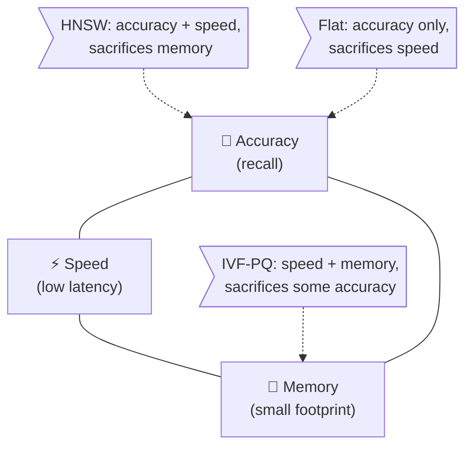
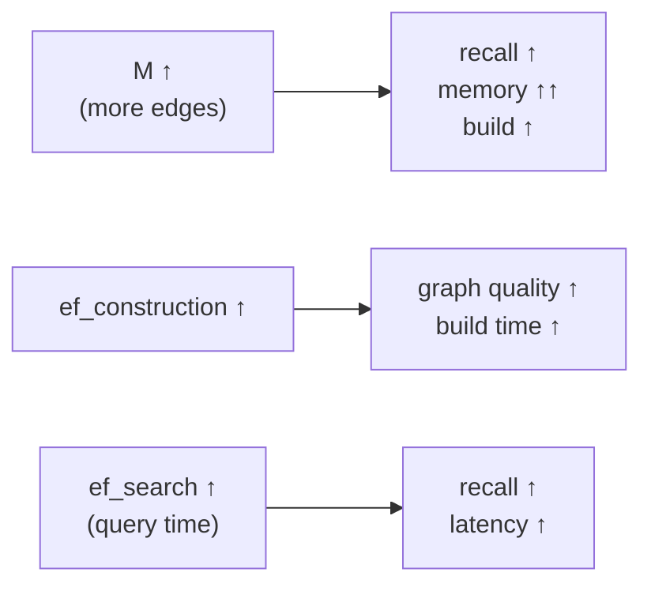
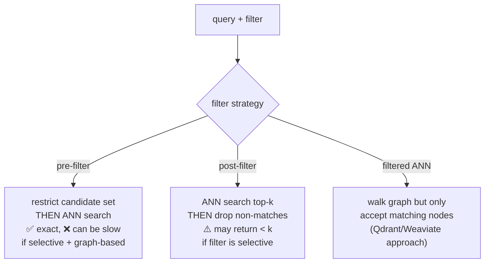

# 3 · Indexing & Tradeoffs

*Vector Databases module · Lesson 3 of 6 · [← ANN Algorithms](02-ann-algorithms.md) · [next → Vector Database Comparison](04-vector-database-comparison.md)*

Lesson 2 named the algorithms. This lesson is about the *engineering decisions*: you can't maximize recall, minimize latency, and minimize memory all at once — pick two and pay for the third. Here's how to reason about the trade, how to tune the knobs, and how to build both index families in FAISS.

---

## 3.1 The four quantities you're always trading

| Quantity | What raises it | What it costs you |
|----------|----------------|-------------------|
| **Recall** | more graph degree / more probes / bigger `ef` | latency + memory |
| **Query latency** | fewer probes / smaller `ef` | recall |
| **Build time** | denser graph / bigger `ef_construction` / more training | one-time (offline) pain |
| **Memory** | keeping full vectors + graph in RAM | $$ / max index size |

Build time is *usually* the one you're happiest to spend, because it's paid **once, offline**. Query latency and memory are paid **forever, per request**.

### The accuracy / speed / memory triangle



Read it as: **HNSW** sits on the accuracy–speed edge (pays with RAM). **IVF-PQ** sits on the speed–memory edge (pays with recall, partly recovered by reranking). **Flat** is pure accuracy (pays with linear-scan speed). There's no index in the middle of the triangle — that point doesn't exist.

---

## 3.2 Tuning HNSW: `M`, `ef_construction`, `ef_search`



Practical recipe:

- **`M`** — start at **16**. Bump to 32–64 only for high-dimensional, high-recall needs. Memory scales roughly linearly with `M`. This is the one you can't change without a rebuild, so choose it deliberately.
- **`ef_construction`** — **200** is a solid default; raise to 400 if build time is affordable and you want a better graph. Diminishing returns past ~500.
- **`ef_search`** — the free lunch: tune it **at query time** against a labelled recall set. Start ~`ef_search = 64`, raise until recall@k stops improving. Keep `ef_search ≥ k`.

**Golden ratio to remember:** you tune `M` and `ef_construction` **once**, then live on the `ef_search` dial forever.

---

## 3.3 Tuning IVF: `nlist`, `nprobe`

- **`nlist`** (build) — number of cells. Rule of thumb: `nlist ≈ 4·√N` (e.g. ~40k cells for 100M vectors). Too few → cells too big (slow); too many → each cell tiny + training expensive and centroid comparison dominates.
- **`nprobe`** (query) — cells to search. Start at **8–16**; raise until recall plateaus. `nprobe/nlist` is roughly the fraction of the dataset you scan.
- **Training data** — k-means needs a representative sample: FAISS suggests **30–256 × nlist** training vectors. Under-training centroids skews the partitions and tanks recall.

| Symptom | Likely cause | Fix |
|---------|--------------|-----|
| Recall too low, latency fine | `nprobe` too small / boundary misses | raise `nprobe` |
| Latency too high | `nprobe` too large or `nlist` too small | lower `nprobe` / raise `nlist` |
| Recall low even at high `nprobe` | under-trained centroids | train on more/representative data |
| Index won't fit in RAM | full vectors too big | switch IVF-Flat → **IVF-PQ** |

---

## 3.4 Building it in FAISS

FAISS (Facebook AI Similarity Search) is the reference library — most managed DBs wrap ideas from it. Note the metric setup: normalize + `METRIC_INNER_PRODUCT` to get cosine (Lesson 1).

```python
import faiss
import numpy as np

d = 768                       # embedding dim
N = 200_000
rng = np.random.default_rng(0)
xb = rng.random((N, d), dtype=np.float32)      # corpus
xq = rng.random((5, d), dtype=np.float32)      # queries
faiss.normalize_L2(xb)                          # cosine == IP on unit vecs
faiss.normalize_L2(xq)

# ---- (A) HNSW: no training needed, just add ----
M = 32
hnsw = faiss.IndexHNSWFlat(d, M, faiss.METRIC_INNER_PRODUCT)
hnsw.hnsw.efConstruction = 200
hnsw.add(xb)                                    # incremental, no train step
hnsw.hnsw.efSearch = 128                         # query-time recall dial
D, I = hnsw.search(xq, k=10)                     # D=scores, I=ids

# ---- (B) IVF-PQ: train, then add ----
nlist = 4096                                     # ~ 4*sqrt(N) rounded
m     = 96                                       # PQ sub-vectors (d % m == 0)
nbits = 8                                        # 256 centroids per sub-space
quantizer = faiss.IndexFlatIP(d)                 # coarse quantizer
ivfpq = faiss.IndexIVFPQ(quantizer, d, nlist, m, nbits, faiss.METRIC_INNER_PRODUCT)

ivfpq.train(xb)                                  # k-means over corpus sample
ivfpq.add(xb)
ivfpq.nprobe = 16                                # query-time recall dial
D, I = ivfpq.search(xq, k=10)

# ---- persist / reload ----
faiss.write_index(hnsw, "hnsw.faiss")
hnsw = faiss.read_index("hnsw.faiss")
```

Note the asymmetry that captures the whole lesson: **HNSW just `.add()`s** (graph is incremental), while **IVF-PQ must `.train()` first** (k-means centroids + PQ codebooks). And `efSearch` / `nprobe` are set *after* the build, per query workload.

---

## 3.5 Filtering + metadata (the part tutorials skip)

Real queries are rarely "nearest neighbours, full stop." They're "nearest neighbours **where** `tenant_id = 42` **and** `doc_type = 'invoice'`." How the DB combines the ANN search with the filter matters enormously:



- **Post-filtering** is simplest but dangerous: if you ask for `k=10` and 99% of vectors fail the filter, you may get back 1 result — the top-k were filtered out. You'd have to over-fetch (`k × oversample`) and hope.
- **Pre-filtering** is exact but can break the ANN graph's connectivity (you can't hop through a node you've excluded), sometimes forcing a slow fallback to brute force over the filtered subset.
- **Filtered ANN** (native, integrated) is what modern engines like **Qdrant** and **Weaviate** do well — they consult the payload index *during* graph traversal. This is a major reason to pick a purpose-built DB over a raw FAISS index once filtering gets serious (Lesson 4).

**Design tip:** index your filterable fields (`tenant_id`, `doc_type`, timestamps) as first-class **payload/metadata** with their own indexes, and prefer engines that do filtered ANN natively.

---

## 3.6 Takeaways

- You optimize among **recall, latency, build time, memory** — you cannot win all four. HNSW pays memory; IVF-PQ pays recall; Flat pays speed. There's no free point in the middle.
- **Build-time knobs** (`M`, `ef_construction`, `nlist`, PQ `m`) are chosen once and often can't change without a rebuild; **query-time knobs** (`ef_search`, `nprobe`) let you slide recall↔latency per request — tune them against a labelled recall set.
- In FAISS, **HNSW `.add()`s directly** while **IVF-PQ must `.train()` first**; normalize + `METRIC_INNER_PRODUCT` gives cosine.
- **Metadata filtering strategy** (pre- vs post- vs native filtered-ANN) can matter more than the ANN algorithm itself — post-filtering silently returns fewer than `k` results on selective filters.

➡️ Next: [Vector Database Comparison](04-vector-database-comparison.md) — how Pinecone, Weaviate, Qdrant, Milvus, Chroma, and pgvector package all this.
