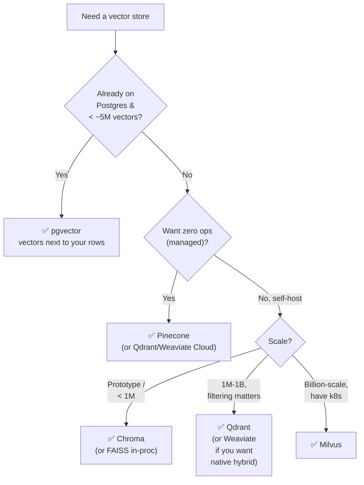

# 4 · Vector Database Comparison

*Vector Databases module · Lesson 4 of 6 · [← Indexing & Tradeoffs](03-indexing-and-tradeoffs.md) · [next → Hybrid Search & Reranking](05-hybrid-search-and-reranking.md)*

The algorithms from Lessons 2–3 are commodities — nearly every engine ships HNSW. What actually differs between products is the **surrounding system**: managed vs self-hosted, how they scale, how well they filter, whether hybrid search is built in, and how they fit your existing stack. This lesson is the head-to-head, plus idiomatic client code for the two you're most likely to reach for first: **Qdrant** and **pgvector**.

> The concept-level *"vector store vs vector database"* distinction (FAISS is a store; Milvus/Qdrant/Weaviate/Pinecone are databases; Chroma sits between) is in [`../12_rag/04_vector-stores.md`](../12_rag/04_vector-stores.md). Here we compare the *databases* on production axes.

---

## 4.1 The contenders in one line each

| DB | One-line identity |
|----|-------------------|
| **Pinecone** | Fully managed, serverless SaaS — you never run a node. |
| **Weaviate** | Open-source + cloud; schema/objects, native hybrid search, modules. |
| **Qdrant** | Open-source (Rust); best-in-class filtering + payloads, easy to self-host. |
| **Milvus** | Open-source, cloud-native, built for **billion-scale** with GPU + k8s. |
| **Chroma** | Lightweight, dev-first, embed-in-process or small server. |
| **pgvector** | A **Postgres extension** — vectors as a column, next to your relational data. |

---

## 4.2 The big table

| Axis | Pinecone | Weaviate | Qdrant | Milvus | Chroma | pgvector |
|------|----------|----------|--------|--------|--------|----------|
| **Model** | Managed SaaS only | OSS + managed | OSS + managed | OSS + managed | OSS (+ small cloud) | OSS extension |
| **Self-host?** | ❌ | ✅ | ✅ | ✅ | ✅ | ✅ (any Postgres) |
| **Index** | proprietary | HNSW (+flat) | HNSW | HNSW, IVF, IVF-PQ, DiskANN, GPU | HNSW | HNSW, IVFFlat |
| **Scale sweet spot** | any (elastic) | 10M–1B | 1M–1B | 100M–10B+ | <~1–5M | <~1–10M |
| **Filtering** | good | good | ⭐ excellent (payload) | good | basic | ⭐ full SQL `WHERE` |
| **Hybrid (BM25+vec)** | ✅ (sparse-dense) | ⭐ native | ✅ | ✅ | ❌ (dense only) | via `tsvector` + ext |
| **Transactions/joins** | ❌ | ❌ | ❌ | ❌ | ❌ | ⭐ full ACID + joins |
| **Ops burden** | ⭐ none | medium | ⭐ low | high (k8s) | ⭐ minimal | ⭐ ~none (reuse PG) |
| **Language** | — | Go | Rust | Go/C++ | Python | C (in Postgres) |

(⭐ = notable strength for that column.)

---

## 4.3 Decision flow



**The honest default for most teams:** if you already run Postgres and you're under a few million vectors, **pgvector** removes an entire system from your architecture — no separate service to deploy, back up, secure, or keep in sync. Graduate to Qdrant/Weaviate/Milvus only when you outgrow it on vector count, recall at latency, or filtering throughput.

---

## 4.4 Qdrant — idiomatic client

Qdrant models data as **collections** of **points** (`id` + `vector` + `payload`). Its filtering is the headline feature: filters are applied *during* HNSW traversal (native filtered-ANN from [Lesson 3](03-indexing-and-tradeoffs.md)), so selective filters stay fast and still return `k` results.

```python
from qdrant_client import QdrantClient
from qdrant_client.models import (
    Distance, VectorParams, PointStruct,
    Filter, FieldCondition, MatchValue,
)

client = QdrantClient(url="http://localhost:6333")   # or QdrantClient(":memory:")

# 1. Create a collection (declare dim + metric ONCE; must match your embedder)
client.recreate_collection(
    collection_name="docs",
    vectors_config=VectorParams(size=768, distance=Distance.COSINE),
)

# 2. Upsert points: vector + arbitrary JSON payload for filtering
client.upsert(
    collection_name="docs",
    points=[
        PointStruct(id=1, vector=emb_1, payload={"tenant": "acme", "doc_type": "invoice"}),
        PointStruct(id=2, vector=emb_2, payload={"tenant": "acme", "doc_type": "contract"}),
    ],
)

# 3. Filtered similarity search — filter is applied natively during search
hits = client.query_points(
    collection_name="docs",
    query=query_emb,
    limit=5,
    query_filter=Filter(
        must=[FieldCondition(key="tenant", match=MatchValue(value="acme"))]
    ),
    with_payload=True,
).points

for h in hits:
    print(h.id, round(h.score, 3), h.payload["doc_type"])
```

Tune HNSW via `hnsw_config` (`m`, `ef_construct`) at collection creation and `search_params=SearchParams(hnsw_ef=128)` per query — the exact `M` / `ef_construction` / `ef_search` knobs from Lesson 3.

---

## 4.5 pgvector — vectors as a Postgres column

pgvector adds a `vector` type and vector operators to Postgres. The killer feature is that similarity search is **just SQL** — you can `JOIN`, filter with a real `WHERE`, paginate, and wrap it in a transaction, all against the same rows your app already owns.

```sql
-- 1. Enable the extension
CREATE EXTENSION IF NOT EXISTS vector;

-- 2. Add a vector column (dimension must match your embedder, e.g. 768)
CREATE TABLE documents (
    id        bigserial PRIMARY KEY,
    tenant    text,
    doc_type  text,
    content   text,
    embedding vector(768)
);

-- 3. Build an HNSW index for the COSINE operator class
--    (<=> cosine, <#> negative inner product, <-> L2)
CREATE INDEX ON documents
    USING hnsw (embedding vector_cosine_ops)
    WITH (m = 16, ef_construction = 200);

-- 4. Query-time recall dial (session-scoped)
SET hnsw.ef_search = 128;

-- 5. Filtered ANN search — ORDER BY distance, filter in plain SQL
SELECT id, doc_type, 1 - (embedding <=> :query_vec) AS cosine_sim
FROM documents
WHERE tenant = 'acme'                       -- ordinary SQL filter + joins allowed
ORDER BY embedding <=> :query_vec           -- <=> = cosine distance (smaller = closer)
LIMIT 5;
```

```python
# Python side with psycopg + pgvector adapter
import psycopg
from pgvector.psycopg import register_vector

conn = psycopg.connect("postgresql://localhost/app")
register_vector(conn)                        # lets you pass numpy arrays directly

conn.execute("SET hnsw.ef_search = 128;")
rows = conn.execute(
    """
    SELECT id, doc_type
    FROM documents
    WHERE tenant = %s
    ORDER BY embedding <=> %s
    LIMIT 5
    """,
    ("acme", query_vec),                      # query_vec: np.ndarray(768,)
).fetchall()
```

Gotchas: choose the operator class matching your metric (`vector_cosine_ops` ↔ `<=>`); the pre-0.5 `ivfflat` index needs a `lists` param and post-insert `ANALYZE`; and because it's Postgres, a selective `WHERE` can make the planner ignore the vector index and scan — check `EXPLAIN` on real filters.

---

## 4.6 Takeaways

- The ANN algorithm is a commodity (everyone has HNSW); the real differentiators are **managed vs self-host, scale ceiling, filtering quality, hybrid search, and fit with your stack**.
- **pgvector** is the lowest-architecture-cost option when you're already on Postgres and under a few million vectors — vectors live beside your rows with full SQL `WHERE`/`JOIN`/ACID.
- **Qdrant** leads on native **filtered-ANN** and payloads; **Weaviate** on built-in **hybrid**; **Milvus** on **billion-scale** + GPU; **Pinecone** on **zero-ops** managed; **Chroma/FAISS** for prototypes.
- Always declare **dimension + metric once** and keep them consistent with your embedding model (Lesson 1) — this is a per-collection contract you can't casually change.
- Start simple, graduate on evidence: move off pgvector/Chroma only when recall-at-latency, vector count, or filter throughput forces it.

➡️ Next: [Hybrid Search & Reranking](05-hybrid-search-and-reranking.md) — why dense vectors alone miss keywords, and how to fix it.
