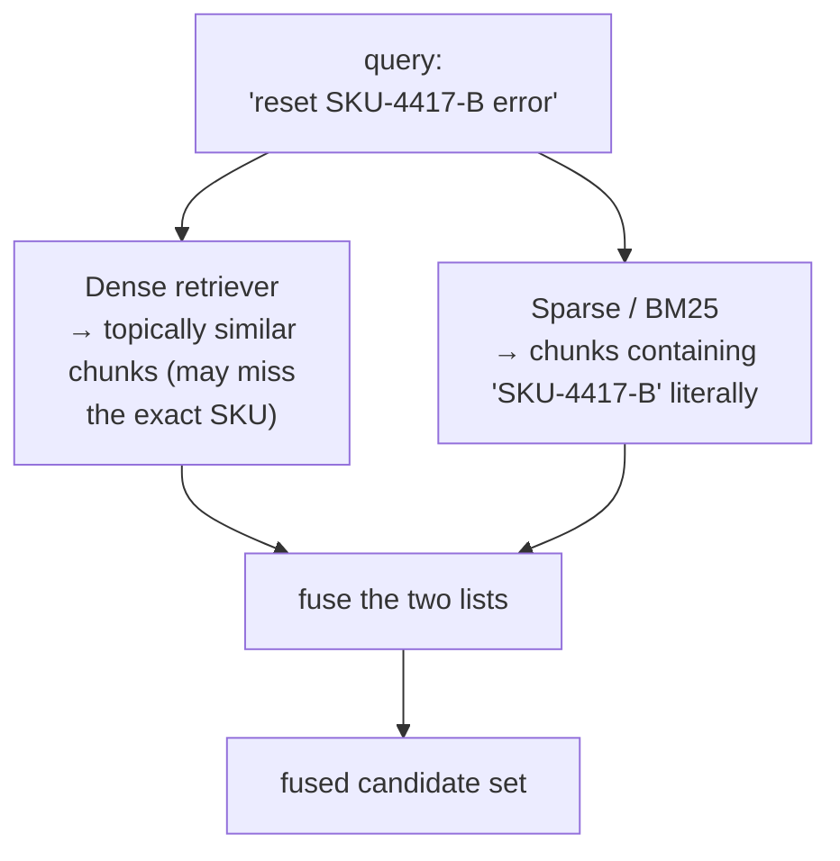
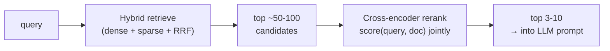
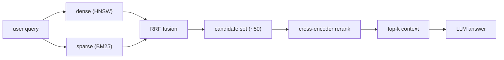

# 5 · Hybrid Search & Reranking

*Vector Databases module · Lesson 5 of 6 · [← Vector Database Comparison](04-vector-database-comparison.md) · [next → Production Concerns](06-production-concerns.md)*

Pure vector search has a blind spot: it's *semantic*, so it's superb at "find things that mean the same" and surprisingly bad at "find this exact token." Query for an error code `SKU-4417-B`, a person's rare surname, or a specific API name, and a dense embedding will happily return things that are *about the same topic* while missing the one chunk that literally contains the string. The fix is **hybrid search** (dense + sparse) followed by **reranking**.

> This is the systems view of the retriever-quality problem introduced in [`../12_rag/05_retrievers.md`](../12_rag/05_retrievers.md) (MMR, MultiQuery, contextual compression). Those improve *which* retriever you use; this improves *how you score and combine* results.

---

## 5.1 Dense vs sparse retrieval

| | **Dense (vector)** | **Sparse (lexical / BM25)** |
|---|---|---|
| Represents text as | a `d`-dim embedding | a bag of weighted terms |
| Matches on | **meaning** (semantic) | **exact tokens** (lexical) |
| Wins at | paraphrase, synonyms, cross-lingual | rare terms, IDs, codes, names, exact phrases |
| Fails at | out-of-vocab tokens, exact strings, rare jargon | synonyms, paraphrase ("car" ≠ "automobile") |
| Index | ANN (HNSW/IVF) | inverted index (like a search engine) |

**BM25** is the classic sparse scorer — a refined TF-IDF that rewards query terms that are frequent *in a document* but rare *across the corpus*, with length normalization. Because it keys on literal tokens, it nails exactly the cases dense retrieval fumbles. The two are **complementary**, not competing — which is the whole argument for hybrid.



---

## 5.2 Fusing the two lists: Reciprocal Rank Fusion (RRF)

Once you have two ranked lists (dense + sparse), you must merge them into one. The scores aren't comparable (cosine ∈ [−1,1] vs unbounded BM25), so **don't add the scores** — combine the **ranks**. **Reciprocal Rank Fusion** *(Cormack et al., 2009)* is the simple, robust standard:

```text
RRF(doc) = Σ over each list L of  1 / (k + rank_L(doc))      # k ≈ 60 by convention
```

A document ranked #1 in either list contributes `1/61`; #2 contributes `1/62`; and so on. Documents that appear high in **both** lists accumulate the most and rise to the top. It needs no score calibration and no tuning beyond `k`.

```python
def rrf(dense_ids, sparse_ids, k: int = 60, top_n: int = 10):
    """Fuse two ranked ID lists (best-first) into one ranking."""
    scores = {}
    for ranked in (dense_ids, sparse_ids):
        for rank, doc_id in enumerate(ranked):        # rank 0 = best
            scores[doc_id] = scores.get(doc_id, 0.0) + 1.0 / (k + rank + 1)
    return sorted(scores, key=scores.get, reverse=True)[:top_n]

dense  = ["d3", "d1", "d9", "d4"]     # from vector search
sparse = ["d9", "d7", "d1", "d2"]     # from BM25
print(rrf(dense, sparse))             # d9 & d1 (in both lists) bubble to the top
```

Alternatives exist (weighted score normalization, learned fusion), but RRF is the "just works" baseline every hybrid stack should start from. Weaviate, Qdrant, Elastic, and OpenSearch all expose RRF-style hybrid natively.

---

## 5.3 Reranking with cross-encoders

Fusion gives you a good *candidate set* — say the top 50–100. Retrieval so far has been **bi-encoder** style: query and document are embedded *independently*, then compared by a cheap dot product. Fast (you precompute all doc vectors), but the query never actually "reads" the document.

A **cross-encoder** reranker fixes that: it feeds `[query, document]` **together** through a transformer and outputs a single relevance score. It sees the interaction between every query token and every doc token, so it's far more accurate — but it's `O(candidates)` model calls at query time, so you only run it on the shortlist, never the whole corpus.



This is the **retrieve-then-rerank** pattern: cast a wide, cheap net (bi-encoder + BM25), then spend expensive compute re-scoring only the finalists.

| Stage | Model | Cost | Corpus touched | Job |
|-------|-------|------|----------------|-----|
| **Retrieve** | bi-encoder + BM25 | cheap | all N (via ANN/inverted index) | high recall, wide net |
| **Rerank** | cross-encoder | expensive | ~50–100 candidates | high precision, final order |

Common rerankers: Cohere Rerank, `bge-reranker`, `mixedbread-ai/mxbai-rerank`, and cross-encoders from `sentence-transformers`.

```python
from sentence_transformers import CrossEncoder

reranker = CrossEncoder("cross-encoder/ms-marco-MiniLM-L-6-v2")

query = "how do I rotate the API signing key?"
candidates = [c.text for c in fused_candidates]          # ~50 from hybrid step
scores = reranker.predict([(query, c) for c in candidates])

ranked = [c for _, c in sorted(zip(scores, candidates), reverse=True)]
top_context = ranked[:5]                                  # feed these to the LLM
```

---

## 5.4 Why hybrid + rerank beats pure vector

Putting the pipeline together — this is the read path a serious RAG system actually runs:



- **Keywords / rare terms / IDs** → BM25 arm catches what dense misses.
- **Paraphrase / synonyms** → dense arm catches what BM25 misses.
- **Precision at the top** → cross-encoder reorders so the *single best* chunk lands first, which matters because of the "lost in the middle" effect from prompt engineering ([`../01_prompt-engineering/06-context-engineering.md`](../01_prompt-engineering/06-context-engineering.md)): the top chunk gets read most reliably.

Empirically, hybrid + rerank lifts answer quality more than almost any embedding-model upgrade — and it's the cheapest lever once your index exists.

---

## 5.5 Takeaways

- **Dense** retrieval matches *meaning*; **sparse/BM25** matches *exact tokens* — they fail on opposite inputs, so combining them (hybrid) strictly dominates either alone, especially for IDs, codes, and rare names.
- Don't add incomparable scores — fuse by **rank** with **RRF** (`1/(k+rank)`, `k≈60`); it needs no calibration and is the standard baseline.
- **Retrieve-then-rerank:** cast a wide cheap net (bi-encoder + BM25), then re-score only the shortlist with an expensive **cross-encoder** that reads query and doc *together*.
- Reranking puts the single best chunk first, which pays off against **"lost in the middle"** — the top context position is the one the LLM reads most reliably.
- This is the systems-level complement to the retriever strategies in [`../12_rag/05_retrievers.md`](../12_rag/05_retrievers.md).

➡️ Next: [Production Concerns](06-production-concerns.md) — sharding, deletes, reindexing on model change, and cost.
