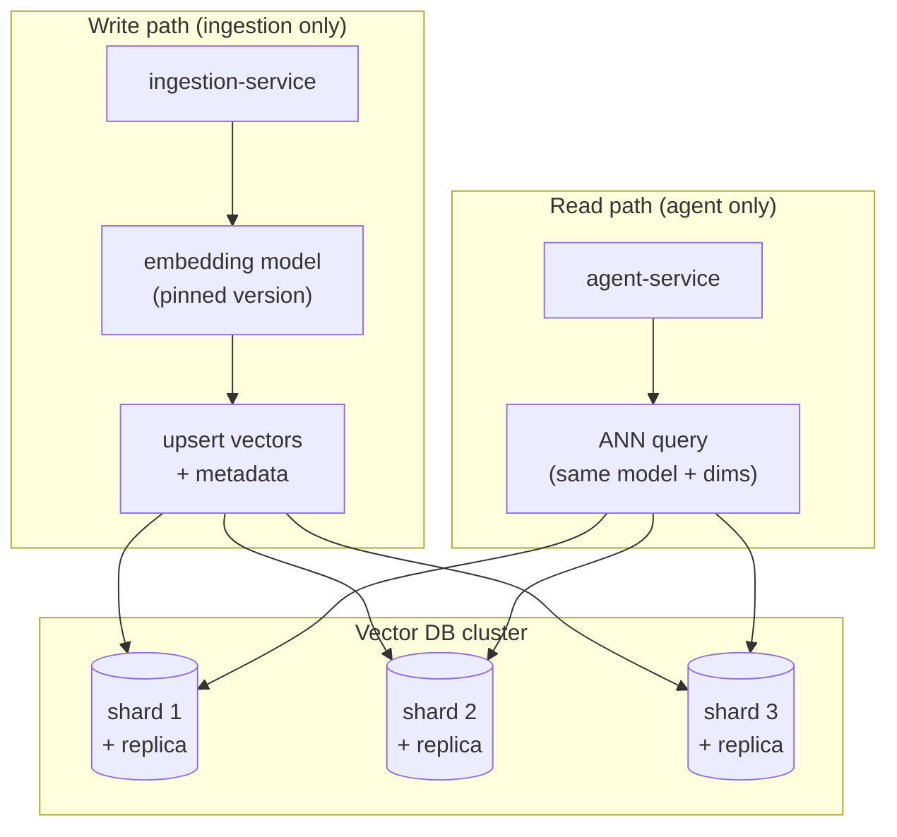
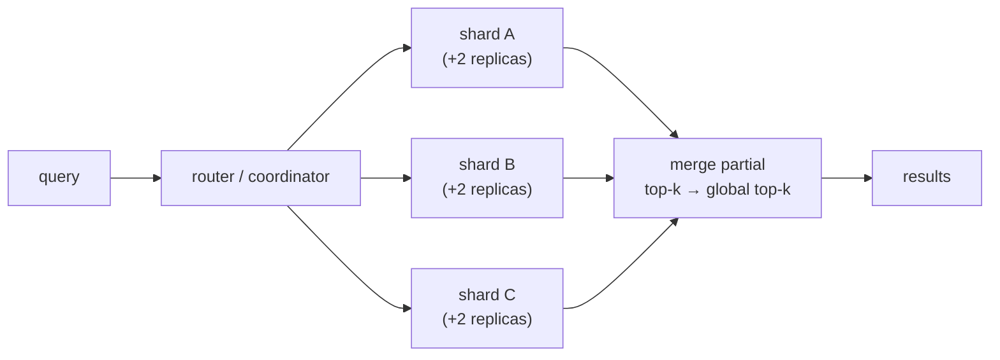
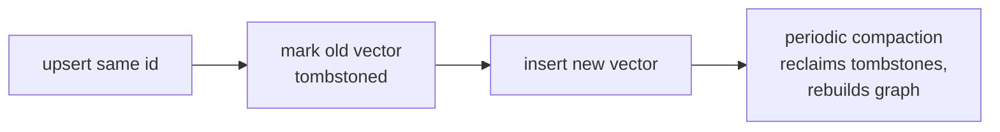
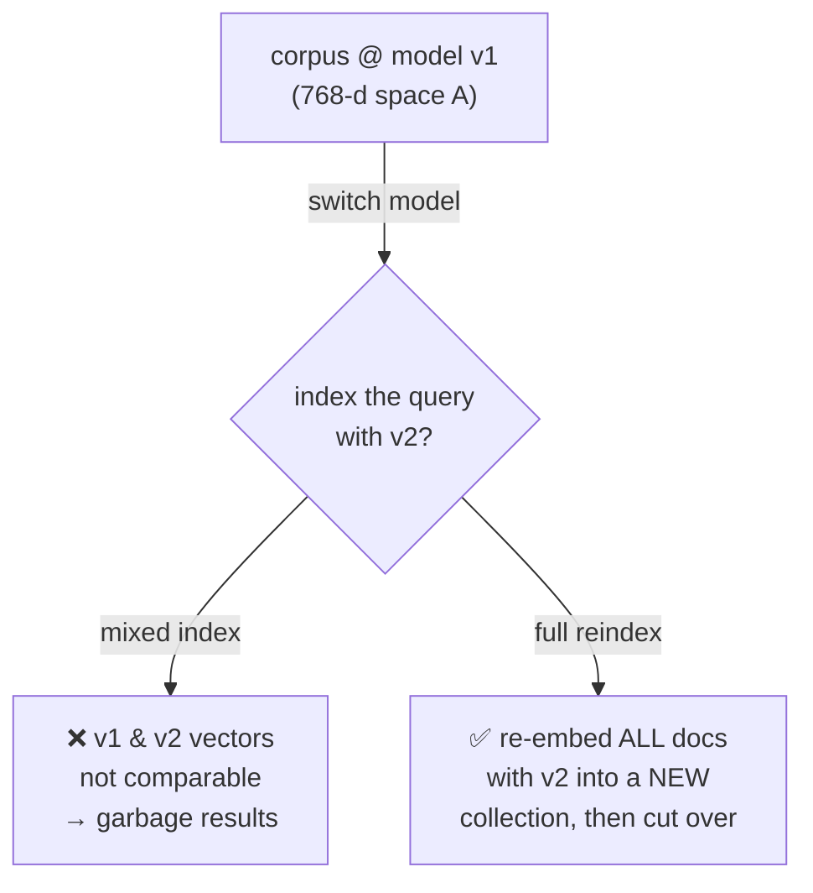
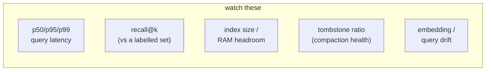

# 6 · Production Concerns

*Vector Databases module · Lesson 6 of 6 · [← Hybrid Search & Reranking](05-hybrid-search-and-reranking.md) · [next → Graph RAG](../07_graph-rag/README.md)*

A vector index that works in a notebook and a vector index that survives production are different animals. Production adds: keeping up as vectors grow (scaling), staying available (replication), handling churn (updates/deletes/reindex), the landmine of **changing your embedding model**, plus cost and monitoring. This lesson closes the module by mapping each concern onto the real contract from the RagApp design ([`../18_ragapp/README.md`](../18_ragapp/README.md)).

---

## 6.1 The shape of a production deployment

This mirrors the RagApp invariants exactly: **ingestion is the only writer** of the vector index, the **agent only reads** it, and both **must target the same vector space** — provider, collection/index, embedding deployment, and dimensions all agreeing. Separating write and read paths is what lets you scale and reindex them independently.

---

## 6.2 Scaling: sharding & replication

Two orthogonal moves, for two different problems:

| Technique | Solves | How | Cost |
|-----------|--------|-----|------|
| **Sharding** (partition) | index/data too big for one node; write throughput | split vectors across N nodes; query fans out, results merged | cross-shard queries touch every shard; global top-k merge |
| **Replication** (copy) | read throughput; availability | copy each shard to R replicas; queries load-balance | R× storage; replicas must stay in sync |

**Watch out:** ANN + sharding compounds approximation. If each shard returns *its own* approximate top-k and you merge, the global result is approximate over approximate — over-fetch per shard (ask each for more than `k`) to recover recall. Milvus and Pinecone handle fan-out/merge for you; a hand-rolled FAISS setup does not.

---

## 6.3 Updates, deletes, and the reindex tax

Vectors are not as easy to mutate as SQL rows, because ANN indexes are optimized structures, not plain lists:

- **Adds** — cheap for HNSW (incremental graph insert). IVF/IVF-PQ can add too, but new points use the *old* centroids; after enough drift you should retrain.
- **Updates** — an embedding change is really *delete + re-add*. Track a stable external key so you can find the old vector (in RagApp this is `file_id` for dedup and `job_id` as the vector-metadata foreign key).
- **Deletes** — the hard one. HNSW usually **tombstones** (marks dead, skips at query time) and only truly reclaims space on a periodic **rebuild/compaction**. A workload that deletes heavily accumulates tombstones → recall and latency degrade until you compact.

**Rule:** design an idempotent upsert keyed on a stable id, and schedule compaction/rebuild for delete-heavy collections.

---

## 6.4 The big one: changing the embedding model = full reindex

This is the production footgun that catches everyone. **Embeddings from two different models (or even two versions of the same model) live in incompatible geometric spaces.** A `text-embedding-3-small` vector and a `text-embedding-3-large` vector cannot be compared — different dimensions, different learned space, meaningless distances. So:

> **Changing the embedding model means re-embedding and re-indexing your *entire* corpus.** There is no incremental migration. You cannot "mix" old and new vectors in one index.

This is exactly why the RagApp design makes it an **architectural invariant** ([`../18_ragapp/README.md`](../18_ragapp/README.md), invariant #3): *"Both services must target the same vector space: provider, backing collection/index, embedding deployment, and embedding dimensions must agree."* The safe migration pattern:

1. **Version the vector config** — treat `(provider, model, deployment, dimension, metric)` as one immutable contract stamped on the collection.
2. **Build a new collection** with the new model; re-run ingestion over the full corpus (the write path from 6.1).
3. **Dual-read / shadow** — optionally query both, compare, until confident.
4. **Atomic cut-over** — flip the agent's read pointer to the new collection; keep the old one until rollback window passes.
5. **Never** let ingestion (writer) and agent (reader) drift onto different model versions — that violates the invariant and silently corrupts retrieval.

The takeaway that outranks all the algorithm tuning: **the embedding model is part of your data schema.** Pin it, version it, and budget a full reindex whenever it changes.

---

## 6.5 Cost & monitoring

**Where the money goes:**

| Cost driver | Scales with | Lever |
|-------------|-------------|-------|
| **RAM** (HNSW keeps vectors + graph in memory) | N × dimension | quantize (PQ), lower dimension, disk-based index (DiskANN) |
| **Embedding API calls** | corpus size × reindex frequency | cache embeddings; avoid needless model churn (6.4) |
| **Compute** (queries/sec × `ef`/`nprobe`) | QPS × recall target | tune query knobs; add replicas |
| **Storage** | N × (dim + payload) × replicas | PQ compression; prune stale docs |

**What to monitor:**

Recall is the sneaky one: latency and errors show up on dashboards, but **silent recall decay** (from drift, tombstone buildup, or a quietly changed model) doesn't throw errors — it just makes answers worse. Keep a small **golden query set with known-correct neighbours** and measure recall@k on a schedule. This connects to the eval program in [`../18_ragapp/eval.md`](../18_ragapp/eval.md) and the observability proposal in [`../18_ragapp/observability-proposal.md`](../18_ragapp/observability-proposal.md).

---

## 6.6 Takeaways

- Scale with **sharding** (bigger/faster writes) and **replication** (more reads/availability); remember ANN + fan-out is *approximate over approximate* — over-fetch per shard to protect recall.
- Vector **deletes** usually tombstone and need periodic **compaction/rebuild**; design idempotent upserts on a stable id (RagApp: `file_id`/`job_id`).
- **Changing the embedding model forces a full re-embed + reindex** — old and new vectors are geometrically incompatible. Treat `(provider, model, dimension, metric)` as an **immutable, versioned schema contract**; migrate by building a new collection and cutting over atomically.
- Cost is dominated by **RAM** and **embedding calls**; compress with PQ/DiskANN and don't churn models needlessly.
- Monitor latency **and** **recall@k against a golden set** — recall decays silently and won't page you on its own.

---

*End of the Vector Databases module. Back to the [module overview](README.md), or continue to the deeper retrieval variants in [Graph RAG](../07_graph-rag/README.md) and the applied system in [`../18_ragapp/`](../18_ragapp/README.md).*
