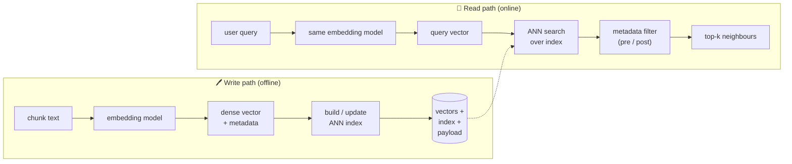

# 🗄️ Vector Databases

> A **vector database** stores high-dimensional embeddings and answers *"which stored vectors are closest to this query vector?"* in milliseconds — even over billions of vectors — by trading a little accuracy for a lot of speed via **approximate nearest-neighbour (ANN)** indexes.

These notes are the **systems-level deep dive**: how ANN algorithms (HNSW, IVF, PQ) actually work, what an index costs in build time / memory / recall, how the production databases differ, and how hybrid search and reindexing behave in the real world.

They deliberately **do not** re-teach the concept-level material. If you want the *"what is an embedding / what is a vector store / how do I `.similarity_search()` in LangChain"* intro, that lives in the RAG module — read it first and come back:

- [`../12_rag/04_vector-stores.md`](../12_rag/04_vector-stores.md) — embeddings intuition, vector store vs vector database, Chroma CRUD.
- [`../12_rag/05_retrievers.md`](../12_rag/05_retrievers.md) — retrievers, MMR, MultiQuery, compression.
- [`../12_rag/README.md`](../12_rag/README.md) — the full RAG pipeline these vectors feed.

This module picks up where that leaves off: the sentence *"a more famous production technique is Approximate Nearest Neighbor (ANN) search — a research topic in its own right, not covered in depth here"* from the RAG notes **is** the subject of this module.

---

## 🗺️ What actually happens inside a vector DB

The two paths **must agree on the vector space** — same embedding model, same dimensions, same distance metric — or the geometry is meaningless. That contract is the single most common source of production bugs (Lesson 6).

---

## 📓 Lessons

| # | Lesson | What you'll learn |
|---|--------|-------------------|
| 1 | [Embeddings & Similarity](01-embeddings-and-similarity.md) | Vectors recap, cosine vs dot vs euclidean, normalization, numpy |
| 2 | [ANN Algorithms](02-ann-algorithms.md) | Exact kNN vs ANN, recall/latency curve, **HNSW**, **IVF**, **PQ** |
| 3 | [Indexing & Tradeoffs](03-indexing-and-tradeoffs.md) | Build/query/14_memory/recall, tuning `M`/`ef`/`nlist`/`nprobe`, FAISS |
| 4 | [Vector Database Comparison](04-vector-database-comparison.md) | Pinecone · Weaviate · Qdrant · Milvus · Chroma · pgvector |
| 5 | [Hybrid Search & Reranking](05-hybrid-search-and-reranking.md) | Dense + sparse (BM25), RRF fusion, cross-encoder rerankers |
| 6 | [Production Concerns](06-production-concerns.md) | Sharding, updates/deletes, **reindexing on model change**, cost |

---

## ⚡ Which vector DB should I reach for?

| Situation | Reach for… | Why |
|-----------|-----------|-----|
| Prototype / notebook, in-process, no server | **FAISS** or **Chroma** | Zero infra; embed the index in your app |
| You already run **Postgres** and want vectors *next to* your rows | **pgvector** | One DB, real SQL joins + transactions, no new system |
| Self-hosted, high performance, rich filtering, Rust | **Qdrant** | Great filtering + payload story, easy Docker deploy |
| Billion-scale, GPU builds, cloud-native, k8s | **Milvus** | Built for massive scale + horizontal sharding |
| Want built-in hybrid search + modules/objects graph | **Weaviate** | Native BM25+vector hybrid, GraphQL, schema |
| Zero-ops managed SaaS, don't want to run anything | **Pinecone** | Fully managed, serverless, predictable scaling |

Full head-to-head (managed vs self-host, scale, filtering, hybrid) is in [Lesson 4](04-vector-database-comparison.md).

**Rule of thumb:** start with the *simplest* thing that fits your scale (pgvector/Chroma), and only graduate to a dedicated engine when you outgrow it on recall, latency, or vector count — not before.

---

*Reference notes for personal study — the deep dive behind [`../12_rag/04_vector-stores.md`](../12_rag/04_vector-stores.md). Algorithms cite their origin papers where relevant (HNSW — Malkov & Yashunin 2016; IVF/PQ — Jégou et al. 2011; ScaNN — Guo et al. 2020; RRF — Cormack et al. 2009).*
