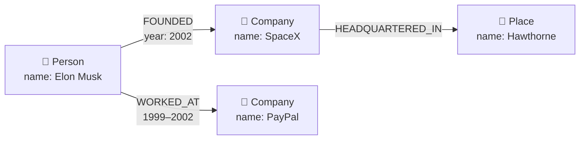
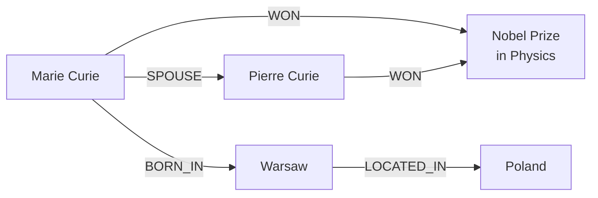
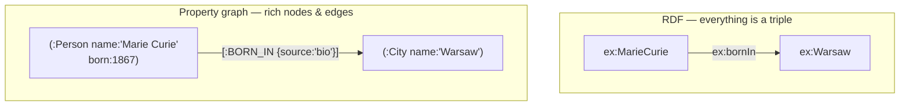
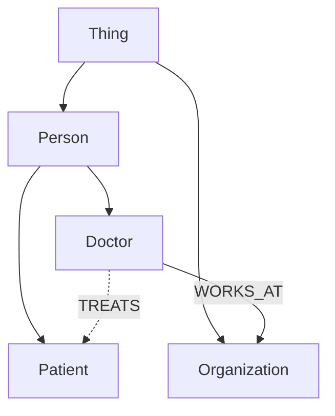

# 1 · Knowledge Graphs 101

*GraphRAG & Knowledge Graphs module · Lesson 1 of 6 · [← Overview](README.md) · [next → Why GraphRAG?](02-why-graphrag.md)*

Before graph *RAG*, you need the graph. A **knowledge graph (KG)** stores information as **things and the relationships between them** — not as rows in a table and not as a bag of text chunks. This lesson is the data-model vocabulary the rest of the module leans on.

---

## 1.1 Nodes, edges, properties

Three primitives:

- **Node** (a.k.a. *vertex* / *entity*) — a thing: a person, company, drug, movie, concept.
- **Edge** (a.k.a. *relationship*) — a **typed, directed** link between two nodes: `WORKS_AT`, `FOUNDED`, `TREATS`.
- **Property** — a key/value attribute *on* a node **or** an edge: a node's `name`, an edge's `since: 2011`.



That model — where **both nodes and edges carry properties** — is called a **Labeled Property Graph (LPG)**. It's what Neo4j uses, and what most GraphRAG tooling targets.

---

## 1.2 The triple: subject → predicate → object

The atomic unit of a knowledge graph is the **triple** (also written **SPO**):

```text
(subject) —[predicate]→ (object)
(Marie Curie) —[WON]→ (Nobel Prize in Physics)
(Marie Curie) —[BORN_IN]→ (Warsaw)
(Warsaw)      —[LOCATED_IN]→ (Poland)
```

Chain enough triples that **share nodes** and you get a graph. The magic is the sharing: `Marie Curie` is the *same node* in every triple that mentions her, so a query can pivot from one fact to the next.



> **This is the whole point.** From these triples you can answer "who *else* won the same prize as Marie Curie's spouse?" by *walking edges* — a **multi-hop** question that a flat chunk index can't do. Hold onto that; it's the thesis of [Lesson 2](02-why-graphrag.md).

---

## 1.3 Two graph models: RDF vs property graph

You'll meet two lineages. GraphRAG tooling overwhelmingly uses the **property-graph** side, but know both:

| | **RDF triple store** | **Labeled Property Graph (LPG)** |
|---|---|---|
| Unit | `(subject, predicate, object)` triples, everything a **URI** | Nodes + edges that both hold **properties** |
| Properties on edges? | No (you *reify* into more triples) | **Yes**, natively |
| Query language | **SPARQL** | **Cypher** (Neo4j), Gremlin |
| Standard / schema | W3C RDF, RDFS, **OWL** ontologies | Optional; schema-flexible |
| Typical use | Linked Open Data, DBpedia, Wikidata | Neo4j apps, most GraphRAG stacks |



**Rule of thumb for this module:** think **property graph + Cypher** (Neo4j). RDF/SPARQL is the same idea with stricter semantics and web-scale interoperability.

---

## 1.4 Ontology: the schema for meaning

An **ontology** defines *what types of things and relationships are allowed* — the vocabulary and rules of your graph:

- **Entity types** (labels): `Person`, `Company`, `Drug`, `Disease`.
- **Relationship types**: a `Person` may `WORK_AT` a `Company`; a `Drug` may `TREATS` a `Disease`.
- **Constraints / hierarchy**: `Cardiologist` *is-a* `Doctor` *is-a* `Person`.



- A loose, mostly-hierarchical vocabulary is a **taxonomy**; a full ontology adds relationship types and logical constraints (formalized in **RDFS / OWL** on the RDF side).
- In GraphRAG you often supply a **lightweight ontology as an extraction hint** — "only pull out `Person`, `Org`, `Product` and these relations" — to keep the LLM's extraction consistent. More on that in [Lesson 3](03-building-the-graph.md).

---

## 1.5 Why graphs capture what vectors miss

An embedding squashes a chunk into **one point in space**; similarity is a blunt "these two texts feel related." A graph keeps the relationship **explicit, typed, and directed**:

| | Vector store | Knowledge graph |
|---|---|---|
| Stores | Chunk → dense vector | Entities + **typed** relationships |
| "Related" means | Cosine-close in embedding space | An **actual named edge** you can name & follow |
| Multi-hop | ✗ (each chunk isolated) | ✅ walk edges |
| Explainable path | ✗ ("nearest neighbor") | ✅ "Curie →SPOUSE→ Pierre →WON→ Nobel" |
| Aggregate over all data | ✗ | ✅ via communities ([Lesson 4](04-microsoft-graphrag.md)) |

Vectors answer *"what looks like this?"* Graphs answer *"how is this connected to that?"* — and connection is exactly what RAG throws away when it chunks-and-embeds. That gap is the reason GraphRAG exists.

---

## Takeaways

- A knowledge graph = **nodes** (entities) + **typed, directed edges** (relationships) + **properties** on either.
- The atom is the **triple**: `subject —predicate→ object`; shared nodes across triples *are* the graph.
- Two lineages: **RDF triples + SPARQL** (web/linked-data) vs **Labeled Property Graphs + Cypher** (Neo4j) — GraphRAG lives mostly in the property-graph world.
- An **ontology** fixes the allowed entity/relationship types; a lightweight one doubles as an LLM extraction hint.
- Graphs preserve **explicit, explainable, traversable relationships** that embeddings collapse — enabling multi-hop and global reasoning.

➡️ Next: [Why GraphRAG?](02-why-graphrag.md) — the concrete failure modes of chunk-based vector RAG.
