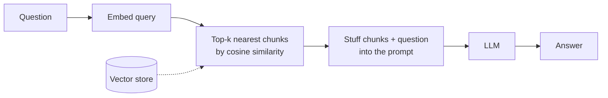
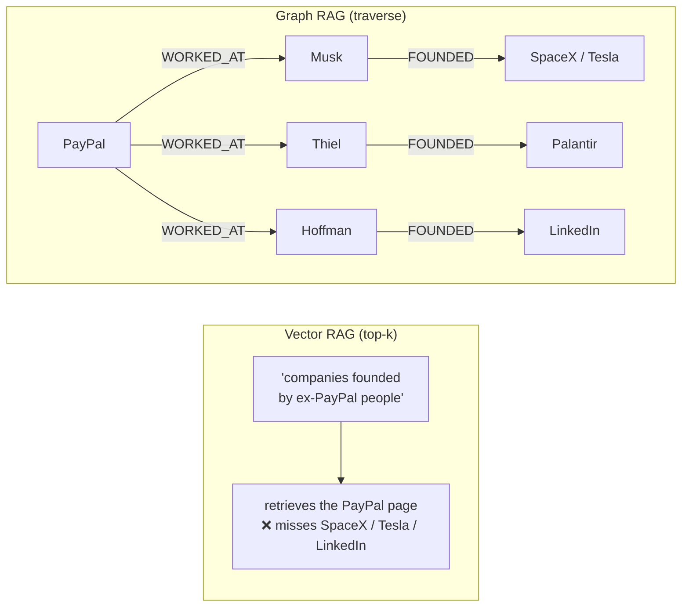
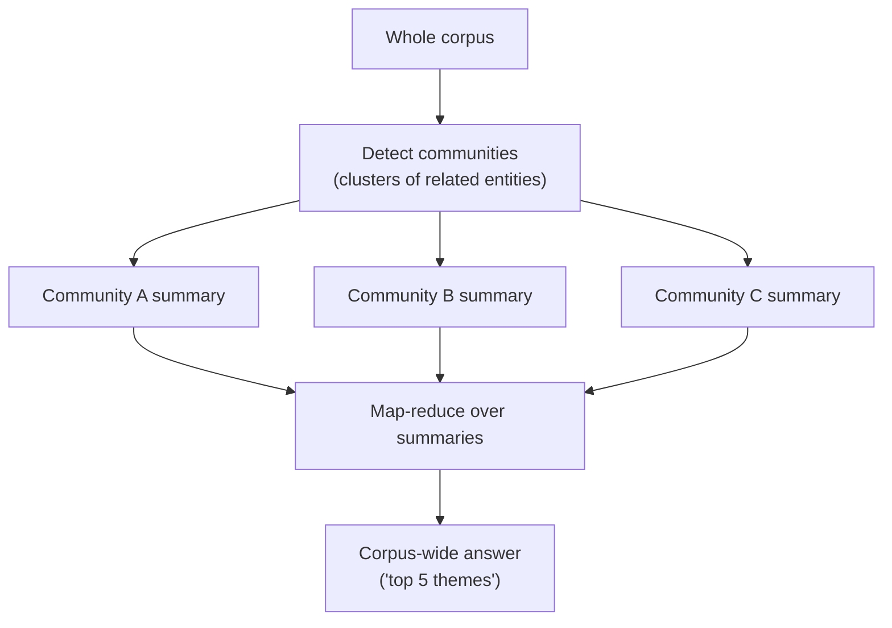
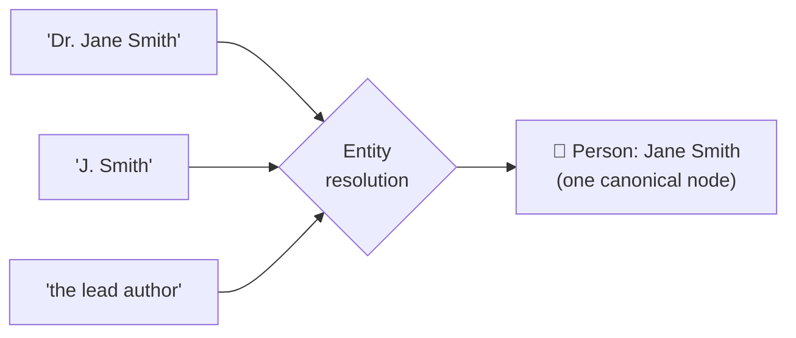
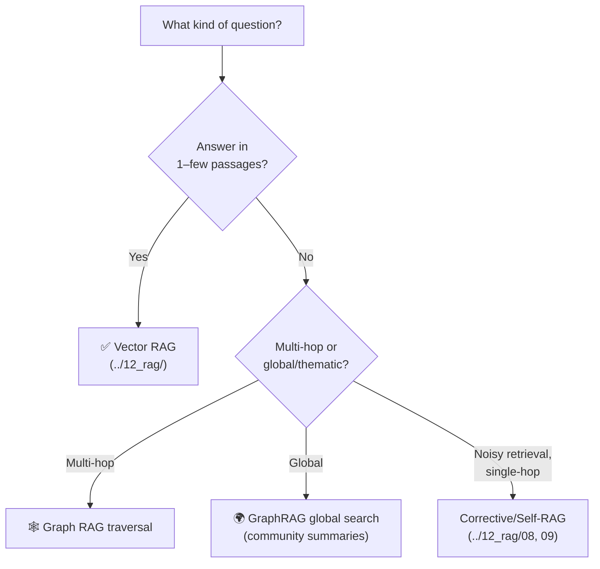

# 2 · Why GraphRAG?

*GraphRAG & Knowledge Graphs module · Lesson 2 of 6 · [← Knowledge Graphs 101](01-knowledge-graphs-basics.md) · [next → Building the Graph](03-building-the-graph.md)*

Baseline vector RAG ([`../12_rag/`](../12_rag/README.md)) is excellent — until it isn't. This lesson is the honest list of **where chunk-based retrieval breaks**, and precisely what a graph adds. If your questions never hit these failure modes, plain vector RAG (or [Corrective/Self-RAG](../12_rag/08_corrective-rag-crag.md)) is the right, cheaper tool — see [Lesson 6](06-tradeoffs-and-when.md).

---

## 2.1 Recap: what vector RAG actually does

Every retrieval decision reduces to **"which chunks are *semantically closest* to the query string?"** Three assumptions are baked in, and each one has a failure mode:

1. The answer lives inside **one (or a few) chunks**.
2. Those chunks are **similar in wording** to the question.
3. Chunks can be treated **independently** — order and cross-links don't matter.

---

## 2.2 Failure mode A — multi-hop reasoning

**"Which companies were founded by people who used to work at PayPal?"**

The answer requires chaining: `PayPal → (employees) → (the ones who left) → (companies they founded)`. But:

- The chunk naming SpaceX probably **never mentions PayPal**, so it isn't similar to the query.
- Retrieval fetches chunks similar to *"companies founded PayPal"* — likely the PayPal history page, not the SpaceX/Tesla/LinkedIn pages.
- Even if a few relevant chunks squeak in, the model must **join facts across them**, and the connective tissue was discarded at chunk time.

The graph answers by **walking edges**: land on `PayPal`, hop to its `WORKED_AT` neighbors, hop again along `FOUNDED`. The path *is* the reasoning, and it's explainable.

---

## 2.3 Failure mode B — global / whole-corpus questions

**"What are the top 5 themes across all 900 customer-support tickets?"**

This is a **query-focused summarization** problem, and top-k retrieval is structurally the wrong shape:

- **No chunk contains the answer.** The themes are an *emergent property of the whole corpus*, not any one passage.
- Retrieving `k = 10` chunks samples **~1%** of the data and biases toward whatever phrasing matches "themes."
- Raising `k` to cover everything blows the context window and drowns the signal ("lost in the middle" — see [`../01_prompt-engineering/06-context-engineering.md`](../01_prompt-engineering/06-context-engineering.md)).

A graph handles this by **pre-aggregating**: cluster the entity graph into **communities**, have an LLM write a **summary per community** at index time, then answer the global question by **map-reducing over community summaries** instead of raw chunks. That's exactly Microsoft GraphRAG's *global search* — [Lesson 4](04-microsoft-graphrag.md).

---

## 2.4 Failure mode C — entity disambiguation & scattered mentions

The same real-world entity shows up under many surface forms, and different entities share a name:

- **"Apple"** the company vs the fruit; **"Jordan"** the person vs the country.
- One person appears as *"Dr. Jane Smith," "J. Smith," "she," "the author"* across 40 chunks.

Vector search treats each mention as unrelated text. A graph performs **entity resolution** at index time — merging all mentions into **one canonical node** — so *everything known about that entity is reachable from a single place*, regardless of wording.

---

## 2.5 What the graph adds — and what it costs

| Vector RAG limitation | What the graph adds |
|-----------------------|---------------------|
| Chunks are isolated islands | **Explicit typed edges** between entities |
| Can't chain facts (multi-hop) | **Traversal** across N hops |
| Can't answer global "summarize everything" | **Community detection + summaries** (map-reduce) |
| Same entity scattered / ambiguous | **Entity resolution** into canonical nodes |
| "Nearest neighbor" is unexplainable | **Explainable paths** ("A →REL→ B →REL→ C") |

**But** — and [Lesson 6](06-tradeoffs-and-when.md) hammers this — the graph is **not free**. Building it means **many LLM extraction calls** (one+ per chunk) plus community summarization, it's harder to keep fresh, and for simple factoid lookups it's pure overhead. Vector RAG remains the default; reach for graphs when your questions are **multi-hop, global, or highly relational**.

---

## 2.6 Decision snapshot

---

## Takeaways

- Vector RAG assumes the answer sits in **a few word-similar, independent chunks** — and each assumption has a failure mode.
- **Multi-hop:** the relevant chunks aren't similar to the query and the connective links were discarded → graphs **traverse** instead.
- **Global / "summarize everything":** no chunk holds the answer and top-k under-samples → graphs **pre-aggregate via community summaries** ([Lesson 4](04-microsoft-graphrag.md)).
- **Disambiguation:** graphs perform **entity resolution** so all mentions of one thing collapse to one canonical node.
- The graph buys traversal, global aggregation, and explainable paths — **at real construction and maintenance cost**; keep vector RAG as the default.

➡️ Next: [Building the Graph](03-building-the-graph.md) — the indexing pipeline that turns raw text into this graph.
