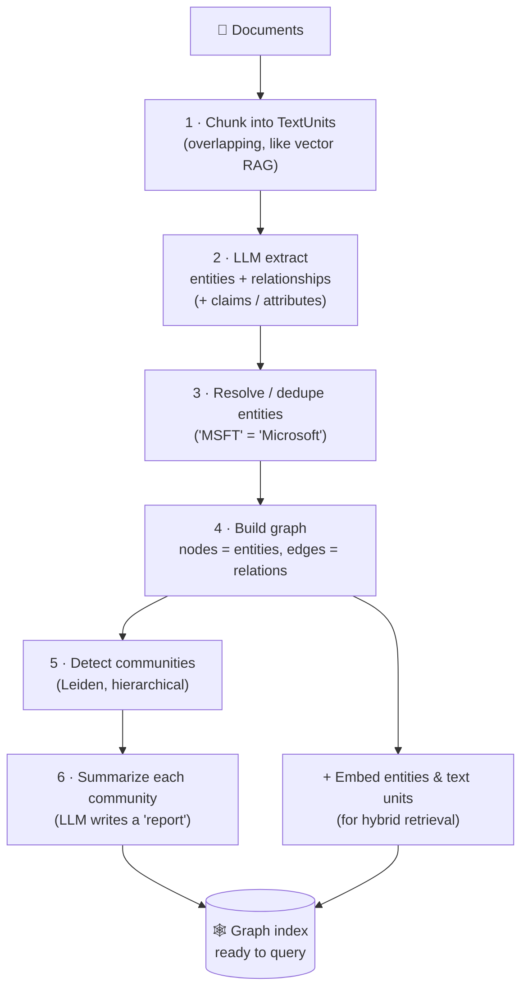
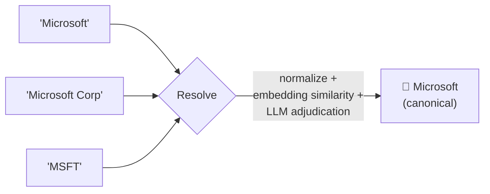
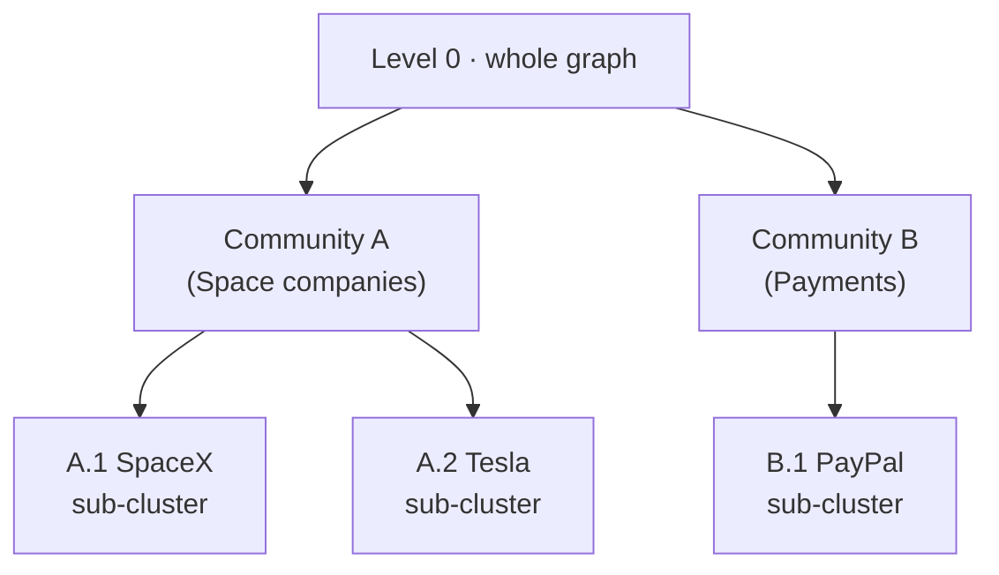

# 3 · Building the Graph

*GraphRAG & Knowledge Graphs module · Lesson 3 of 6 · [← Why GraphRAG?](02-why-graphrag.md) · [next → Microsoft GraphRAG](04-microsoft-graphrag.md)*

This is the heart of GraphRAG: the **offline indexing pipeline** that turns a pile of documents into a queryable knowledge graph. It reuses the front of the baseline RAG pipeline (load → split) from [`../12_rag/03_text-splitters.md`](../12_rag/03_text-splitters.md), then diverges hard: instead of *embed → vector store*, we do **extract → resolve → build → cluster → summarize**.

---

## 3.1 The pipeline end to end



Note the two big differences from vector RAG: step 2 costs **an LLM call per chunk** (this dominates cost — [Lesson 6](06-tradeoffs-and-when.md)), and steps 5–6 add a **whole second summarization pass** so global questions are answerable later.

---

## 3.2 Step 1 — chunk (same as vector RAG)

Split into overlapping **TextUnits**. Overlap matters even more here: an entity mentioned at a chunk boundary should stay recoverable. Nothing new versus [`../12_rag/03_text-splitters.md`](../12_rag/03_text-splitters.md), so we move on.

```python
from langchain_text_splitters import RecursiveCharacterTextSplitter

splitter = RecursiveCharacterTextSplitter(chunk_size=1200, chunk_overlap=200)
text_units = splitter.split_text(raw_document)   # list[str]
```

---

## 3.3 Step 2 — extract entities & relationships (the LLM does the work)

For each chunk, an LLM reads the text and emits **structured triples**. Give it a **target ontology** and demand **strict JSON** (see [`../01_prompt-engineering/05-structured-output.md`](../01_prompt-engineering/05-structured-output.md)) so the output is machine-parseable.

```python
import json
from langchain_openai import ChatOpenAI

EXTRACTION_PROMPT = """You are a knowledge-graph extractor.
From the TEXT, extract entities and the relationships between them.

Allowed entity types: Person, Organization, Product, Location, Event.
Allowed relations:     WORKS_AT, FOUNDED, LOCATED_IN, ACQUIRED, PART_OF.

Return ONLY JSON:
{{
  "entities":      [{{"name": str, "type": str, "description": str}}],
  "relationships": [{{"source": str, "target": str, "relation": str, "description": str}}]
}}

TEXT:
{chunk}
"""

llm = ChatOpenAI(model="gpt-4o-mini", temperature=0)

def extract(chunk: str) -> dict:
    resp = llm.invoke(EXTRACTION_PROMPT.format(chunk=chunk))
    return json.loads(resp.content)
```

Two production notes:
- **Gleaning** — Microsoft GraphRAG runs a follow-up "did you miss any entities?" pass on each chunk to raise recall.
- **Claims / covariates** — optionally extract factual statements about entities (`"Company X acquired Y in 2021"`) as a third output alongside entities and relations.

A lighter, cheaper alternative for the *entity* half is classic **spaCy NER** (no LLM), though it won't give you typed *relationships*:

```python
import spacy
nlp = spacy.load("en_core_web_sm")

doc = nlp("Elon Musk founded SpaceX in Hawthorne, California.")
ents = [(e.text, e.label_) for e in doc.ents]
# [('Elon Musk', 'PERSON'), ('SpaceX', 'ORG'), ('Hawthorne', 'GPE'), ('California', 'GPE')]
```

Use spaCy to pre-tag or validate; use the LLM to get the **relationships** that make it a graph rather than a list.

---

## 3.4 Step 3 — resolve & dedupe entities

The extractor emits `"Microsoft"`, `"Microsoft Corp"`, and `"MSFT"` as three nodes. **Entity resolution** merges them into one canonical node — otherwise the graph fragments and traversal breaks (the exact problem from [Lesson 2 §2.4](02-why-graphrag.md)).



Common tactics, cheapest first: **string normalization** (lowercase, strip suffixes like "Inc/Corp") → **embedding similarity** on names+descriptions above a threshold → **LLM adjudication** for the ambiguous pairs. A simple normalize-and-key gets you surprisingly far:

```python
def canonical_key(name: str) -> str:
    name = name.lower().strip()
    for suffix in (" inc", " corp", " corporation", " ltd", " llc"):
        name = name.removesuffix(suffix)
    return name.strip()

# "Microsoft", "Microsoft Corp", "MSFT" -> collapse via a name->canonical alias map
```

---

## 3.5 Step 4 — build the graph (networkx)

With clean entities and relationships, assembling the graph is mechanical. `networkx` is the standard in-memory choice; you'd persist to **Neo4j** for anything large (see [Lesson 5](05-querying-and-hybrid.md)).

```python
import networkx as nx

G = nx.DiGraph()   # directed: relationships have a direction

for chunk in text_units:
    data = extract(chunk)

    for e in data["entities"]:
        key = canonical_key(e["name"])
        if G.has_node(key):
            # merge: keep the richer description, bump a frequency weight
            G.nodes[key]["weight"] += 1
        else:
            G.add_node(key, label=e["name"], type=e["type"],
                       description=e["description"], weight=1)

    for r in data["relationships"]:
        s, t = canonical_key(r["source"]), canonical_key(r["target"])
        G.add_edge(s, t, relation=r["relation"], description=r["description"])

print(G.number_of_nodes(), "entities /", G.number_of_edges(), "relationships")
```

The `weight` on repeatedly-mentioned entities later helps rank the "important" nodes in a community summary.

---

## 3.6 Step 5 — detect communities (Leiden)

A real corpus produces one giant tangled graph. To answer **global** questions you first partition it into **communities** — clusters of densely-interconnected entities (a "product-launch" cluster, a "litigation" cluster). Microsoft GraphRAG uses the **Leiden algorithm**, which is **hierarchical**: it yields nested communities at multiple resolution levels (broad at the top, fine-grained at the leaves).



```python
import networkx as nx

# Leiden runs on undirected graphs; convert first.
UG = G.to_undirected()

# Option A — leidenalg (via igraph), what Microsoft GraphRAG uses under the hood
import igraph as ig, leidenalg
g_ig = ig.Graph.from_networkx(UG)
part = leidenalg.find_partition(g_ig, leidenalg.RBConfigurationVertexPartition)
# part -> list of communities (each a list of node indices)

# Option B — pure-networkx fallback (Louvain, non-hierarchical)
communities = nx.community.louvain_communities(UG, seed=42)
```

> **Leiden vs Louvain:** both optimize *modularity* (dense inside, sparse between). Leiden fixes Louvain's badly-connected-community bug and gives clean **hierarchical** levels — which GraphRAG needs so it can answer at "zoomed out" (few big communities) or "zoomed in" (many small ones) granularity.

---

## 3.7 Step 6 — summarize each community

The final pass: an LLM writes a **community report** — a title, summary, and key findings — for *every* community, bottom-up (leaf reports feed into parent reports). These summaries are what **global search** map-reduces over ([Lesson 4](04-microsoft-graphrag.md)); they're the reason "summarize the whole corpus" becomes answerable.

```python
SUMMARY_PROMPT = """Write a report on this community of related entities.
Return JSON: {{"title": str, "summary": str, "findings": [str]}}

Entities & relationships:
{members}
"""

def summarize_community(nodes) -> dict:
    members = "\n".join(
        f'- {G.nodes[n]["label"]} ({G.nodes[n]["type"]}): {G.nodes[n]["description"]}'
        for n in nodes
    )
    return json.loads(llm.invoke(SUMMARY_PROMPT.format(members=members)).content)

community_reports = [summarize_community(c) for c in communities]
```

Cost reality check: extraction is *one LLM call per chunk* and summarization is *one per community per level*. For a modest corpus that's easily **thousands** of calls — the number [Lesson 6](06-tradeoffs-and-when.md) is built around.

---

## 3.8 Doing it with a framework (LangChain `LLMGraphTransformer`)

You rarely hand-roll all of the above. LangChain packages steps 2–4 into one component that emits graph documents you can push straight into Neo4j:

```python
from langchain_experimental.graph_transformers import LLMGraphTransformer
from langchain_openai import ChatOpenAI
from langchain_neo4j import Neo4jGraph
from langchain_core.documents import Document

transformer = LLMGraphTransformer(
    llm=ChatOpenAI(model="gpt-4o", temperature=0),
    allowed_nodes=["Person", "Organization", "Product", "Location"],
    allowed_relationships=["WORKS_AT", "FOUNDED", "LOCATED_IN", "ACQUIRED"],
)

graph_docs = transformer.convert_to_graph_documents(
    [Document(page_content=chunk) for chunk in text_units]
)

graph = Neo4jGraph()                       # reads NEO4J_URI / _USERNAME / _PASSWORD
graph.add_graph_documents(graph_docs, include_source=True)
```

`allowed_nodes` / `allowed_relationships` are your ontology-as-hint from [Lesson 1 §1.4](01-knowledge-graphs-basics.md) — they keep extraction consistent. Community detection + summarization you'd still run separately (or use the Microsoft GraphRAG library, which does the whole pipeline — [Lesson 4](04-microsoft-graphrag.md)).

---

## Takeaways

- The indexing pipeline is **chunk → LLM-extract entities+relations → resolve/dedupe → build graph → detect communities → summarize communities** (+ embed for hybrid).
- **Extraction** is an LLM call per chunk emitting **strict-JSON triples**, steered by an allowed-types ontology; **spaCy NER** is a cheap way to get entities but not relationships.
- **Entity resolution** (normalize → embedding similarity → LLM adjudication) is mandatory, or the graph fragments and traversal breaks.
- **Leiden** community detection is **hierarchical** (nested levels) and is why GraphRAG can answer at different zoom levels; **Louvain** is a non-hierarchical fallback.
- **Community summaries** are a second LLM pass and are what make *global* questions answerable later.
- `LLMGraphTransformer` + `Neo4jGraph` package extraction→build; the full Microsoft pipeline automates communities+summaries too.

➡️ Next: [Microsoft GraphRAG](04-microsoft-graphrag.md) — how local vs global search query this graph.
