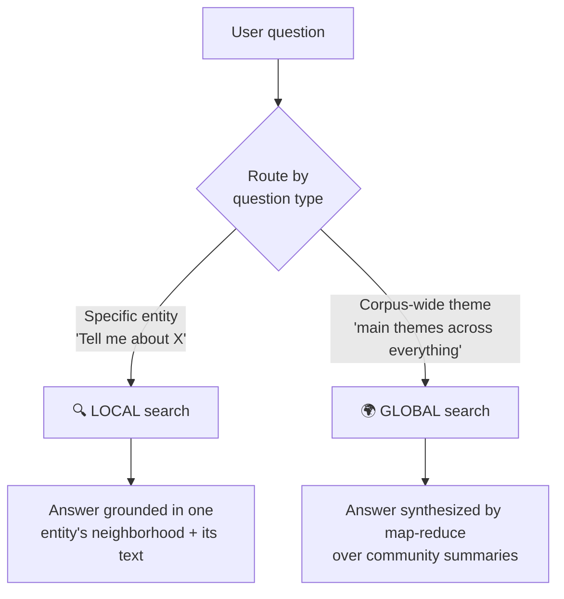
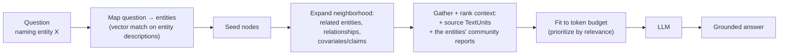
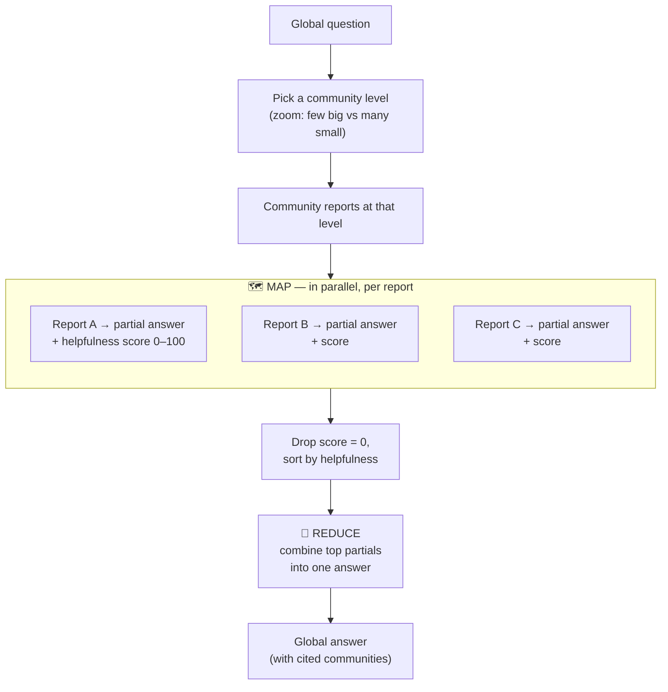

# 4 · Microsoft GraphRAG

*GraphRAG & Knowledge Graphs module · Lesson 4 of 6 · [← Building the Graph](03-building-the-graph.md) · [next → Querying & Hybrid RAG](05-querying-and-hybrid.md)*

"GraphRAG" as a proper noun usually means **Microsoft Research's** open-source system, from the 2024 paper *"From Local to Global: A Graph RAG Approach to Query-Focused Summarization"* (Edge et al.). Its headline contribution isn't the graph — it's **two distinct query modes over that graph**: **local search** for entity-specific questions and **global search** for whole-corpus sensemaking. This lesson is about those two modes and the map-reduce that powers global.

The index it queries is exactly the pipeline from [Lesson 3](03-building-the-graph.md): entities, relationships, hierarchical **communities** (Leiden), and per-community **summaries/reports**.

---

## 4.1 One index, two query modes



The distinction maps straight onto the two failure modes from [Lesson 2](02-why-graphrag.md): **local** solves multi-hop-around-an-entity; **global** solves "summarize the whole corpus."

---

## 4.2 Local search — reason around specific entities

Use when the question **names or implies concrete entities**: *"What products has SpaceX launched and who leads them?"*



Mechanically, local search:
1. **Maps the query to entities** by embedding it and matching against entity descriptions (this is where the vector index from [Lesson 3](03-building-the-graph.md) earns its keep).
2. **Expands** to the neighborhood — connected entities, the relationships between them, and any extracted **claims**.
3. **Assembles a mixed context window**: the entities, their relationships, the **raw source TextUnits** they came from, *and* the relevant **community reports** — then prioritizes to fit the budget.

It's "vector RAG **plus** the graph neighborhood **plus** the local community summary." Great for precise, grounded, multi-hop-*local* answers.

---

## 4.3 Global search — map-reduce over community summaries

Use for **corpus-wide sensemaking**: *"What are the top themes?", "How do the datasets relate?", "Summarize the key risks across all filings."* No single entity anchors it, so local search would flail.

The trick is that the expensive aggregation **already happened at index time** — every community has a summary ([Lesson 3 §3.7](03-building-the-graph.md)). Global search does a classic **map-reduce** over those summaries:



- **Map:** each community report is sent to the LLM *independently and in parallel*, producing a **partial answer** plus a **helpfulness score (0–100)** rating how relevant that community is to the question.
- **Filter/sort:** discard the zero-scored partials, rank the rest.
- **Reduce:** concatenate the most helpful partials and have the LLM synthesize the **final answer**.

Because Map runs against pre-written summaries (not raw chunks), a small handful of community reports stands in for the *entire corpus* — which is precisely what top-k vector retrieval could never do.

---

## 4.4 Choosing the community level (the zoom dial)

Leiden's hierarchy ([Lesson 3 §3.6](03-building-the-graph.md)) gives global search a **zoom control**:

| Level | Communities | Each report covers | Good for |
|-------|-------------|--------------------|----------|
| **C0** (root) | Few, huge | Very broad themes | Fast, high-level "what's this corpus about?" |
| **C1 / C2** | Moderate | Mid-grain topics | The usual sweet spot |
| **C3+** (leaf) | Many, small | Fine detail | Thorough but more Map calls = slower/costlier |

Lower level = fewer Map calls = cheaper/faster but coarser; deeper level = more calls = richer but pricier. The paper found even the **root-level** summaries beat naive vector RAG on comprehensiveness and diversity for global questions.

---

## 4.5 DRIFT search — the hybrid middle

Microsoft later added **DRIFT** (*Dynamic Reasoning and Inference with Flexible Traversal*), which **starts global** (rank community summaries relevant to the query) then **refines locally** (follow up with local searches on the entities that surfaced). It's the pragmatic default when a question is *neither* purely entity-specific *nor* purely global — a preview of the graph+vector hybrid thinking in [Lesson 5](05-querying-and-hybrid.md).

---

## 4.6 Running it (the `graphrag` library)

The Microsoft package runs the whole [Lesson 3](03-building-the-graph.md) pipeline and both query modes from the CLI:

```bash
pip install graphrag

# 1. scaffold a workspace and drop .txt files under ./ragtest/input
graphrag init --root ./ragtest

# 2. index: chunk → extract → build → Leiden communities → summarize
graphrag index --root ./ragtest

# 3a. GLOBAL search — map-reduce over community summaries
graphrag query --root ./ragtest --method global \
  --query "What are the top themes across these documents?"

# 3b. LOCAL search — reason around a specific entity
graphrag query --root ./ragtest --method local \
  --query "What is entity X and what is it connected to?"
```

`settings.yaml` in the workspace controls the LLM, chunk size, the community level global search targets, and the extraction/summarization prompts. Indexing is where the money goes — budget accordingly ([Lesson 6](06-tradeoffs-and-when.md)).

---

## 4.7 Local vs global at a glance

| | **Local search** | **Global search** |
|---|---|---|
| Best for | Specific entities, multi-hop *around* them | Whole-corpus themes & summarization |
| Starts from | Query → entities (vector match) | Community summaries |
| Core mechanism | Neighborhood expansion + mixed context | **Map-reduce** over community reports |
| Uses raw text units? | ✅ yes, alongside the graph | Mostly summaries, not raw chunks |
| Cost per query | Low–moderate | Higher (many Map calls) |
| Example | "Tell me about SpaceX's programs" | "What are the main themes here?" |

---

## Takeaways

- **Microsoft GraphRAG** (Edge et al., 2024) is defined by **two query modes over one graph index**, matching the two failure modes of vector RAG.
- **Local search** maps the query to seed entities, expands the neighborhood, and blends **entities + relationships + raw text units + local community reports** — vector RAG *plus* the graph.
- **Global search** answers corpus-wide questions by **map-reduce over pre-computed community summaries**: Map = partial answer + helpfulness score per community in parallel; Reduce = synthesize the top ones.
- The Leiden **hierarchy is a zoom dial** — root-level = broad/cheap, leaf-level = detailed/costly; even root summaries beat vector RAG on global questions.
- **DRIFT** blends global-then-local for in-between questions.
- The `graphrag` CLI runs the full index + `--method local|global` query; **indexing dominates cost**.

➡️ Next: [Querying & Hybrid RAG](05-querying-and-hybrid.md) — Cypher traversal and combining graph with vector.
