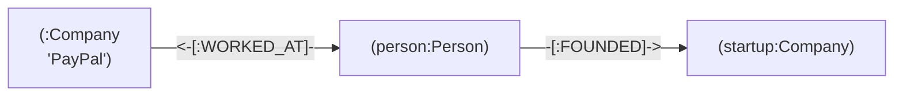
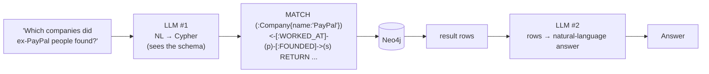
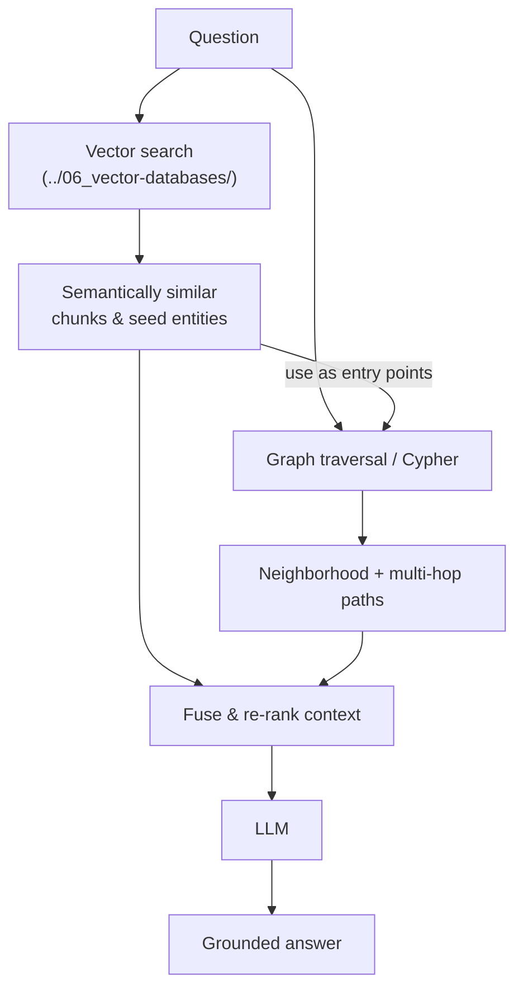

# 5 · Querying & Hybrid RAG

*GraphRAG & Knowledge Graphs module · Lesson 5 of 6 · [← Microsoft GraphRAG](04-microsoft-graphrag.md) · [next → Trade-offs & When](06-tradeoffs-and-when.md)*

Microsoft's local/global modes ([Lesson 4](04-microsoft-graphrag.md)) are one way to query a graph. This lesson is the more general toolkit: **traversal with Cypher**, letting an **LLM write the query for you** (`GraphCypherQAChain`), LlamaIndex's **property-graph** retrievers, and the pattern that wins most often in practice — **hybrid graph + vector**, which ties this module back to [`../06_vector-databases/`](../06_vector-databases/README.md).

---

## 5.1 Cypher — traversal as a query language

**Cypher** (Neo4j's query language) is ASCII-art for graph patterns: `(nodes)` in parens, `-[relationships]->` as arrows. You describe the *shape of the path* you want and the engine finds every match.

```cypher
// Every person who founded a company, and where it's based
MATCH (p:Person)-[:FOUNDED]->(c:Company)-[:HEADQUARTERED_IN]->(loc:Location)
RETURN p.name, c.name, loc.name
```

The multi-hop question from [Lesson 2](02-why-graphrag.md) is now **one line** — the hops are literally the arrows:

```cypher
// Companies founded by people who used to work at PayPal
MATCH (:Company {name: 'PayPal'})<-[:WORKED_AT]-(person:Person)-[:FOUNDED]->(startup:Company)
RETURN person.name, collect(startup.name) AS companies
```



Variable-length paths (the true "multi-hop" operator) use `*`:

```cypher
// Anyone connected to Alice within 1–3 hops, by any relationship
MATCH path = (a:Person {name: 'Alice'})-[*1..3]-(other)
RETURN other.name, length(path) AS hops
ORDER BY hops
```

RDF graphs use **SPARQL** for the same job; the pattern-matching spirit is identical.

---

## 5.2 Let the LLM write the Cypher — `GraphCypherQAChain`

Users ask in English, not Cypher. LangChain's **`GraphCypherQAChain`** closes the gap: an LLM **translates the natural-language question into Cypher**, runs it against Neo4j, then a second LLM turn phrases the rows as an answer.



```python
from langchain_neo4j import Neo4jGraph, GraphCypherQAChain
from langchain_openai import ChatOpenAI

graph = Neo4jGraph()          # NEO4J_URI / NEO4J_USERNAME / NEO4J_PASSWORD
graph.refresh_schema()        # the LLM MUST see the schema to write valid Cypher

chain = GraphCypherQAChain.from_llm(
    llm=ChatOpenAI(model="gpt-4o", temperature=0),
    graph=graph,
    verbose=True,             # prints the generated Cypher — great for debugging
    validate_cypher=True,     # syntax-check before running
    allow_dangerous_requests=True,  # required ack: generated Cypher can read/write
    top_k=10,
)

chain.invoke({"query": "Which companies were founded by people who worked at PayPal?"})
```

Watch-outs, all real:
- **Schema in the prompt is non-negotiable** — without `refresh_schema()` the LLM invents label/relationship names and the query returns nothing.
- **`allow_dangerous_requests=True`** is a required acknowledgement: generated Cypher is arbitrary. Point it at a **read-only** Neo4j user in production.
- It answers **structured** questions well; for fuzzy semantic ones you still want vectors — hence hybrid (§5.4).

---

## 5.3 LlamaIndex property graphs

LlamaIndex's modern API is **`PropertyGraphIndex`** (the older one is `KnowledgeGraphIndex`). You choose **extractors** (build side) and **retrievers** (query side), and it can use Neo4j as the store.

```python
from llama_index.core import PropertyGraphIndex, Document
from llama_index.core.indices.property_graph import (
    SchemaLLMPathExtractor,   # extract triples constrained to a schema
    LLMSynonymRetriever,      # match query keywords -> graph nodes
    VectorContextRetriever,   # vector search over nodes, then expand neighbors
)
from llama_index.llms.openai import OpenAI
from llama_index.embeddings.openai import OpenAIEmbedding

index = PropertyGraphIndex.from_documents(
    [Document(text=t) for t in text_units],
    llm=OpenAI(model="gpt-4o-mini"),
    embed_model=OpenAIEmbedding(),
    kg_extractors=[SchemaLLMPathExtractor(llm=OpenAI(model="gpt-4o-mini"))],
)

# Query with BOTH a synonym/keyword retriever AND a vector retriever = hybrid out of the box
retriever = index.as_retriever(
    sub_retrievers=[
        LLMSynonymRetriever(index.property_graph_store, llm=OpenAI(model="gpt-4o-mini")),
        VectorContextRetriever(index.property_graph_store, embed_model=OpenAIEmbedding()),
    ]
)
nodes = retriever.retrieve("How is PayPal connected to SpaceX?")
```

LlamaIndex also ships a **`TextToCypherRetriever`** (its version of NL→Cypher) — mix and match retrievers to taste.

---

## 5.4 Hybrid: graph + vector (the pattern that usually wins)

Graph traversal and vector search have **complementary strengths**. Hybrid RAG runs both and fuses the results, so you get structured multi-hop *and* fuzzy semantic recall.



The common recipe — and exactly what Microsoft's **local search** does under the hood ([Lesson 4 §4.2](04-microsoft-graphrag.md)):

1. **Vector search** finds *seed entities/chunks* semantically close to the query (handles paraphrase & fuzziness).
2. **Graph traversal** expands from those seeds along relationships (handles multi-hop & structure).
3. **Fuse** both context sets, re-rank, and prompt the LLM.

| Retrieval | Strong at | Weak at |
|-----------|-----------|---------|
| **Vector** ([`../06_vector-databases/`](../06_vector-databases/README.md)) | Fuzzy/paraphrased match, "what looks like this" | Multi-hop, global aggregation, precision on entities |
| **Graph** | Multi-hop, explainable paths, aggregation | Fuzzy wording, entities not yet in the graph |
| **Hybrid** | Both — vector seeds → graph expansion | More moving parts, higher latency/cost |

---

## 5.5 Wiring it into an agent (LangGraph)

Retrieval strategy shouldn't be hard-coded. As in [`../12_rag/07_rag-with-langgraph.md`](../12_rag/07_rag-with-langgraph.md), wrap **each retriever as a tool** and let the LLM (or a router node) pick — casual question → answer directly, entity question → graph tool, fuzzy lookup → vector tool.

```python
from langchain_core.tools import tool

@tool
def graph_query(question: str) -> str:
    """Answer questions about relationships/connections between entities
    (multi-hop). Uses the knowledge graph."""
    return chain.invoke({"query": question})["result"]

@tool
def vector_query(question: str) -> str:
    """Answer questions about the content/wording of documents.
    Uses semantic vector search."""
    return vector_retriever.invoke(question)

# Bind both; the LangGraph chat_node routes to whichever the question needs
# (same tool-calling graph as ../12_rag/07_rag-with-langgraph.md)
```

This is the natural home for the routing decision from [Lesson 2 §2.6](02-why-graphrag.md) — see [`../13_langgraph/`](../13_langgraph/README.md) for the full node/edge model.

---

## Takeaways

- **Cypher** expresses traversal as path patterns — `(node)-[:REL]->(node)`; `[*1..3]` does true variable-length multi-hop, and the [Lesson 2](02-why-graphrag.md) question becomes one line.
- **`GraphCypherQAChain`** has an LLM translate NL → Cypher (schema in the prompt), runs it, then verbalizes rows — always give it `refresh_schema()`, a **read-only** DB user, and treat `allow_dangerous_requests` seriously.
- **LlamaIndex `PropertyGraphIndex`** composes **extractors** (e.g. `SchemaLLMPathExtractor`) and **retrievers** (`LLMSynonymRetriever`, `VectorContextRetriever`, `TextToCypherRetriever`) — hybrid by construction.
- **Hybrid graph + vector** usually wins: **vector finds seeds, graph expands them** — literally what GraphRAG local search does.
- Wrap graph and vector retrievers as **tools** and let a LangGraph router choose per question ([`../12_rag/07_rag-with-langgraph.md`](../12_rag/07_rag-with-langgraph.md)).

➡️ Next: [Trade-offs & When](06-tradeoffs-and-when.md) — what this all costs and when it's actually worth it.
