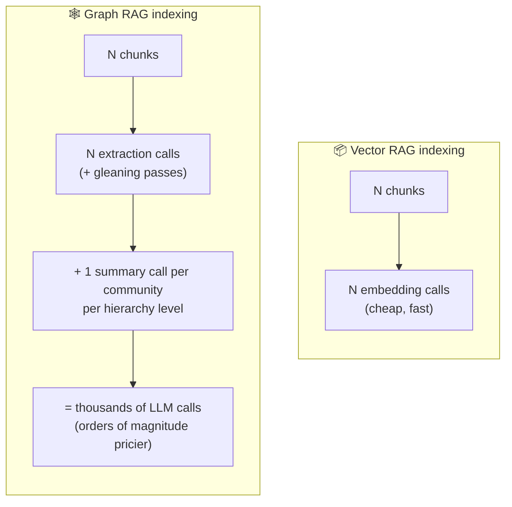
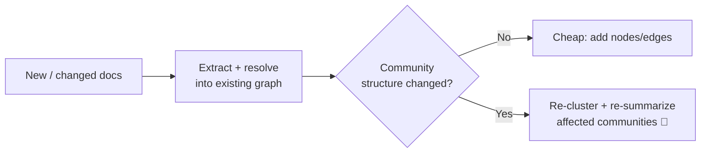
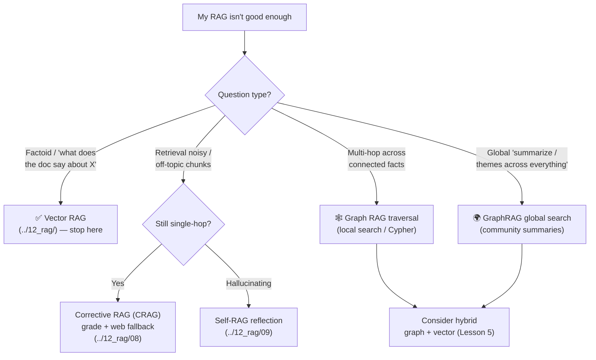

# 6 · Trade-offs & When

*GraphRAG & Knowledge Graphs module · Lesson 6 of 6 · [← Querying & Hybrid RAG](05-querying-and-hybrid.md) · [Overview →](README.md)*

The previous five lessons sell graph RAG. This one is the counterweight: it is **expensive to build, awkward to keep fresh, and overkill for most questions**. The engineering skill is knowing when the payoff is worth it versus when plain vector RAG — or [Corrective/Self-RAG](../12_rag/08_corrective-rag-crag.md) — is the smarter, cheaper answer.

---

## 6.1 The dominant cost: LLM calls at index time

Vector RAG's index cost is **embeddings** — cheap, one small model call per chunk. Graph RAG's index cost is **generation** — a full LLM call (or several) per chunk for extraction, *plus* summarization per community per hierarchy level ([Lesson 3](03-building-the-graph.md)).

Rough intuition: **graph indexing can cost one to two orders of magnitude more than vector indexing** for the same corpus, and take much longer. A few thousand chunks is easily thousands of LLM calls before you answer a single question. Query-time cost is higher too — global search fires many parallel Map calls ([Lesson 4 §4.3](04-microsoft-graphrag.md)).

| Cost axis | Vector RAG | Graph RAG |
|-----------|-----------|-----------|
| Index compute | Embeddings (cheap) | **LLM extraction + summaries (expensive)** |
| Index time | Minutes | Minutes → **hours** |
| $ per query | Low | Low (local) → **higher (global map-reduce)** |
| Infra | Vector DB | Vector DB **+ graph DB** |
| Build complexity | Low | **High** (extraction, resolution, communities) |

---

## 6.2 The second tax: maintenance & updates

Vector stores update trivially — embed the new chunk, upsert it, done. Graphs don't:

- A new document introduces **new entities and edges** that must be extracted, **resolved against existing nodes** ([Lesson 3 §3.4](03-building-the-graph.md)), and stitched in.
- New edges can **change community structure**, so community detection and the affected **summaries may need re-running** — the pricey passes.
- Naive "just re-index everything" is correct but costly; **incremental indexing** (Microsoft GraphRAG supports it) updates only affected communities, but adds complexity.

**Takeaway for volatile corpora:** if your data churns constantly (news, tickets, chat), the maintenance tax is real and recurring. Stable knowledge bases (regulations, product manuals, research corpora) amortize the build cost far better.

---

## 6.3 Other honest downsides

- **Extraction quality caps everything.** The graph is only as good as the LLM's triples; missed or wrong relations silently degrade answers. Garbage in, garbage graph.
- **Latency.** Multi-step retrieval (map query→entities, traverse, sometimes generate Cypher) is slower than a single vector lookup.
- **Non-determinism.** Two index runs can yield slightly different graphs (LLM sampling); reproducibility takes care (temperature 0, pinned prompts).
- **Tuning surface.** Chunk size, ontology, community level, prompts — many more knobs than vector RAG.

---

## 6.4 The decision: which RAG for which problem?

Don't reach for graphs first. Walk the ladder — the cheapest tool that answers your questions wins.

---

## 6.5 When graph RAG is worth it — and when it isn't

| ✅ Worth the cost | ❌ Not worth it |
|------------------|----------------|
| Multi-hop questions chaining several facts | Simple factoid lookup / FAQ |
| Global "summarize / main themes / how do these relate" | Answer always sits in one passage |
| Densely **connected** domains: biomedical, fraud/AML, legal, org & supply chains, research citations | Sparse, unrelated documents |
| **Explainability** matters — you must show the reasoning path | "Good enough" answers are fine |
| **Stable** corpus that amortizes the build | **High-churn** data re-indexed constantly |
| Budget & latency headroom for indexing | Tight cost/latency constraints |

Rules of thumb:
- **Start with vector RAG.** It solves the majority of retrieval problems at a fraction of the cost.
- If retrieval is *noisy* but questions are single-hop, add **CRAG/Self-RAG** ([`../12_rag/08_corrective-rag-crag.md`](../12_rag/08_corrective-rag-crag.md), [`../12_rag/09_self-rag.md`](../12_rag/09_self-rag.md)) before considering graphs — grading and reflection are far cheaper than a graph.
- Introduce a graph only when questions are genuinely **multi-hop or global**, or the domain is intrinsically **relational**.
- When you do, **hybrid graph + vector** ([Lesson 5](05-querying-and-hybrid.md)) usually beats graph-only — don't throw away semantic recall.

---

## Takeaways

- Graph RAG's dominant cost is **LLM calls at index time** (extraction per chunk + summaries per community) — often **1–2 orders of magnitude** pricier and slower than embedding-based vector indexing.
- **Maintenance is a recurring tax**: new docs need extraction + entity resolution, and structural changes force **re-clustering/re-summarizing**; incremental indexing helps but adds complexity — bad fit for high-churn data.
- Other costs: extraction quality caps answer quality, higher latency, non-determinism, more tuning knobs.
- **Decision ladder:** vector RAG → Corrective/Self-RAG for noise/hallucination → graph RAG only for **multi-hop / global / highly-relational** questions.
- Graph RAG earns its keep on **connected domains, explainability, and stable corpora**; it's overkill for factoid lookup and painful on churny data.
- When you commit, prefer **hybrid graph + vector** over graph-only.

*You've reached the end of the module. Back to the [Overview](README.md), or over to the baseline pipeline in [`../12_rag/`](../12_rag/README.md).*
