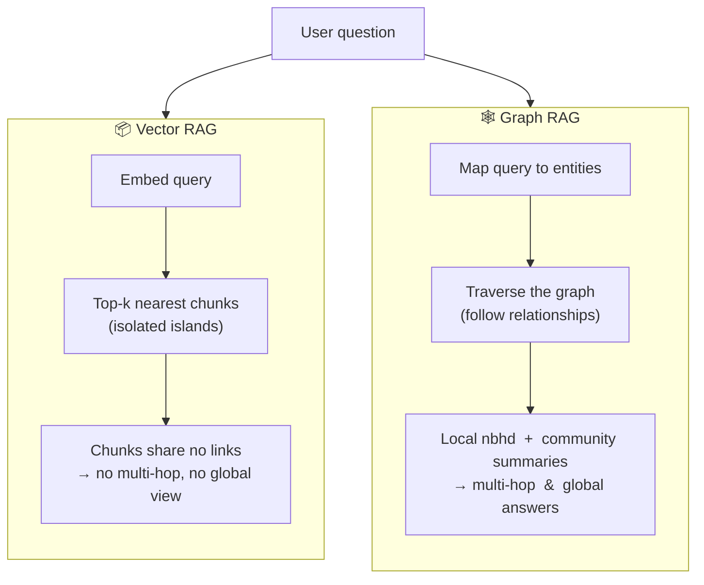

# 🕸️ GraphRAG & Knowledge Graphs

> Retrieval-Augmented Generation where the index is a **knowledge graph** of entities and relationships — not just a flat pile of text chunks. Built for the questions plain vector RAG *can't* answer: multi-hop reasoning and "summarize the whole corpus."

These notes are the **graph-based, advanced-RAG follow-on** to the baseline module in [`../12_rag/`](../12_rag/README.md). That module already covers the vector pipeline (load → split → embed → store → retrieve) and the agentic variants **Corrective RAG** and **Self-RAG** in [`08_corrective-rag-crag.md`](../12_rag/08_corrective-rag-crag.md) / [`09_self-rag.md`](../12_rag/09_self-rag.md). This module assumes all of that and does **not** re-teach it — it swaps the *index* from a vector store to a graph.

Prerequisites worth skimming first: baseline RAG ([`../12_rag/`](../12_rag/README.md)), vector stores ([`../06_vector-databases/`](../06_vector-databases/README.md)), and the LangGraph mental model ([`../13_langgraph/`](../13_langgraph/README.md)).

---

## 🗺️ Why baseline vector RAG hits a wall

Vector RAG retrieves the **top-k chunks most similar to the query** and stuffs them in the prompt. Each chunk is an **island** — the semantic links *between* chunks are thrown away at indexing time. That breaks on two whole classes of question:

- **Multi-hop** — "Which companies were founded by ex-PayPal employees?" The answer is spread across chunks that are *not individually similar to the query*, and requires **chaining** facts (person → employer → company).
- **Global / sensemaking** — "What are the main themes across all 900 support tickets?" **No single chunk contains the answer**; you must aggregate over the *entire* corpus, which top-k retrieval structurally cannot do.

The core move: at **indexing time** an LLM extracts **entities and relationships** into a graph, so those links survive to **query time** and can be traversed.

---

## 📓 Lessons

| # | Lesson | What you'll learn |
|---|--------|-------------------|
| 1 | [Knowledge Graphs 101](01-knowledge-graphs-basics.md) | Nodes, edges, properties; SPO triples; RDF vs property graphs; ontologies |
| 2 | [Why GraphRAG?](02-why-graphrag.md) | The exact failure modes of chunk-based RAG and what graphs add |
| 3 | [Building the Graph](03-building-the-graph.md) | The indexing pipeline: extract → resolve → build → detect communities → summarize |
| 4 | [Microsoft GraphRAG](04-microsoft-graphrag.md) | Local vs global search; community reports; map-reduce for global questions |
| 5 | [Querying & Hybrid RAG](05-querying-and-hybrid.md) | Cypher traversal, `GraphCypherQAChain`, LlamaIndex property graphs, graph+vector hybrid |
| 6 | [Trade-offs & When](06-tradeoffs-and-when.md) | The real cost of graph construction; maintenance; when it beats plain/Corrective RAG |

---

## ⚡ When to reach for graph RAG (cheat sheet)

| Your situation | Reach for… |
|----------------|-----------|
| Factoid lookup, "what does the doc say about X" | **Vector RAG** ([`../12_rag/`](../12_rag/README.md)) — don't over-engineer |
| Retrieved chunks are often off-topic / noisy | **Corrective RAG (CRAG)** grading + web fallback ([`../12_rag/08_corrective-rag-crag.md`](../12_rag/08_corrective-rag-crag.md)) |
| Hallucination / ungrounded answers | **Self-RAG** reflection ([`../12_rag/09_self-rag.md`](../12_rag/09_self-rag.md)) |
| **Multi-hop** questions chaining several facts | **Graph RAG** — traverse relationships |
| **Global** "summarize / main themes across everything" | **Microsoft GraphRAG global search** (community summaries) |
| Highly **connected** domain (fraud, biomedical, legal, org charts) | **Graph RAG** or **hybrid** (graph + vector) |
| You need *both* fuzzy semantic recall and structured hops | **Hybrid** — vector seeds + graph expansion ([Lesson 5](05-querying-and-hybrid.md)) |

---

## 🧰 Core stack referenced in this module

| Layer | Tools named in these notes |
|-------|----------------------------|
| Graph databases | **Neo4j** (property graph, **Cypher**), RDF triple stores (**SPARQL**) |
| In-memory graphs | **networkx** (Python) |
| Entity/relation extraction | LLM extraction prompts, **spaCy** NER, LangChain **`LLMGraphTransformer`** |
| Community detection | **Leiden** algorithm (hierarchical), Louvain |
| Frameworks | **Microsoft GraphRAG** (2024), LangChain **`GraphCypherQAChain`**, LlamaIndex **`PropertyGraphIndex`** / `KnowledgeGraphIndex` |
| Orchestration | LangGraph ([`../13_langgraph/`](../13_langgraph/README.md)) for wiring retrieval as graph nodes |

---

*Reference notes for personal study. Key source: Edge et al., "From Local to Global: A Graph RAG Approach to Query-Focused Summarization" (Microsoft Research, 2024). Follows on from the baseline RAG module in [`../12_rag/`](../12_rag/README.md).*
