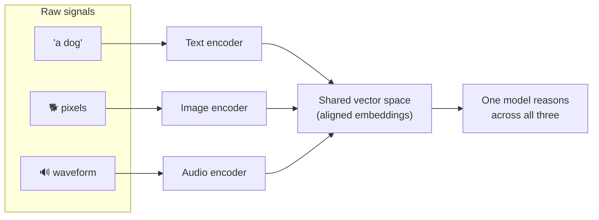
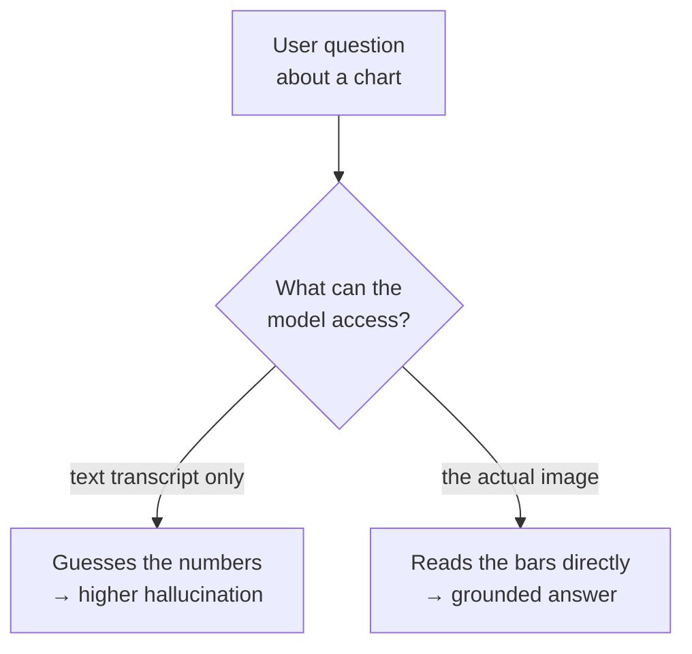
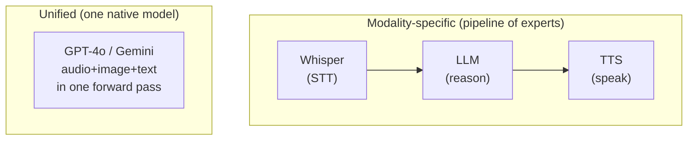
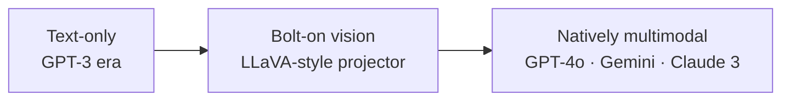

# 1 · What is Multimodal AI?

*Multimodal AI module · Lesson 1 of 6 · [← index](README.md) · [next → Vision-Language Models](02-vision-language-models.md)*

Multimodal AI is any system that takes in — or produces — **more than one kind of data**: text *and* images, speech, or video. A text-only LLM reads a transcript of a chart; a multimodal model **looks at the chart**. That difference is the whole module.

---

## 1.1 The modalities

A "modality" is a channel of information with its own raw representation. The four you'll meet constantly:

| Modality | Raw form | How it becomes vectors | Typical task |
|----------|----------|------------------------|--------------|
| **Text** | Tokens (sub-words) | Token embeddings | Chat, extraction, RAG |
| **Image** | Pixel grid (H×W×3) | Patch embeddings via a Vision Transformer | Captioning, VQA, OCR |
| **Audio** | Waveform / spectrogram | Frame embeddings via an audio encoder | Transcription (STT), speech synth (TTS) |
| **Video** | Sequence of frames (+ audio) | Per-frame image embeddings + temporal model | Action recognition, video Q&A |

The trick that makes them *inter*operable: each encoder maps its raw form into the **same embedding space**, so a picture of a dog and the word "dog" end up as nearby vectors. That alignment is what lets one model reason across channels.

---

## 1.2 Why joint understanding matters

Real information is rarely pure text. Consider three requests a text-only model simply *cannot* serve:

- *"What's wrong with this error screenshot?"* — the answer is pixels, not a string.
- *"Summarize this 40-minute standup recording."* — the input is a waveform.
- *"Redraw this wireframe with a dark theme."* — both input and output are images.

Joint understanding also unlocks **grounding**: when a model can see the actual chart, it hallucinates less about the numbers than when it only reads a lossy text transcript of it. This is exactly why the [RagApp visual track](../18_ragapp/06-visual-extraction-and-vlm.md) loads the real page image as a content block at answer time rather than trusting the text description alone.

---

## 1.3 Two ways to build multimodal: unified vs modality-specific

There are two architectural philosophies, and production systems mix them.

| Approach | How it works | Pros | Cons | When to use |
|----------|--------------|------|------|-------------|
| **Modality-specific pipeline** | Best-in-class model per modality, stitched together (STT → LLM → TTS) | Swap any component; cheap; use the strongest specialist for each step | Errors compound across the chain; added latency at each hop; no cross-modal nuance (tone, timing) | Most production voice/vision apps today |
| **Unified native model** | One model pretrained on all modalities, shared weights | Cross-modal reasoning (hears sarcasm, sees layout); single call; lowest latency | Fewer providers; less controllable; can cost more per modality | Real-time voice, tasks needing tight fusion |

> **Rule of thumb:** start with a **modality-specific pipeline** (it's modular and debuggable). Move to a **unified model** only when latency or genuine cross-modal reasoning (emotion, timing, spatial layout) forces it.

---

## 1.4 The shift: from text-only to natively-multimodal LLMs

The trajectory of the last few years:

1. **Text-only LLMs** (GPT-3, early LLaMA) — language in, language out.
2. **Bolt-on vision** — a pretrained LLM gets a vision encoder grafted on and a small amount of alignment training. **LLaVA (2023)** is the canonical open example; see [Lesson 2](02-vision-language-models.md). The LLM's weights are mostly frozen; a **projector** teaches it to read image features.
3. **Natively multimodal** — models pretrained from the start on interleaved text, image, and audio. **GPT-4o** ("omni", 2024) handles text/image/audio in and text/image/audio out; **Google Gemini** is multimodal by design; **Claude 3** (2024) added vision. Here there's no separate "vision head" bolted on — the modalities share the representation.

The practical upshot for you: **you rarely train any of this.** You call a hosted multimodal model with an image or audio block in the message (Lessons 2 and 4), or you use an open encoder like CLIP for retrieval (Lesson 5). The engineering is in *plumbing modalities into prompts and vectors*, not in training encoders.

---

## 1.5 Takeaways

- A **modality** is a data channel (text, image, audio, video); multimodal AI ingests or emits more than one.
- The core mechanism is **alignment** — encode each modality into a **shared vector space** so the model can reason across them.
- Multimodality unlocks tasks text can't touch and **reduces hallucination** by letting the model see/hear the real signal (grounding).
- Two build styles: **modality-specific pipelines** (modular, debuggable, start here) vs **unified native models** (tight fusion, lowest latency).
- The field moved **text-only → bolt-on vision (LLaVA) → natively multimodal (GPT-4o, Gemini, Claude 3)**; in practice you *call* these models rather than train them.

➡️ Next: [Vision-Language Models](02-vision-language-models.md) — how a model actually learns to read an image and talk about it.
